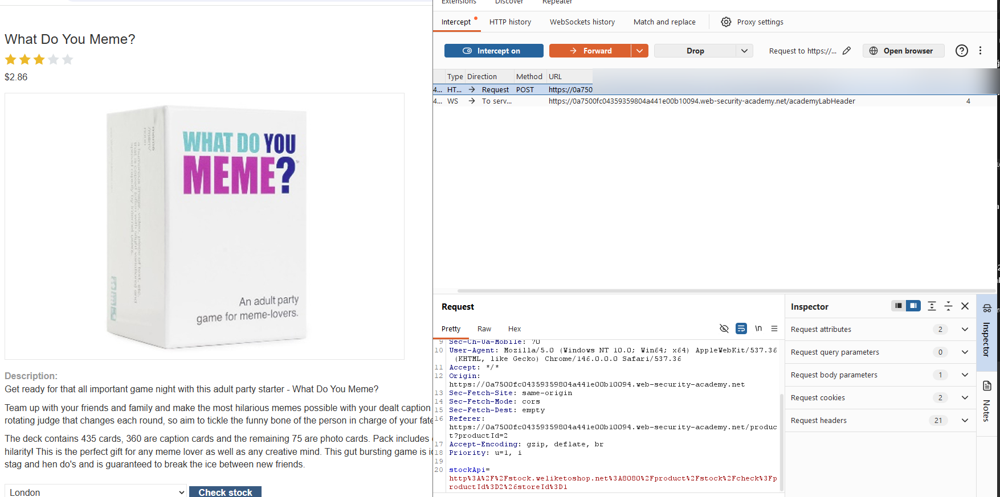
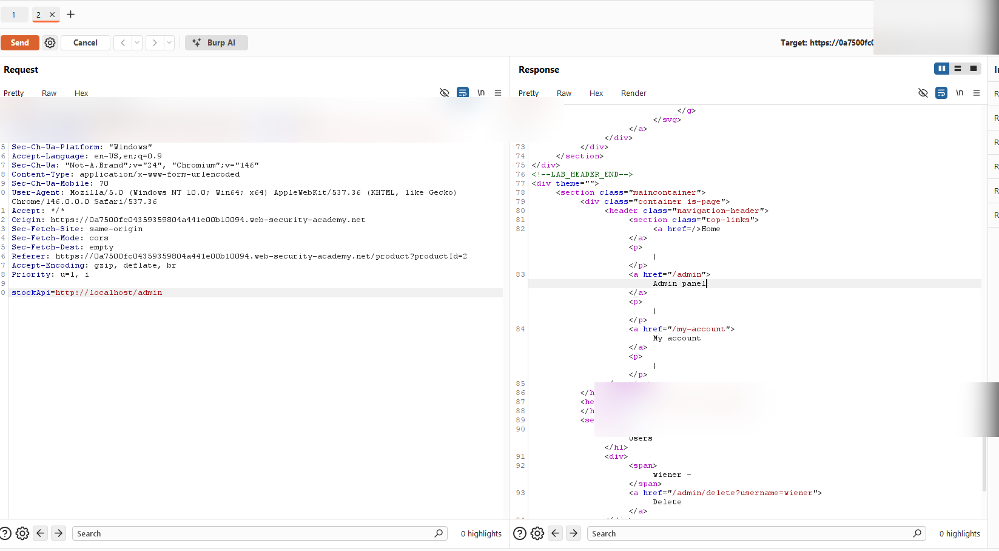
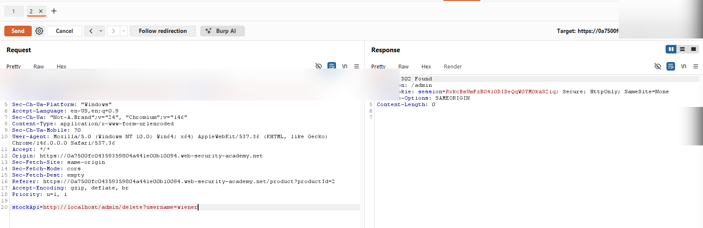

# SSRF: Basic SSRF against the local server (Full Finding Report)

## Scope / Target
- Target: PortSwigger Web Security Academy lab instance
- Scope: Lab environment only (no real targets)
- Date: 2026-05-11

## Summary
The stock check feature fetches a URL provided by the client (`stockApi`). Because the backend performs the request
server-side without a strict outbound allowlist and without blocking internal destinations, an attacker can force the
server to request internal-only URLs such as `http://localhost/admin`. This exposes internal admin functionality and
enables privileged actions (in the lab: deleting the user `carlos`).

## Background (what SSRF enables)
Server-Side Request Forgery (SSRF) occurs when an application makes outbound requests based on attacker-controlled input.
The core risk is that the request is executed from the server's network position and privileges, which may provide:
- Access to internal-only services (admin panels, internal APIs, monitoring endpoints)
- Access to cloud metadata endpoints (identity/credential exposure)
- Network trust advantages (services that trust `localhost` or private subnets)

SSRF is frequently escalated via redirect handling, DNS tricks (rebinding/pinning), and weak network segmentation.

## Steps to Reproduce
1. Navigate to a product page and click **Check stock**.
2. In Burp, capture the request to the stock check endpoint (e.g., `POST /product/stock`) and send it to Repeater.
3. Modify the `stockApi` parameter to target the internal admin interface:
   - `stockApi=http://localhost/admin`
4. Send the request and observe the response contains admin interface content and a delete action for `carlos`.
5. Modify the parameter to trigger the delete action:
   - `stockApi=http://localhost/admin/delete?username=carlos`
6. Send the request and confirm the server responds with a redirect (e.g., `302 Found` to `/admin`) and the lab marks as solved.

## Evidence
Baseline request capture:

Admin interface fetched via SSRF:

Delete action triggered via SSRF (redirect after deletion):

## Impact
This SSRF primitive enables internal admin access and execution of privileged actions. In real systems, the same class of
issue is commonly used to:
- Reach internal control planes (admin UIs, internal dashboards, service discovery)
- Exfiltrate secrets via internal endpoints (configuration, tokens, internal APIs)
- Probe internal networks (status/timing-based discovery)
- Target cloud metadata endpoints (identity and credential exposure)

## Severity
- Rating: Critical
- Rationale: Internal admin endpoint access + privileged action execution via attacker-controlled server-side requests.

## Recommendation
### Primary controls (do these first)
- Implement a strict allowlist for outbound destinations required by the stock-check feature (exact domains/paths).
- Resolve DNS and block requests to loopback/link-local/private ranges (IPv4 + IPv6), including:
  - `127.0.0.0/8`, `10.0.0.0/8`, `172.16.0.0/12`, `192.168.0.0/16`, `169.254.0.0/16`
- Disable redirects, or re-validate the destination after every redirect hop.
- Restrict URL schemes to `http`/`https` only (avoid `file://`, `gopher://`, etc., depending on client support).

### Defense in depth
- Enforce egress network controls so this feature cannot reach internal admin services or metadata endpoints.
- Add strict timeouts and request limits to reduce SSRF-based scanning and DoS.
- Log outbound request attempts and alert on internal/blocked destination attempts.

## Retest Plan
- Attempt SSRF to `localhost`, `127.0.0.1`, private IPs, and URL-encoded variants; verify blocks are enforced after DNS resolution.
- Attempt redirect-based bypass; verify redirects cannot reach internal targets.
- Confirm stock check continues to work for allowlisted endpoints only.

## Executive Summary (5–10 lines)
The stock check feature fetches a client-supplied URL server-side, enabling SSRF. An attacker can force the server to
request internal-only endpoints such as `http://localhost/admin`, exposing admin functionality and allowing privileged
actions like deleting users. This is critical because internal services and cloud metadata endpoints may be reachable from
the application environment, expanding impact far beyond the web app itself. Fix by allowlisting outbound destinations,
blocking private/loopback/link-local IPs after DNS resolution, disabling unsafe redirects, and enforcing egress network
controls. Add monitoring and regression tests to prevent reintroduction.
