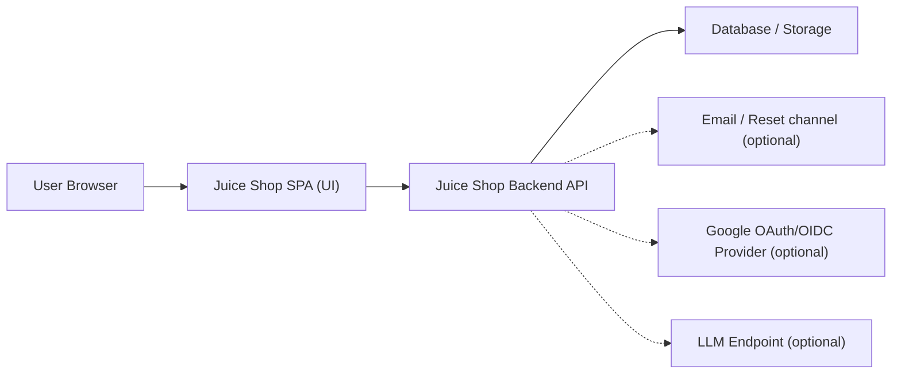
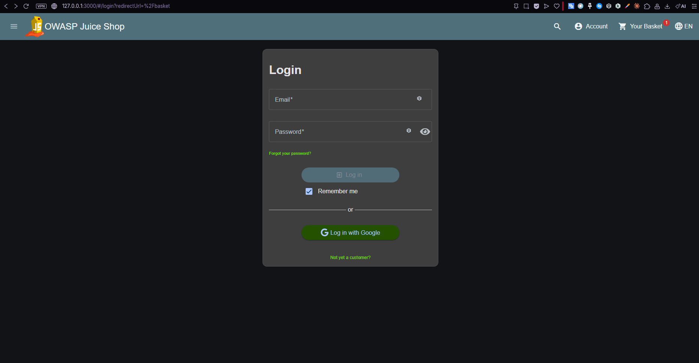
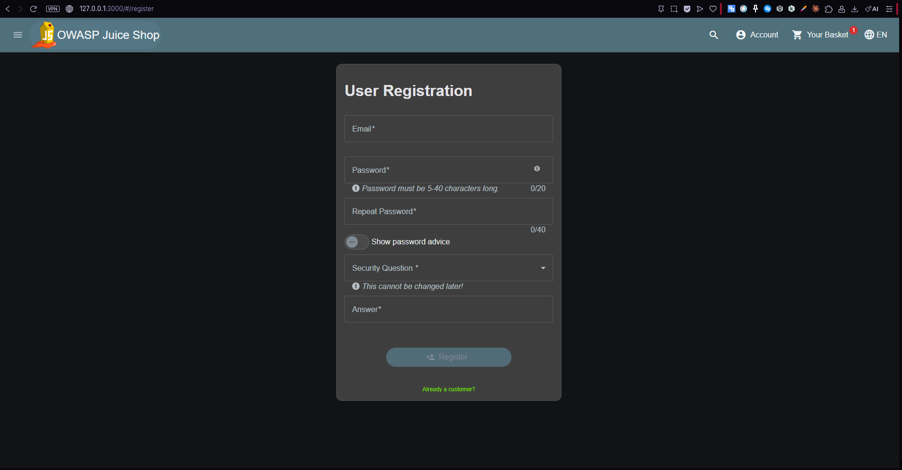
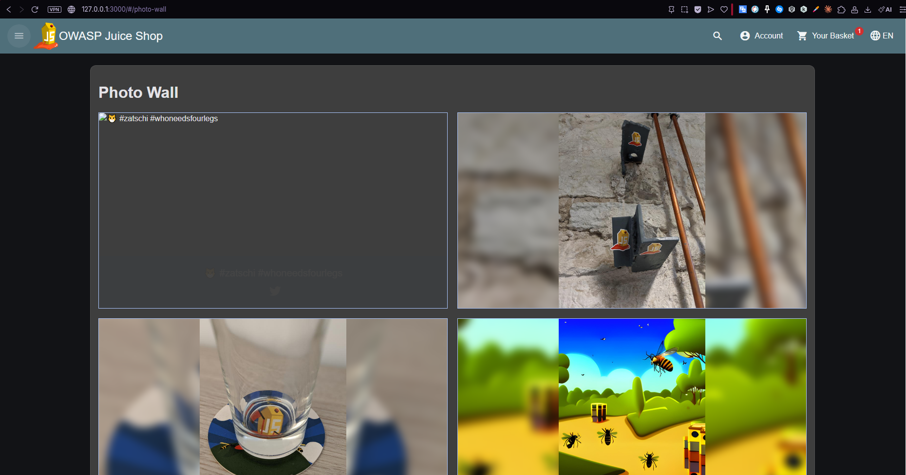
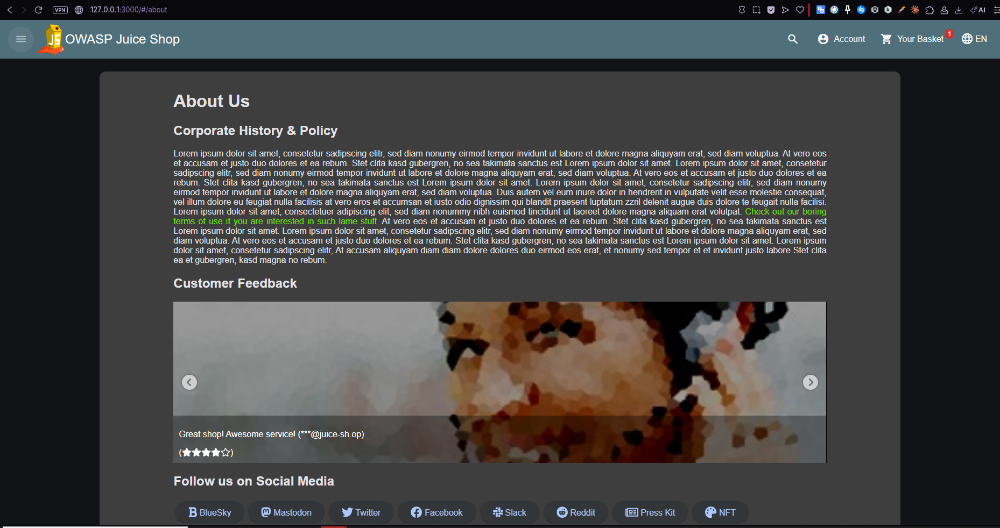
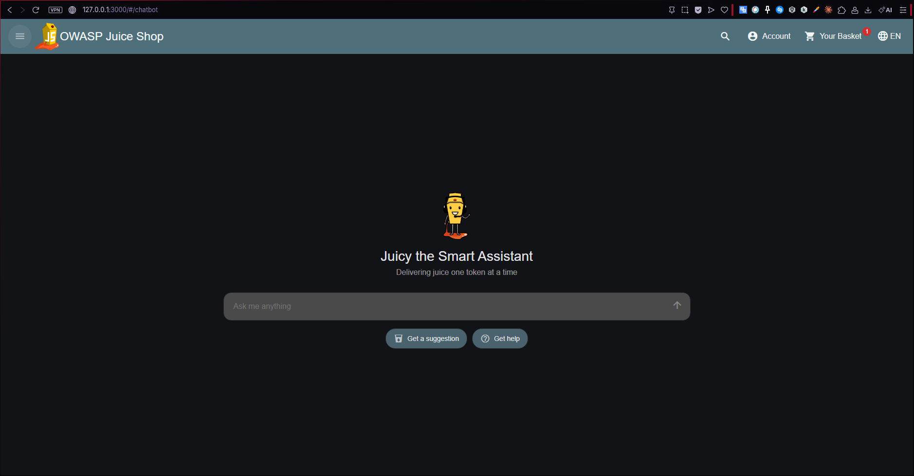
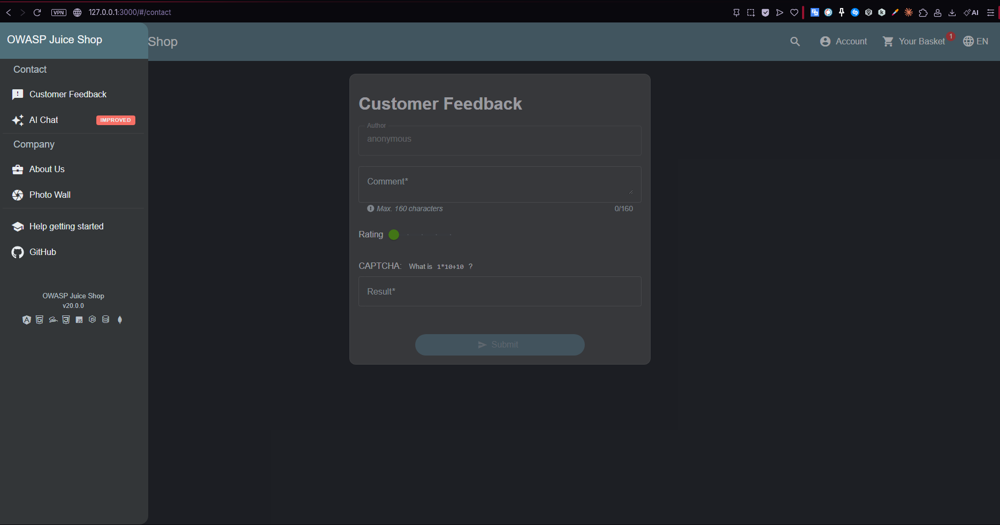
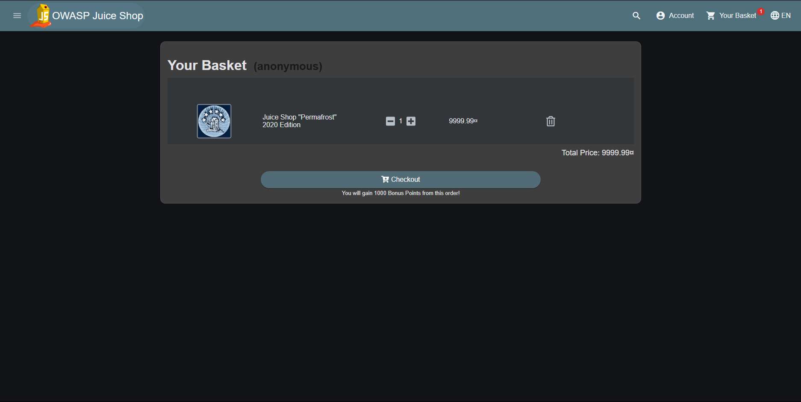

# Threat Model: OWASP Juice Shop (Local)

## Scope / Target

- Target: OWASP Juice Shop running locally at `http://127.0.0.1:3000`
- Purpose: training / portfolio (authorized lab environment only)
- In-scope:
  - user-facing web UI and backend API behavior
  - authentication & account lifecycle (login, registration, password reset)
  - basket/checkout flows (business integrity)
  - user-generated content (feedback, photo wall)
  - AI chat surface (prompt-driven user input)
- Out-of-scope:
  - host OS hardening, Docker runtime security, and infrastructure hardening of the local machine
  - security posture of third-party providers (we treat them as external dependencies)

### Integrations (present)

- Google login (3rd-party authentication) is present in the UI.
  - Out-of-scope: Google infrastructure
  - In-scope: how the app handles redirects/tokens/session binding around this integration

## System Decomposition

### Key user journeys (high-level)

- Browse products, search, and view product details.
- Add items to basket and proceed to checkout.
- Create an account (registration) and log in.
- Recover an account via password reset (forgot-password flow).
- Submit user content (customer feedback).
- Browse user content (photo wall).
- Use AI chat (chatbot UI).

### Entry points (observed UI routes)

- `/#/login` (login)
- `/#/register` (registration)
- `/#/forgot-password` (password reset / recovery)
- `/#/basket` (basket + checkout entry)
- `/#/contact` (contact + customer feedback)
- `/#/photo-wall` (media/content surface)
- `/#/chatbot` (AI chat surface)
- `/#/about` (content page)

## Assets (what we protect)

- Accounts: email, password, security question/answer, account profile data
- Authentication state: session cookies/tokens, remember-me state
- Account recovery: password reset workflow and verification channels
- Basket/checkout integrity: item quantities, prices, totals, order creation
- Bonus/loyalty points: fraud and abuse potential
- User-generated content: feedback text, photo wall content
- Secrets: JWT signing keys, API keys, environment variables, admin credentials (if present)
- Logs and telemetry: may contain PII or secrets if not handled safely

## Actors (threat agents)

- Anonymous attacker (no account)
- Authenticated user (normal user)
- Admin user (privileged account)
- Automated attacker (credential stuffing, brute force, scraping)

## High-level Architecture (DFD)

The goal is to model data flows and trust boundaries, not to mirror every internal module.

## Trust Boundaries

- Browser ↔ Server boundary: all client input is untrusted (including cookies, headers, and parameters).
- Auth boundary: anonymous vs authenticated vs admin actions must be enforced server-side.
- User-generated content boundary: feedback and photo-wall content must be treated as attacker-controlled input.
- External integration boundaries: OAuth provider and LLM endpoints are external trust zones.

## Threat Register (prioritized)

| # | Threat | Where | Impact | Likelihood | Mitigation (summary) | Validation (how to test) |
|---:|---|---|---|---|---|---|
| 1 | Broken access control (IDOR/BOLA) | Basket, account, APIs | Account/data exposure, privilege escalation | High | Server-side authz checks; deny-by-default | Attempt ID/role tampering; verify consistent 403/blocked |
| 2 | Auth brute force / credential stuffing | Login | Account takeover | High | Rate limit, lockouts, MFA, monitoring | Try high-rate login attempts; verify throttling/lockout |
| 3 | Password reset abuse | Forgot password | Account takeover | Medium/High | Secure reset tokens, expiry, verification | Verify reset requires proof of ownership and expires |
| 4 | SQL injection | Search/filter/login/API | Data theft, auth bypass | Medium/High | Parameterized queries; validation | Test classic payloads; verify treated as data |
| 5 | Stored/Reflected/DOM XSS | Feedback, photo wall, search | Session theft, account takeover | High | Output encoding, sanitization, CSP | Submit payload; verify harmless rendering and CSP blocks |
| 6 | CSRF on state-changing actions | Profile changes, checkout | Forced actions | Medium | CSRF tokens + SameSite + Origin checks | PoC form submit; verify server rejects |
| 7 | Business logic abuse | Basket/checkout/points | Fraud, price manipulation | Medium | Server-side totals, integrity checks, audits | Manipulate client values; verify server recomputes |
| 8 | Insecure file/content handling | Photo wall/media | RCE, content injection | Medium | Strict upload rules, store outside web root | Attempt upload polyglots/exec; verify blocked/inert |
| 9 | Sensitive data exposure | Errors/logs/API responses | Token/PII leakage | Medium | Safe error handling, log hygiene | Force errors; verify no secrets/PII leak |
| 10 | Prompt injection / LLM abuse | AI chat | Data exfil, tool abuse | Low/Medium | Treat prompts as untrusted; allowlists | Try instruction injection; verify no privileged actions |

## Mitigation Plan (control checklist)

Authentication & sessions:
- Enforce rate limiting and suspicious-login monitoring.
- Secure cookies (`HttpOnly`, `Secure`, `SameSite`) and rotate sessions after privilege changes.
- Harden password reset (one-time tokens, expiry, verification, rate limiting).

Authorization:
- Centralize authorization checks server-side (no client-trusted admin flags).
- Validate object ownership on every API route (BOLA/IDOR prevention).

Injection defenses:
- Parameterize all database queries.
- Apply strong output encoding + sanitization for user content.
- Apply Content Security Policy (CSP) to reduce XSS impact.

State-changing protection:
- CSRF tokens for state-changing actions; Origin/Referer validation as defense-in-depth.
- Step-up authentication for sensitive account changes where appropriate.

Business integrity:
- Recompute price/totals server-side; never trust client totals.
- Add audit logs for sensitive actions and fraud-like patterns.

Operational hygiene:
- Avoid leaking secrets in errors/logs; redact sensitive fields.
- Keep dependencies updated; use SCA and secrets scanning in CI when possible.

## Validation / Maintenance

- When we start producing Juice Shop findings, each finding will link back to the matching threat entry above.
- Update this model when a new major feature surface is introduced (new endpoint class, upload integration, payment, etc.).

## Screenshots (system mapping)

1) AI Chat (`/#/chatbot`)

2) About page (`/#/about`)

3) Login (`/#/login`)

4) Registration (`/#/register`)

5) Basket (`/#/basket`)

6) Customer Feedback (via `/#/contact`)

7) Photo Wall (`/#/photo-wall`)

