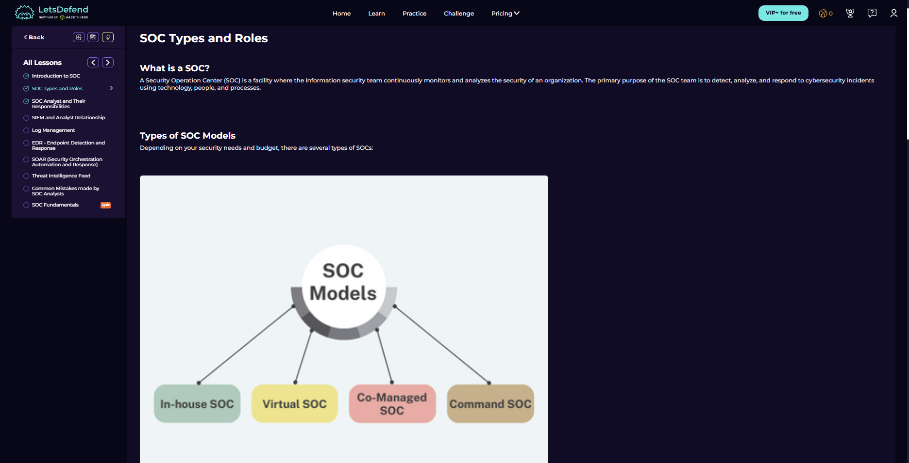
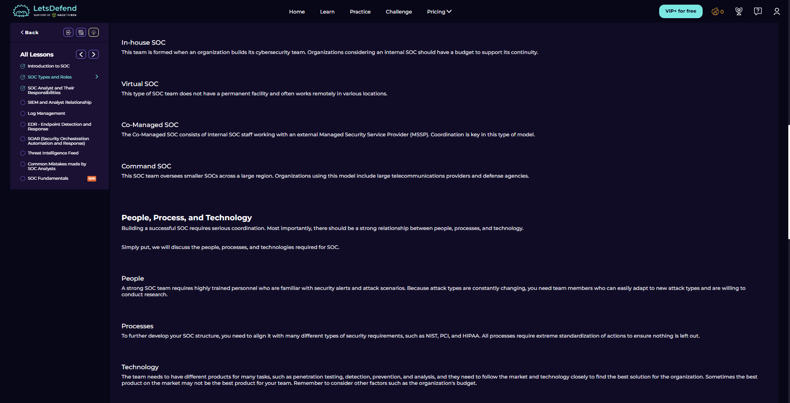

# SOC Types and Roles

Course link: https://app.letsdefend.io/path/soc-analyst-learning-path

## 1) What a SOC is and which models exist

This screenshot defines a Security Operations Center as the function that continuously monitors and analyzes an organization's security posture. The goal is to detect, analyze, and respond to incidents using people, technology, and process.

The lesson then introduces four SOC models: In-house SOC, Virtual SOC, Co-Managed SOC, and Command SOC. This matters because SOC structure changes depending on budget, organization size, risk level, and how much work is handled internally or by an external provider.

## 2) SOC models, people, process, and technology

This section explains the models in more detail. An in-house SOC is built internally, a virtual SOC works without a permanent physical facility, a co-managed SOC combines internal staff with an MSSP, and a command SOC coordinates smaller SOCs across a larger region.

The second half of the screenshot introduces the main SOC balance: people, process, and technology. A strong SOC needs trained analysts, standardized procedures, and tools that fit the organization's real security needs.

The key lesson here is that buying a security product is not enough. Analysts need to understand normal behavior, processes must keep investigations consistent, and tools must support detection, prevention, and analysis.

## 3) SOC roles and checkpoint

This screenshot lists common SOC roles: SOC Analyst, Incident Responder, Threat Hunter, Security Engineer, and SOC Manager.

The SOC Analyst role is responsible for classifying alerts, looking for causes, and advising on remediation. Incident responders handle breach assessment, threat hunters proactively search for hidden threats, security engineers maintain SIEM/SOAR/SOC products, and SOC managers coordinate operational work.

The completed checkpoint confirms the basic role overview before the course moves into the dedicated SOC analyst responsibility section.

## Key Takeaways
- SOC models depend on the organization's needs and resources.
- A SOC depends on people, process, and technology working together.
- SOC analyst is the first investigation role, but it connects closely with incident response, threat hunting, engineering, and management.
