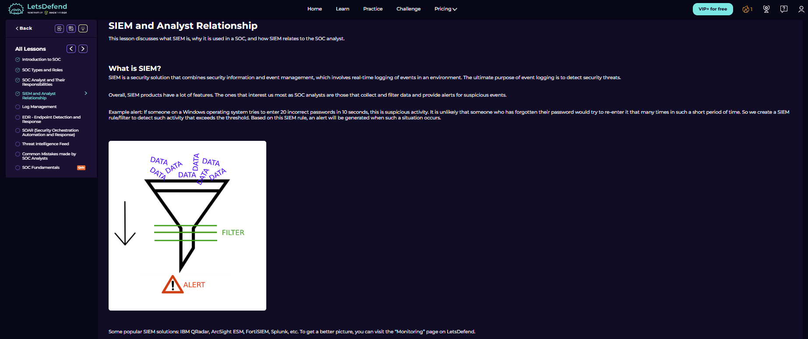
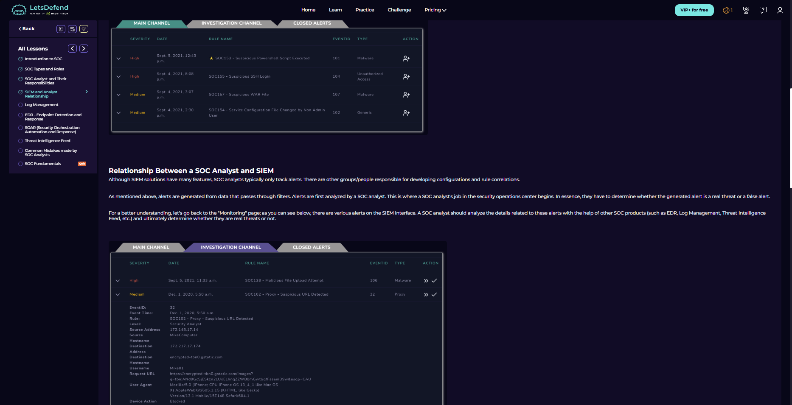
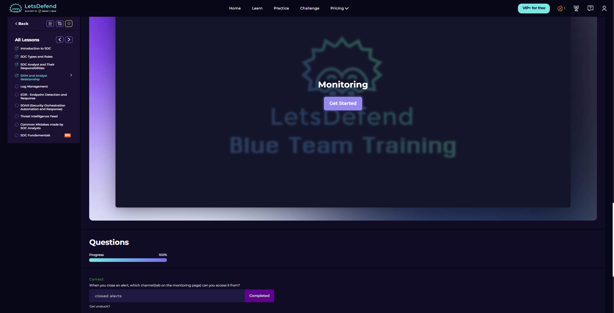

# SIEM and Analyst Relationship

Course link: https://app.letsdefend.io/path/soc-analyst-learning-path

## 1) What SIEM does

This screenshot explains SIEM as a solution that collects event data, filters it, and generates alerts when suspicious activity matches defined rules or thresholds.

The example about repeated failed Windows logins shows the basic detection idea clearly: raw events become useful for a SOC analyst only after they are collected, filtered, and turned into an alert worth reviewing.

## 2) Relationship between SOC analyst and SIEM alerts

This section shows the monitoring interface and explains the analyst's role in the alert flow. SOC analysts usually track and review alerts, while separate teams or roles may handle rule development, correlation logic, and configuration.

The key point is that an alert is only the beginning of the investigation. The analyst checks details, decides whether it looks like a real threat or a false positive, and uses other SOC products such as EDR, log management, and threat intelligence to support the decision.

## 3) Monitoring checkpoint

## Key Takeaways
- SIEM collects and filters events before generating analyst-facing alerts.
- SOC analysts validate alerts instead of blindly trusting every SIEM match.
- Alert review often requires context from other SOC tools, not only the SIEM screen.
