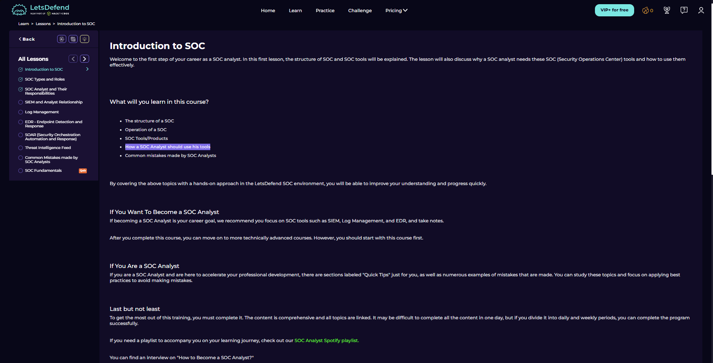
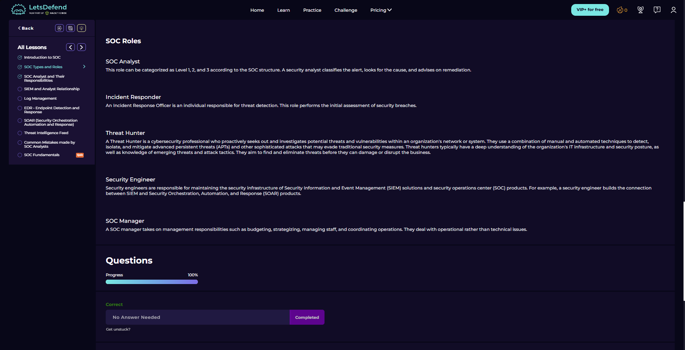
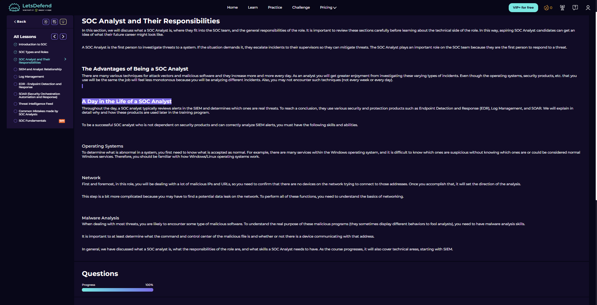

# SOC Fundamentals

Course link: https://app.letsdefend.io/path/soc-analyst-learning-path

## Executive Summary
- This course introduces how a Security Operations Center works and where a SOC analyst fits inside the team.
- The first sections focus on SOC structure, SOC models, analyst responsibilities, and the tools/products used during investigations.
- For a beginner SOC path, this is a useful starting point because it connects people, process, and technology before going deeper into SIEM, EDR, SOAR, and threat intelligence.

## Walkthrough (Evidence + Analysis)

### 1) Course overview and scope

The course overview shows that SOC Fundamentals is a beginner-level LetsDefend course under the Security Analyst track. The page also gives the course size: 9 lessons, 11 lesson questions, 1 quiz, and an estimated 30 minutes to complete.

This is a good first step because the goal is not to jump directly into alerts, but to understand what a SOC is, which tools analysts use, and how investigation work is organized.

---

### 2) Lesson structure and course progression

The lesson sidebar shows the flow of the course. The first three lessons are already completed, and the remaining sections continue into SIEM, log management, EDR, SOAR, threat intelligence feeds, common SOC analyst mistakes, and the final SOC Fundamentals quiz.

This structure is useful because the topics follow the normal SOC learning order: first understand the role and environment, then move into the tools that generate and manage security evidence.

---

### 3) Introduction to SOC

The introduction explains that the course will cover SOC structure, SOC operations, SOC tools/products, how a SOC analyst should use these tools, and common mistakes made by SOC analysts.

The important point in this screen is that SOC work is not only about using a single tool. A SOC analyst needs to understand how the team operates, how tools support investigation, and how to avoid weak analyst habits early.

For someone starting the SOC analyst path, the most relevant note is the recommendation to focus on SIEM, log management, and EDR while taking notes. These are the core areas that will appear repeatedly in real alert triage.

---

### 4) SOC definition and SOC model types

This section defines a SOC as the team or facility that continuously monitors and analyzes an organization's security posture. The main purpose is to detect, analyze, and respond to cybersecurity incidents using people, technology, and process.

The screenshot also introduces different SOC models: In-house SOC, Virtual SOC, Co-Managed SOC, and Command SOC. This matters because not every organization runs security operations in the same way; team structure depends on budget, size, risk, and operational needs.

---

### 5) SOC models: people, process, and technology

This screen breaks down the SOC models in more detail. An in-house SOC is built internally, a virtual SOC works without a permanent physical facility, a co-managed SOC combines internal staff with an MSSP, and a command SOC oversees smaller SOCs across a wider region.

The second half of the screenshot introduces the classic SOC balance: people, process, and technology. A strong SOC needs trained analysts, standardized procedures, and security products that fit the organization's actual needs.

The key takeaway here is that tools alone do not make a SOC effective. Analysts need to know what normal behavior looks like, processes need to keep work consistent, and technology needs to support detection, prevention, and analysis.

---

### 6) SOC roles and first checkpoint

This section lists common SOC-related roles: SOC Analyst, Incident Responder, Threat Hunter, Security Engineer, and SOC Manager.

The SOC Analyst role is described as the person who classifies alerts, looks for the cause, and advises on remediation. Incident responders handle breach assessment, threat hunters proactively search for threats, security engineers maintain SIEM/SOAR/SOC products, and SOC managers handle operational coordination.

The completed checkpoint confirms the basic role overview before moving into the analyst responsibility section.

---

### 7) SOC analyst responsibilities and required skills

This section focuses directly on what a SOC analyst does during the day. The analyst reviews SIEM alerts, decides which alerts may be real threats, and uses tools such as EDR, log management, and SOAR to support the investigation.

The screenshot highlights several skill areas that are important for the role:
- operating system knowledge, because suspicious behavior must be compared against normal Windows/Linux activity;
- networking knowledge, because analysts often investigate malicious IPs, URLs, connections, and possible data leaks;
- malware analysis basics, because many incidents involve understanding what malware is trying to do or where it communicates.

This is the most career-relevant part of the first course sections. It shows that SOC analyst work is a mix of alert triage, evidence review, escalation, and technical understanding across systems, networks, and malware behavior.

## Key Takeaways
- SOC Fundamentals starts with role clarity before introducing deeper tooling.
- A SOC is built around people, process, and technology, not only around a SIEM product.
- SOC models can change depending on the organization's size, budget, and security needs.
- The SOC Analyst role is strongly connected to SIEM alert review, log analysis, EDR context, network evidence, and escalation decisions.
- Operating systems, networking, and malware analysis basics are practical foundations for SOC analyst development.
