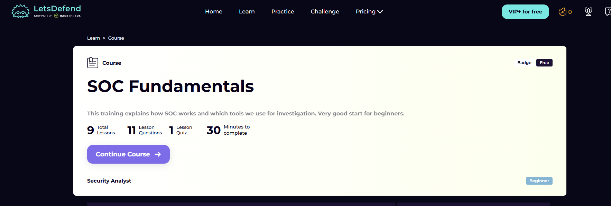
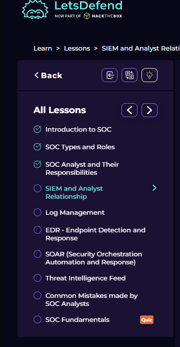

# SOC Fundamentals

Course link: https://app.letsdefend.io/path/soc-analyst-learning-path

## Course Overview

This course is part of the LetsDefend Security Analyst track. The overview shows the course scope clearly: 9 lessons, 11 lesson questions, 1 quiz, and an estimated 30 minutes to complete.

The lesson list starts with the foundational SOC topics and then moves toward SIEM, log management, EDR, SOAR, threat intelligence, common analyst mistakes, and the final quiz. This order is useful because it explains the SOC role before going deeper into the tools used during investigations.

## Lessons
- [Introduction to SOC](01-Introduction_to_SOC/)
- [SOC Types and Roles](02-SOC_Types_and_Roles/)
- [SOC Analyst and Their Responsibilities](03-SOC_Analyst_and_Their_Responsibilities/)
