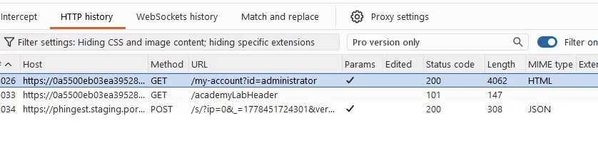

# Lab: User ID controlled by request parameter with password disclosure (PortSwigger)

## Scope / Target
- Target: PortSwigger Web Security Academy lab instance
- Scope: Lab environment only (no real targets)
- Date: 2026-05-11

## Summary
The account page uses a user-controlled identifier (`id`) to decide which user's data to load. By setting `id` to a more
privileged user (e.g., `administrator`), the application leaks that user's current password in the HTML response.

## Steps to Reproduce (high-level)
1. Log in as a low-priv user (e.g., `wiener:peter`) and open your account page.
2. Change the request parameter to target another user:
   - `GET /my-account?id=administrator`
3. View the response in Burp and observe that the page contains the administrator's password value.

## Evidence
Request:
- `GET https://<lab-host>/my-account?id=administrator`

Screenshot (Burp HTTP history):
- `assets/password-disclosure-burp-history.webp`



Response snippet:
```http
HTTP/2 200 OK
Content-Type: text/html; charset=utf-8

<p>Your username is: administrator</p>
...
<input required type="hidden" name="csrf" value="<csrf>">
<input required type=password name=password value='<password>'/>
```

## Impact
Credentials disclosure enables account takeover. If the disclosed account is an administrator, this can lead to full
privilege escalation and destructive actions.

## Severity
- Rating: Critical
- Rationale: Direct disclosure of admin password (immediate account takeover).

## Recommendation
- Enforce authorization server-side: the authenticated user must only access their own account data.
- Do not prefill sensitive values (passwords) in responses. Store passwords hashed; never display them back.
- Add tests to ensure `id` tampering cannot access other users’ data (IDOR/BOLA coverage).

## Retest Plan
- Confirm `/my-account?id=administrator` returns 403/404 for non-admin users.
- Confirm password fields are never pre-populated with real credentials.
