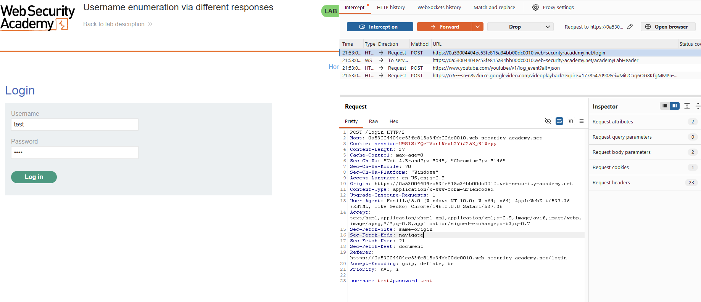
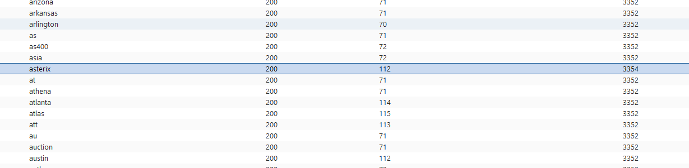
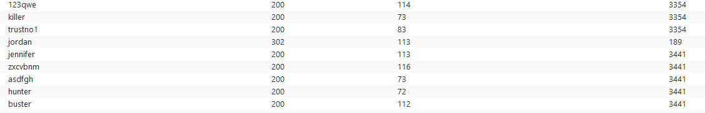
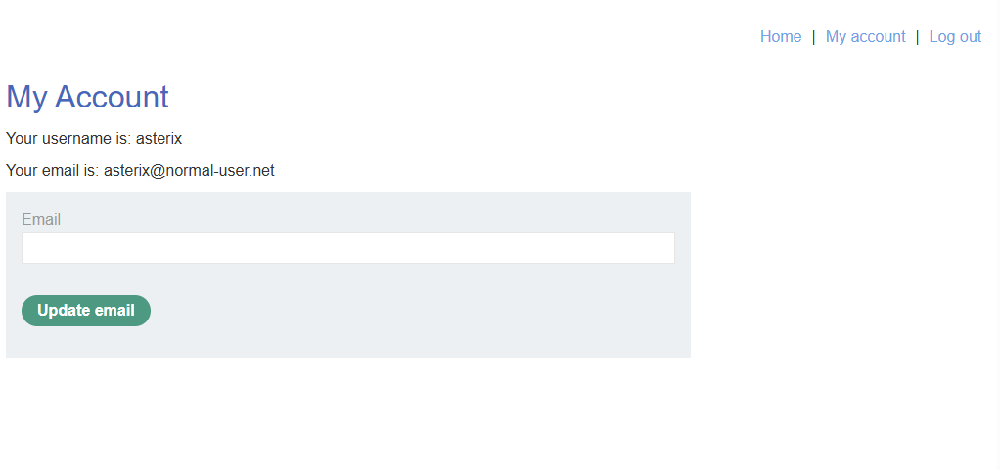

# Lab: Username enumeration via different responses (PortSwigger)

## Scope / Target
- Target: PortSwigger Web Security Academy lab instance
- Scope: Lab environment only (no real targets)
- Date: 2026-05-11

## Lab Description

This lab is vulnerable to username enumeration and password brute force through differences in the login response.

Goal: identify a valid username, brute-force the matching password from the provided wordlist, and access the account page.

## Overview (why this works)

The login flow leaks useful state through its error behavior:

- invalid usernames trigger one type of response,
- valid usernames with wrong passwords trigger a different response.

Once a valid username is known, the attacker can switch from reconnaissance to password brute force. In this lab, success
is also easy to detect because the valid password causes a redirect to the account page.

## Summary

The login endpoint returns different responses for valid vs invalid usernames. This allows an attacker to enumerate a
valid username, then brute-force the password using a wordlist.

## Steps to Reproduce (high-level)

1. Capture a login request (`POST /login`) in Burp and send it to Intruder.
2. Set `username` as the payload position and run the provided username wordlist.
3. Identify the outlier response that indicates a valid username.
4. Keep the valid username fixed and switch the payload position to `password`.
5. Run the provided password wordlist.
6. Identify the successful password attempt, usually indicated by a redirect such as `302 Found`.
7. Log in with the discovered credentials and verify the account page loads.

## Evidence

- Valid username identified: `asterix`
- Successful password attempt shows a redirect:
  - `302 Found` -> `Location: /my-account?id=asterix`

Baseline request capture (the request sent to Intruder):

Username enumeration (the outlier reveals a valid username):

Password brute force (success is indicated by a redirect):

Verification (the account page loads after authentication):

## Impact

Username enumeration reduces the search space for brute-force attacks and makes account takeover attempts far more
efficient.

## Severity

- Rating: High
- Rationale: Enables account compromise when combined with weak passwords and missing brute-force protections.

## Recommendation

- Use generic authentication error messages for both invalid usernames and invalid passwords.
- Add rate limiting, lockouts, or progressive delays for repeated failures.
- Add bot defenses where appropriate.
- Monitor and alert on enumeration and credential-stuffing patterns.

## Retest Plan

- Verify valid and invalid usernames now produce indistinguishable responses.
- Verify repeated brute-force attempts are slowed, blocked, or alerted on.
