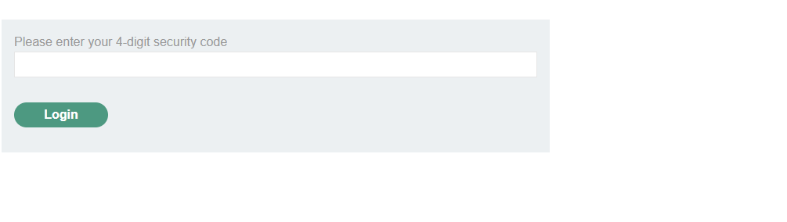
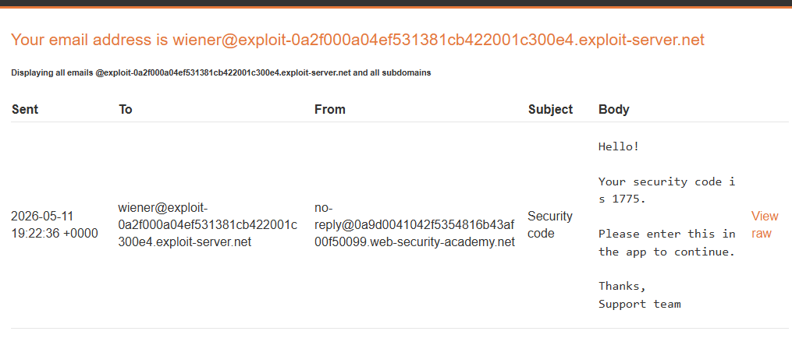
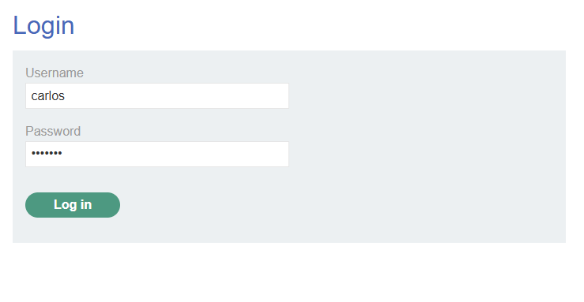
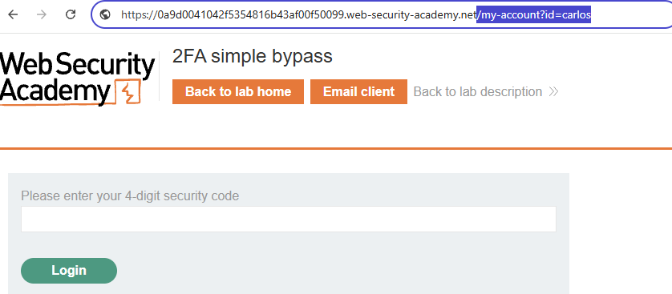
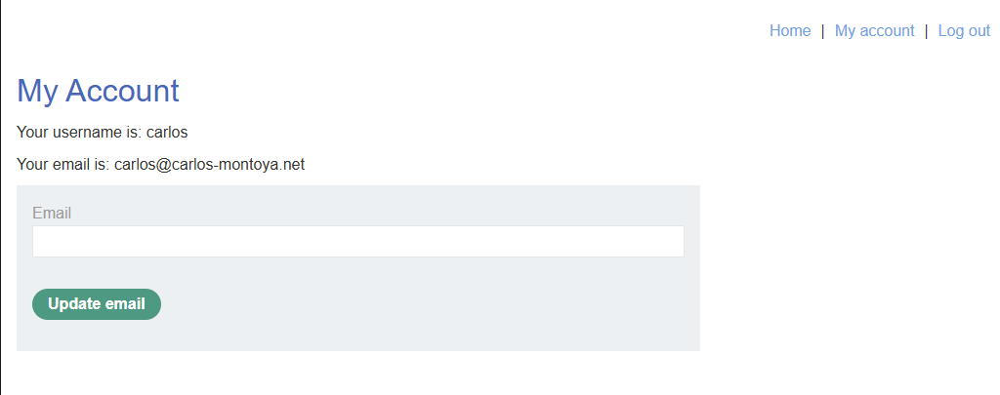
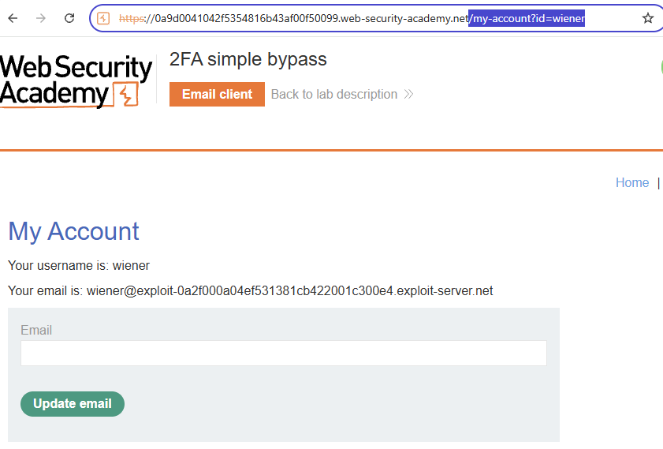

# Lab: 2FA simple bypass (PortSwigger)

## Scope / Target
- Target: PortSwigger Web Security Academy lab instance
- Scope: Lab environment only (no real targets)
- Date: 2026-05-11

## Summary
The application enforces 2FA during login, but the post-login account page (`/my-account`) can be accessed without
completing the 2FA step. As a result, an attacker with valid credentials can bypass 2FA and access the victim's account.

## Steps to Reproduce (high-level)
1. Log in with a low-priv user (e.g., `wiener:peter`) and note the account page URL pattern (e.g., `/my-account`).
2. Log out.
3. Log in with the victim credentials (e.g., `carlos:montoya`).
4. When prompted for the 2FA verification code, manually navigate to `/my-account` (instead of completing 2FA).
5. If the account page loads, 2FA is bypassed and the lab is solved.

## Evidence
Victim login reaches the 2FA checkpoint (we do *not* have the code):

Low-priv user's email client shows the 2FA code delivery flow (proves code is required in the intended path):

Victim credentials entered successfully (carlos:montoya), immediately followed by the 2FA prompt:

We are still on the 2FA URL / step (session is not 2FA-complete yet):

Bypass: directly navigate to `/my-account` without submitting a 2FA code:

Result: victim's account page loads anyway (2FA bypass confirmed):

## Impact
2FA bypass leads to account takeover whenever an attacker obtains valid credentials (phishing, credential stuffing, reuse).

## Severity
- Rating: Critical
- Rationale: 2FA is rendered ineffective; direct unauthorized access to accounts is possible.

## Recommendation
- Enforce 2FA server-side by binding a “2FA-complete” state to the session.
- Block access to authenticated pages until 2FA is completed.
- Re-check authorization on every request; do not rely on client-side navigation.
- Add tests: attempt to access `/my-account` with a session that is not 2FA-complete (should be denied/redirected).

## Retest Plan
- Verify `/my-account` is inaccessible until the session is marked 2FA-complete.
- Verify bypass attempts (direct URL, opening in new tabs, replaying requests) fail consistently.
