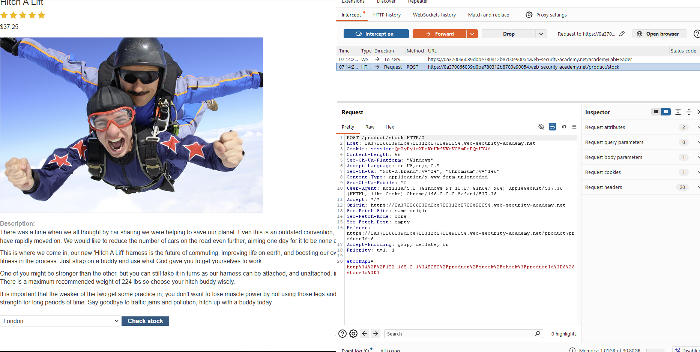
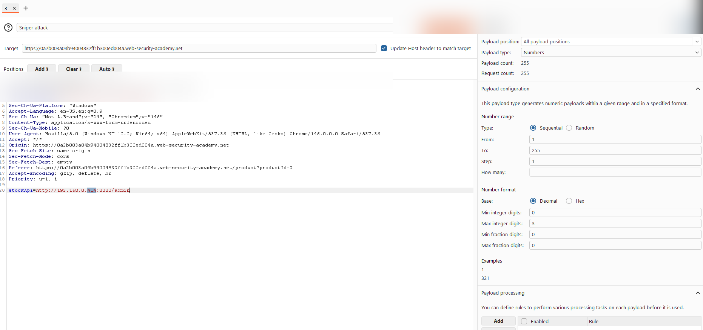
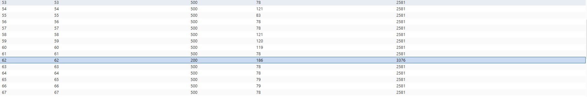
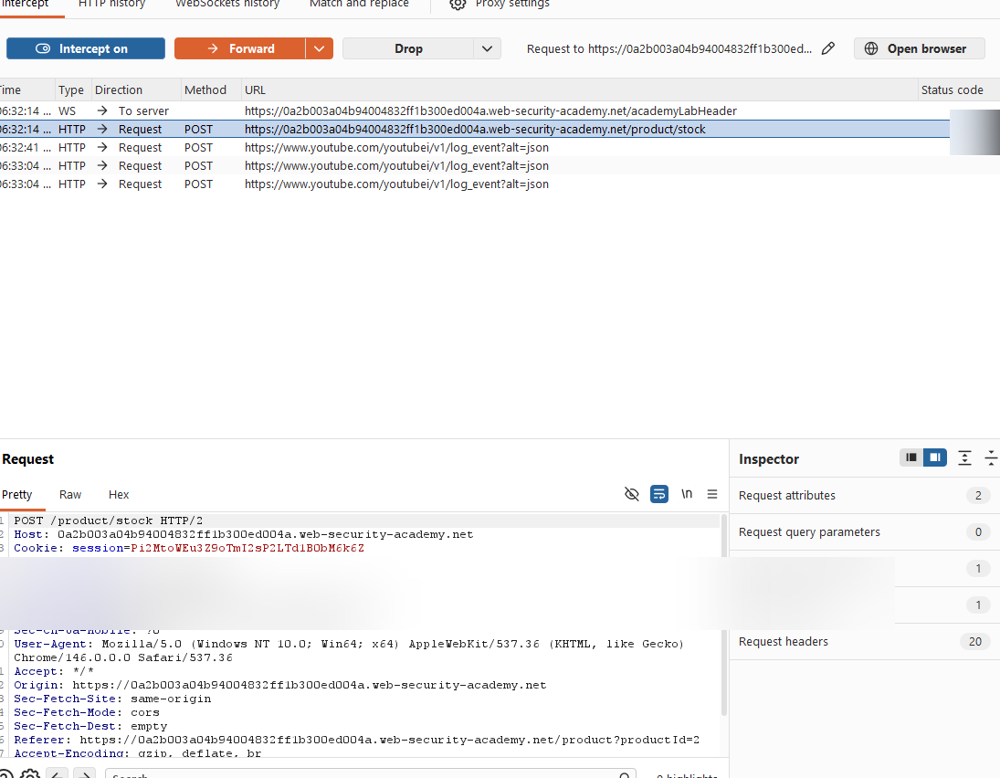
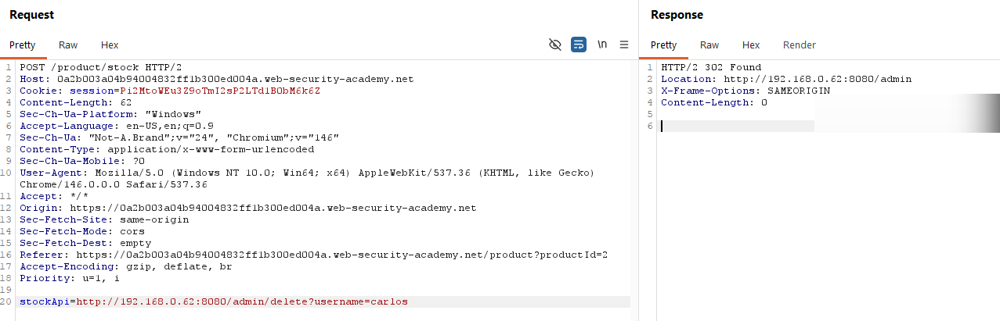

# Lab: Basic SSRF against the local server (internal scan 192.168.0.X:8080) (PortSwigger)

## Scope / Target
- Target: PortSwigger Web Security Academy lab instance
- Scope: Lab environment only (no real targets)
- Date: 2026-05-11

## Summary
The stock check feature fetches a URL from a user-controlled parameter (`stockApi`). By abusing this, we can force the
backend to scan the internal `192.168.0.X` range for an admin interface on port `8080`, then use the discovered internal
admin endpoint to delete the user `carlos`.

## Steps to Reproduce (high-level)
1. Intercept the stock check request (e.g., `POST /product/stock`) in Burp and send it to Intruder.
2. In the request body, set the target pattern:
   - `stockApi=http://192.168.0.§x§:8080/admin`
3. Configure payloads so `x` iterates from `1..255` and start the attack.
4. Identify the internal host that returns a successful response for `/admin` (e.g., `200 OK` vs `500` errors).
5. Send a request to fetch the admin page via SSRF for the discovered host:
   - `stockApi=http://192.168.0.<hit>:8080/admin`
6. From the response, extract the delete URL for `carlos` and trigger it via SSRF:
   - `stockApi=http://192.168.0.<hit>:8080/admin/delete?username=carlos`
7. Confirm the delete action succeeded (commonly indicated by a `302 Found` redirect back to `/admin`) and the lab is solved.

## Evidence (sanitized)
Baseline request capture:

Intruder setup for internal range scan (`192.168.0.X:8080`):

Intruder results showing a successful hit (200 OK):

Admin interface retrieved via SSRF (example hit):

Delete action triggered via SSRF (redirect after deletion):

## Impact
SSRF can be used to scan internal networks, discover internal services, access internal admin interfaces, and perform
privileged actions. In cloud environments, SSRF can also reach metadata services and expose credentials.

## Severity
- Rating: Critical
- Rationale: Internal network reachability + internal admin access + destructive privileged action (user deletion).

## Recommendation (short)
- Allowlist outbound destinations and validate the resolved IP is not private/loopback/link-local.
- Disable redirects or re-validate destination after each redirect hop.
- Add network egress controls so this feature cannot reach internal subnets/metadata endpoints.

## Retest Plan
- Confirm requests to private ranges (`192.168.0.0/16`, `10.0.0.0/8`, `172.16.0.0/12`), loopback, and URL-encoded variants are blocked.
- Confirm stock check still works for allowlisted destinations only.
