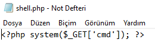
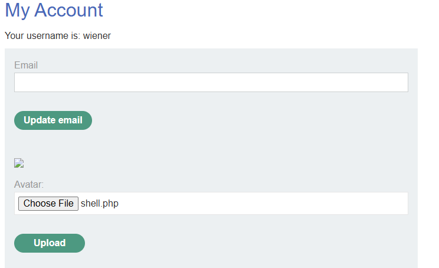
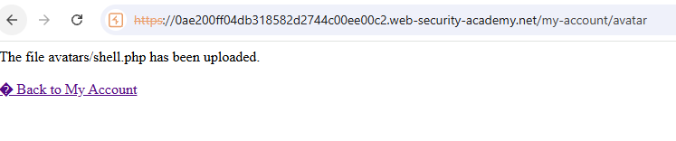
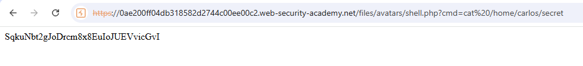

# Lab: Remote code execution via web shell upload (PortSwigger)

## Scope / Target
- Target: PortSwigger Web Security Academy lab instance
- Scope: Lab environment only (no real targets)
- Date: 2026-05-12

## Lab Description

This lab contains a vulnerable avatar upload function that does not validate uploaded files before saving them to the
server filesystem.

Goal: upload a basic PHP web shell, execute it on the server, read `/home/carlos/secret`, and submit the secret.

## Overview (why this works)

The upload feature stores attacker-controlled files directly under a web-accessible directory. Because the server does
not restrict file type or block execution of uploaded scripts, a `.php` file is both stored and interpreted by the web
server as executable code.

That means the upload feature is not just a file storage bug—it becomes a direct remote code execution primitive.

## Summary

The avatar upload feature stores user-supplied files on the server without validation. By uploading a PHP web shell,
an attacker can execute arbitrary code on the server and read sensitive files such as `/home/carlos/secret`.

## Steps to Reproduce

1. Log in as `wiener:peter`.
2. Open `My account` and locate the avatar upload feature.
3. Create a simple PHP web shell, for example:

```php
<?php echo file_get_contents('/home/carlos/secret'); ?>
```

4. Save the file as `shell.php`.
5. Upload `shell.php` as the avatar.
6. Observe that the application accepts the upload and discloses the uploaded path (for example `avatars/shell.php`).
7. Request the uploaded file directly under `/files/avatars/shell.php`.
8. Confirm the response returns the contents of `/home/carlos/secret`, then submit the secret via the lab banner.

## Evidence

1) PHP web shell prepared for upload. Its only job is to read `/home/carlos/secret` and print the result:



2) `shell.php` selected in the avatar upload form on the account page:



3) The server accepts the upload and reveals that the file is now stored as `avatars/shell.php`:



4) Opening the uploaded PHP file executes the web shell and returns the secret from `/home/carlos/secret`:



## Impact

Unrestricted file upload leading to server-side code execution can result in full compromise of the application and
host: sensitive file access, credential theft, persistence, lateral movement, and further post-exploitation activity.

## Severity

- Rating: Critical
- Rationale: Direct remote code execution on the server.

## Recommendation

- Validate uploads server-side using strict allowlists for extensions, MIME types, and file signatures.
- Store uploads outside the web root and serve them through a controlled file handler.
- Rename files on upload and remove any executable interpretation from upload directories.
- Disable script execution in upload locations via server configuration.

## How to test the fix

- Attempt to upload executable extensions such as `.php`, `.phtml`, or polyglot files and verify they are rejected.
- Confirm uploaded files cannot be executed directly from a web-served path.
- Verify the application stores uploads outside the web root and serves them as inert content only.

## Retest Plan

- Attempt to upload executable scripts and verify they are rejected.
- Verify uploaded files are not directly accessible/executable under a web-served directory.
- Confirm the app does not disclose predictable upload paths.
