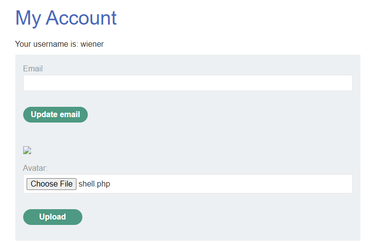
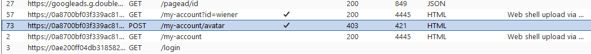
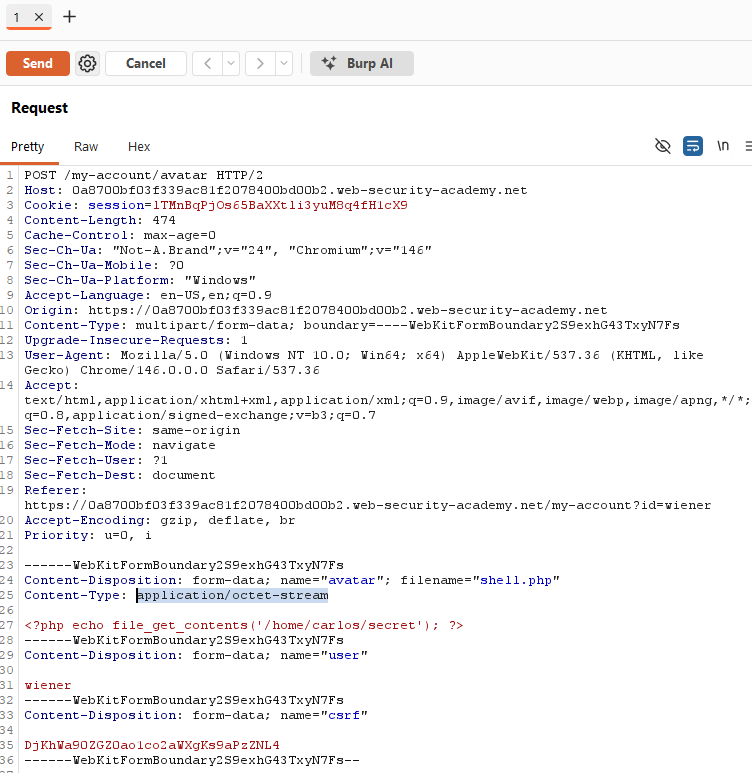
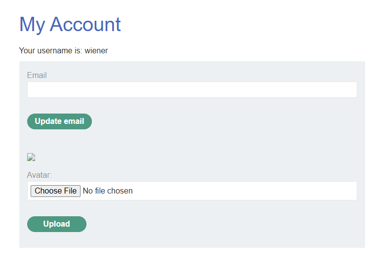
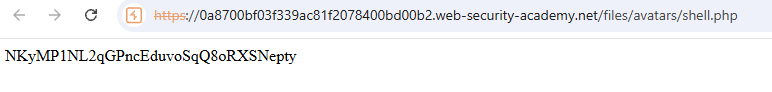

# Lab: Web shell upload via Content-Type bypass (PortSwigger)

## Scope / Target
- Target: PortSwigger Web Security Academy lab instance
- Scope: Lab environment only (no real targets)
- Date: 2026-05-12

## Summary
The avatar upload feature attempts to restrict uploads to images only, but it relies on **user-controllable** metadata
(the `Content-Type` value in the multipart request) to validate file type. By changing `Content-Type` to `image/jpeg`,
it's possible to upload a PHP web shell and read `/home/carlos/secret`.

## Steps to Reproduce
1. Log in as `wiener:peter` and go to **My account** (avatar upload).
2. Prepare a basic PHP web shell (example below) and save it as `shell.php`:
   - `<?php echo file_get_contents('/home/carlos/secret'); ?>`
3. Try uploading `shell.php` normally via the avatar form. The upload is rejected because the server checks MIME type
   (for example it blocks `application/octet-stream`).
4. In Burp, locate the `POST /my-account/avatar` request and send it to **Repeater**.
5. In Repeater, in the multipart section for the file upload, change the file part header:
   - From: `Content-Type: application/octet-stream`
   - To: `Content-Type: image/jpeg`
6. Send the modified request. The server accepts the upload and responds with the uploaded path (for example:
   `avatars/shell.php`).
7. Access the uploaded file under `/files/avatars/shell.php`.
   - In the browser, opening the uploaded avatar in a new tab returns the secret directly (because the shell echoes it).
8. Copy the secret value and submit it via the lab banner to solve the lab.

## Evidence
0) PHP web shell used (reads `/home/carlos/secret`):

1) My account page with the avatar upload form:

2) `shell.php` selected for upload:

3) Normal upload attempt rejected due to MIME type check (`application/octet-stream`):

4) Burp history showing the avatar fetch path (`/files/avatars/<filename>`):

5) Repeater request showing the original file part `Content-Type: application/octet-stream`:

6) Repeater request after changing the file part `Content-Type` to `image/jpeg` (upload succeeds):

7) Opening the uploaded avatar in a new tab returns the secret:

## Impact
Bypassing file upload restrictions can enable remote code execution and full server compromise (read/write files, steal
secrets, pivot to other internal systems).

## Severity
- Rating: Critical
- Rationale: Uploading executable code leads to server-side code execution / sensitive file disclosure.

## Recommendation
- Do not trust user-supplied `Content-Type`. Perform server-side validation using content sniffing and allowlists.
- Store uploads outside the web root and serve them via an image handler (never directly execute uploads).
- Enforce non-executable permissions and disable script execution in upload directories.
- Randomize/rename uploaded files and avoid reflecting predictable paths to users.

## Retest Plan
- Attempt to upload `.php` again while spoofing `Content-Type`; verify the server rejects it.
- Verify `/files/avatars/` cannot execute or interpret scripts (uploads are treated as inert content only).

