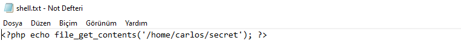
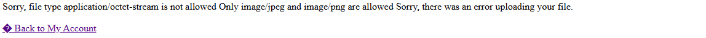
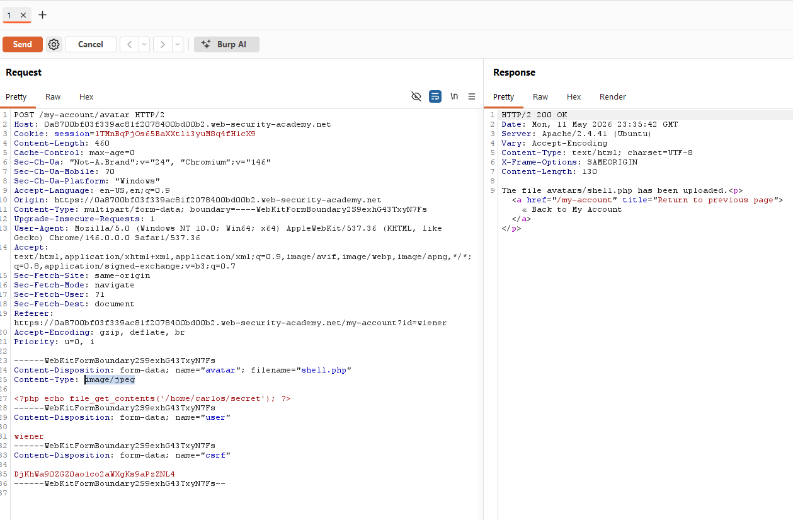

# Lab: Web shell upload via Content-Type bypass (PortSwigger)

## Scope / Target
- Target: PortSwigger Web Security Academy lab instance
- Scope: Lab environment only (no real targets)
- Date: 2026-05-12

## Lab Description

This lab contains an avatar upload function that tries to allow only image files, but the validation relies on
user-controllable metadata.

Goal: bypass the image-only restriction, upload a PHP web shell, and use it to read `/home/carlos/secret`.

## Overview (why this works)

The application is not validating the uploaded file based on its real content. Instead, it trusts the multipart
`Content-Type` header supplied by the client. Because the attacker controls that header, the server can be tricked into
treating a PHP script as if it were an image.

This is weaker than proper server-side file validation and turns the upload restriction into a cosmetic control that can
be bypassed in Burp Repeater.

## Summary

The avatar upload feature attempts to restrict uploads to images only, but it relies on the client-controlled
`Content-Type` value in the multipart request. By changing the file-part header to `image/jpeg`, it is possible to
upload a PHP web shell and read `/home/carlos/secret`.

## Steps to Reproduce

1. Log in as `wiener:peter` and open `My account`.
2. Prepare a PHP file that prints the contents of `/home/carlos/secret`.
3. Try uploading `shell.php` normally through the avatar form.
4. Observe that the normal upload fails because the server sees the file part as `application/octet-stream`.
5. In Burp, locate the failed `POST /my-account/avatar` request and send it to Repeater.
6. In the multipart body, change the file-part header:
   - from `Content-Type: application/octet-stream`
   - to `Content-Type: image/jpeg`
7. Send the modified request and confirm the server now accepts the upload.
8. Open the uploaded file under `/files/avatars/shell.php` and confirm the secret is returned.

## Evidence

1) PHP web shell prepared for the upload. It reads `/home/carlos/secret` when executed:

2) The account page shows the avatar upload form before the request is sent:

3) `shell.php` is selected in the avatar form for the first, normal upload attempt:

4) The normal upload attempt is rejected because the request uses the file-part header `Content-Type: application/octet-stream`:

5) Burp HTTP history shows the failed `POST /my-account/avatar` request that we reuse as the basis for manual tampering:

6) In Repeater, the original multipart request still shows `Content-Type: application/octet-stream` for the file part:

7) After changing that header to `Content-Type: image/jpeg`, the server responds with `200 OK` and confirms that
`avatars/shell.php` has been uploaded:

8) Opening the uploaded file in a new tab executes the PHP payload and returns Carlos's secret:

## Impact

Bypassing file upload restrictions can lead directly to remote code execution. In real applications this may result in
server compromise, file theft, credential extraction, persistence, and deeper internal access.

## Severity

- Rating: Critical
- Rationale: Executable code can be uploaded and run on the server by spoofing client-controlled metadata.

## Recommendation

- Do not trust user-supplied `Content-Type`.
- Validate uploads server-side using extension allowlists, MIME verification, and file signature/content checks.
- Store uploads outside the web root and serve them through a safe handler only.
- Disable script execution in upload directories and randomize stored filenames.

## How to test the fix

- Attempt to upload `.php` while spoofing `Content-Type: image/jpeg` and verify the server still rejects it.
- Try alternative executable extensions and polyglot payloads.
- Confirm files under the upload directory are always treated as inert content and never executed.

## Retest Plan

- Attempt to upload `.php` again while spoofing `Content-Type`; verify the server rejects it.
- Verify `/files/avatars/` cannot execute or interpret scripts (uploads are treated as inert content only).
