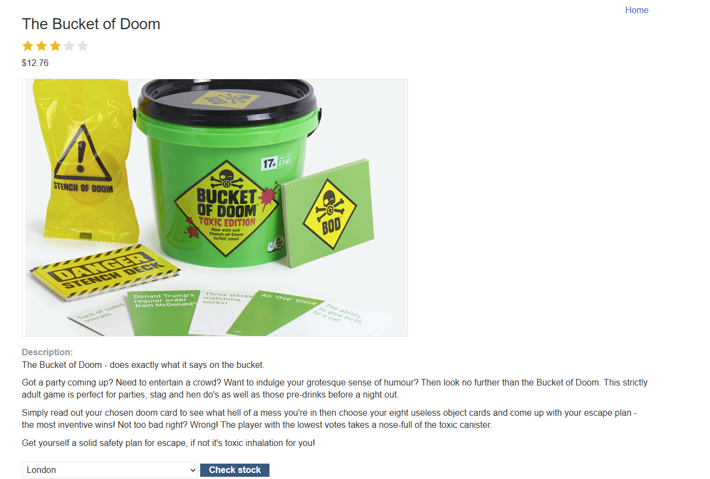
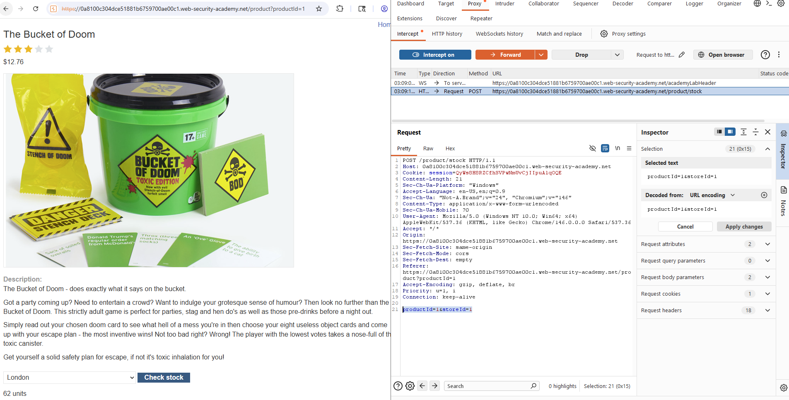
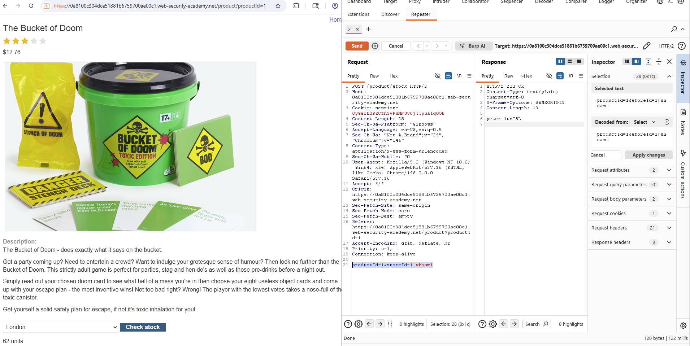

# Lab: OS command injection, simple case (PortSwigger)

## Scope / Target
- Target: PortSwigger Web Security Academy lab instance
- Scope: Lab environment only (no real targets)
- Date: 2026-05-12

## Lab Description

This lab contains a stock-check feature that passes user input into an operating-system command.

Goal: inject an additional command into the request and confirm code execution by leaking the output of `whoami`.

## Overview (why this works)

The vulnerable input is `storeId`. Instead of validating or safely handling it, the application appears to build a
shell command using attacker-controlled data. When a shell metacharacter such as `|` is accepted, the attacker can
append a second command and have it executed by the operating system.

This turns an ordinary business feature—checking product stock—into a direct command-execution surface.

## Summary

The stock check feature builds an operating-system command using user input from `storeId`. Because the input is not
safely handled, command separators can be injected. Appending `|whoami` executes an extra command and leaks the server
user (`peter-1uzI5L` in this lab instance).

## Steps to Reproduce

1. Open a product page and click `Check stock` to generate the stock request.
2. Capture the `POST /product/stock` request in Burp Proxy.
3. Send the request to Repeater.
4. Modify the `storeId` parameter to include an OS command separator and a second command:
   - `storeId=1|whoami`
5. Send the modified request.
6. Observe that the response now contains the output of the injected command.
7. Confirm that the returned server-side username is `peter-1uzI5L`, proving OS command injection.

## Evidence

1) The normal stock-check workflow and captured `POST /product/stock` request:

2) The baseline product page before the payload is injected:

3) The request is replayed in Repeater with `storeId=1|whoami`, and the response includes the output
`peter-1uzI5L`:

## Impact

OS command injection can allow arbitrary command execution in the security context of the web application. In real
systems this can lead to secret disclosure, file access, command chaining, persistence, or full host compromise.

## Severity

- Rating: Critical
- Rationale: Direct server-side command execution via user-controlled input.

## Recommendation

- Never concatenate user input into shell commands.
- Replace shell execution with safe APIs wherever possible.
- Apply strict input allowlisting (for `storeId`, numeric-only validation is expected).
- Run the application with the least privileges necessary and isolate risky execution paths.

## How to test the fix

- Re-test payloads such as `|whoami`, `;whoami`, `&&whoami`, and backticks, and verify they are rejected or handled as
  plain input.
- Confirm only expected numeric `storeId` values are accepted and command output is never reflected.

## Retest Plan

- Re-send payloads like `|whoami`, `;whoami`, `&&whoami` and confirm they are rejected or treated as plain input.
- Verify only expected `storeId` values are accepted and command output is never reflected.
