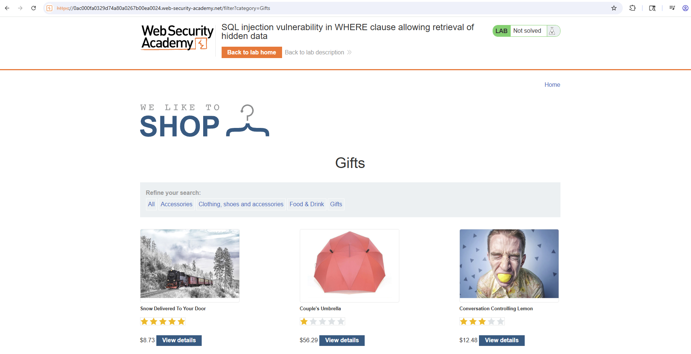
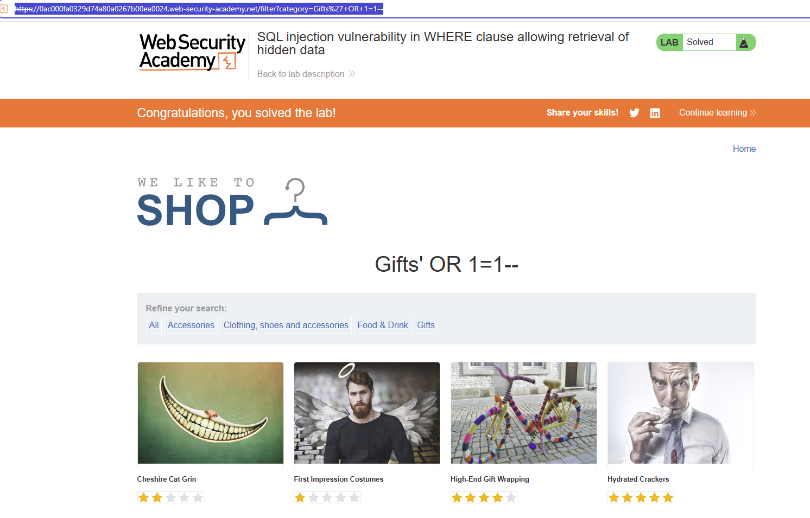

# Lab: SQL injection vulnerability in WHERE clause allowing retrieval of hidden data (PortSwigger)

## Scope / Target
- Target: PortSwigger Web Security Academy lab instance
- Scope: Lab environment only (no real targets)
- Date: 2026-05-12

## Lab Description

This lab contains a SQL injection vulnerability in the product category filter.

The backend query behaves like:

```sql
SELECT * FROM products WHERE category = 'Gifts' AND released = 1
```

Goal: inject SQL into the `category` parameter so the application returns hidden/unreleased products.

## Overview (why this works)

The `category` value is placed directly into a SQL string. By inserting a closing quote, a boolean condition, and a
comment sequence, we can terminate the intended string value, add our own logic, and neutralize the remainder of the
original query.

In this lab, the payload `Gifts' OR 1=1--` turns the restrictive filter into one that evaluates true for all rows,
including unreleased products.

## Summary

The product filter uses the `category` parameter directly in a SQL `WHERE` clause. By injecting SQL in the URL, the
query logic is changed so hidden/unreleased items are returned.

## Steps to Reproduce

1. Open the category page normally, for example:
   - `/filter?category=Gifts`
2. Observe the baseline product listing for that category.
3. In the URL, replace the category value with the SQL injection payload:
   - `Gifts' OR 1=1--`
4. Use the encoded form in the browser:
   - `/filter?category=Gifts%27+OR+1=1--`
5. Reload the page and observe that additional products now appear, including unreleased ones.
6. Confirm the lab is solved.

## Query logic

Intended query shape:

```sql
SELECT * FROM products WHERE category = 'Gifts' AND released = 1
```

After injection:

```sql
SELECT * FROM products WHERE category = 'Gifts' OR 1=1--' AND released = 1
```

Because `OR 1=1` is always true, the restrictive `released = 1` condition is effectively bypassed.

## Evidence

1) Baseline category view before injection, using the normal `Gifts` filter:



2) After applying the SQLi payload `Gifts' OR 1=1--`, the page shows additional items and the lab enters the solved
state:



## Impact

SQL injection in filtering logic can expose hidden records and bypass business restrictions. In real systems, similar
flaws can lead to sensitive data disclosure, authentication bypass, privilege escalation, or full database compromise.

## Severity

- Rating: Critical
- Rationale: Direct manipulation of backend SQL query logic via user input.

## Recommendation

- Use parameterized queries / prepared statements for all user-controlled input.
- Apply strict server-side validation or allowlisting for expected category values.
- Enforce authorization and business rules independently of user-controlled query parameters.

## How to test the fix

- Re-test with payloads such as `' OR 1=1--`, `' UNION SELECT ...`, and encoded equivalents.
- Confirm the application treats malicious input as plain data and still returns only authorized, released records.

## Retest Plan

- Re-test with payloads like `' OR 1=1--` and confirm they are treated as plain text input.
- Verify only allowed categories return expected, authorized records.
