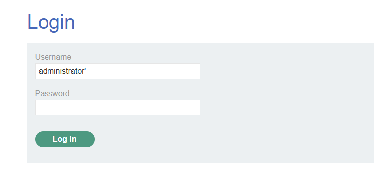
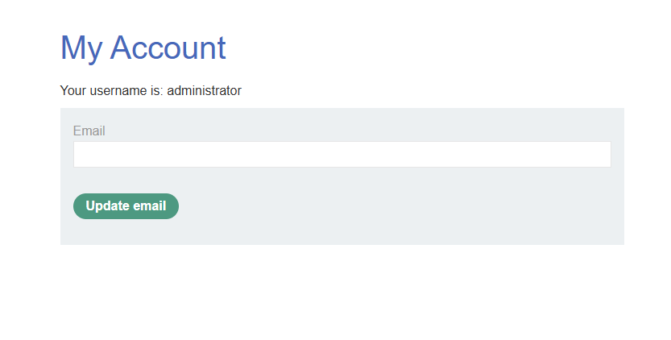

# Lab: SQL injection vulnerability in login function (PortSwigger)

## Scope / Target
- Target: PortSwigger Web Security Academy lab instance
- Scope: Lab environment only (no real targets)
- Date: 2026-05-12

## Summary
The login function is vulnerable to SQL injection in the `username` parameter. By terminating the string and commenting
out the rest of the query, we can force the application to authenticate as `administrator` without knowing a password.

## Steps to Reproduce
1. Open the login page.
2. In the `Username` field, enter the payload:
   - `administrator'--`
3. Leave the password blank (or any value) and submit the form.
4. If the application logs you in as `administrator`, the lab is solved.

## Evidence
1) SQLi payload placed in the login username field (`administrator'--`):

2) Successful authentication as administrator (account page):

## Impact
SQL injection in authentication can enable complete account takeover, including administrative access. In real systems
this typically leads to full application compromise.

## Severity
- Rating: Critical
- Rationale: Authentication bypass as an administrative user.

## Recommendation
- Use parameterized queries/prepared statements for authentication checks.
- Apply strict input handling and avoid building SQL with string concatenation.
- Add monitoring for suspicious login payloads and repeated failed login attempts.

## Retest Plan
- Verify payloads like `administrator''--`, `' OR 1=1--`, and `admin'--` do not change authentication behavior.
- Confirm the backend uses parameterized queries and no SQL errors leak to users.
