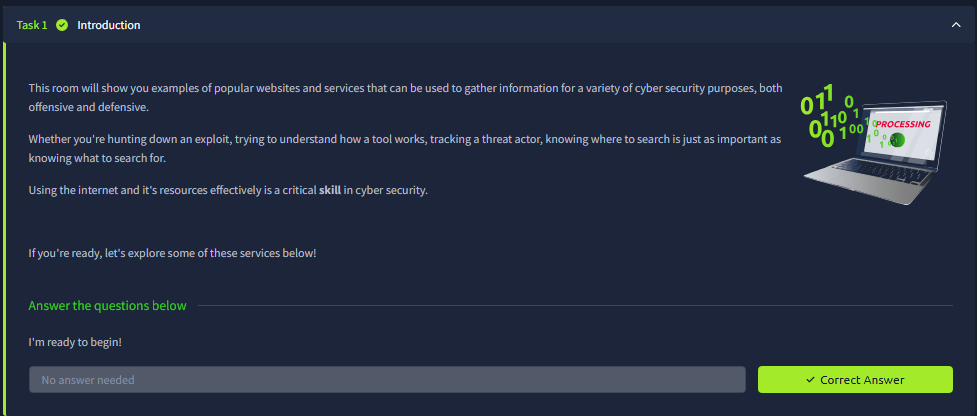
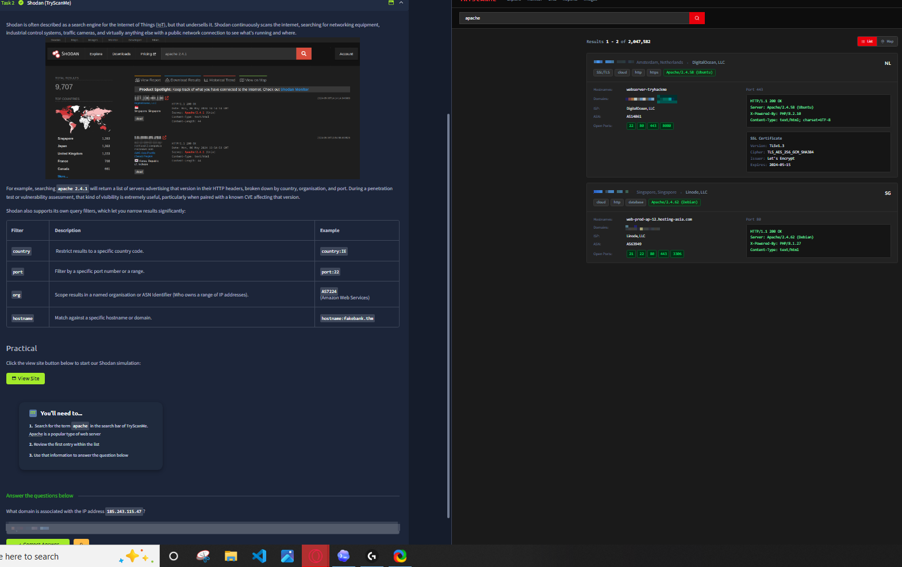
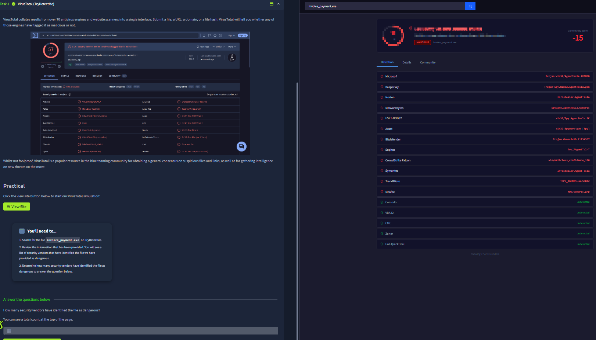
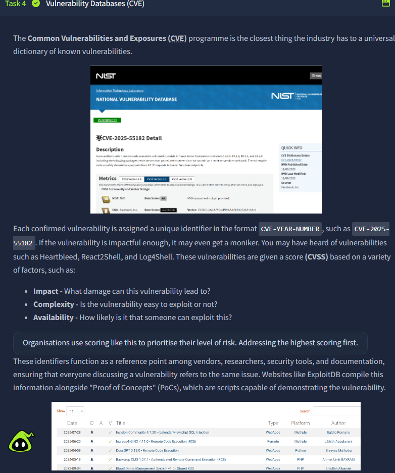
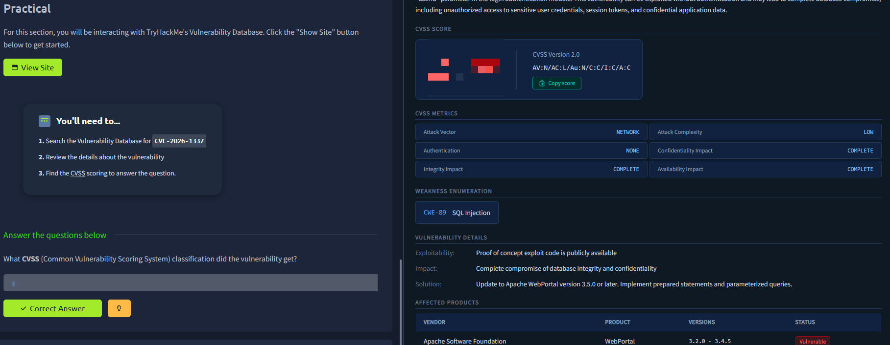
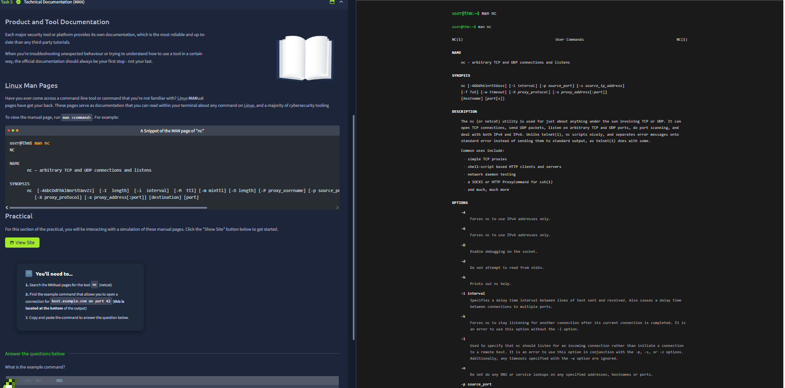
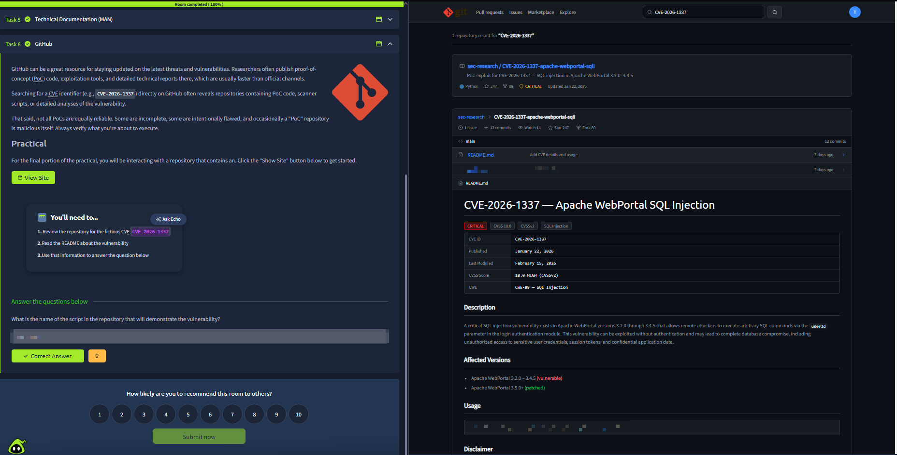



# Search Skills

Room link: https://tryhackme.com/room/searchskills

## Executive Summary
- This room focuses on how to find reliable technical information quickly and verify what is trustworthy.
- It teaches practical search habits (query shaping, operator use, filtering noise, source validation).
- For AppSec work, strong search skills directly reduce time-to-answer during investigation, debugging, and write-up preparation.

## Walkthrough (Evidence + Analysis)

### 1) Why search is a core cybersecurity skill

The first screenshot frames searching as an operational skill, not a passive activity. The key point is that security work depends on finding precise answers fast under uncertainty.

### 2) Building better search queries

This section appears to emphasize query quality: specific keywords, context terms, and intent-based phrasing. Better query design narrows results and prevents wasting time on generic/non-actionable pages.

### 3) Using operators and narrowing results

The screenshot highlights structured searching techniques (e.g., exact phrases, include/exclude logic, scoped searches). In practice, this is essential when looking for version-specific docs, error messages, or exploitation references.

### 4) Evaluating source reliability

This part focuses on deciding whether a source is trustworthy: official docs, known references, date relevance, and reproducibility. This protects you from following outdated or incorrect advice.

### 5) Practical search task and validation

The practical segment validates that search results are not just found, but verified against the room’s expected context. This reinforces a core analyst habit: never stop at first hit, confirm correctness.

### 6) Question checkpoint and concept reinforcement

This checkpoint confirms that query formulation and source vetting steps were understood. It also trains consistency—same method can be reused across networking, web, and incident topics.

### 7) Completion and workflow consolidation

The final screenshot consolidates the workflow: define question -> search precisely -> validate source -> extract actionable answer. This process directly supports faster and cleaner security write-ups.

## Key Takeaways
- Search skill is a force multiplier for every security path.
- Query quality determines result quality.
- Verification of source/date/context is mandatory before trusting technical guidance.
- A repeatable search workflow improves both speed and accuracy in AppSec tasks.
