# Linux Fundamentals Part 1

Room link: https://tryhackme.com/room/linuxfundamentalspart1

## Executive Summary
- This room introduces Linux from the ground up: what Linux is, where it is used, and why command-line usage matters.
- It then walks through core terminal commands (`echo`, `whoami`, `ls`, `cd`, `cat`, `pwd`) and practical file discovery with `find` and `grep`.
- The final section introduces shell operators (`&`, `&&`, `>`, `>>`) for command chaining, background jobs, and output redirection.

## Evidence + Screenshot-based Analysis

### 1) Room introduction and learning goals
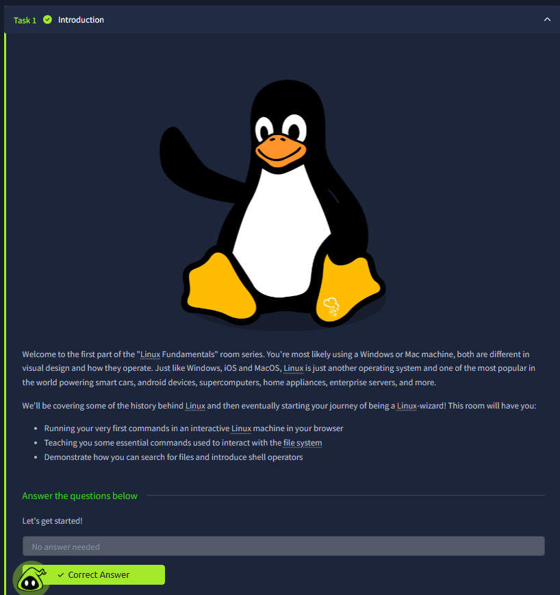
This screenshot clearly frames the room scope: Linux fundamentals for beginners using an in-browser machine. The visible bullet points define the exact learning outcomes—run first commands, understand basic filesystem interaction, and get introduced to shell operators. This is important because it sets the progression from concept -> command usage -> practical interpretation, not just memorizing syntax.

### 2) Where Linux is used + distributions concept
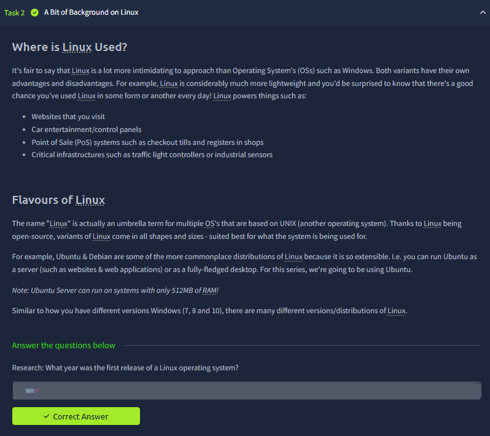
The screenshot explains two key ideas: Linux is already everywhere (websites, control systems, POS, infrastructure), and “Linux” is an umbrella family with many distributions. The Ubuntu/Debian mention and server vs desktop distinction show why Linux appears in many operational roles. The practical value here is understanding that command-line habits transfer across distros even if package tools or defaults change.

### 3) Deploying and accessing the in-browser Linux machine
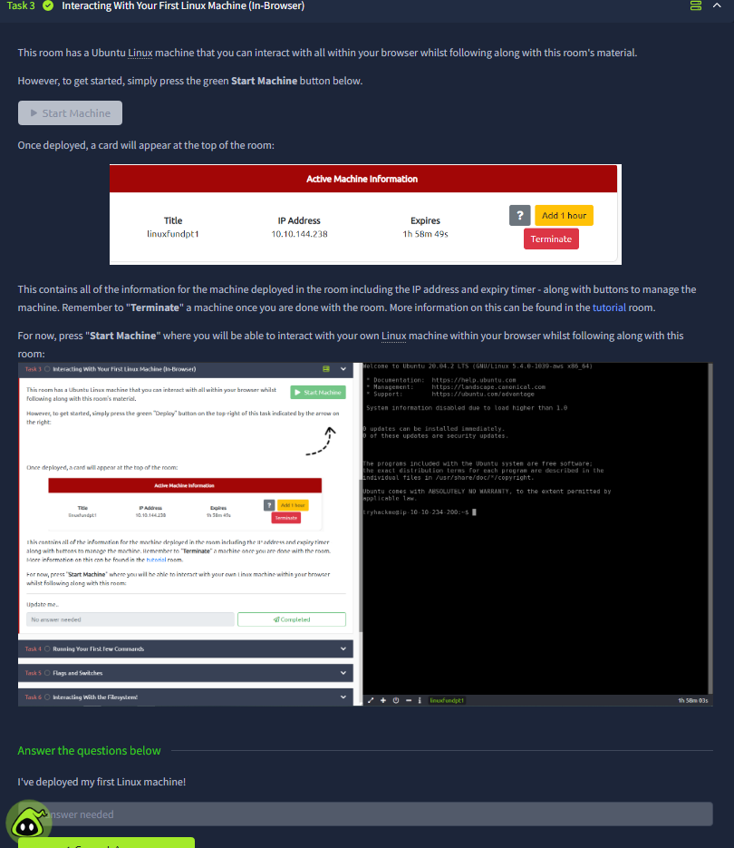
This image focuses on environment setup: starting a machine, reading active machine info (including IP and expiry), and opening the web terminal. The screenshot also shows lifecycle controls like extending time and terminating instances. Operationally, this teaches an important workflow pattern: before any command work, validate session state and target context.

### 4) First commands: `echo` and `whoami`
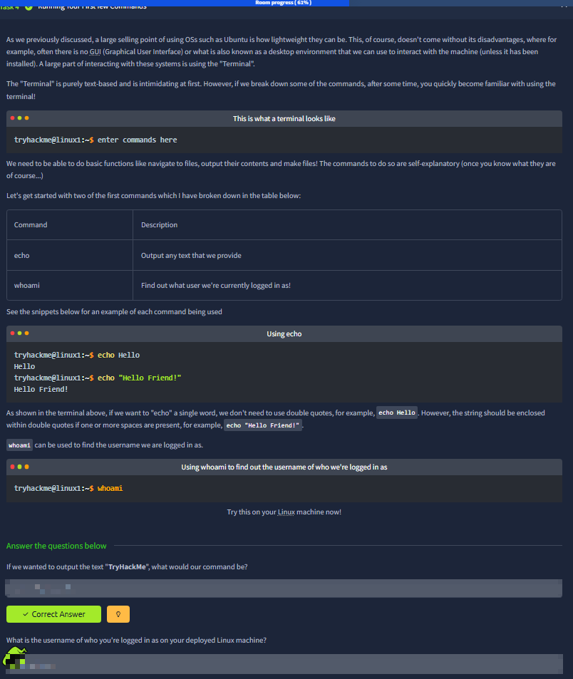
Here the room introduces two foundational commands: `echo` for printing values and `whoami` for confirming current user context. The examples with quoted/unquoted output teach string handling basics, while `whoami` highlights identity awareness before executing privileged actions. This screenshot is conceptually small but security-relevant: user context drives permissions and determines what commands can succeed.

### 5) Filesystem interaction basics: `ls`, `cd`, `cat`, `pwd`
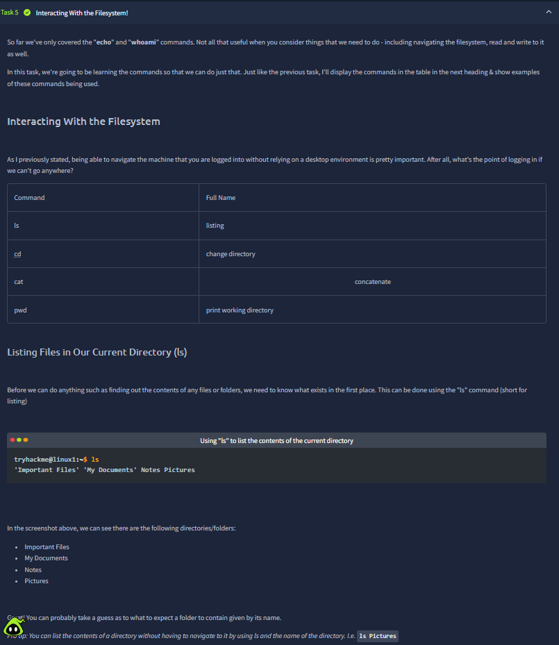
This screenshot transitions from command syntax to filesystem navigation logic. It defines each command’s role, then demonstrates listing files and reading file contents. The narrative connects discovery (`ls`) to movement (`cd`) and content retrieval (`cat`), which is the exact workflow used in almost every Linux triage or CTF task. It also reinforces that filenames and folder naming give strong clues during fast reconnaissance.

### 6) Working directory awareness with `pwd`
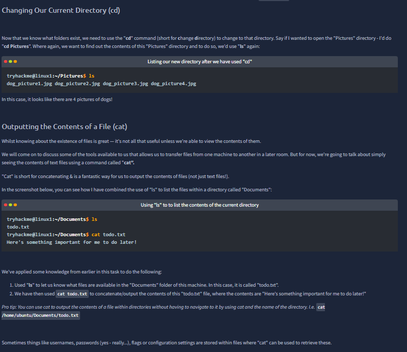
This section emphasizes orientation: knowing *where* you are in the filesystem before taking action. The screenshot shows `pwd` output and maps it to explicit absolute paths, then connects path awareness to future `cd` operations. This is critical for avoiding command mistakes, especially when multiple similarly named directories exist or when scripts assume a specific working path.

### 7) Linux challenge checkpoints (command application)
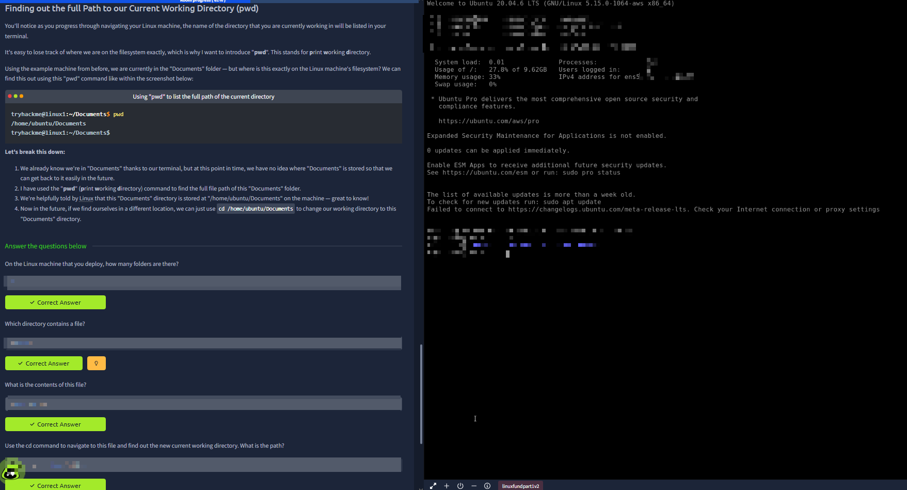
The quiz block here validates applied command usage rather than theory alone: finding folder counts, locating a file, reading file content, and navigating to a target path. The visible question sequence mirrors a real terminal troubleshooting flow: discover -> inspect -> open -> move. It confirms the room’s command set is being used in combination, not isolation.

### 8) File discovery using `find`
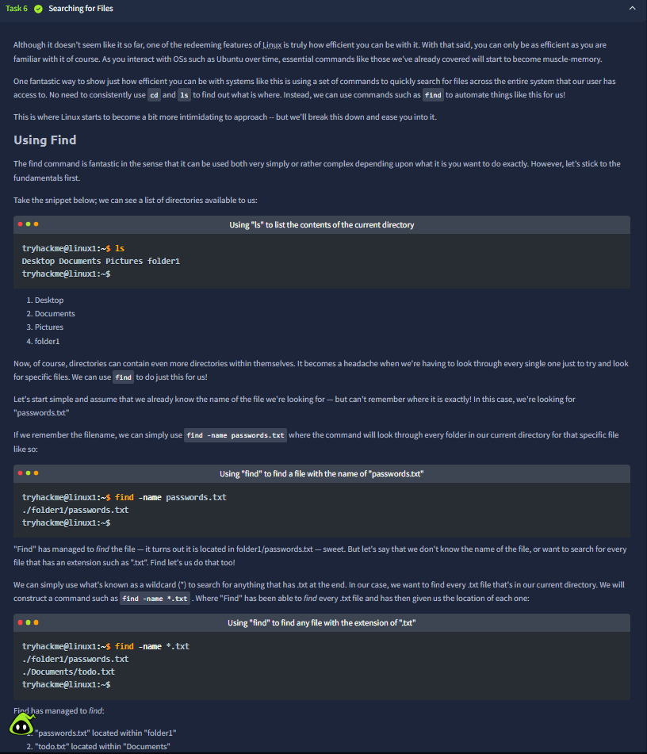
This screenshot introduces scalable search behavior with `find`, including exact filename lookup and wildcard extension searches. The examples show why manual directory browsing becomes inefficient as tree depth grows. The practical insight is speed and repeatability: with proper search patterns, you can surface relevant files quickly even in unfamiliar systems.

### 9) Content search and recursive lookup with `grep`
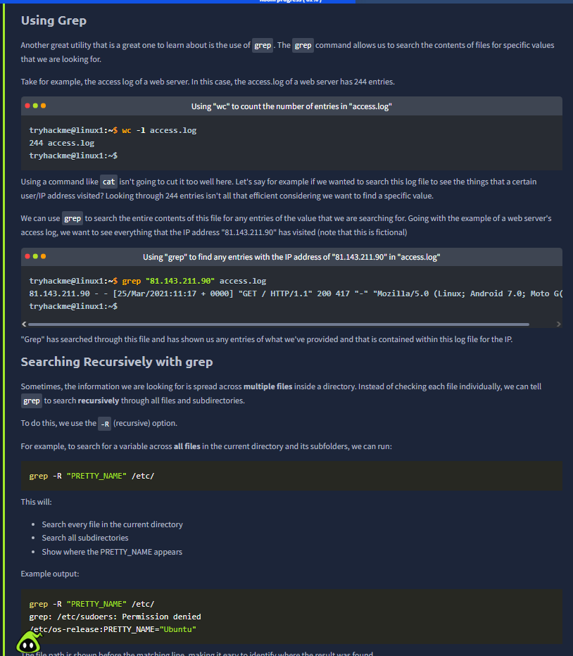
The image explains `grep` as content-level filtering, then demonstrates matching specific values inside log files and recursive scanning with `-R`. It distinguishes file search (`find`) from text search (`grep`), which is a very important mental model. In security workflows, this is exactly how analysts hunt IOC strings, suspicious requests, or configuration keys across many files.

### 10) Applying `grep` in room questions
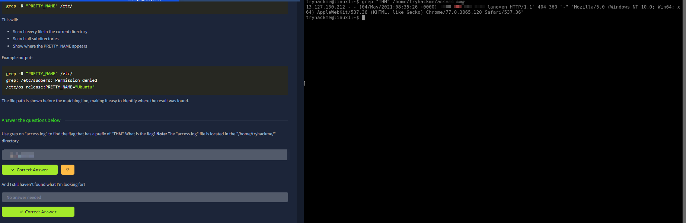
This screenshot continues the same `grep` task into the challenge answers. The left pane asks for a `THM`-prefixed value in `access.log`, while the right pane shows terminal usage in context. It demonstrates that command-line filtering is not abstract knowledge; it is directly tied to evidence extraction from logs.

### 11) Shell operators overview (`&`, `&&`, `>`, `>>`)
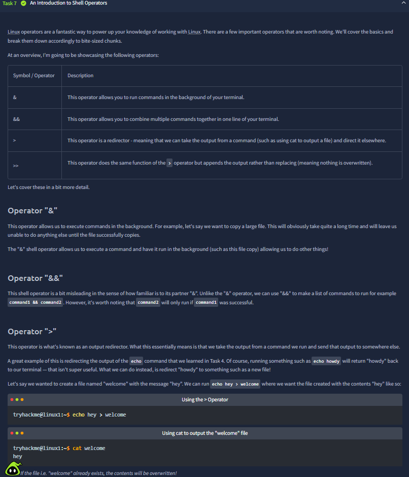
The section introduces execution-flow and redirection operators, with examples that distinguish their behavior: background execution, conditional chaining, overwrite redirection, and append redirection. The screenshot’s progression from operator table to examples is useful because operator misuse is a common beginner error. Understanding these operators is what turns single commands into practical task automation.

### 12) Operator practice and output behavior verification
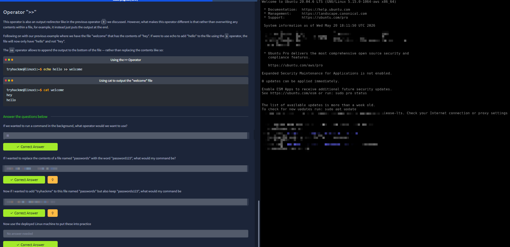
This final practical view validates operator behavior through applied questions: background execution symbol, overwrite vs append file writes, and preserving existing content. The command/output snippets make the difference between `>` and `>>` visually obvious by showing file state after each step. This is an essential habit in terminal work—always verify output effect, not only command syntax.

## Key Takeaways
- Linux command-line efficiency comes from combining simple commands in sequence.
- `find` and `grep` solve different problems (file location vs content matching) and are strongest when used together.
- Path awareness (`pwd`) and user awareness (`whoami`) reduce operational mistakes.
- Shell operators are foundational for automation and safe output handling.
