# Linux Fundamentals Part 2

Room link: https://tryhackme.com/room/linuxfundamentalspart2

## Executive Summary
- This room moves from basic in-browser Linux usage into practical remote access with SSH.
- It deepens command-line fluency using flags/switches, manual pages, filesystem operations, and search tools.
- It then introduces permission models and key Linux directories that matter in daily operations and security work.

## Evidence + Screenshot-based Analysis

### 1) Part 2 scope and progression from Part 1
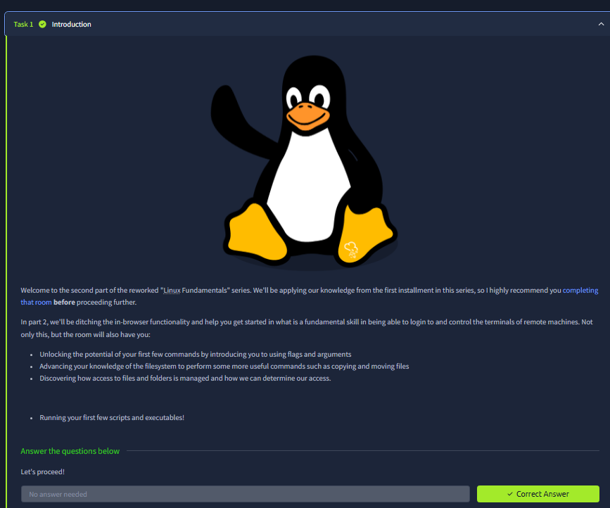
This intro screenshot explicitly says Part 2 builds on Part 1 and shifts focus to controlling **remote** Linux terminals, not just local/browser basics. The visible bullets define the path clearly: use flags and arguments, perform richer filesystem actions (copy/move), understand access control, and start with scripts/executables. The structure matters because the room is no longer “what is Linux?”, it is “how to operate Linux effectively in realistic workflows.”

### 2) SSH concept and encrypted remote execution
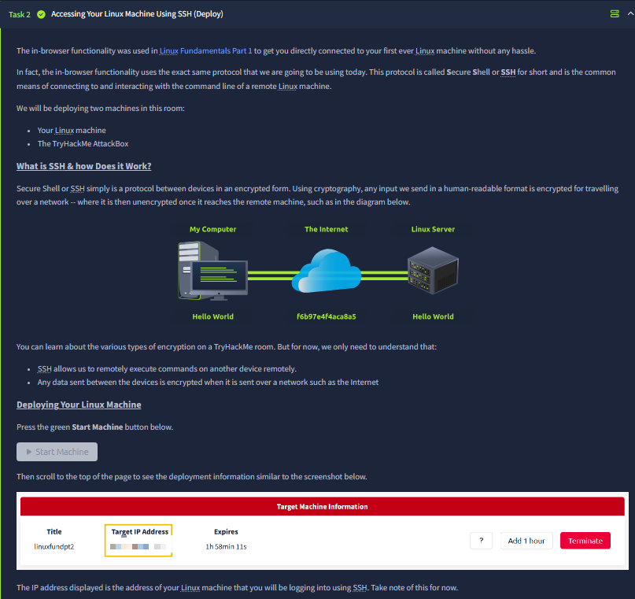
This screenshot introduces SSH as the central protocol for remote command-line management. The diagram (“My Computer -> Internet -> Linux Server”) and transformed payload in transit visually explain encryption-in-transit: readable input is protected while crossing the network and becomes usable again at destination. It also separates two machines in this room (target Linux machine + AttackBox), preparing you to think in attacker/workstation vs remote target terms, which is core for later security labs.

### 3) Deploying AttackBox and logging in over SSH
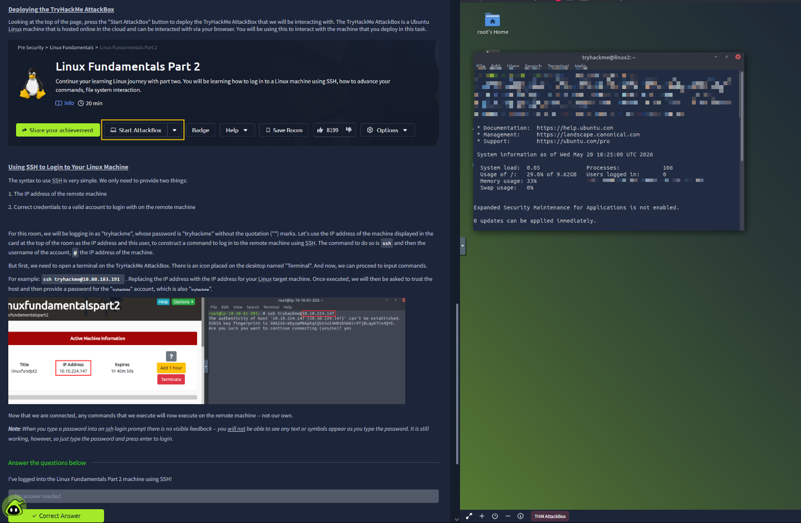
Here the room transitions from theory to procedure: start AttackBox, read target machine IP, then build an SSH login command with user + target address. The screenshot also highlights the first-connection host trust prompt and password entry behavior (no visible characters while typing). The key operational lesson is precision: one wrong username/IP and the login flow fails, so reading machine card details carefully is part of the skill.

### 4) Flags and switches with `ls` (`-a`, `--help`)
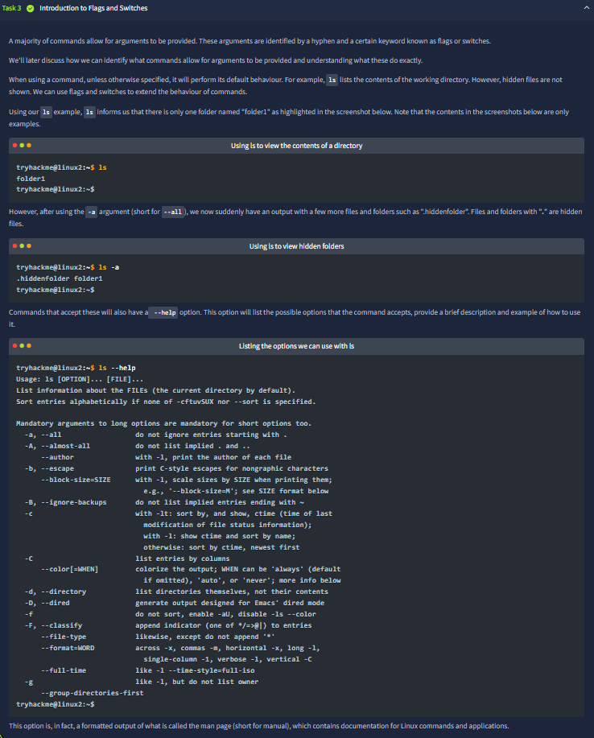
This section demonstrates how command behavior changes with arguments: plain `ls` vs `ls -a` (hidden entries) and `ls --help` (built-in options overview). The screenshot teaches that commands are tools with configurable modes, not fixed one-liners. The important takeaway is that flags expose hidden state and reduce guesswork; in practical investigations, this directly impacts speed and visibility.

### 5) Using manual pages (`man`) for command documentation
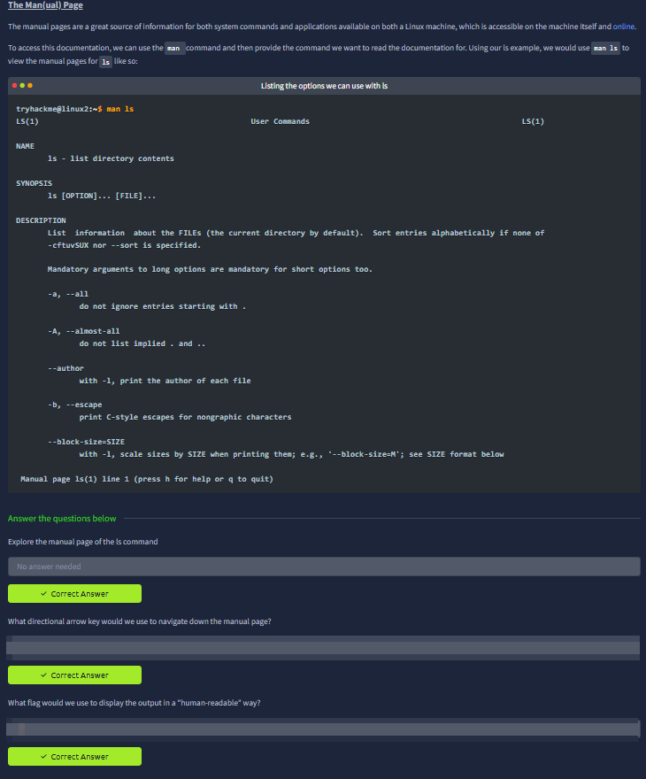
The screenshot centers on `man ls`, showing command documentation structure: name, synopsis, description, and option list. It also includes task prompts asking you to navigate manual content and identify useful flags (e.g., human-readable output). This is a foundational habit: instead of memorizing everything, learn to retrieve authoritative usage details quickly from the system itself.

### 6) Expanded filesystem operations (`touch`, `mkdir`, `cp`, `mv`, `rm`, `file`)
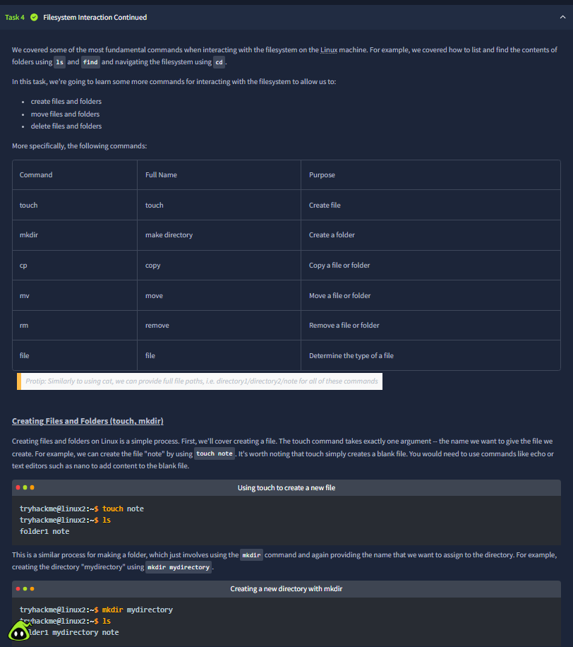
This image introduces a broader command set for file lifecycle handling: create, copy, move, and remove. It includes concrete mini-examples (`touch`, `mkdir`) and links them to day-to-day administration. The progression shows that Linux competency is sequence-driven: create state, inspect state, mutate state, then verify results.

### 7) Deletion, copying, moving, and overwrite semantics
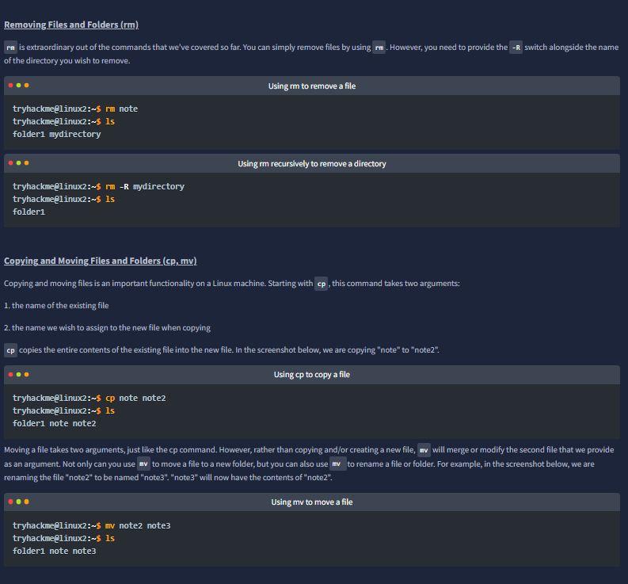
This screenshot drills into behavior differences:
- `rm` removes files, `rm -R` removes directories recursively,
- `cp` duplicates content,
- `mv` relocates or renames without keeping a second copy.
By showing before/after `ls` outputs, the room emphasizes effect validation, not just syntax. That validation mindset is critical in secure operations because destructive commands are easy to mistype.

### 8) Determining file type with `file` + practical verification
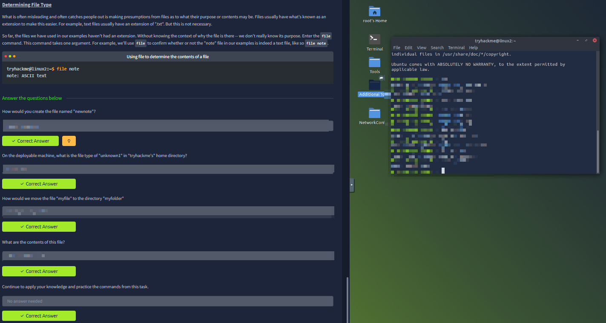
The screenshot explains why extensions alone can be misleading and demonstrates `file <name>` to inspect actual file type signatures. The right side practical terminal supports the same workflow in a live machine context. This matters in security analysis because disguised files and misleading names are common; type verification is a basic defensive and investigative step.

### 9) Permission model basics (symbolic -> numeric)
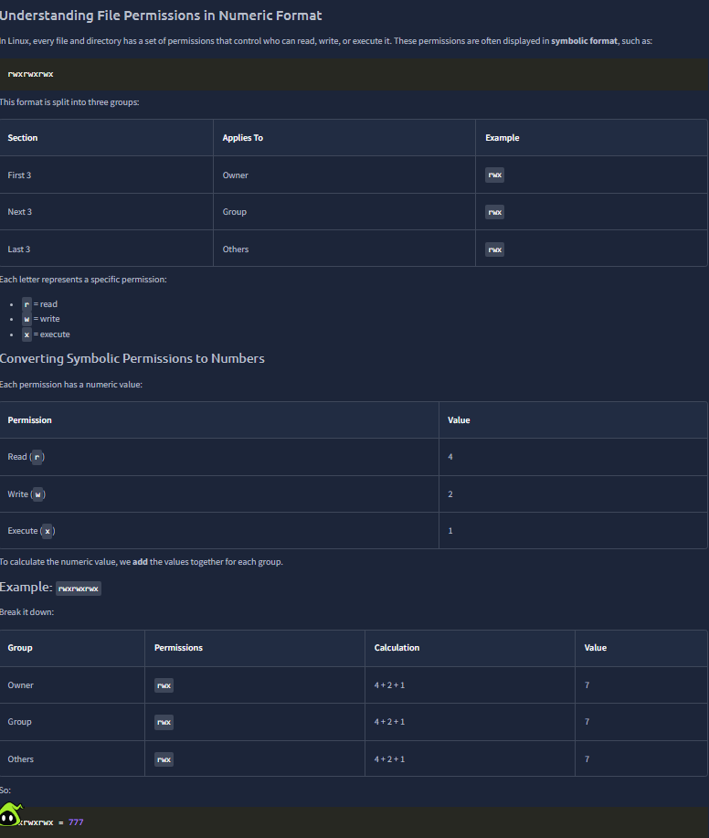
This section introduces permission triads for owner/group/others and maps symbolic bits (`rwx`) to numeric values (4/2/1). The table and worked example (`rwxrwxrwx = 777`) show conversion logic group-by-group. The screenshot makes clear that numeric modes are just compact arithmetic representations of read/write/execute grants.

### 10) Common permission sets and `chmod` implications
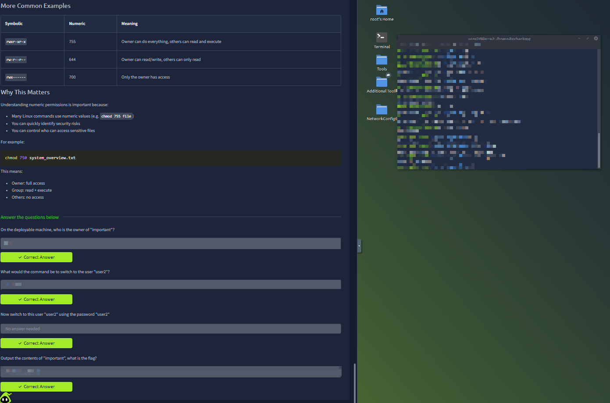
The screenshot compares practical permission examples (e.g., 755, 644, 700) and ties them to access outcomes for owner/group/others. It then uses `chmod` in a concrete command to reinforce how policy is enforced. The key takeaway is impact-oriented thinking: permission numbers are not decoration—they directly define who can read, modify, or execute sensitive files.

### 11) Key Linux directories and operational purpose (`/etc`, `/var`, `/root`, `/tmp`)
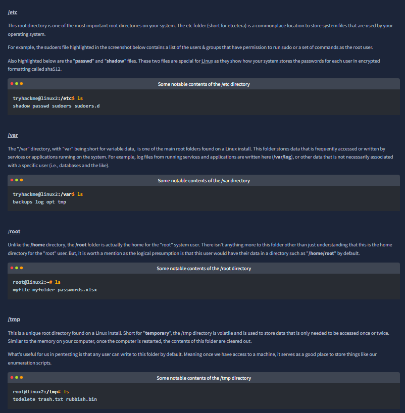
This image explains high-value filesystem locations:
- `/etc` for configuration and security-relevant files (`passwd`, `shadow`, `sudoers`),
- `/var` for changing runtime data/logs,
- `/root` as root user’s home,
- `/tmp` as temporary writable space.
It’s a strong context map for later triage: knowing *where* classes of data usually live is essential for investigation speed.

### 12) Directory-concept checkpoint (logs, volatile storage, root home)
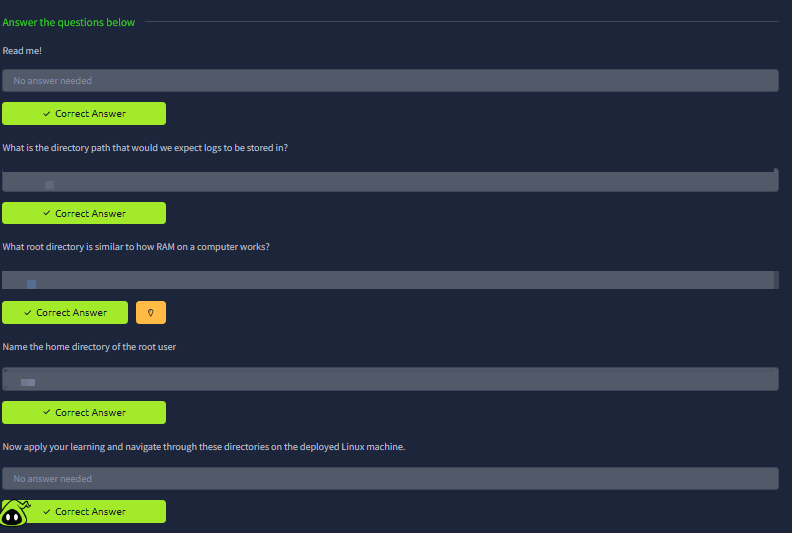
The final screenshot validates understanding of directory semantics rather than raw command memorization. The prompts test whether you can map concepts to locations (log path expectations, RAM-like volatility behavior, root user home path) and then apply navigation practically. It confirms the room objective: command knowledge + filesystem mental model together.

## Key Takeaways
- SSH is the standard secure path for remote Linux terminal access.
- Flags/switches and manual pages turn commands into flexible tools.
- File operations must be paired with verification to avoid mistakes.
- Permissions are a security control surface; numeric modes reflect real access policy.
- Directory literacy (`/etc`, `/var`, `/root`, `/tmp`) is foundational for both admin work and security analysis.
