

# Linux Fundamentals Part 3

Room link: https://tryhackme.com/room/linuxfundamentalspart3

## Executive Summary
- Bu room, Linux’te günlük kullanım komutlarından sistem yönetimi davranışına geçiş yaptırıyor.
- Özellikle metin editörleri, dosya transferi, web üzerinden dosya sunma, process yönetimi, cron otomasyonu, paket depoları ve log analizi odakta.
- Ekran görüntülerindeki akış “komutu ezberle” değil, “komutun sistemde neyi değiştirdiğini doğrula” yaklaşımını öğretiyor.

## Evidence + Screenshot-based Analysis

### 1) Part 3 girişi: room hedefleri
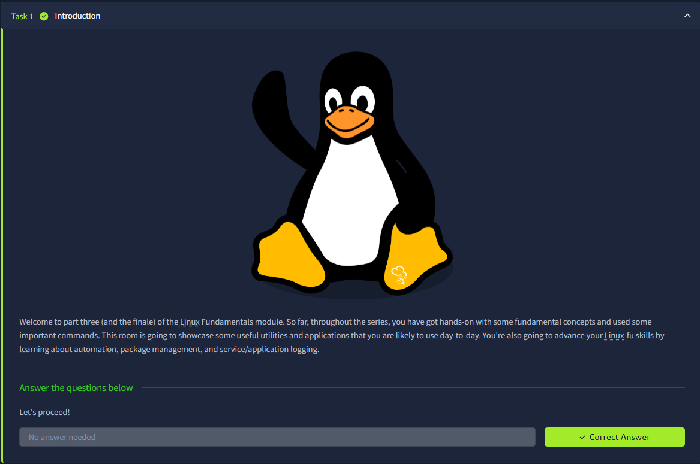
Bu ilk görselde Tux figürü ile birlikte room’un kapsamı net yazıyor: Linux Fundamentals serisinin son kısmında otomasyon, package management ve service/application logging gibi günlük hayatta sürekli kullanılacak başlıklar anlatılacak. Bu, önceki part’lerdeki “temel komut” yaklaşımından daha operasyonel bir seviyeye geçtiğimizi gösteriyor. Özellikle “day-to-day utilities” vurgusu, bu room’un sadece CTF değil gerçek sistem yönetimi pratiğine dönük tasarlandığını açıkça hissettiriyor.

### 2) Terminal text editors: neden gerektiği
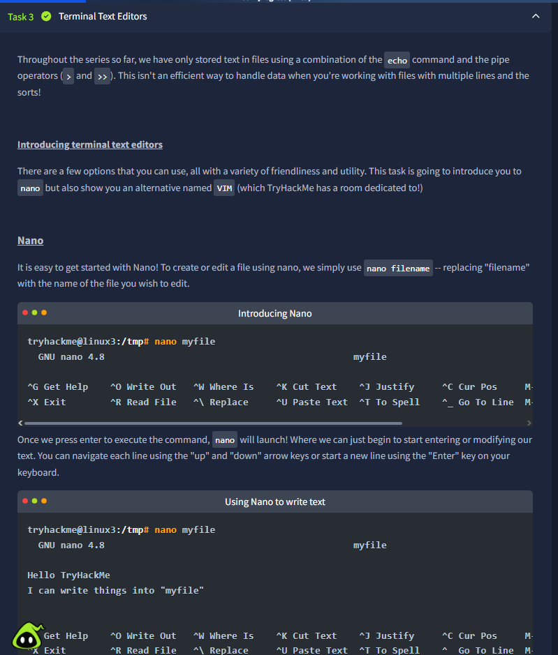
İkinci görselde “echo” ve pipe ile tek satır yazmanın yetersiz kaldığı anlatılıyor ve doğrudan terminal editörlerine geçiliyor. Nano ile başlanması önemli; çünkü hızlı öğrenilebilir, kısa sürede dosya üretme/düzenleme imkânı veriyor. Görselde `nano filename` kullanımı ve editör açıldıktan sonra doğrudan metin girme süreci gösterilerek, bir Linux kullanıcısının “config dosyası editleme” refleksi inşa ediliyor.

### 3) Nano kısayolları ve VIM’e geçiş mantığı
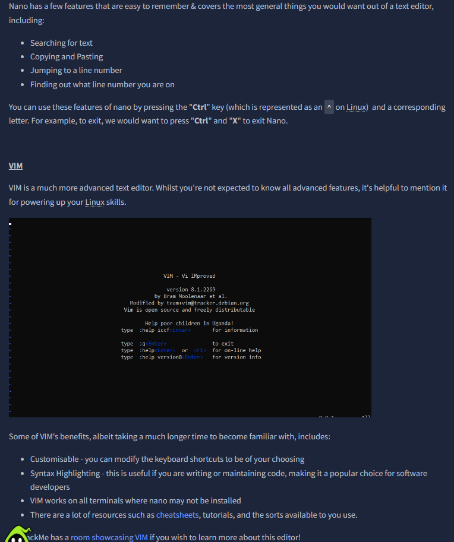
Bu görselde Nano’nun temel kullanımına ek olarak Ctrl tabanlı kısa yollar (arama, satır atlama, çıkış vb.) anlatılıyor; hemen ardından VIM’in daha gelişmiş ama öğrenmesi daha zor bir editör olduğu vurgulanıyor. Buradaki pedagojik mesaj net: önce işini görecek minimum editör becerisini kazan, sonra daha güçlü araçlara geç. VIM’in syntax highlighting ve terminal bağımsızlığı gibi artıları özellikle uzun vadeli Linux becerisi için neden önemli olduğunu gösteriyor.

### 4) Nano ile pratik görev ve dosya düzenleme doğrulaması
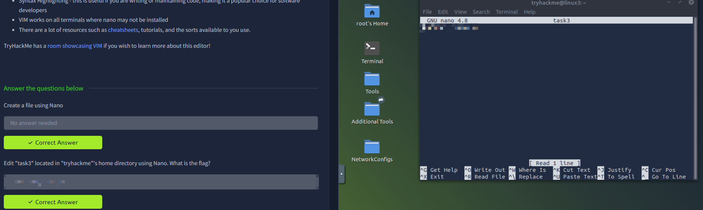
Dördüncü görsel teoriyi pratiğe bağlıyor: “task3” dosyasını Nano ile açıp içeriği düzenleme ve flag doğrulama akışı var. Sağ tarafta canlı terminal ekranında Nano penceresi açık, solda görev cevapları bulunuyor. Bu kombinasyon, sadece komutu yazmanın yetmediğini; dosyayı gerçekten doğru yerde, doğru içerikle değiştirip sonucu doğrulaman gerektiğini gösteriyor.

### 5) General/Useful Utilities başlangıcı: `wget` ve `scp`
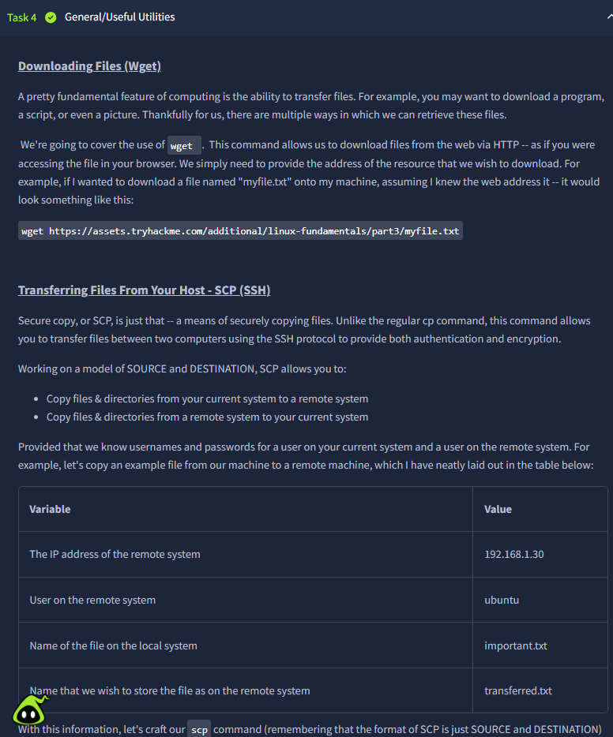
Bu ekran, dosya transferinin iki temel senaryosunu aynı anda öğretiyor: web üzerinden alma (`wget`) ve SSH üzerinden iki makine arasında güvenli kopyalama (`scp`). Tablo yapısıyla source/destination değişkenleri tek tek açılmış; bu çok kritik çünkü `scp`’de hata çoğunlukla hangi tarafın kaynak, hangi tarafın hedef olduğunu karıştırmaktan doğar. Görselin alt mesajı: komut sözdizimini ezberlemek yerine, transfer yönü mantığını öğren.

### 6) `scp` yön değişimi + Python HTTP server ile dosya servis etme
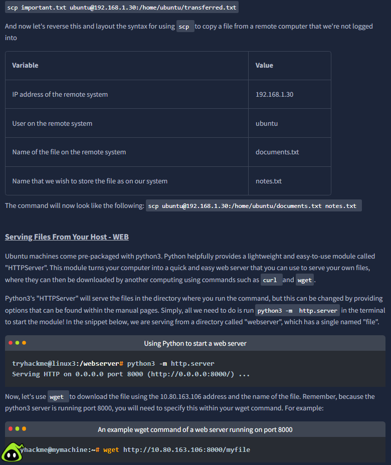
Bu görsel bir üst seviyeye çıkıyor: aynı `scp` mantığının ters yönde nasıl kurulduğu anlatılıyor, ardından `python3 -m http.server` ile lokal dizini hızlıca web sunucuya çevirme gösteriliyor. Buradaki kritik detay port bilgisi (8000) ve ikinci terminal ihtiyacı. Yani bir terminalde sunucu çalışırken, diğer terminalde istemci komutunu (wget/curl) çalıştırma zorunluluğu anlatılıyor.

### 7) `wget` ile aktif local web server’dan indirme akışı
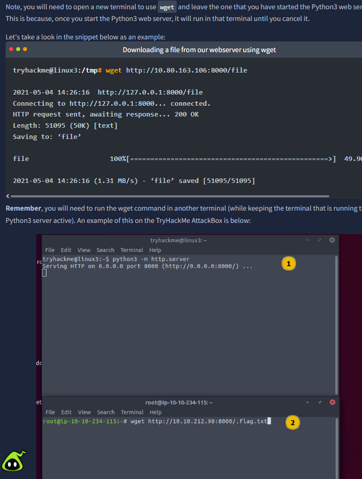
Yedinci ekran, önceki teorinin çıktısını gerçek terminal log’u ile kanıtlıyor: HTTP request -> 200 OK -> dosyanın kaydedilmesi -> transfer yüzdesi. Ayrıca görselin altındaki çift terminal diyagramı, “aynı oturumda her şeyi yapamazsın” problemini çözüyor. Bu, lab ortamında sık düşülen bir hatayı (sunucu process’ini kesmeden indirme denemesi) pratik olarak engelliyor.

### 8) Görev doğrulaması: server başlatma, dosya indirme, içerik kontrol
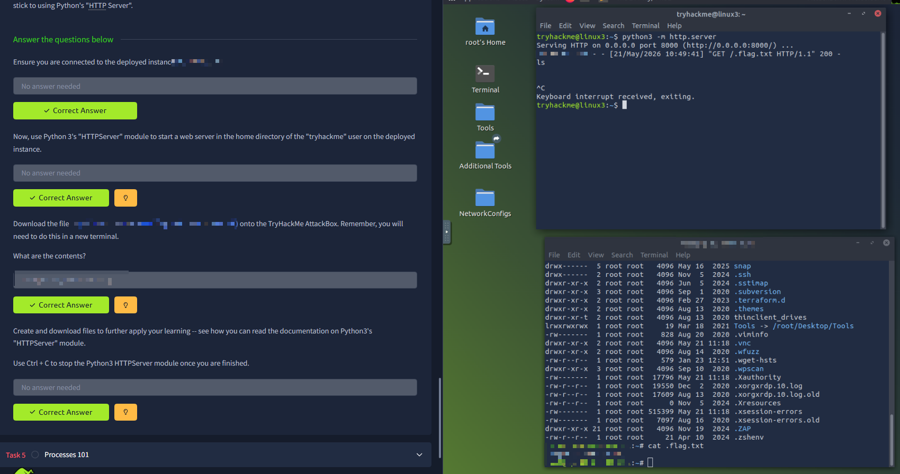
Bu görselde solda sorular, sağda terminal kanıtı birlikte yer alıyor: HTTP server’ın çalıştığı log satırı, ardından hedef dosyanın indirildiği ve içeriğinin okunduğu adımlar görünüyor. Burada önemli olan “komutu çalıştırdım” değil; adım adım doğrulama zinciri kurmak: server ayakta mı, istek geldi mi, dosya indi mi, içerik doğru mu.

### 9) Processes 101: PID kavramı ve `ps`/`top` görünürlüğü
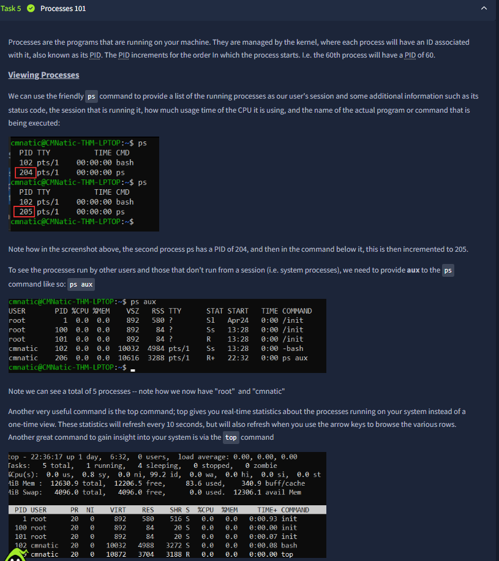
Dokuzuncu görsel process kavramını netleştiriyor: her çalışan program bir PID alır ve bu kimlik process yönetiminin temelidir. `ps`, `ps aux` ve `top` çıktılarıyla “kimin çalıştığı, ne kadar kaynak kullandığı, hangi kullanıcıya ait olduğu” okunuyor. Bu bölüm özellikle güvenlikte önemli; çünkü şüpheli süreç avı veya performans anomalisinde ilk bakılan yer process listeleridir.

### 10) Process signals: `kill`, SIGTERM, SIGKILL, SIGSTOP
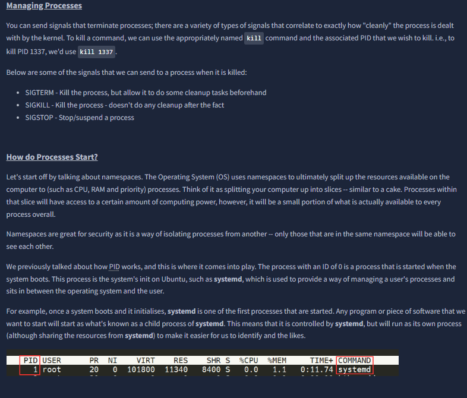
Bu görselde process sonlandırmanın kaba kuvvet olmadığını, sinyal türüne göre davranış değiştiğini görüyoruz. SIGTERM ile temiz kapanış şansı verilirken SIGKILL anlık keser; SIGSTOP ise askıya alır. Ayrıca system boot’ta PID 1 ile başlayan süreç ağacı ve `systemd` ilişkisi anlatılıyor. Bu, Linux’ta process yönetiminin sadece “kapat-aç” değil, yaşam döngüsü mantığıyla ele alınması gerektiğini öğretiyor.

### 11) `systemctl` + foreground/background çalışma modeli
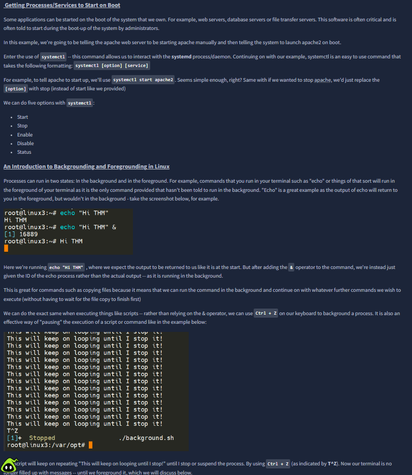
Bu ekranda iki kritik operasyon birlikte var: servisleri boot’a bağlama (`systemctl start/stop/enable/disable/status`) ve komutları foreground/background yönetimi (`&`, `Ctrl+Z`). Özellikle uzun çalışan script örneği, terminali kilitleyen job’ları geri plana almanın neden gerekli olduğunu çok iyi gösteriyor. Bu, hem üretkenlik hem de incident anında hızlı müdahale için önemli bir kas.

### 12) `fg` ile geri öne alma (foreground)
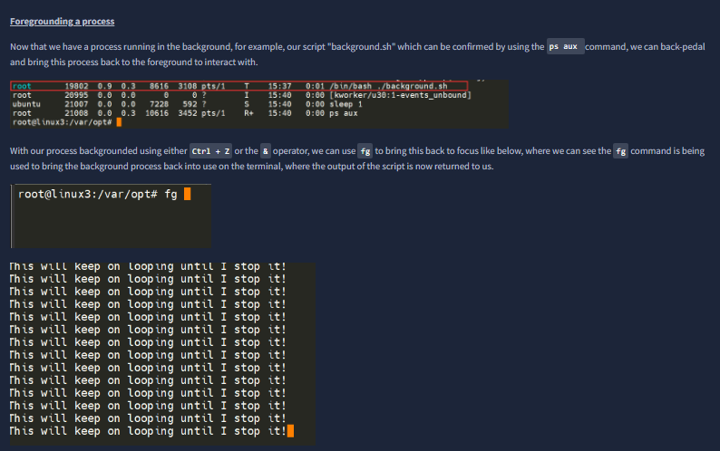
On ikinci görsel, arkaya alınmış bir işi (`background.sh`) tekrar etkileşimli hâle getirmeyi gösteriyor. `ps aux` ile job doğrulanıyor, `fg` ile terminal kontrolü tekrar o sürece veriliyor. Bu detay pratikte çok değerlidir; çünkü yanlışlıkla arka plana attığın işlemi bulup geri çağırabilmek, özellikle canlı sistemde manuel bakım sırasında sürekliliği korur.

### 13) Task 5 checkpoint: process ve service komutlarının ölçülmesi
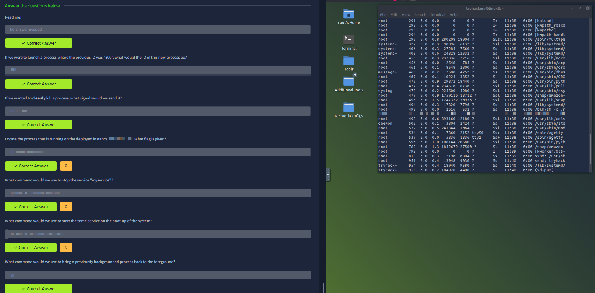
Bu ekran quiz tarafı gibi görünse de sağdaki terminalde aktif process listesiyle birlikte gerçek uygulama kanıtı var. Soruların odağı PID artışı, “clean kill” sinyali, spesifik process tespiti, service durdurma ve boot’ta başlatma komutları. Yani teorik başlıkların hepsi operasyonel komutlara dönüştürülerek ölçülüyor.

### 14) Automation: cron/crontab temeli
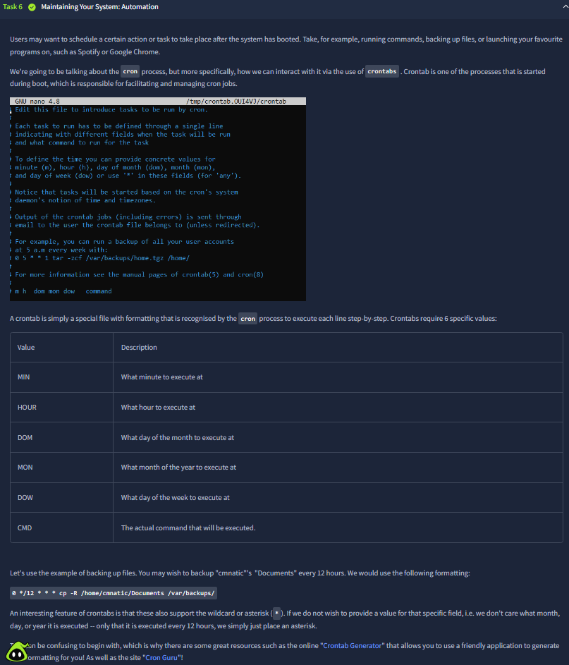
Bu görsel cron yapısını sistematik biçimde anlatıyor: MIN/HOUR/DOM/MON/DOW/CMD alanları ve wildcard `*` kullanımı. Verilen örnek (`0 */12 * * * ...`) ile periyodik backup mantığı kuruluyor. Buradaki ana kazanım, cron ifadesini ezberlemek değil; zaman alanlarını doğru okuyup bir işi ne sıklıkta, hangi bağlamda çalıştırdığını güvenle tahmin etmek.

### 15) Cron job oluşturma ve deployed instance üzerinde doğrulama
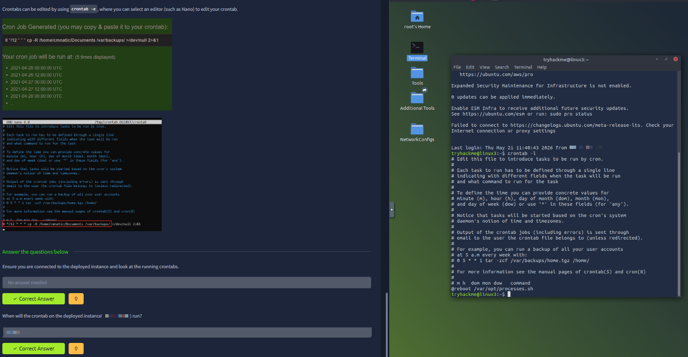
Bu ekran solda cron üretici çıktısını, altta crontab örneğini, sağda ise gerçek terminalde `crontab -l` doğrulamasını birleştiriyor. Yani sadece formül üretmek değil, sistemde gerçekten yazılıp yazılmadığını kontrol etmek öğretiliyor. Güvenlik bakışında bu çok önemli; persistence ya da otomatik görev analizi yaparken önce kayıtlı cron işlerini doğrulamak gerekir.

### 16) Package management: repo dosyaları ve `apt` akışı
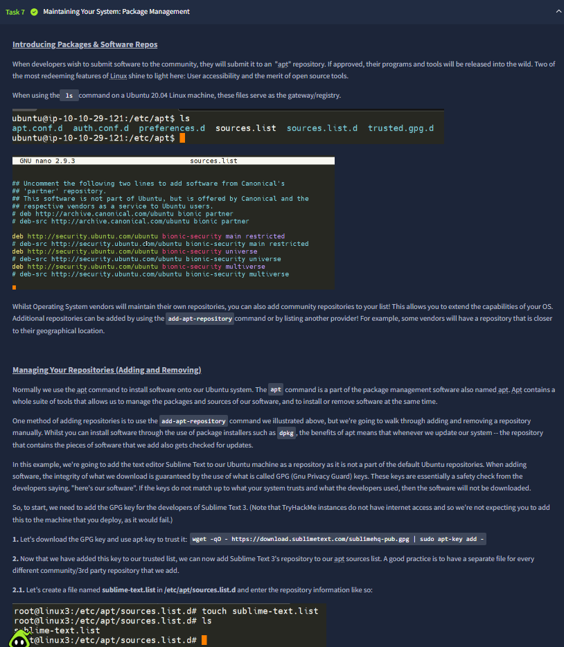
Bu görselde `/etc/apt` altındaki kaynak dosyalar ve repository mantığı anlatılıyor; ardından GPG key ekleme, yeni kaynak tanımı oluşturma (`sources.list.d`) ve `apt update`/`apt install` hattı gösteriliyor. Buradaki kritik fikir “paketi kurmak”tan önce “paket kaynağını güvenli şekilde tanımlamak.” Yani güven zinciri repo seviyesinde başlıyor.

### 17) Repo ekleme/silme çevrimi ve tersine alınabilirlik
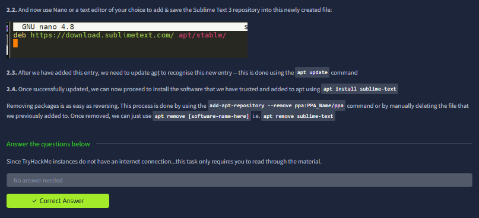
On yedinci ekran, repository ekleme adımlarının tamamlanmasını ve gerektiğinde geri alınmasını gösteriyor. “Okuyup geç” gibi görünse de pratik etkisi büyük: test amaçlı eklenen repo ya da araçların kalıcı iz bırakmaması için kaldırma adımlarını bilmek gerekiyor. Bu, lab hijyeni ve sistem stabilitesi açısından kritik bir alışkanlık.

### 18) Logs: `/var/log` ekosistemi ve servis bazlı gözlem
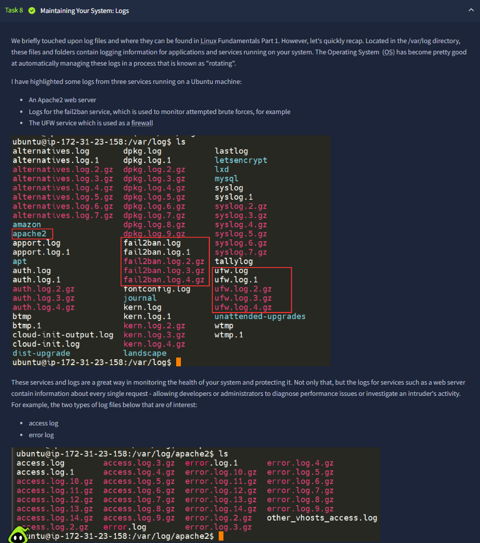
Bu görsel log yönetimini çok net konumlandırıyor: Apache, fail2ban, UFW gibi servislerin log dosyaları tek dizin ekosisteminde görülüyor. Ayrıca log rotation kavramı (sıkıştırılmış/eski loglar) görselde doğrudan hissediliyor. Bu sayede “tek dosya oku” yaklaşımından çıkıp, servis ailesi boyunca iz sürme alışkanlığı gelişiyor.

### 19) Apache loglarını okuyarak olayı kanıta bağlama
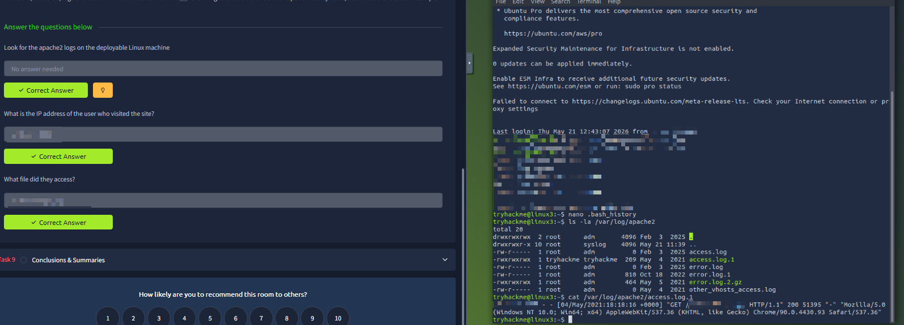
Son görselde görev soruları ve canlı terminal çıktısı aynı karede: `access.log` okunuyor ve ziyaret eden istemci IP’si ile erişilen dosya çıkarılıyor. Bu, room’un final mesajı: loglar yalnızca teknik detay değil, doğrudan olay anlatısıdır. Kim geldi, ne istedi, ne zaman istedi sorularını cevaba çeviren temel kaynak burada operasyonel olarak doğrulanmış oluyor.

## Key Takeaways
- Part 3, Linux kullanımını “komut bilgisi”nden “sistem işletme” seviyesine taşıyor.
- Editor, transfer, process, cron, repo ve log başlıkları tek bir operasyon zincirinin parçaları.
- Her adımda komut + doğrulama (çıktı/log) birlikte ele alınınca hata oranı ciddi düşer.
- Security pratiğinde en değerli refleks: değişiklik yap, etkisini ölç, kanıtını topla.
