

# Windows Fundamentals 1

Room link: https://tryhackme.com/room/windowsfundamentals1xbx

## Executive Summary
- Bu room, Windows ortamını “kullanıcı arayüzü” seviyesinden çıkarıp güvenlik bakışıyla okuma becerisine çeviriyor.
- Ekran görüntülerinde özellikle edition farkları, sistem bileşenleri, dosya hiyerarşisi, kullanıcı/izin modeli ve yerleşik güvenlik mekanizmaları adım adım oturtuluyor.
- Pratik tarafta amaç yalnızca cevap bulmak değil; hangi Windows bileşeninin hangi güvenlik riskini azalttığını bağlamıyla anlamak.

## Evidence + Screenshot-based Analysis

### 1) Windows editions ve sürüm evrimi
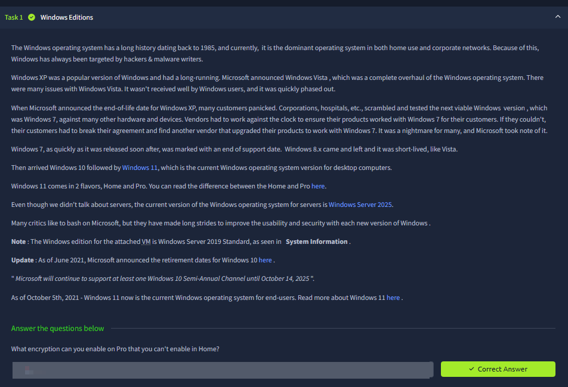
Bu görselde tarihsel akışla birlikte Windows sürümlerinin neden değiştiği anlatılıyor: uyumluluk, güvenlik, kurumsal ihtiyaçlar ve destek ömrü. Özellikle Home/Pro ayrımı vurgusu AppSec açısından kritik; çünkü disk şifreleme gibi güvenlik özellikleri edition’a göre değişebiliyor. Buradaki ana fikir, “işletim sistemi sürümü”nün yalnızca estetik fark değil, doğrudan güvenlik yeteneği farkı olduğudur.

### 2) Windows arayüzü ve temel gezinme mantığı
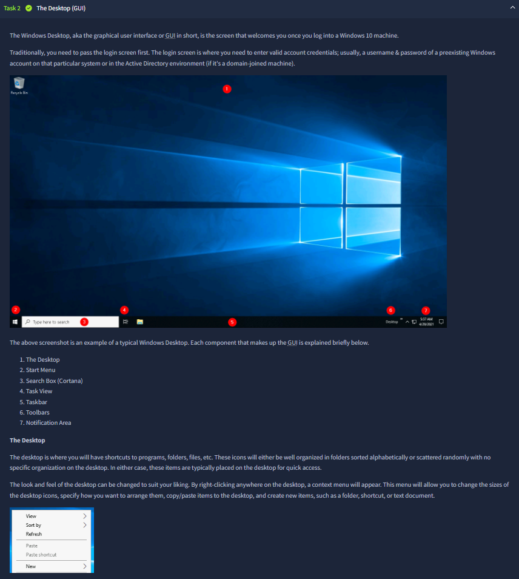
Bu ekran Windows masaüstü, Start menüsü, taskbar ve hızlı erişim alışkanlığını temel seviyede oturtuyor. Güvenlik çalışırken bu gezinme çok önemlidir çünkü Event Viewer, Services, System Information, Windows Security gibi araçlara sürekli bu katmandan erişilir. Yani görseldeki basit UI bilgisi, sonraki savunma ve inceleme adımlarının operasyon kapısıdır.

### 3) Dosya sistemi temelleri ve Windows klasör yapısı
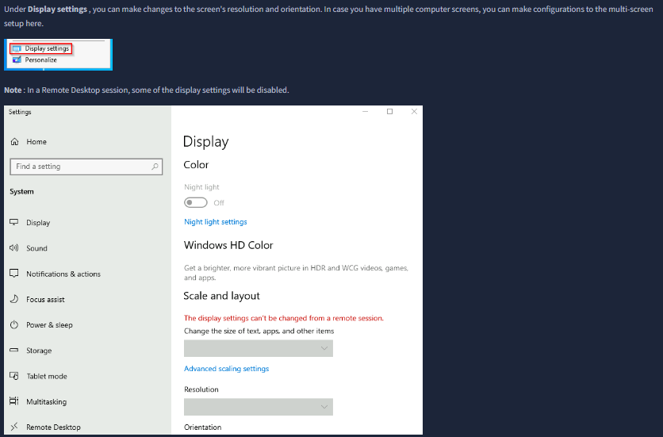
Bu bölümde sürücüler, klasör hiyerarşisi ve özellikle sistem klasörlerinin anlamı netleşiyor. Program dosyalarının, kullanıcı verilerinin ve işletim sistemi çekirdek bileşenlerinin farklı konumlarda tutulması güvenlik için kritik bir ayrımdır. Bu ayrım bilinmeden persistence artefact’larını, kötü amaçlı drop konumlarını veya yanlış yapılandırmaları tespit etmek zorlaşır.

### 4) System32 / Program Files / Users ayrımı
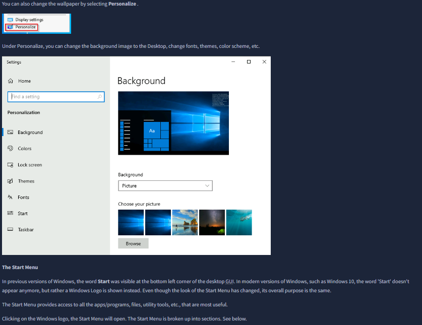
Görselde öne çıkan konu, “hangi dosya nerede yaşar?” sorusunun cevabıdır. System32 gibi dizinlerin çekirdek işletim sistemi fonksiyonlarıyla ilişkisi, Program Files’ın uygulama katmanını taşıması ve Users altının kullanıcı-özel veri içermesi olay müdahalesinde temel bir zihin haritası sağlar. Şüpheli bir dosyanın bulunduğu yol, çoğu zaman niyet hakkında ilk güçlü ipucudur.

### 5) NTFS izin modeli ve dosya erişim kontrolü
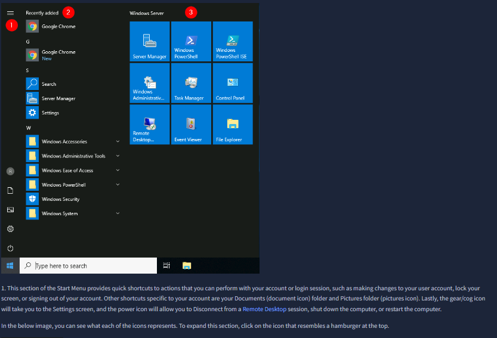
Bu görsel, NTFS permission yaklaşımını pratik düzeyde hissettiriyor: her kullanıcı her şeye erişemez, erişim ACL/izin kuralı ile yönetilir. Kurumsal güvenliğin büyük kısmı bu prensibe dayanır; yanlış izin verilirse veri sızıntısı, privilege abuse ve lateral movement kapısı açılır. Bu nedenle ekran, hem sistem yönetimi hem AppSec zihniyeti için çok değerli bir temel kuruyor.

### 6) Kullanıcı hesapları ve profil yapısı
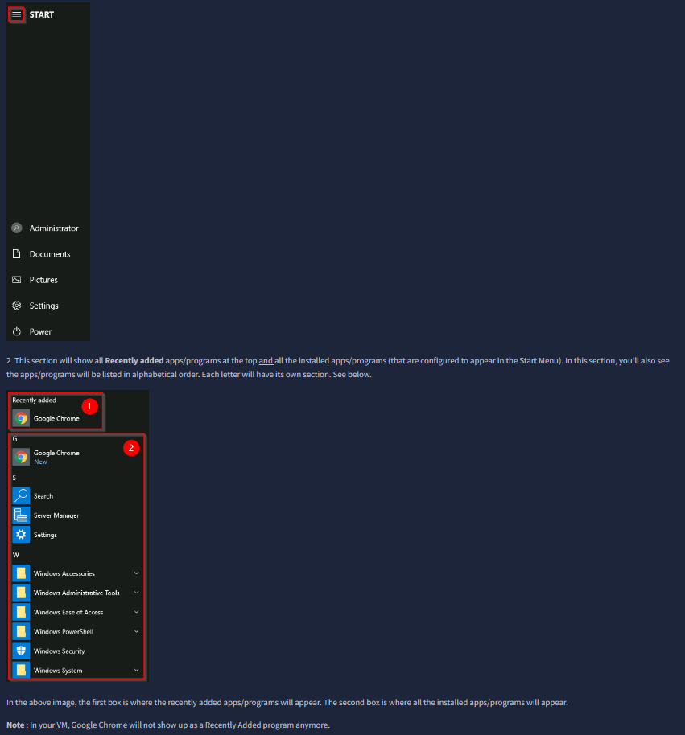
Burada lokal kullanıcı hesapları, profil klasörleri ve oturum bağlamı arasındaki ilişki görülüyor. Aynı makinede farklı hesapların ayrı veri alanlarında çalışması izolasyon sağlar; ancak yanlış paylaşımlar veya zayıf parola politikası bu sınırı deldirebilir. Görselin ana mesajı: “kullanıcı modeli” yalnızca login ekranı değil, veri sınırı ve yetki sınırıdır.

### 7) Administrator vs standard user ayrımı
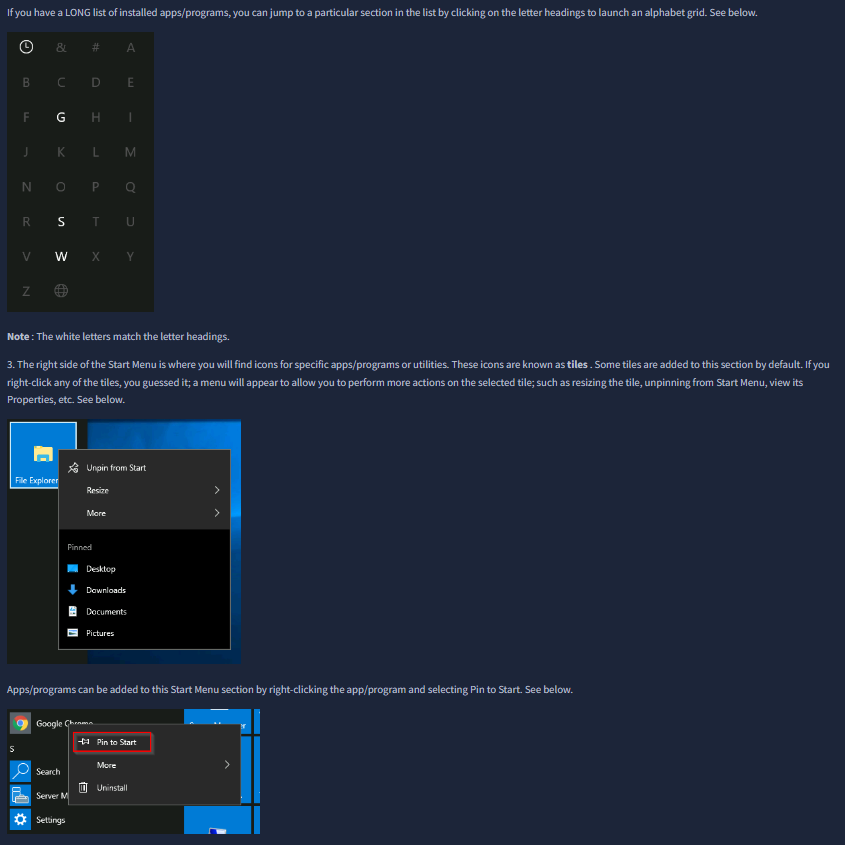
Bu ekran en kritik Windows güvenlik prensiplerinden birini anlatır: günlük kullanımın admin hesapla yapılmaması. Standard user yaklaşımı saldırı yüzeyini daraltır; zararlı kod çalışsa bile yetki sınırlı kalır. Pratikte en çok yapılan hatalardan biri sürekli yüksek yetkiyle oturum açmaktır; görsel bunu davranışsal güvenlik kuralına dönüştürüyor.

### 8) UAC (User Account Control) davranışı
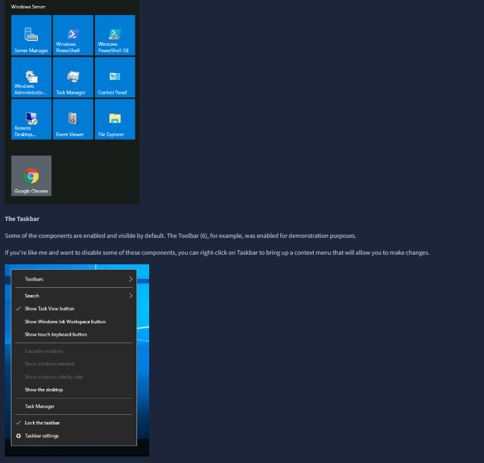
UAC prompt mantığı burada güvenliğin kullanıcı ile kesiştiği katman olarak görünür. UAC, sessiz yetki yükseltmeyi engelleyip kritik değişikliklerde doğrulama ister; bu yüzden hem teknik hem insan faktörü kontrolüdür. Görselin çıkarımı: pop-up “rahatsızlık” değil, privilege escalation’a karşı aktif frendir.

### 9) Settings / Control Panel / yönetim araçları ayrımı
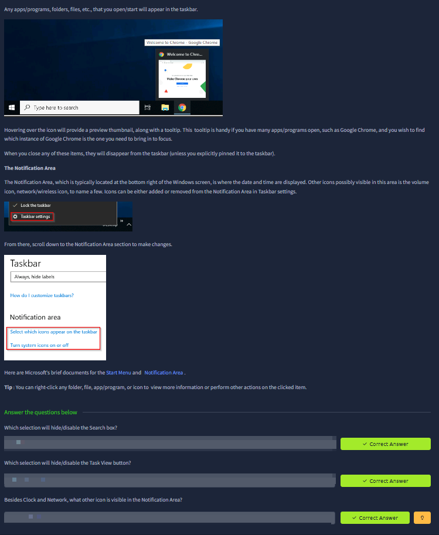
Bu ekran Windows yönetim yüzeyinin iki katmanını (modern Settings + klasik yönetim öğeleri) birlikte anlamaya yardımcı olur. Güvenlik ayarları çoğu zaman bu iki dünyaya dağılmıştır; firewall, update, defender, account policy gibi başlıklara doğru yerden gitmek gerekir. Operasyon hızını artıran şey, tam da bu navigasyon netliğidir.

### 10) System Information ile envanter doğrulama
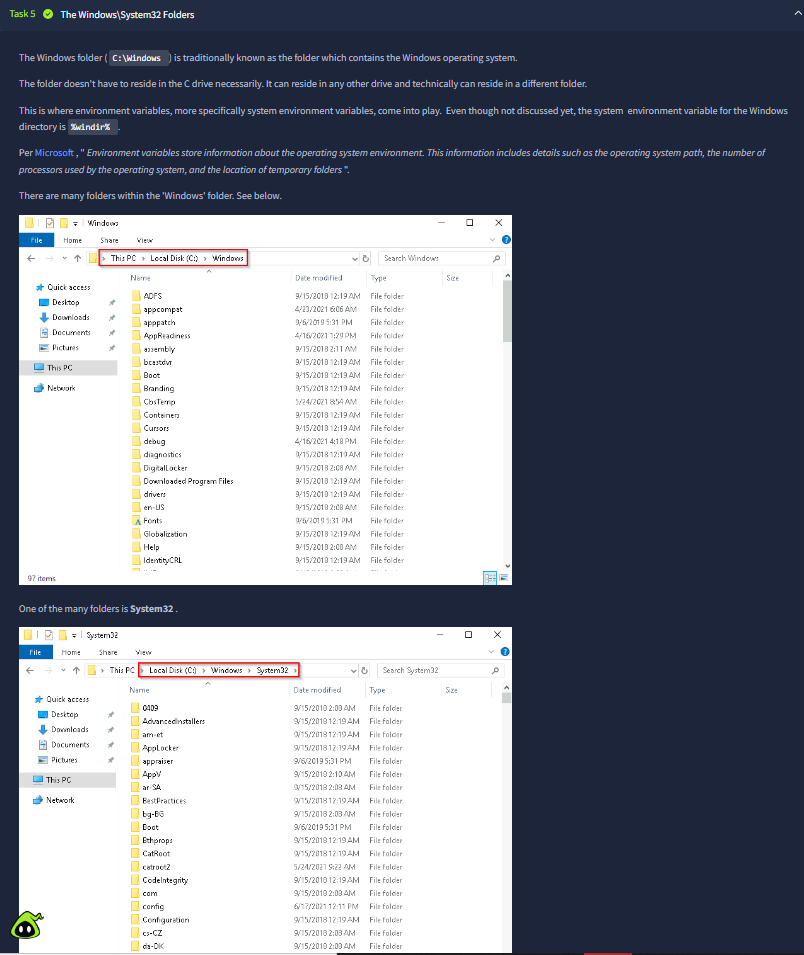
Sistem bilgisi ekranları host fingerprinting’in yasal ve iç denetim tarafındaki temelidir: OS sürümü, build, donanım, boot mode, BIOS/UEFI vb. Bu veriler patch stratejisi ve uyumluluk için kullanılır. AppSec ve blue-team tarafında “hangi host ne durumda?” sorusunun ilk resmi cevabı bu tür ekranlardan gelir.

### 11) Processes ve Task Manager okuma becerisi
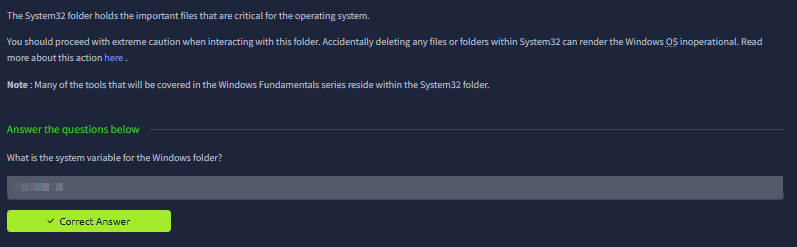
Task Manager görünümü yalnızca performans aracı değil, davranış analizi panelidir. CPU/RAM/IO anomalisi, beklenmedik process adı, parent-child uyumsuzluğu gibi sinyaller ilk alarmı burada verir. Görsel, Windows üzerinde canlı süreç farkındalığının neden temel bir güvenlik becerisi olduğunu pratikte gösteriyor.

### 12) Services katmanı ve arka plan bileşenleri
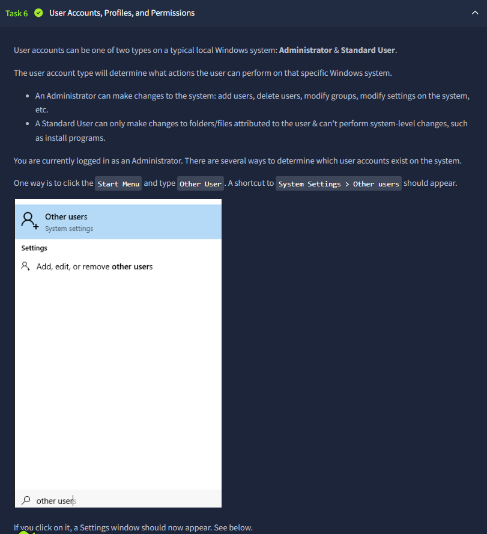
Servisler Windows’un kalıcı çalışan omurgasıdır; güvenlik ürünü, log ajanı, update bileşeni, ağ hizmeti çoğunlukla burada koşar. Bu katman yanlış yapılandırılırsa hem savunma körleşir hem de persistence fırsatı doğar. Görselin kritik mesajı: servis adı, başlangıç tipi ve çalışıp çalışmadığı düzenli kontrol edilmelidir.

### 13) Startup öğeleri ve kalıcılık riski
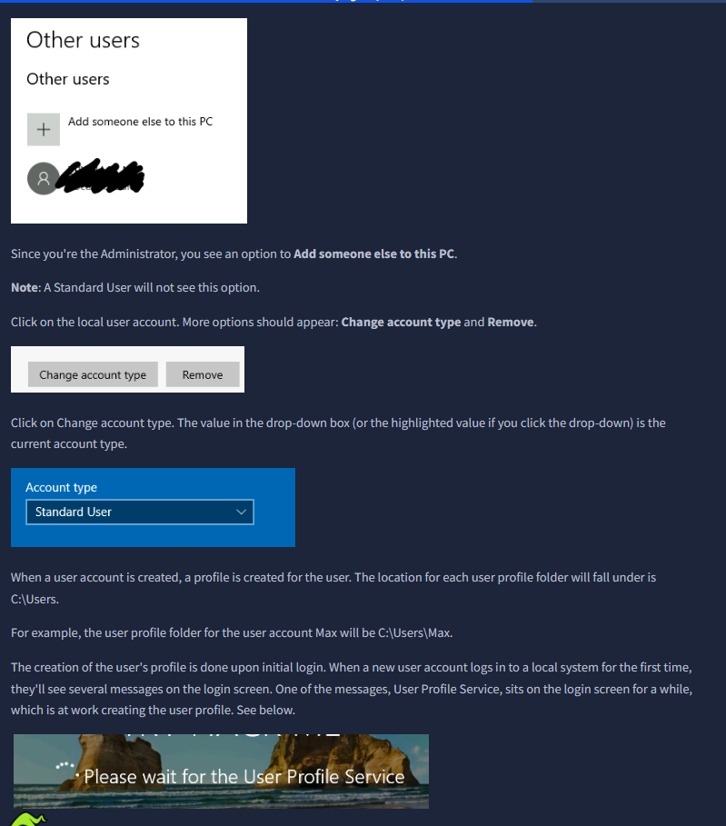
Oturum açılışında otomatik çalışan bileşenler kullanıcı deneyimini etkilediği kadar güvenliği de etkiler. Şüpheli startup girdileri zararlı yazılımların en klasik kalıcılık yöntemlerinden biridir. Bu ekran, “makine yavaş” şikayetinin arkasında bazen güvenlik olayı olabileceğini hatırlatan önemli bir analiz noktasıdır.

### 14) Windows Update ve patch hijyeni
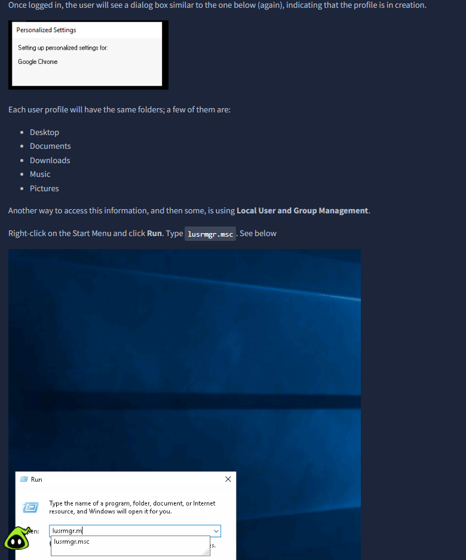
Bu görsel patching disiplininin doğrudan güvenlik çıktısını anlatır: bilinen açıklar çoğu zaman güncellenmemiş sistemlerde istismar edilir. Update yönetimi yalnızca yeni özellik değil, risk azaltımıdır. Kurumsal pratikte patch gecikmesi saldırı yüzeyini ölçülebilir biçimde büyütür.

### 15) Defender/Windows Security bileşenleri
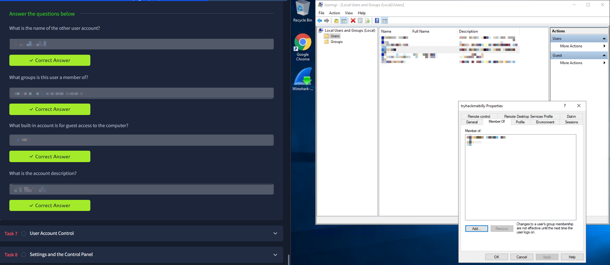
Windows Security paneli; threat protection, firewall & network protection ve account/device security gibi koruma katmanlarını birleştirir. Buradaki bütünlük yaklaşımı önemlidir: tek bir kontrole güvenmek yerine katmanlı savunma gerekir. Görsel, host-level savunmanın “bir ürün” değil, birden çok kontrol seti olduğunu güzel özetliyor.

### 16) Firewall profilleri (Domain/Private/Public)
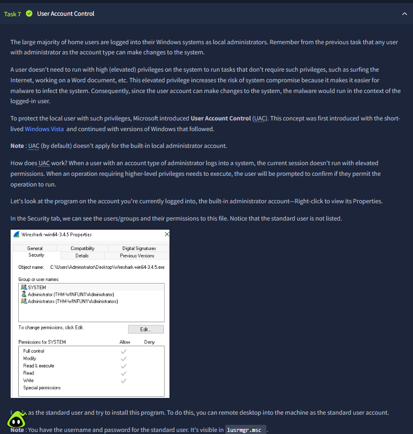
Ağ konumuna göre farklı firewall davranışı, Windows güvenliğinin bağlam-temelli tarafını temsil eder. Kurumsal domainde izin verilen bir şey public ağda kapalı tutulmalıdır. Bu görsel, yanlış profile geçmenin nasıl gereksiz exposure yaratabileceğini ve profile-aware yönetimin neden kritik olduğunu hissettiriyor.

### 17) Remote access yüzeyi ve RDP farkındalığı
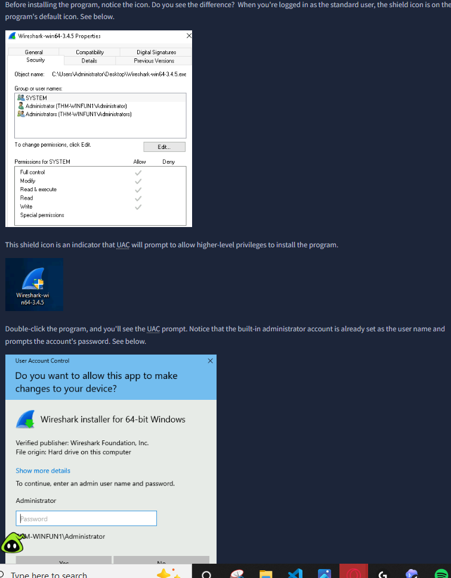
Uzak erişim ayarları verimlilik sağlar ama saldırı yüzeyini de büyütür. RDP benzeri servisler açıkken zayıf parola, yanlış ACL veya internetten doğrudan erişim riskleri hızla yükselir. Görsel, erişilebilirlik ile güvenlik arasındaki dengeyi doğru kurmanın önemini operasyonel seviyede gösteriyor.

### 18) Event logs: olay kaydını okuma kültürü
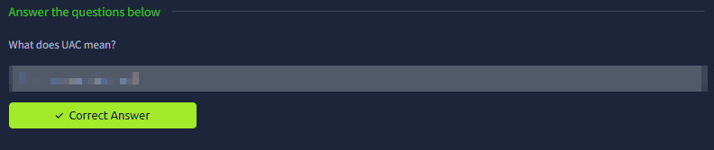
Windows Event Log, “ne oldu?” sorusunun resmi kaynağıdır. Başarısız oturumlar, servis hataları, policy değişiklikleri ve güvenlik uyarıları bu katmanda kronolojik kanıta dönüşür. Bu ekranın mesajı net: yorum değil kanıt üretmek için log okumayı öğrenmek şarttır.

### 19) PowerShell / CMD temel yönetim pratikleri
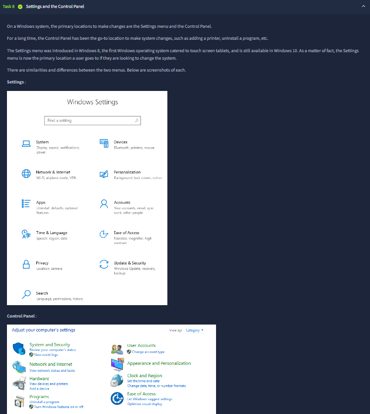
Komut satırı katmanı, GUI ile görünmeyen pek çok kontrolü hızlı ve tekrarlanabilir şekilde yapmayı sağlar. Güvenlikte standardizasyonun anahtarı çoğu zaman scriptlenebilirliktir. Bu yüzden görseldeki terminal odaklı yaklaşım, hem denetim hızını hem de doğrulama kalitesini artıran bir adım olarak okunmalı.

### 20) Dosya/gizlilik özellikleri ve metadata bilinci
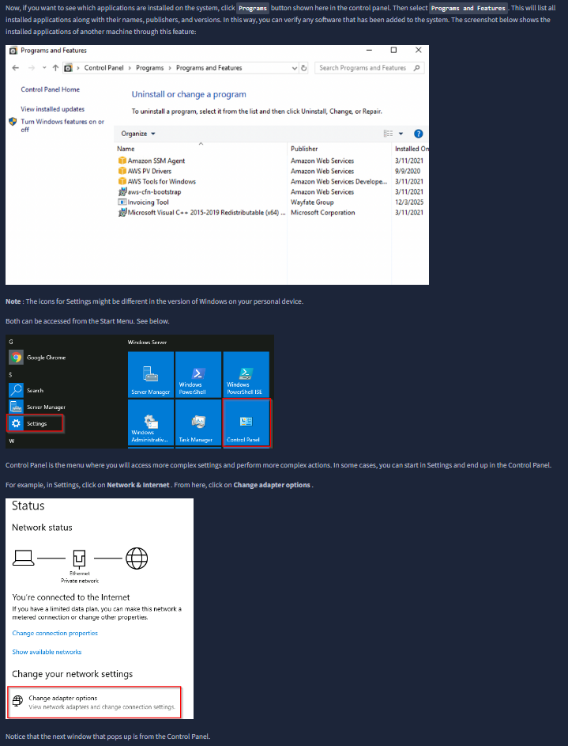
Windows’ta dosya özellikleri (hidden/system/readonly vb.) hem kullanım hem güvenlik bağlamı taşır. Saldırganlar bazen görünürlüğü azaltmak için bu bayrakları kötüye kullanır; savunmacı da inceleme sırasında bu göstergeleri kontrol eder. Görsel bu “küçük görünen ama kritik” metadata farkındalığını oturtuyor.

### 21) Güvenlik soruları/quiz akışı ve kavram ölçümü
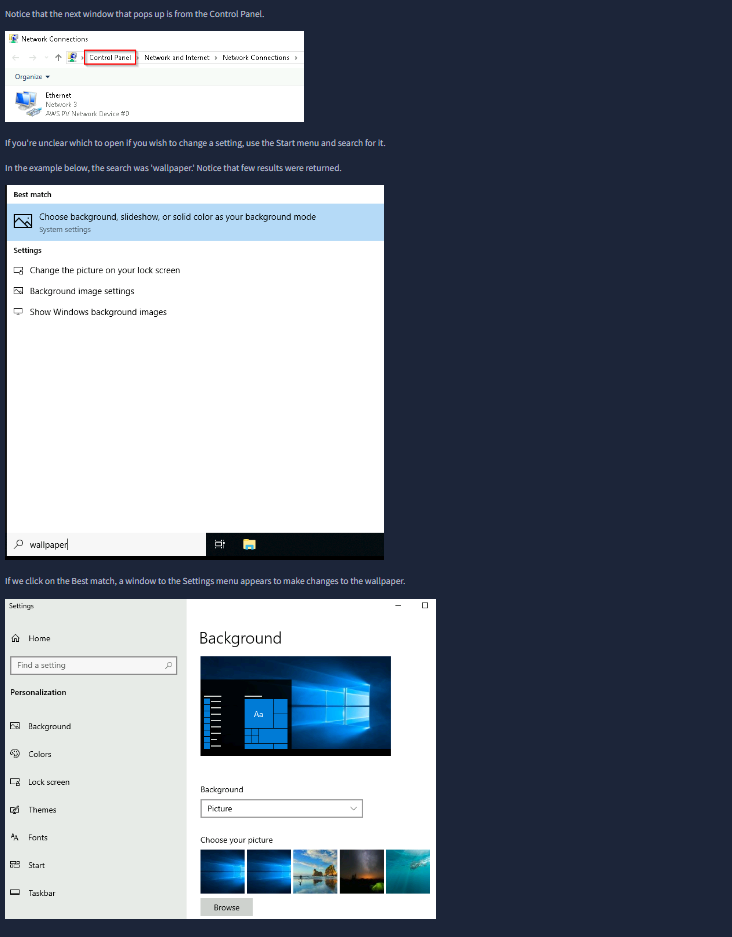
Bu ekran quiz görünse de asıl değeri, hangi kavramların çekirdek kabul edildiğini göstermesidir: edition farkı, yetki ayrımı, UAC, dosya/izin modeli, güvenlik araçları. Yani room’un öğrenme çıktıları ölçülebilir biçimde kapanıyor. Bu, teoriden uygulamaya geçişte boşluk kalmamasını sağlıyor.

### 22) Lab doğrulama ve uygulama adımlarının kapanışı
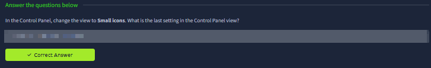
Bu görselde pratik adımların tamamlandığını doğrulayan yapı var. “Doğru cevap” butonu tek başına önemli değil; önemli olan o cevaba giden gözlem zinciri: doğru ekranı açma, doğru güvenlik ayarını bulma, doğru kavramı doğru bağlama oturtma. Bu da gerçek hayatta runbook takibinin mini provasıdır.

### 23) Room tamamlanma / final konsolidasyon
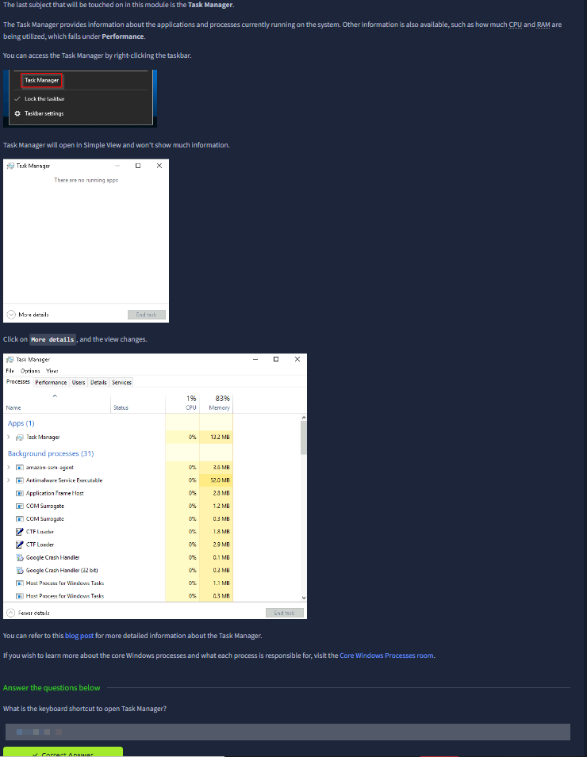
Final ekranı, teknik olarak bir bitiş gibi görünse de aslında bir başlangıç noktasıdır: artık Windows hostu güvenlik bakışıyla parçalayabilecek temel bir harita oluşmuş olur. Edition, kullanıcı/izin, UAC, update, defender, firewall ve logs birlikte düşünülmeye başlanır. Sonraki odalarda bu temel, saldırı yüzeyi analizi ve savunma kararları için doğrudan kullanılacaktır.

## Key Takeaways
- Windows güvenliği, tek bir ayardan değil birbiriyle bağlı kontrol katmanlarından oluşur.
- En kritik refleksler: least privilege, düzenli patch, doğru firewall profili, log-first doğrulama.
- GUI bilgisini terminal ve servis/log gözlemiyle birleştirmek, operasyonel kaliteyi ciddi biçimde artırır.
- Bu room, Windows’u “kullanıcı sistemi” olmaktan çıkarıp “savunulacak platform” olarak görmeyi öğretir.
