

# Windows Fundamentals 2

Room link: https://tryhackme.com/room/windowsfundamentals2x0x

## Executive Summary
- This room walks through **native Windows administration tools** that are also relevant for security work (triage, troubleshooting, and verifying system state).
- The screenshots focus on **System Configuration (`msconfig`)**, **UAC**, **Computer Management (`compmgmt.msc`)**, **Event Viewer**, **Services**, **System Information (`msinfo32`)**, **Resource Monitor (`resmon`)**, **Command Prompt (`cmd`)**, and the **Registry Editor (`regedit`)**.
- The main skill is reading each console carefully and understanding what the UI is telling you (settings, status, and scope).

## Evidence + Screenshot-based Analysis

### 1) Launching System Configuration (`msconfig`) from the Start Menu

This screenshot introduces the **System Configuration** utility and explicitly names the executable: **`MSConfig`**. The Start Menu search shows how you can locate it quickly (typing `msconfig`), then open the **System Configuration** app.

At the bottom, the task includes an important note: you need **local administrator rights** to open this utility. It also lists the five tabs you’ll be exploring:
**General**, **Boot**, **Services**, **Startup**, and **Tools**.

### 2) `msconfig` tabs: General, Boot, and Services (what each one controls)
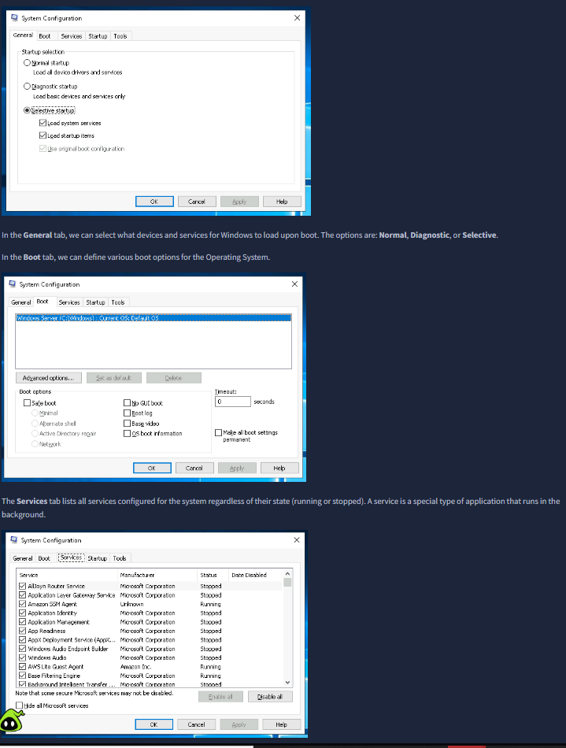

The screenshot shows the **System Configuration** window with the tab bar visible. In **General**, the UI provides three startup modes:
- **Normal startup** (load all device drivers and services)
- **Diagnostic startup** (load basic devices and services only)
- **Selective startup** (choose which components to load)

It then previews the **Boot** tab (boot options for the OS) and the **Services** tab (a list of configured services, regardless of running/stopped). The key point the room is making is that `msconfig` is primarily about **boot/startup troubleshooting and control**, not day‑to‑day app management.

### 3) `msconfig` Startup: where startup items live (Task Manager vs Startup folder)
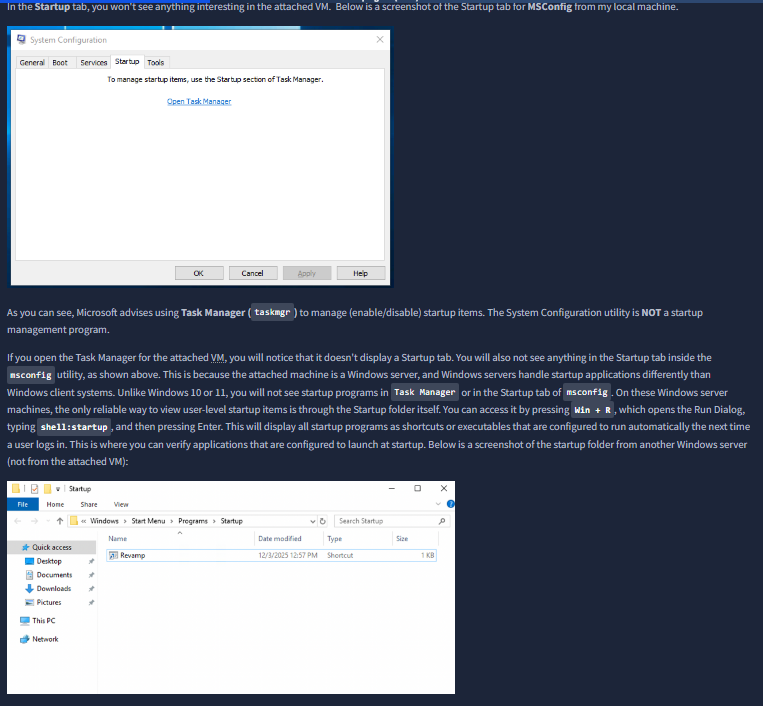

This screenshot explains a common confusion: the **Startup** tab in `msconfig` is not where you manage startup items on modern Windows. Instead, Windows points you to **Task Manager** (`taskmgr`) for enabling/disabling startup items.

The task also explains why the attached VM might not show a Startup tab in Task Manager (Windows Server handles startup differently). As an alternative, it shows the **Startup folder** approach and explicitly references launching it using:
- `Win + R` → `shell:startup`

The folder screenshot illustrates what “startup items” look like in practice: shortcuts/executables placed there will run automatically for the user on next logon.

### 4) `msconfig` Tools tab + entry point to Advanced System Settings

The Tools tab contains a list of built-in utilities with short descriptions. The screenshot highlights that each tool populates a **Selected command** field (for example, `winver.exe` for “About Windows”), and you can run it via the **Launch** button.

Below, the room transitions into **Advanced System Settings**. It explains that you can reach these settings via “View advanced system settings”, which opens the **System Properties** window (shown underneath).

### 5) Answer checkpoint
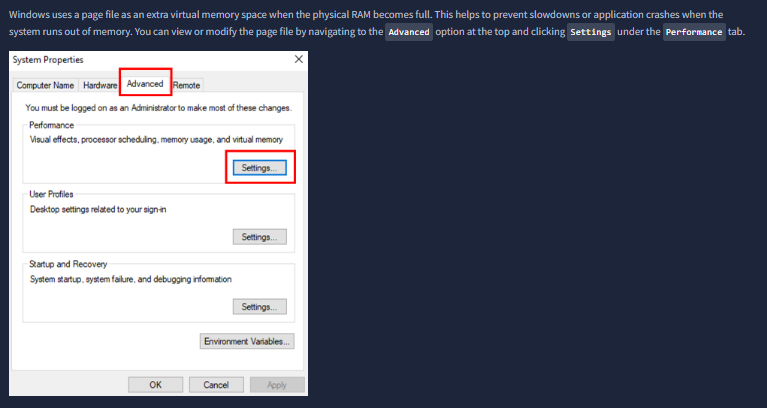

This screenshot focuses on the **System Properties → Advanced** tab and highlights **Performance → Settings...**.

The room explains that Windows uses a **page file** as extra virtual memory when physical RAM is full, and that performance settings are one place where you can view/adjust this behavior (which matters for both stability and troubleshooting).

### 6) Performance Options: processor scheduling + virtual memory paging file
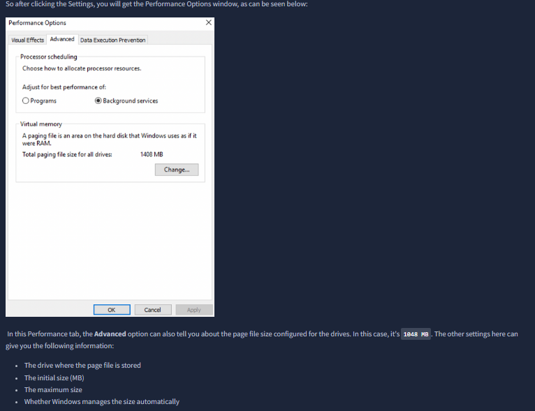

This shows the **Performance Options** window. The text calls out two areas you can tune:
- **Processor scheduling** (Programs vs Background services)
- **Virtual memory** (paging file)

The screenshot includes an example paging file size (“Total paging file size for all drives: **1408 MB**”) and points out that deeper paging file configuration is available via the **Advanced** tab / **Change...** button.

### 7) Advanced System Settings: Startup and Recovery (crash dumps)
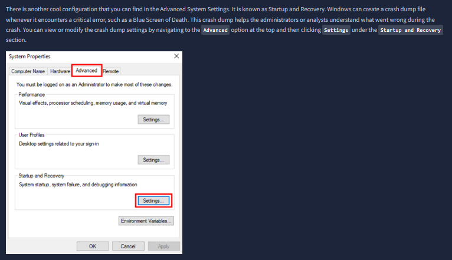

This screenshot introduces the **Startup and Recovery** settings (System Properties → Advanced → Startup and Recovery → Settings...). The text explains the “why”: when Windows hits a critical error (BSOD), it can generate a **crash dump** file that helps admins/analysts understand what happened.

The highlighted “Settings...” button shows where you configure how Windows behaves after a failure and what kind of debugging information it saves.

### 8) Answer checkpoint

This is the **Startup and Recovery** dialog. The screenshot shows:
- Default OS selection (Windows Server)
- Timers for displaying OS list / recovery options
- “System failure” options (write event to system log, auto restart)
- “Write debugging information” dropdown (dump type) and dump file path

The room lists common dump types (automatic/kernel/small/complete/none) and explains that dump configuration directly affects how much forensic/debugging data you get after a crash.

### 9) Knowledge check + “About Windows” (tools in `msconfig`)
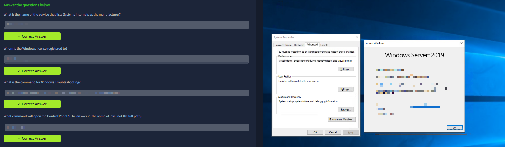

This screenshot is a quiz/checkpoint section. On the right, it shows an “About Windows” window identifying **Windows Server 2019** and the System Properties window in the background.

The questions reinforce that many tools in this room are launched as **executables** from `msconfig` (for example: which `.exe` opens Control Panel, and which command launches a specific troubleshooting utility).

### 10) Change UAC settings: understanding the slider levels

This task is explicitly about **User Account Control (UAC)** settings. The screenshot explains that UAC can be tuned (or turned off, not recommended), and it lists the four slider levels:
- **Always notify** (highest security; Secure Desktop dimming)
- **Notify me only when apps try to make changes** (default behavior)
- **Notify me only when apps try to make changes (do not dim)** (no Secure Desktop)
- **Never notify** (notifications off)

The embedded image shows the UAC slider UI and emphasizes that the slider position controls how often Windows prompts you for elevation/approval.

### 11) Computer Management overview + Task Scheduler basics
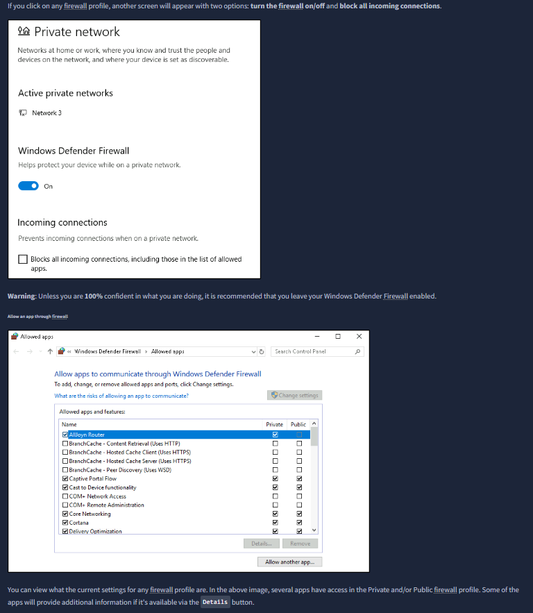

This screenshot introduces **Computer Management** (`compmgmt`) and the three high-level buckets: **System Tools**, **Storage**, and **Services and Applications**.

It then drills into **Task Scheduler**, showing how tasks have triggers and actions. The highlighted example task (“SystemInfoDailyLog”) is configured to run on a schedule (every day at a specific time), and the “Actions” pane shows what command will run (example uses PowerShell).

The screenshot also points to the right‑side **Actions** panel entry “Create Basic Task” as the simplest way to create a scheduled task.

### 12) Event Viewer: event types and standard log categories
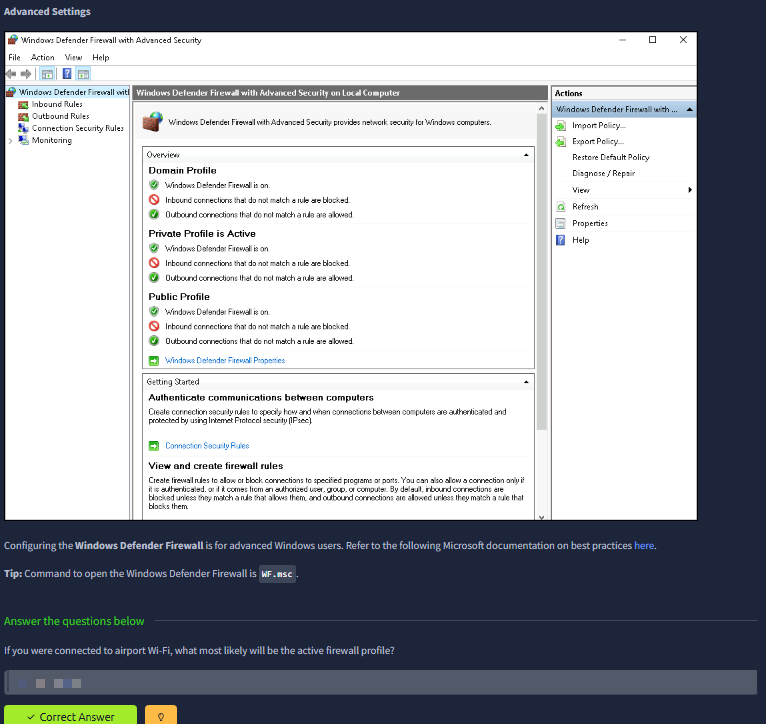

This screenshot introduces **Event Viewer** as an audit trail of activity and problems on the system. It shows the left navigation tree (Custom Views, Windows Logs, Applications and Services Logs, Subscriptions) and explains the three-pane layout (tree, summary, actions).

The two tables summarize:
- Common **event types** (Error, Warning, Information, Success Audit, Failure Audit)
- Common **log categories** (Application, Security, System, and Custom logs)

The key message is that logs are evidence: they help you confirm what happened and when, instead of guessing.

### 13) Computer Management: Shared Folders, performance monitoring, and Device Manager
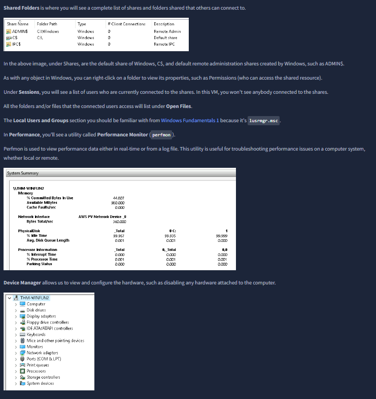

This screenshot covers multiple parts of **Computer Management**:
- **Shared Folders**: shows that Windows maintains a list of shares and includes default administrative shares like `ADMIN$`, `C$`, and `IPC$`.
- **Sessions / Open Files**: explains where you would see active connections and what users are accessing (in the VM example, no one is connected).
- Mentions **Local Users and Groups** (`lusrmgr.msc`) as a user/account management console.
- Mentions **Performance Monitor** (`perfmon`) for real-time or recorded performance data.
- Mentions **Device Manager** as the place to view/configure hardware devices (including disabling devices).

The takeaway is that Computer Management is a “hub” for fast triage across multiple admin surfaces.

### 14) Storage + Services: Disk Management and Services list

The top half shows **Disk Management**, listing volumes and partitions (including “System Reserved” and `C:`). The text calls out that this is a Windows Server VM, so you might see server‑specific utilities too, but Disk Management is the one being emphasized.

The bottom half moves into **Services and Applications → Services**, showing a services list and explaining that services are background applications. It also notes you can open a service’s **Properties** to see deeper details (service name vs display name, path to executable, startup type).

### 15) Service Properties: startup types + WMI context
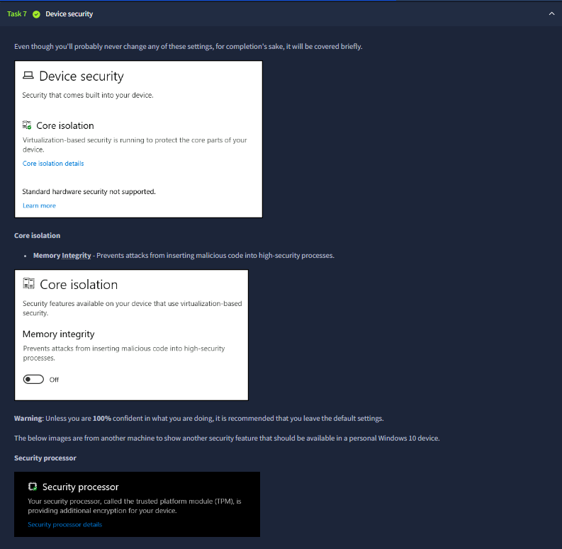

This screenshot shows a **service Properties** window and highlights **Startup type** options:
- **Automatic** (starts on boot)
- **Manual** (starts when triggered)
- **Disabled** (should not run)

It then introduces **WMI Control** (Windows Management Instrumentation) as a management interface that can be used by scripting tools (PowerShell/VBScript) and notes that older `wmic` tooling is deprecated on newer Windows.

At the bottom, there’s a knowledge-check section (questions about opening Computer Management, task schedules, and hidden shared folders), reinforcing that you should be able to navigate these consoles and extract facts.

### 16) System Information (`msinfo32`): what it is and how it’s structured

This task introduces **Microsoft System Information** (`msinfo32`) as a tool that provides a comprehensive view of hardware, system components, and the software environment.

The screenshot shows the three main sections:
- **Hardware Resources**
- **Components**
- **Software Environment**

It also highlights “System Summary” as the starting point for general specs, and shows examples of subtrees (like multimedia codecs under Components).

### 17) Software Environment: Environment Variables inside `msinfo32`
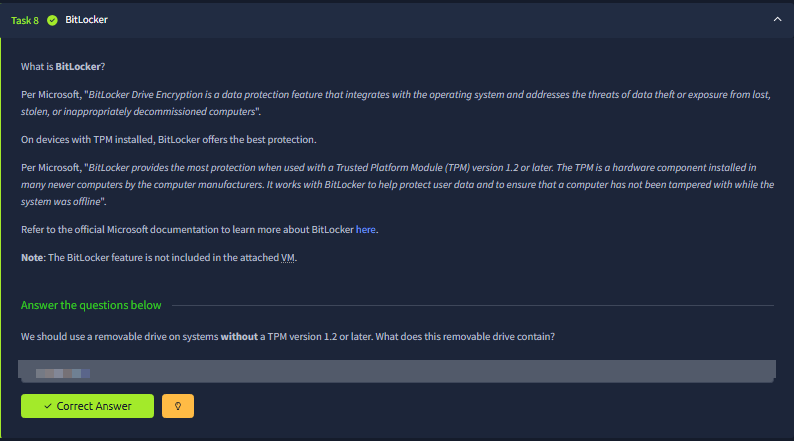

This screenshot zooms into **Software Environment → Environment Variables** and explains what environment variables represent: OS environment details such as paths, processor info, and temporary folder locations.

The bottom half shows an `msinfo32` Environment Variables table. The key detail is scope: values can apply to the system and/or to user contexts, and many tools read these variables at runtime.

### 18) Environment Variables UI + searching `msinfo32` for IP Address
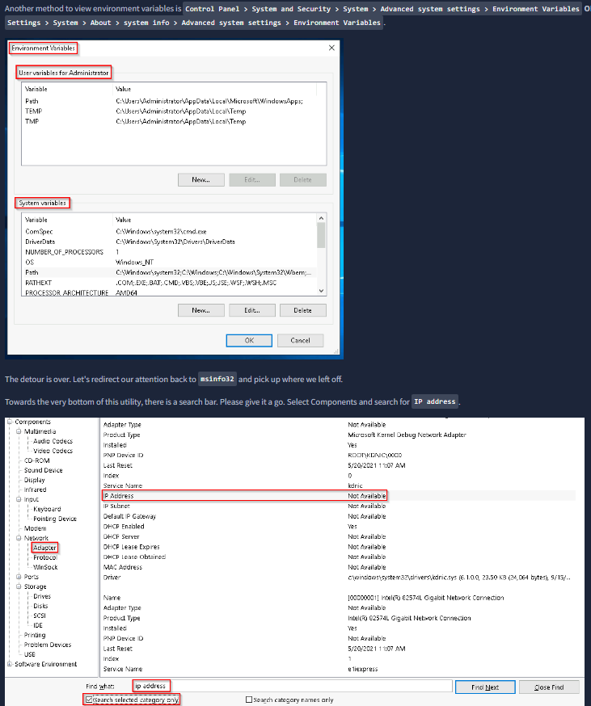

The top part shows the **Environment Variables** dialog, split into:
- **User variables for Administrator**
- **System variables**

This reinforces that some variables are user-specific while others apply system-wide.

The bottom part shows returning to `msinfo32` and using its **search** function to find “IP address”, demonstrating that `msinfo32` can be queried to locate specific details without manually browsing the tree.

### 19) `msinfo32` knowledge check (command + system name + variable values)
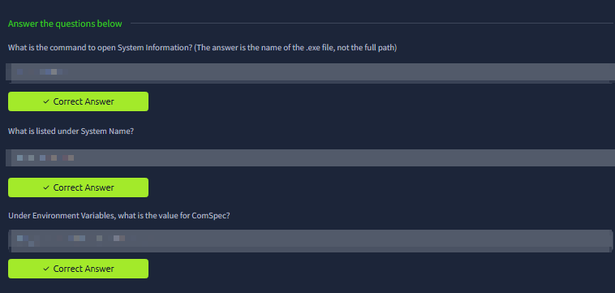

This screenshot is a question block tied to the `msinfo32` section, asking for:
- the executable name used to open System Information
- a value shown under “System Name”
- a specific environment variable value (ComSpec)

The purpose is to practice extracting exact values from the UI/tools rather than answering from memory.

### 20) Resource Monitor (`resmon`): overview and what it tracks
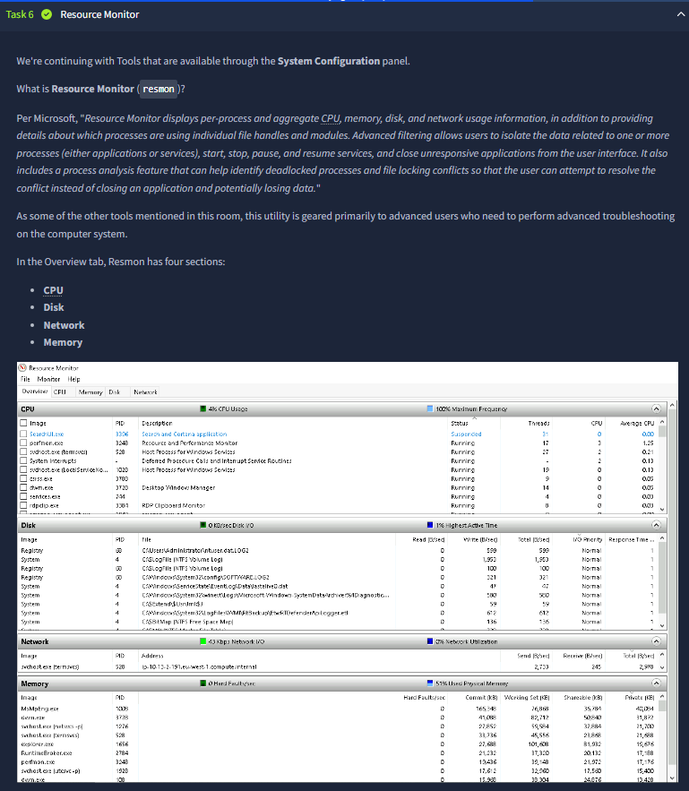

This task introduces **Resource Monitor** (`resmon`) and includes a definition-style description: it displays per‑process and aggregate **CPU, memory, disk, and network** usage.

The screenshot shows the overview with the four sections listed and an example window that includes processes plus disk/network/memory activity panes. The room positions this tool for **advanced troubleshooting** (identifying heavy processes, file handle issues, responsiveness problems).

### 21) Resource Monitor tabs (CPU/Memory/Disk/Network) + example panes
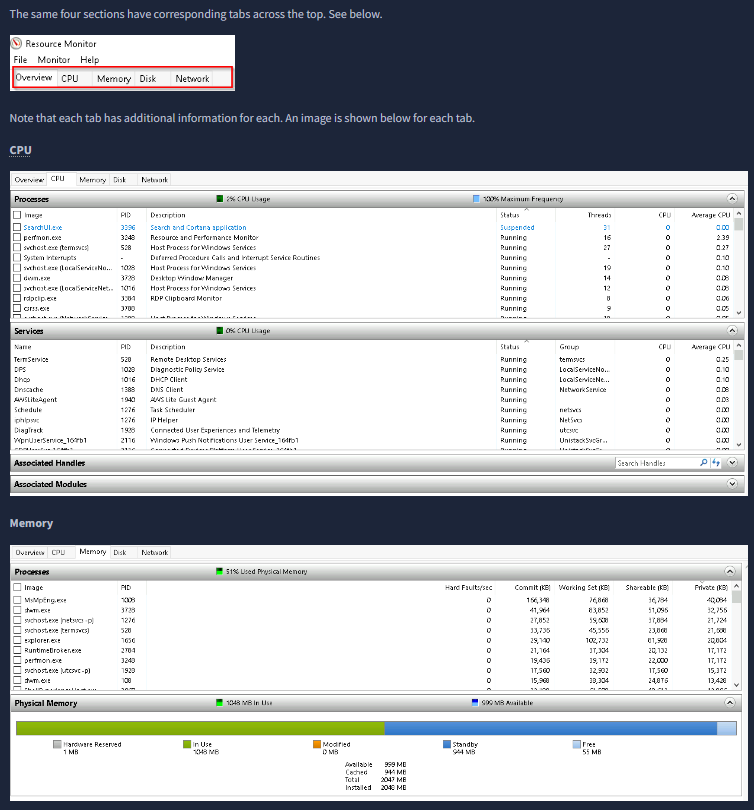

This screenshot highlights the tab structure of Resource Monitor: **Overview, CPU, Memory, Disk, Network**.

Below, it shows example content for CPU (processes/services) and Memory (process list + physical memory chart). The main takeaway is that each tab adds extra detail beyond the overview, and you can switch between them depending on what you’re troubleshooting.

### 22) Resource Monitor: Disk and Network views + command knowledge check
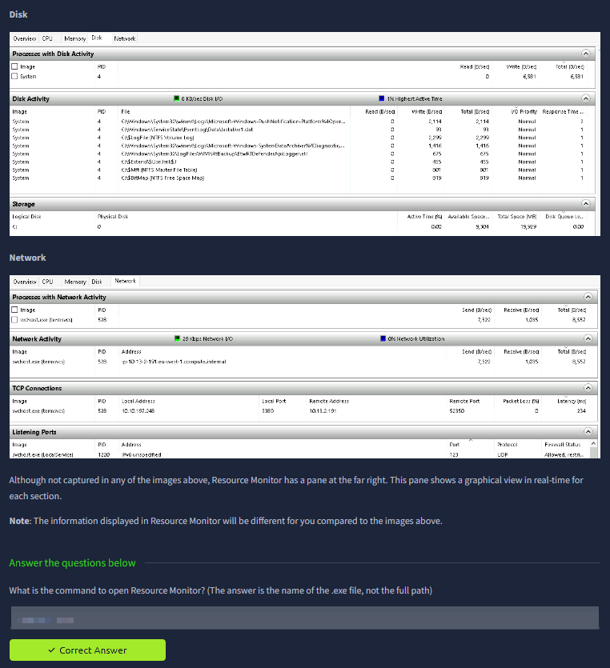

This screenshot shows the **Disk** section (disk activity, files, response time) and the **Network** section (network activity, TCP connections, listening ports).

The note under the screenshots explains that Resource Monitor also has a right-side pane with real-time graphs, and that your output will differ from the examples. At the bottom, the task asks for the executable name used to open Resource Monitor.

### 23) Command Prompt (`cmd`): basic commands and `ipconfig`
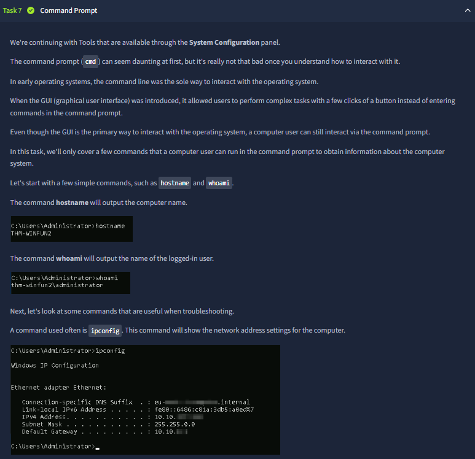

This task introduces the **Command Prompt** and explains why the command line still matters (some tasks are faster/repeatable, and older systems were CLI-only).

The screenshot starts with simple identity/host checks:
- `hostname` (prints the computer name)
- `whoami` (prints the current logged-in user)

Then it moves to troubleshooting-oriented output with **`ipconfig`**, showing network adapter configuration details.

### 24) Using built-in help (`/?`), `netstat`, and the `net` command family
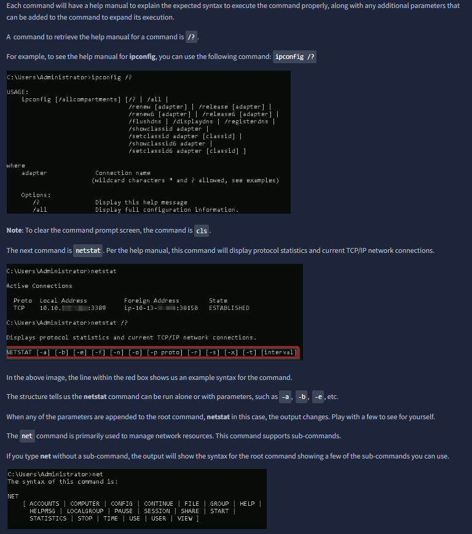

This screenshot shows a practical habit: use `/?` to view help/syntax for a command (example: `ipconfig /?`).

It also notes a small quality-of-life command: `cls` clears the console.

Then it introduces `netstat` as a way to view protocol statistics and network connections, and highlights the `net` command as a **command family** with multiple subcommands.

### 25) `net help` and `net help <subcommand>` (how to discover syntax)
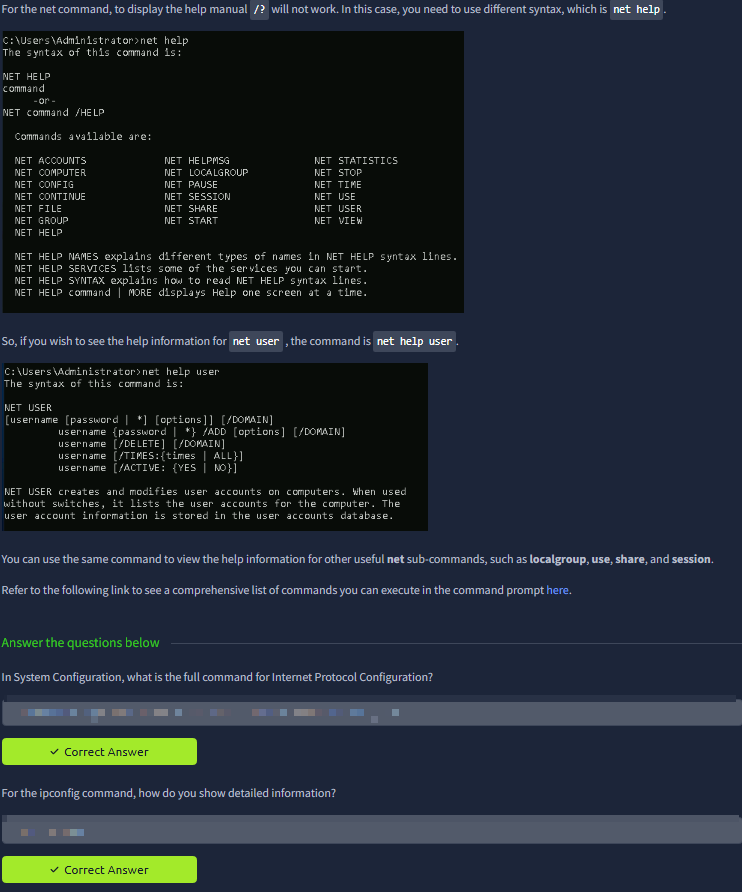

This screenshot explains that `/?` does not work for `net`, and instead you should use:
- `net help`
- `net help user` (or other subcommands like localgroup, use, share, session)

At the bottom, the room provides questions that tie back to earlier tooling (for example: the full command for Internet Protocol Configuration, and how to show detailed `ipconfig` output).

### 26) Registry Editor (`regedit`): what the registry is and how to open it
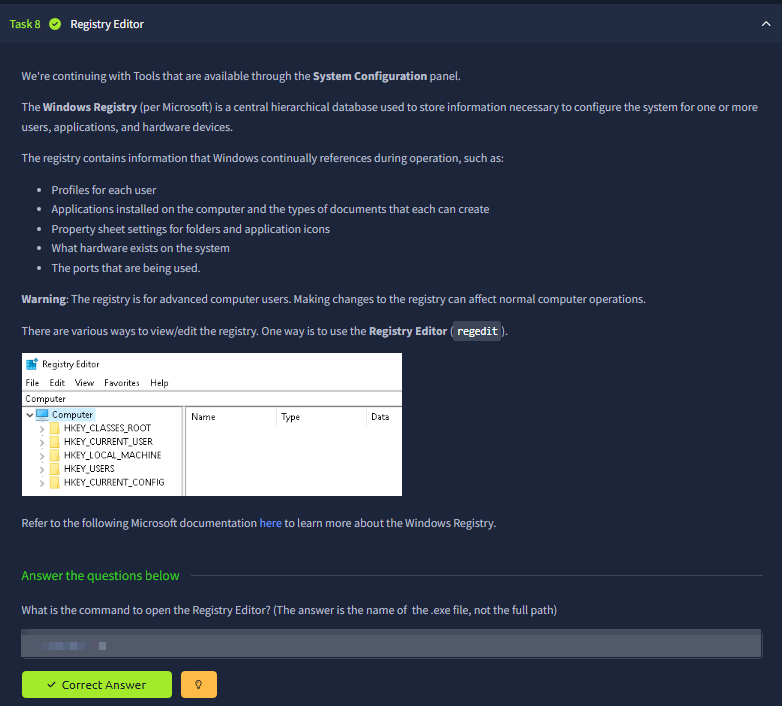

The final task introduces the **Windows Registry** as a central hierarchical database for configuration across users, applications, and hardware. The screenshot lists example data stored there (user profiles, application/document associations, icon/propsheet settings, hardware inventory, ports in use).

It includes an explicit warning: the registry is for advanced users and changes can impact normal operations.

Finally, it shows the Registry Editor UI and calls out the command used to open it: **`regedit`**.

## Key Takeaways
- Windows Fundamentals 2 is a tool-driven room: each task is about opening a native console and reading what it reports.
- The screenshots repeatedly reinforce “know the executable” (`msconfig`, `compmgmt`, `msinfo32`, `resmon`, `cmd`, `regedit`) and how to navigate each UI quickly.
- Security relevance comes from visibility and verification: services, logs, shares, environment variables, network connections, and system configuration all become evidence during troubleshooting and investigations.

