

# Windows Fundamentals 3

Room link: https://tryhackme.com/room/windowsfundamentals3xzx

## Executive Summary
- This room is a guided tour of Windows’ built-in security surfaces, using Windows Update + Windows Security as the main UI.
- The screenshots focus on what you should *check* (status, toggles, last scan/update time, profiles) rather than memorizing definitions.
- The core skill: reading the UI carefully and understanding what each control/status actually implies.

## Evidence + Screenshot-based Analysis

### 1) Windows Update overview (Patch Tuesday + where to find it)
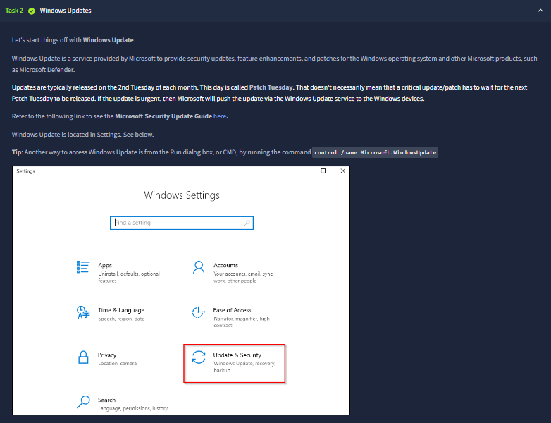

This task introduces **Windows Update** as the delivery channel for security patches, feature updates, and Microsoft product updates. The text calls out the “**2nd Tuesday of each month**” cadence (Patch Tuesday) and clarifies that urgent patches can be pushed outside that schedule.

It also shows where the setting lives in Windows Settings (**Update & Security**) and includes a practical tip: launching Windows Update via `control /name Microsoft.WindowsUpdate`.

### 2) Managed update policies + “No updates available”
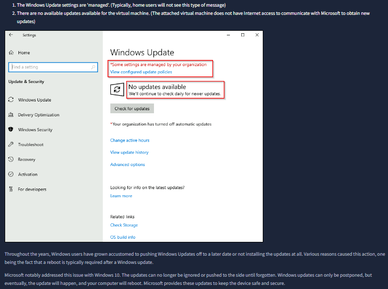

Here we see the Windows Update page with two important signals:
- **“Some settings are managed by your organization”** → update behavior can be enforced by policy (common in enterprise environments).
- **“No updates available”** → this VM currently can’t fetch new updates (the room text notes the attached VM has no Internet access), so you can’t rely on it to stay current automatically.

The key takeaway is: when you’re assessing patch posture, you must consider both **policy** (who controls updates) and **connectivity** (can the device actually reach update servers).

### 3) “Restart required” and reboot scheduling
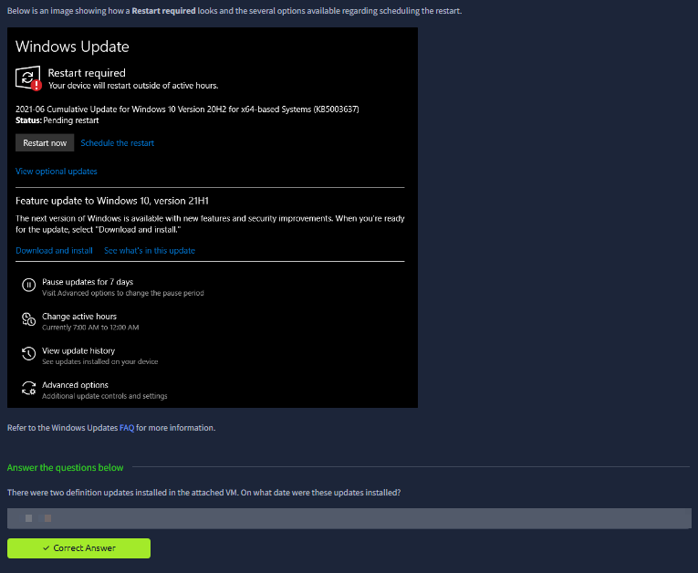

The room text above the screenshot explicitly says it’s showing what a **Restart required** state looks like and what options you have to handle the reboot.

From the Windows Update panel itself, we can see:
- **Restart required** for a cumulative Windows 10 update, with **Status: Pending restart**
- Two actions: **Restart now** and **Schedule the restart**
- Related controls/links that commonly appear in real environments: **View optional updates**, **Pause updates for 7 days**, **Change active hours**, **View update history**, and **Advanced options**

At the bottom of the task, the room asks a question about **definition updates** installed in the attached VM. This reinforces a practical habit: after updates, verify what actually installed (and when) via **update history**, not just the “you’re up to date” headline.

### 4) Windows Security entry point (protection areas)
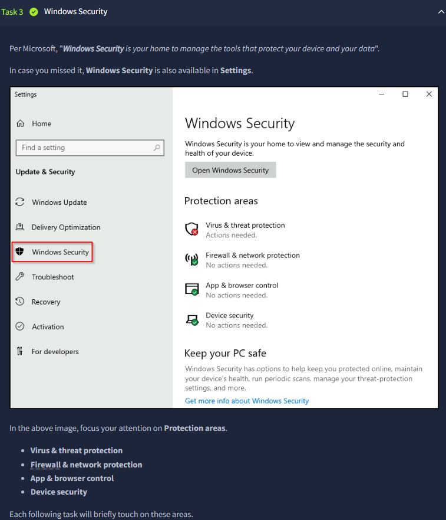

This task introduces **Windows Security** as “your home to manage the tools that protect your device and your data”. The screenshot shows it in Settings and highlights the main **Protection areas**:
- Virus & threat protection
- Firewall & network protection
- App & browser control
- Device security

The room explicitly says the following tasks will briefly touch on these areas — so the rest of the room is essentially “read these panels, understand what each status means, and know where the toggles live.”

### 5) Security at a glance + status icon meaning (green/yellow/red)
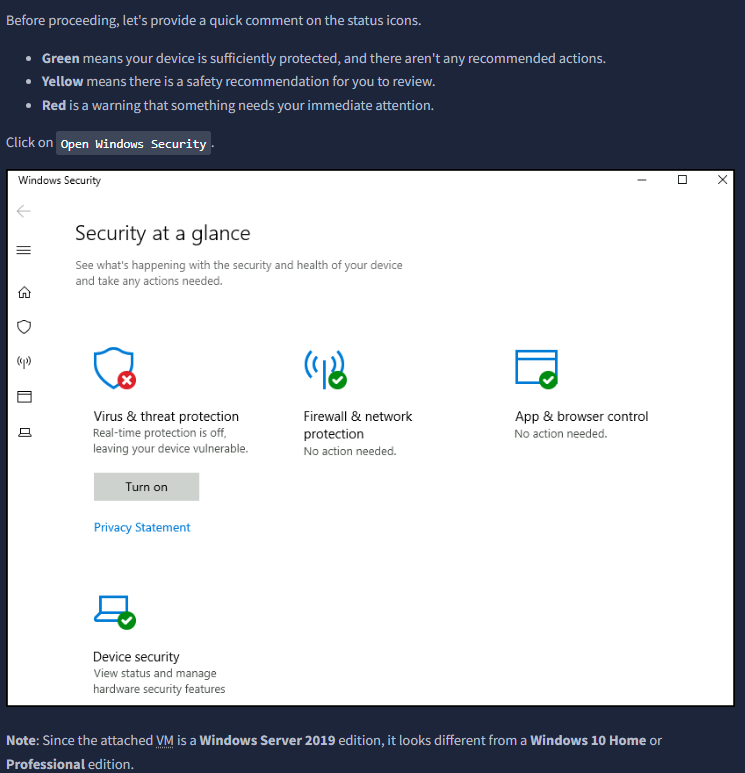

Before diving into individual categories, this screenshot explains the **status icon colors**:
- **Green**: sufficiently protected, no recommended actions
- **Yellow**: recommendation you should review
- **Red**: immediate attention required

In the “Security at a glance” view, you can already see a **red** indicator under “Virus & threat protection”, and the UI shows a **Turn on** button — meaning real-time protection is currently off on this machine.

### 6) Protection areas list + first knowledge-check prompt
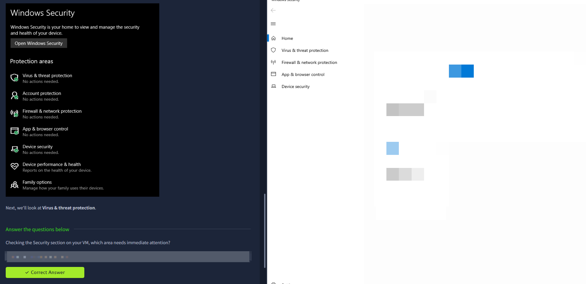

This screenshot shows the Windows Security protection areas list again, now in the dark UI. Every item shows **“No actions needed”** in this view, and then the page tells you: “Next, we’ll look at **Virus & threat protection**.”

At the bottom, there’s a short question: “Checking the Security section on your VM, which area needs immediate attention?” — which is meant to train your eyes to spot the **red/yellow** status and identify which category needs action.

### 7) Virus & threat protection: “Current threats” view (quick scan, last scan details)
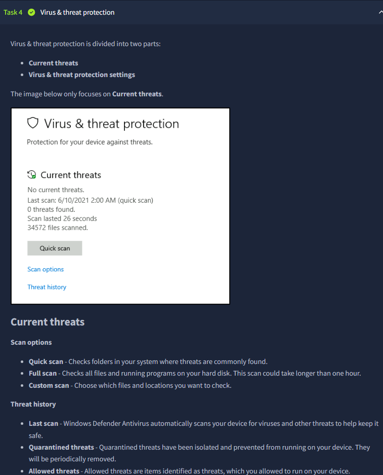

This page is specifically the **Current threats** portion of Virus & threat protection. The screenshot shows:
- “No current threats”
- The **last scan time** (quick scan timestamp)
- How many threats were found, how long the scan lasted, and how many files were scanned

Below, the room explains the difference between **Quick scan**, **Full scan**, and **Custom scan**, and introduces **Threat history** (quarantined vs allowed threats). The practical mindset is: don’t just trust “green” — verify *what was scanned and when*.

### 8) Virus & threat protection settings, updates, and ransomware protection (what each toggle implies)
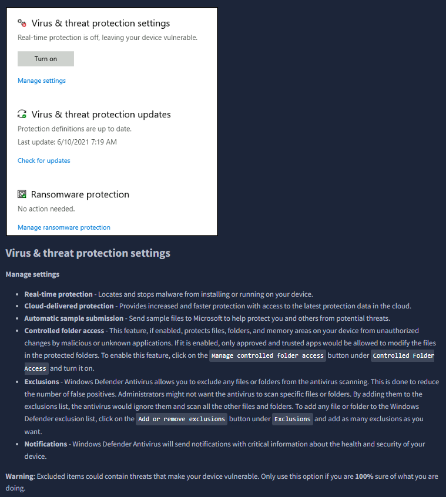

This screenshot switches from “Current threats” to **settings + maintenance**:
- **Real-time protection is off** (with a “Turn on” button).
- **Protection updates** shows definitions are up to date and a **last update** time.
- **Ransomware protection** is shown as “No action needed”.

The text below lists specific controls you should recognize:
- **Real-time protection** (actively blocks malware at runtime)
- **Cloud-delivered protection** (faster intel-based detection)
- **Automatic sample submission**
- **Controlled folder access** (ransomware hardening)
- **Exclusions** (what not to scan — powerful but risky if abused)
- **Notifications**

The warning at the bottom is the main security lesson: exclusions or disabled real-time protection can create blind spots even when the rest of the UI looks “mostly fine.”

### 9) “Scan with Microsoft Defender” from context menu + prompt about what’s disabled
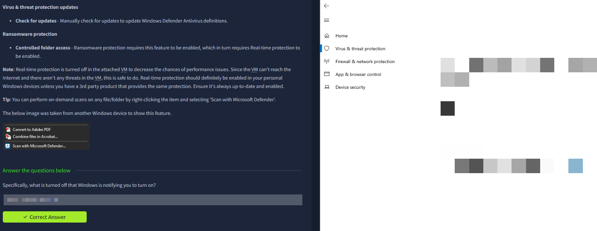

This image adds an operational tip: you can right‑click a file/folder and run an on-demand scan (“**Scan with Microsoft Defender…**”).

It also notes why the lab VM might have real-time protection turned off (performance + limited exposure due to no Internet), while reminding you that on a personal machine you should keep protection enabled and updated.

The question at the bottom (“Specifically, what is turned off…”) is meant to reinforce that you must identify the exact control that’s disabled — not just say “Defender”.

### 10) Firewall & network protection: domain/private/public profiles
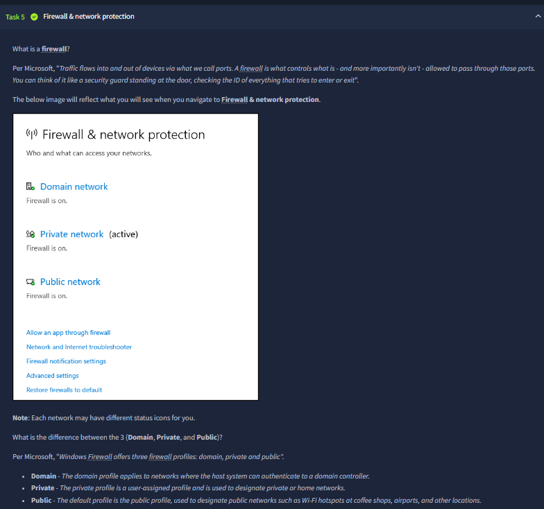

This task introduces the Windows Firewall profiles:
- **Domain network**
- **Private network (active)**
- **Public network**

The text explains why the same host can behave differently depending on which profile is active (e.g., public Wi‑Fi vs a known private network). This is the basis for later hardening decisions: you apply stricter inbound rules in public contexts.

### 11) Private network firewall toggle + “Allowed apps” list (per-profile exposure)

This screenshot shows a **Private network** firewall page where the firewall is **On** and there’s an option to **block all incoming connections** (including allowed apps).

Below it, the “Allowed apps” Control Panel view lists applications and whether they’re allowed on **Private** and/or **Public** networks. This is important because “an app works” often means “the firewall is allowing it somewhere” — and you should verify *where*.

### 12) Advanced firewall console (`WF.msc`) + choosing the right profile on public Wi‑Fi

Here the room jumps to **Windows Defender Firewall with Advanced Security**, which is the more detailed management console (inbound rules, outbound rules, connection security rules, monitoring).

The bottom prompt about airport Wi‑Fi is training a real-world habit: when you connect to an untrusted network, Windows should treat it as **Public profile**, and your firewall behavior should match that risk level.

### 13) App & browser control: SmartScreen (block/warn/off) + “Windows protected your PC”
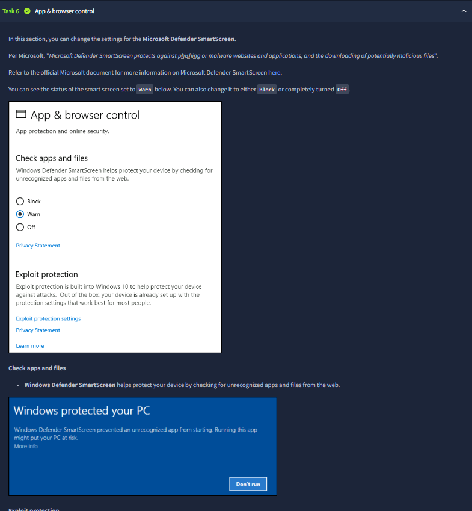

This section is about Microsoft Defender **SmartScreen** and browser/app reputation checks:
- The UI shows three modes: **Block**, **Warn**, or **Off**.
- The “Windows protected your PC” dialog is a familiar SmartScreen experience: Windows prevents an unrecognized app from starting and forces the user to make a deliberate decision.

The practical takeaway: even if antivirus misses something, SmartScreen can add friction to risky downloads and unknown executables.

### 14) Exploit protection (CFG, DEP, ASLR) and why defaults matter
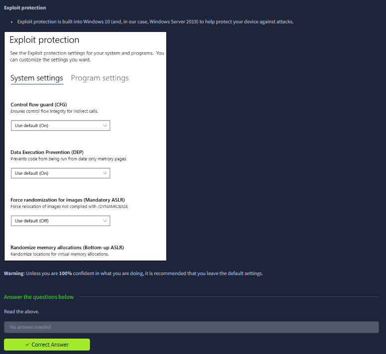

This screenshot is the **Exploit protection** settings page, listing system-level mitigations like:
- **Control flow guard (CFG)**
- **Data Execution Prevention (DEP)**
- **Mandatory ASLR** and **Bottom‑up ASLR**

The room warns not to change these unless you’re sure, because they’re foundational mitigations and misconfiguration can cause compatibility issues.

### 15) Device security: Core isolation, Memory integrity, and the Security processor

This task focuses on **Device security** features:
- **Core isolation** (virtualization-based security)
- **Memory integrity** (shown as Off in the example)

It also introduces the **Security processor (TPM)** as a hardware-backed component that supports additional security guarantees (e.g., secure key storage and attestation).

### 16) TPM details: specs, status, and what TPM is used for
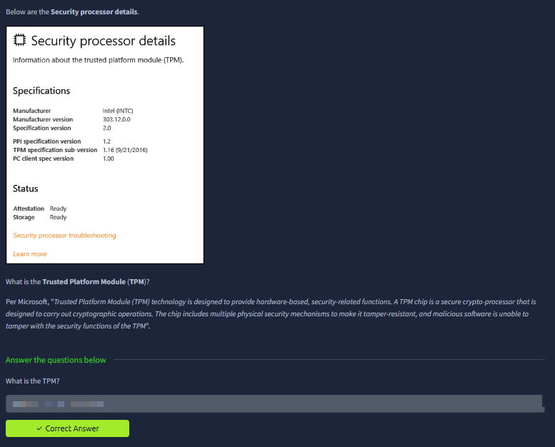

The “Security processor details” panel shows concrete TPM metadata (manufacturer, spec version, etc.) and status indicators like **Attestation: Ready** and **Storage: Ready**.

The text below explains TPM as a **hardware-based security module** designed to carry out cryptographic operations and resist tampering — which is why it becomes important for features like BitLocker and modern platform trust.

### 17) BitLocker overview and the “no TPM” removable drive requirement

This task explains **BitLocker Drive Encryption** and explicitly connects it to:
- Protecting data if a device is lost/stolen or decommissioned improperly
- Working best with a **TPM (v1.2 or later)** for stronger protection

It also notes the lab VM doesn’t include BitLocker. The question about a removable drive for systems **without TPM** points to the concept of storing a startup key / recovery material externally when hardware-backed trust isn’t available.

### 18) Volume Shadow Copy Service (VSS): what it is and where you manage it
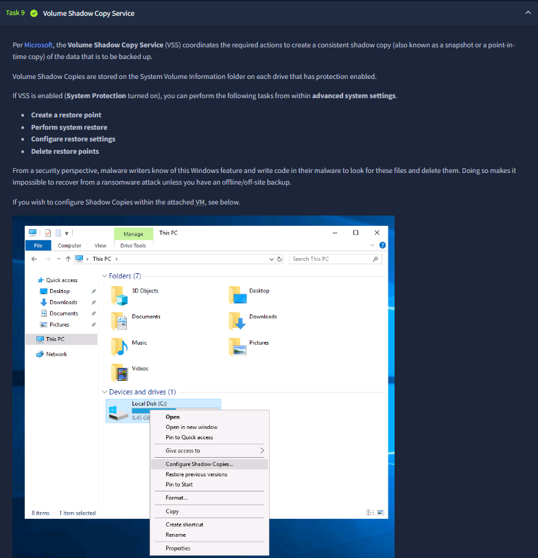

This screenshot introduces **Volume Shadow Copy Service (VSS)** — Windows’ snapshot/restore mechanism used for backups and restore points. The text lists what VSS enables:
- Create a restore point
- Perform system restore
- Configure restore settings
- Delete restore points

The UI shows the “**Configure Shadow Copies…**” option from the drive context menu, which is how you access configuration for a specific volume.

### 19) Shadow Copies configuration dialog + VSS recap question
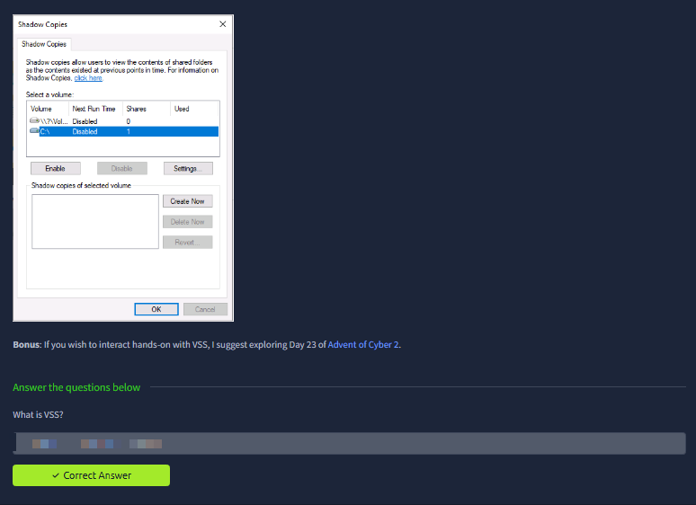

The Shadow Copies dialog shows volumes (including `C:`) and the ability to **Enable/Disable** shadow copies, plus actions like **Create Now** / **Delete Now** (availability depends on state).

The final question (“What is VSS?”) is a short recap: VSS is the Windows service that coordinates consistent snapshots so data can be backed up or restored.

## Key Takeaways
- Windows Fundamentals 3 is about *reading Windows’ built-in security UI precisely* (updates, protection status, profiles, toggles, and timestamps).
- The room repeatedly reinforces “don’t assume” — confirm status in the relevant panel (Update history, Current threats, firewall profile, etc.).
- Most controls shown are default Windows features; knowing where they live and what their states mean is the main win.

