# Windows AD Basics

Room link: https://tryhackme.com/room/winadbasics

## Executive Summary
- This room introduces **Active Directory (AD)** as the core identity and policy backbone in many Windows enterprise environments.
- It explains the **domain model** (users, computers, groups, Domain Controllers) and why centralizing these objects simplifies management at scale.
- It walks through practical administration tasks: **Organizational Units (OUs)**, **delegation**, and **Group Policy Objects (GPOs)**.
- It ends with authentication fundamentals (**Kerberos vs NetNTLM**) and AD scaling concepts (**trees, forests, and trust relationships**).

## Evidence + Screenshot-based Analysis

### 1) Room introduction + objectives
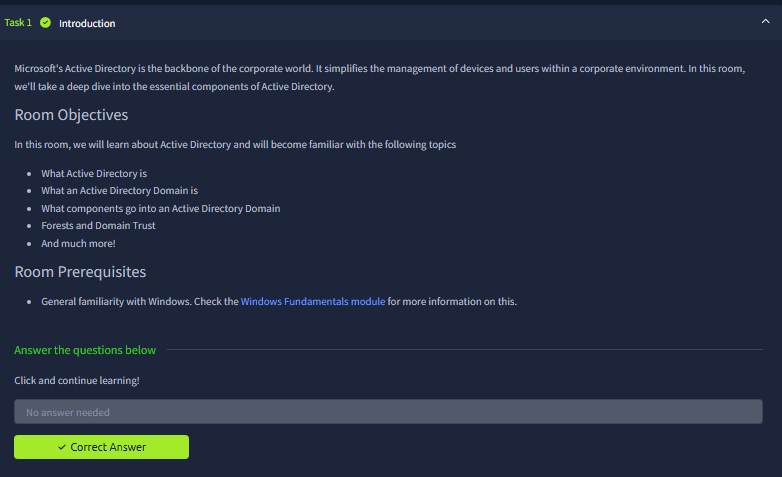
The screenshot frames Active Directory as “the backbone of the corporate world” and sets expectations for what will be covered. The objective list highlights the room’s scope: what AD is, what an AD domain is, which components go into a domain, and how **forests** and **domain trusts** fit in. The prerequisite note also points out that you should already be comfortable with Windows basics, which matters because the later steps use Windows admin tools (like “Active Directory Users and Computers” and Group Policy tooling).

### 2) Why Windows domains exist + Domain Controller concept
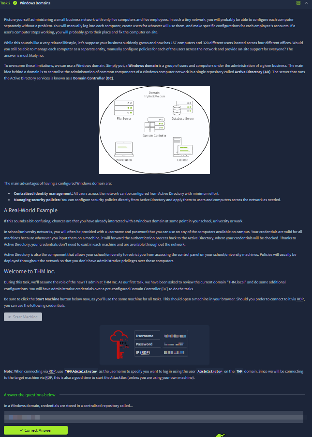
This page starts with a scaling problem: managing a small network computer-by-computer might work with a handful of devices, but it becomes unrealistic as the number of users/computers grows. The screenshot defines a **Windows domain** as a managed group of users and computers, and introduces **Active Directory (AD)** as the centralized repository of “things” in the environment. It also explicitly calls out the **Domain Controller (DC)** as the server running AD services.

The lower part introduces the lab environment (“Welcome to THM Inc.”) and provides domain credentials + RDP connection details, emphasizing that all tasks will be done through the provided Domain Controller session.

### 3) AD objects: users, machines, and security groups
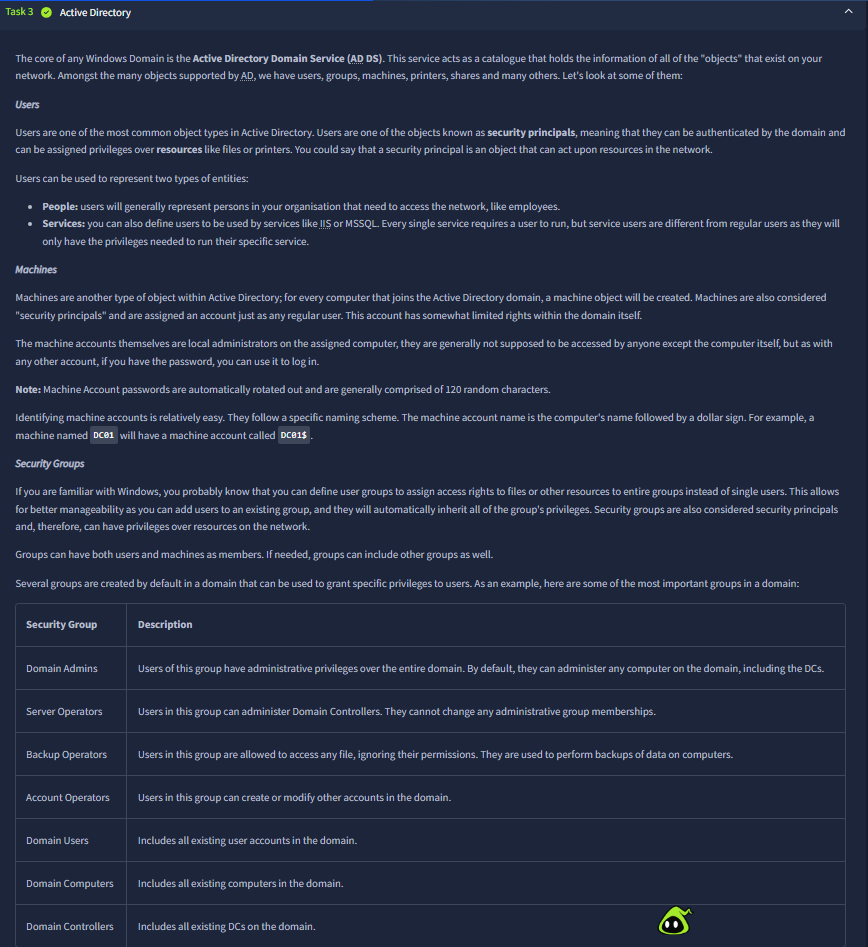
This screenshot explains AD DS (Active Directory Domain Service) as the directory/catalog that stores information about AD “objects.” It breaks down three core object types:
- **Users** as security principals that can authenticate and be granted permissions. It also distinguishes “people” users from “service users” (accounts used to run services like IIS or MSSQL).
- **Machines** as computer objects created when systems join the domain. It notes that machine accounts behave like accounts (they have credentials) and typically follow a naming scheme (computer name + `$`).
- **Security groups** used for permission management at scale, where users/computers can inherit access through group membership.

The table at the bottom highlights built-in groups (Domain Admins, Server Operators, Backup Operators, Account Operators, Domain Users, Domain Computers, Domain Controllers), reinforcing that group membership is one of the most important “control levers” in a Windows domain.

### 4) Opening “Active Directory Users and Computers” (ADUC)
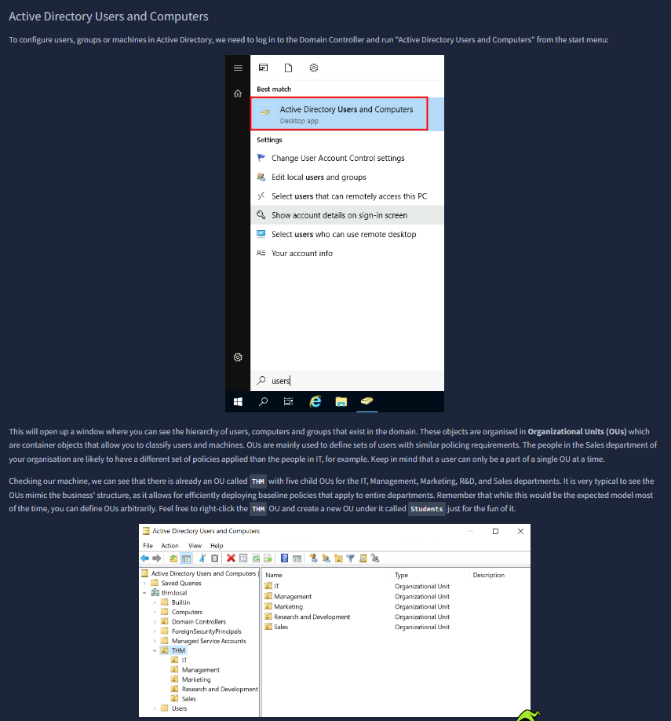
The screenshot shows how to open **Active Directory Users and Computers** from the Start menu search. The text explains why ADUC is important: it lets you browse the domain hierarchy and manage objects. It introduces **Organizational Units (OUs)** as containers used to organize users/computers (often mirroring business structure) and to make policy management practical.

The lower window view shows an example domain structure with an OU called **THM** and multiple child OUs (IT, Management, Marketing, Research and Development, Sales), illustrating how enterprises commonly group objects by department.

### 5) Default containers + Security Groups vs OUs (purpose difference)
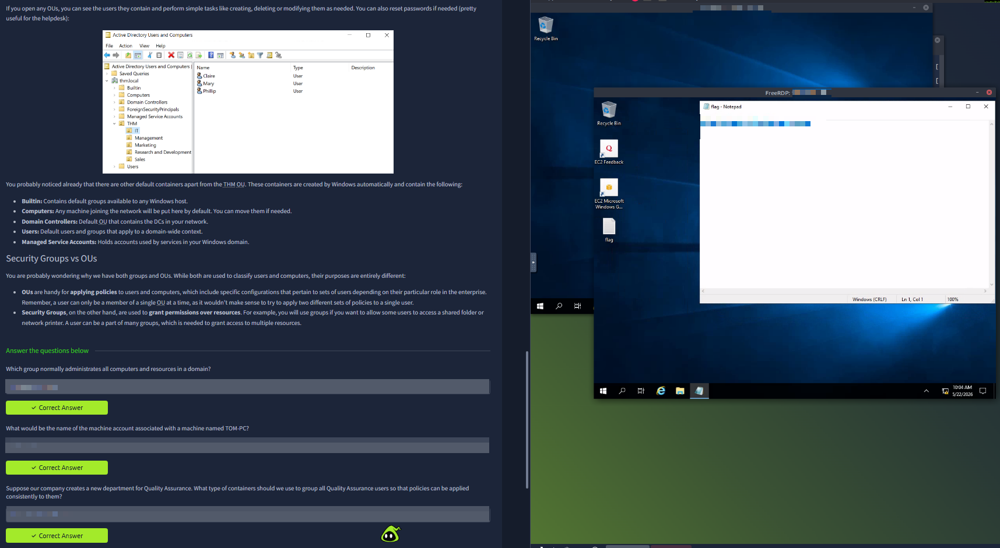
This screenshot reinforces that, besides your organization-specific OUs, AD has default containers created by Windows:
- **Builtin** (default groups),
- **Computers** (default container for joined machines),
- **Domain Controllers** (default container for DC objects),
- **Users** (default domain-wide users/groups),
- **Managed Service Accounts** (service account objects).

It then clarifies a common confusion: **OUs** are primarily for organizing objects and applying policies, while **Security Groups** are for granting permissions to resources. The practical takeaway is that OUs and groups solve different problems—policy targeting vs access control—and you typically use both.

### 6) Managing users: org chart + “protected from accidental deletion”
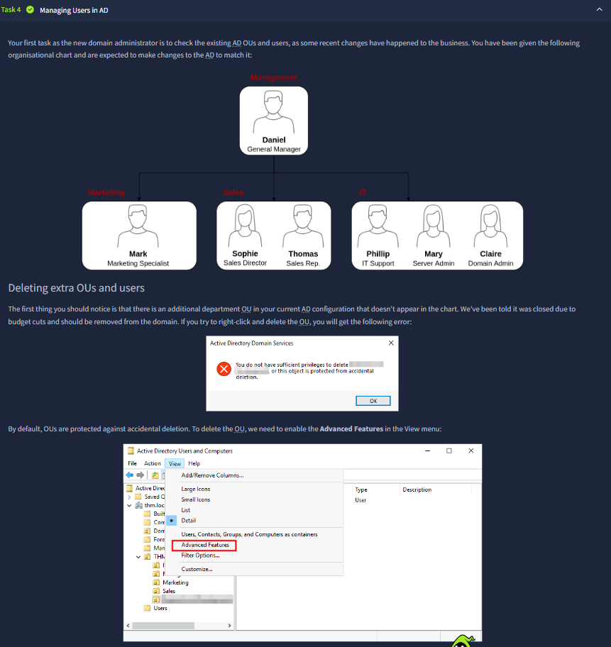
This page gives an organization chart for THM Inc. and sets the task: align the AD configuration with recent business changes. The key technical point is about deletion safety: when trying to delete an OU, the screenshot shows an error indicating insufficient privileges or that the object is protected from accidental deletion.

The guidance is to enable **Advanced Features** in ADUC (View → Advanced Features). This is an admin workflow detail that directly affects what controls you can see and modify for objects.

### 7) Disabling deletion protection + starting delegation
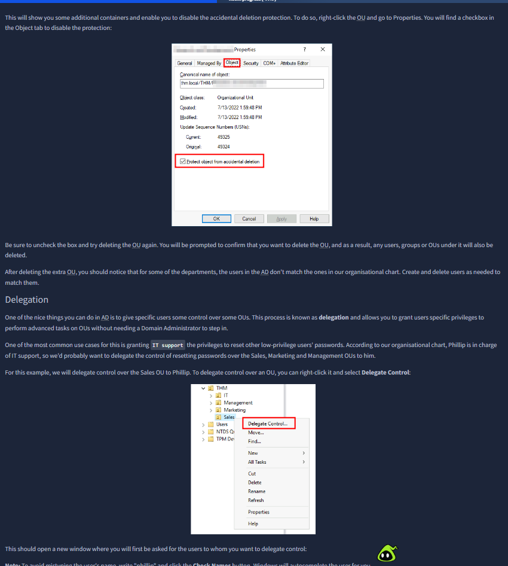
The screenshot shows the OU Properties window and the checkbox **“Protect object from accidental deletion”** under the “Object” tab. The text explains that unchecking this allows deletion and that deleting an OU can cascade (child objects can be deleted too), which is why this protection exists.

The second half introduces **delegation**: granting specific users limited administrative control over an OU. The example shown is delegating to IT support the ability to reset passwords for certain departments. The ADUC context menu highlight (“Delegate Control…”) shows how delegation is initiated from an OU.

### 8) Delegation of Control Wizard + choosing delegated tasks
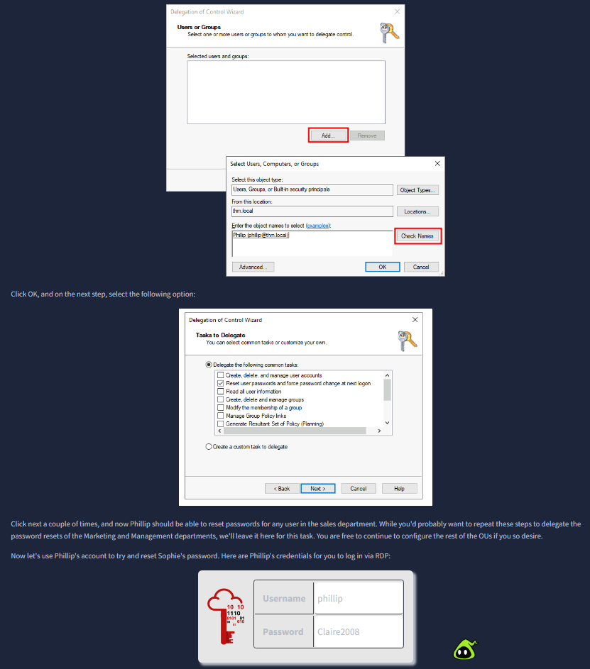
This screenshot shows the Delegation of Control Wizard flow:
- Adding a user/group to delegate to (with “Add…” and the “Select Users, Computers, or Groups” dialog).
- Validating the selection using **“Check Names”**.
- Choosing a predefined set of tasks to delegate (a list of common admin actions).

It also shows credentials for logging in as the delegated user, which makes the next steps testable: you can confirm what the user can/can’t do after delegation.

### 9) Password reset via PowerShell (as delegated user)
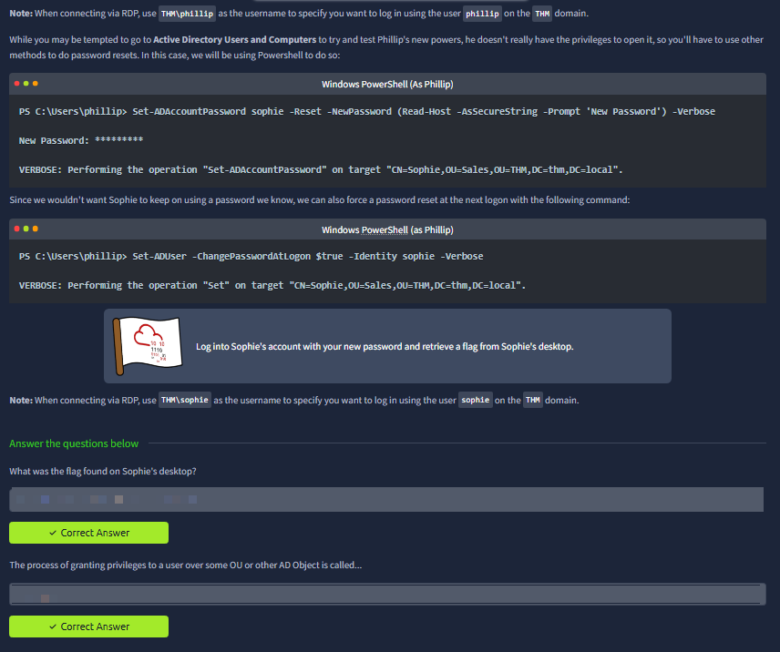
This screenshot demonstrates that even if a delegated user can’t fully manage AD via GUI tools, they can still perform allowed actions using PowerShell cmdlets. It shows:
- `Set-ADAccountPassword` with `-Reset` to set a new password for a user (prompting for a secure string).
- `Set-ADUser -ChangePasswordAtLogon $true` to force a password change at next login.

The instructions emphasize the domain prefix when connecting via RDP (e.g., `THM\phillip` and `THM\sophie`), reinforcing that authentication context matters in domain environments.

### 10) Managing computer objects: separate OUs for workstations and servers
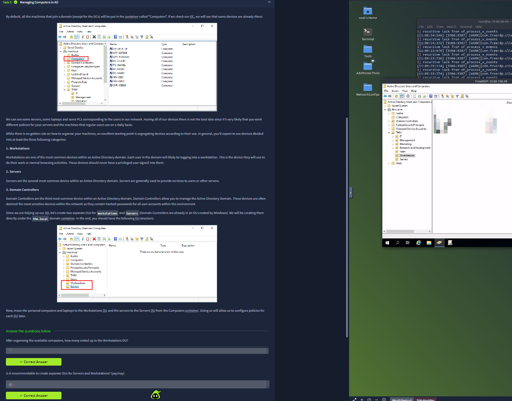
This page shows the default **Computers** container and explains why mixing all machines there is not ideal. It proposes organizing computer objects into at least:
- **Workstations** (user endpoints),
- **Servers** (service hosts),
- **Domain Controllers** (most sensitive systems).

The screenshots show creating separate OUs (Workstations and Servers) and moving computer objects into them. The reasoning is policy-driven: you’ll want different security settings for servers vs user laptops/desktops, and OUs are the mechanism used to target those policies.

### 11) Group Policy basics: creating GPOs and linking to OUs
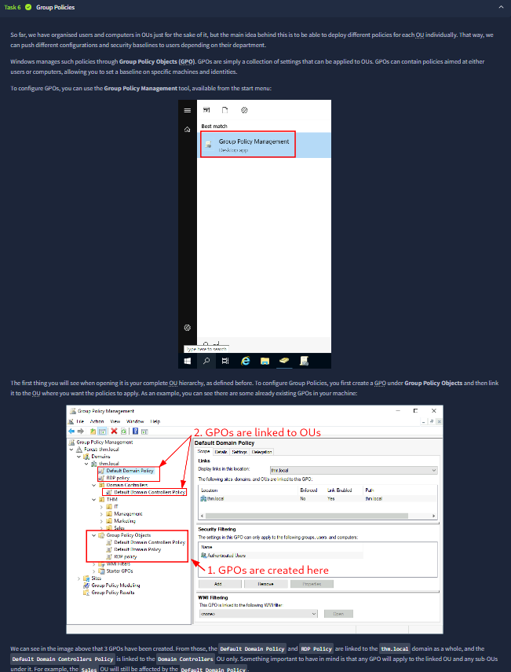
This screenshot introduces **Group Policy Objects (GPOs)** as collections of settings applied to users and/or computers. It shows opening **Group Policy Management** and highlights two key concepts:
1) **GPOs are created under “Group Policy Objects”**
2) **GPOs are linked to OUs (or domains) to define where they apply**

The diagram annotations (“GPOs are linked to OUs” and “GPOs are created here”) make the “create vs apply” split explicit.

### 12) Default Domain Policy scope + Computer vs User Configuration
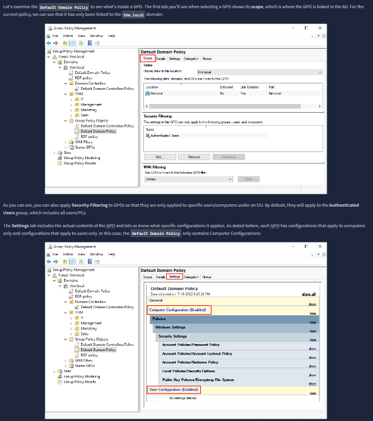
This screenshot focuses on understanding what a GPO applies to and where it’s linked. It shows the Default Domain Policy linked at the domain level (not only to a department OU), which implies broad impact.

The second panel shows that a GPO has two main sections:
- **Computer Configuration**
- **User Configuration**

The highlighted state in the screenshot indicates that, in this example, only Computer Configuration has content. This distinction is important because it determines whether settings affect machines regardless of who logs in, or affect user profiles/logon behavior.

### 13) Editing a GPO to change password policy requirements
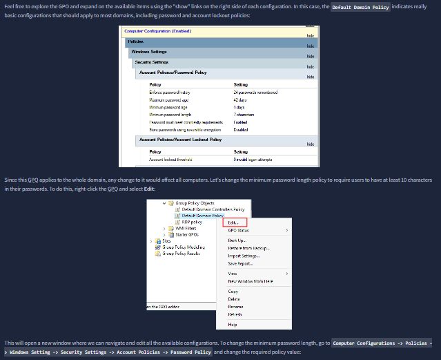
The screenshot shows the Default Domain Policy content view (including password and lockout policy items) and then the context menu where you right-click the GPO and select **Edit…**. The text explains the goal: change a policy so that users are required to have at least a certain minimum password length.

It also provides a navigation path inside the Group Policy editor (Computer Configuration → Policies → Windows Settings → Security Settings → Account Policies → Password Policy), showing how these settings are structured.

### 14) Password policy details + “Explain” help + gpupdate usage
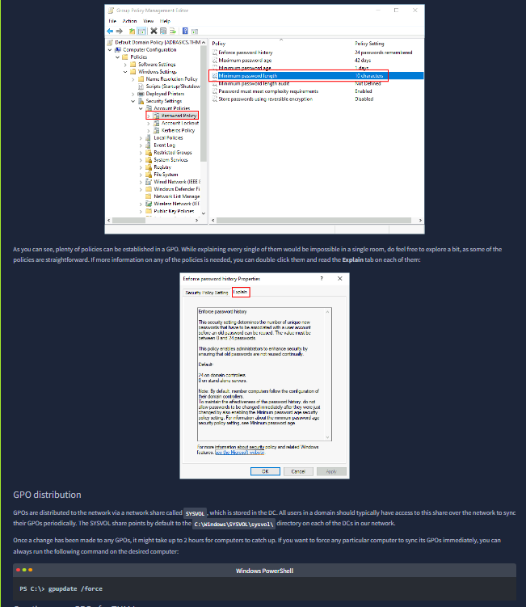
This screenshot shows the Group Policy Management Editor opened on password policy settings, with **“Minimum password length”** highlighted. It also shows the built-in **Explain** tab, which provides documentation for the selected setting (useful when you’re unsure what a policy does or what its side effects are).

At the bottom, the page introduces **GPO distribution** via the **SYSVOL** network share, and notes that changes can take time to propagate. It also shows using `gpupdate /force` in PowerShell to force a machine to refresh policies immediately.

### 15) Creating a new GPO: restricting Control Panel access
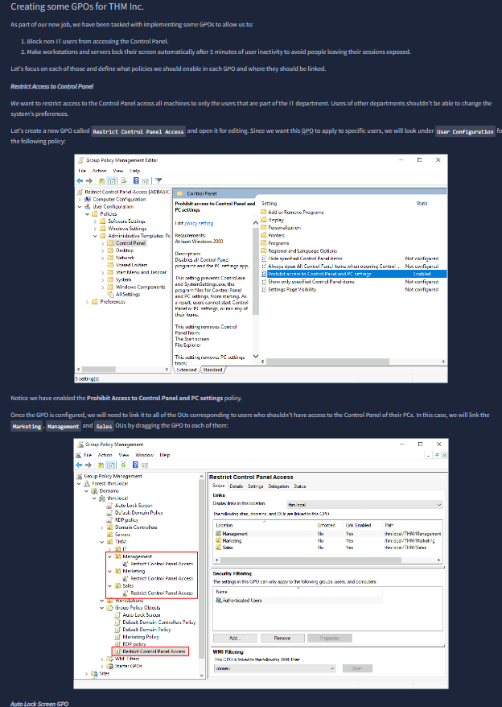
This page describes two example policy goals and begins implementing one of them: blocking non-IT users from accessing the Control Panel. The screenshot shows:
- Creating a new GPO (“Restrict Control Panel Access”).
- Editing settings under **User Configuration** (since it targets user behavior).
- Enabling “Prohibit access to Control Panel and PC settings.”

It then shows linking the new GPO to specific OUs (Marketing, Management, Sales) rather than the entire domain, reinforcing the idea that OU structure + GPO links determine policy targeting.

### 16) Creating “Auto Lock Screen” policy + linking strategy + RDP test user
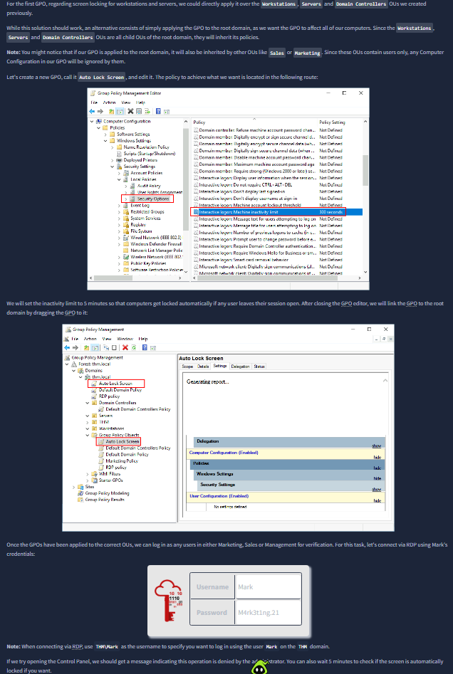
This page continues with the second policy goal: automatically locking sessions after inactivity. The screenshot shows the policy location inside Group Policy (Security Options with an “Interactive logon” setting highlighted), and the idea of setting an inactivity limit so sessions lock after a defined time.

The lower section shows linking the “Auto Lock Screen” GPO and provides RDP credentials for a department user (Mark), which is how you validate that the policy behaves as expected when logging in as a non-admin user.

### 17) Knowledge check: SYSVOL + whether GPO can apply to users and computers
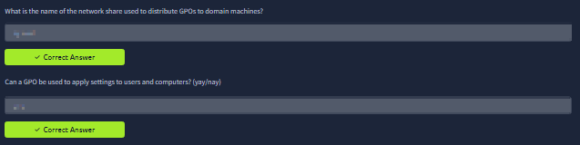
This final check section asks two recap questions tied directly to the previous pages:
- The name of the network share used to distribute GPOs (introduced as **SYSVOL**).
- Whether a GPO can apply settings to both users and computers (matching the earlier “Computer Configuration vs User Configuration” explanation).

The focus here is validating the core vocabulary and the “mental model” of how policy distribution and targeting works in a domain.

### 18) Authentication methods overview: Kerberos vs NetNTLM
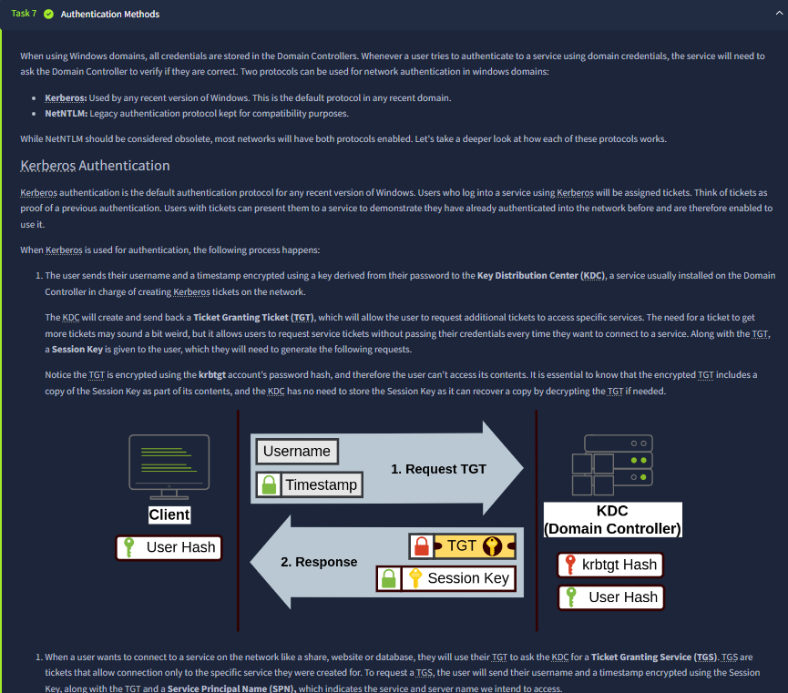
This screenshot introduces two Windows domain authentication protocols:
- **Kerberos** (default for modern domains)
- **NetNTLM** (legacy compatibility)

It begins the Kerberos explanation and uses a ticket-based model:
1) The client requests a **Ticket Granting Ticket (TGT)** from the **Key Distribution Center (KDC)**.
2) The KDC returns the TGT and a session key.

The diagram and text emphasize that tickets act as proof of prior authentication and that Kerberos is designed so users don’t repeatedly send credentials for every service access.

### 19) Kerberos service tickets (TGS) and authenticating to a service (SPN)
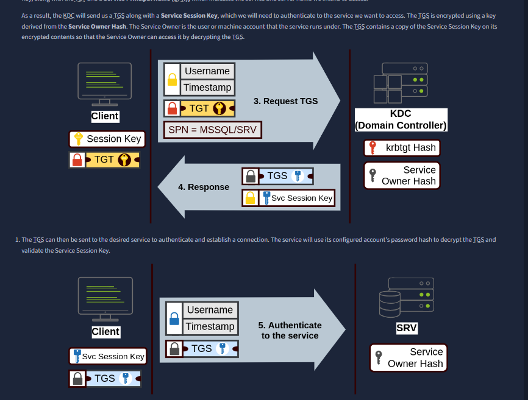
This screenshot continues the Kerberos flow:
- Using the TGT to request a **Ticket Granting Service (TGS)** ticket for a specific service.
- The request references an **SPN** (Service Principal Name), shown as an example like `MSSQL/SRV`.
- The KDC returns a TGS + service session key.

The lower diagram shows using the TGS to authenticate to the target service (SRV). The key point is that service access is tied to a specific ticket, and the service can validate/decrypt it using its own account key material.

### 20) NetNTLM challenge-response authentication flow
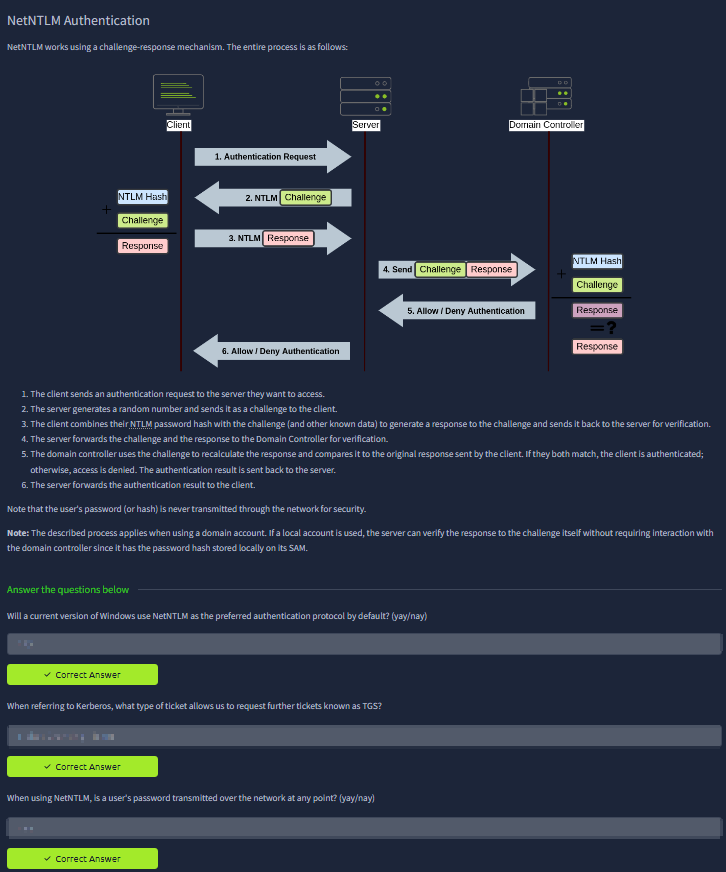
This screenshot explains NetNTLM as a challenge-response mechanism. The step list describes:
1) Client requests authentication to a server.
2) Server sends a random challenge.
3) Client computes a response using the NTLM password hash + challenge and returns it.
4) Server forwards to the Domain Controller for verification (in domain scenarios).
5) Authentication is allowed/denied based on whether verification matches.

The note at the bottom highlights a key property: the user’s password/hash is not transmitted “in the clear” as the password itself, but a response derived from a hash is used for verification.

### 21) Scaling AD: Trees (multiple domains in one namespace)
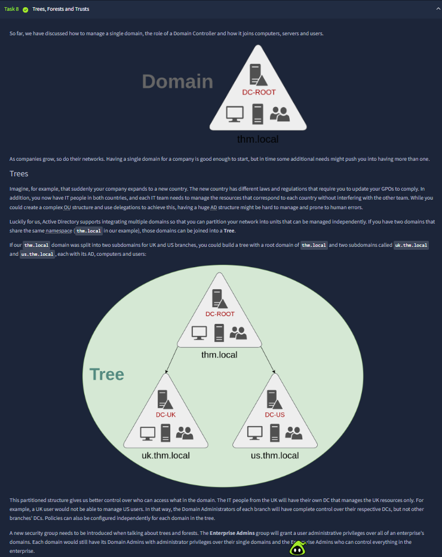
This page explains why a single domain might not be enough as companies grow (different regions, laws/regulations, separate IT teams). It introduces an AD **tree**: multiple domains that share the same namespace (example shows `thm.local` as root and `uk.thm.local` / `us.thm.local` as subdomains).

The diagram helps visualize that each domain can have its own DC and resources, while still being part of a unified structure. This supports delegated administration without giving every admin full control everywhere.

### 22) Forests + trust relationships (one-way vs two-way trust)
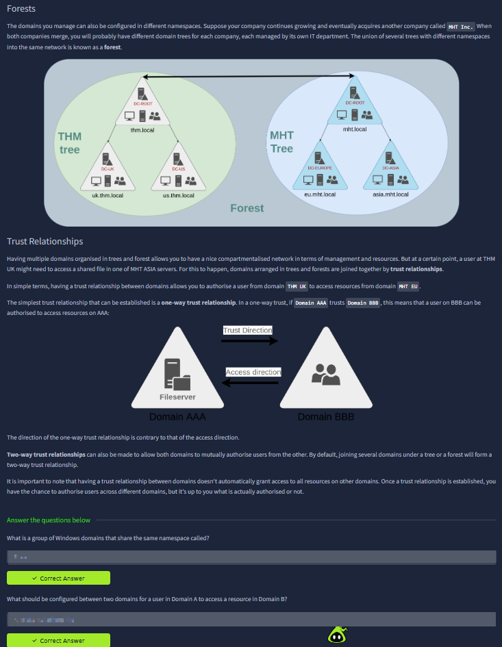
This final page introduces a **forest** as a union of one or more trees with different namespaces (example: `thm.local` tree and `mht.local` tree). It then explains **trust relationships** as the mechanism that allows users from one domain to be authorized to access resources in another.

The trust diagram highlights trust direction and access direction in a **one-way trust**, and the text notes that forests often form **two-way trusts** by default, but authorization still needs to be configured (trust doesn’t automatically grant access to everything). The recap questions at the bottom reinforce the vocabulary: what a shared-namespace group of domains is called and what must be configured to enable cross-domain resource access.

