

# Windows Command Line

Room link: https://tryhackme.com/room/windowscommandline

## 1) CLI motivation and room scope

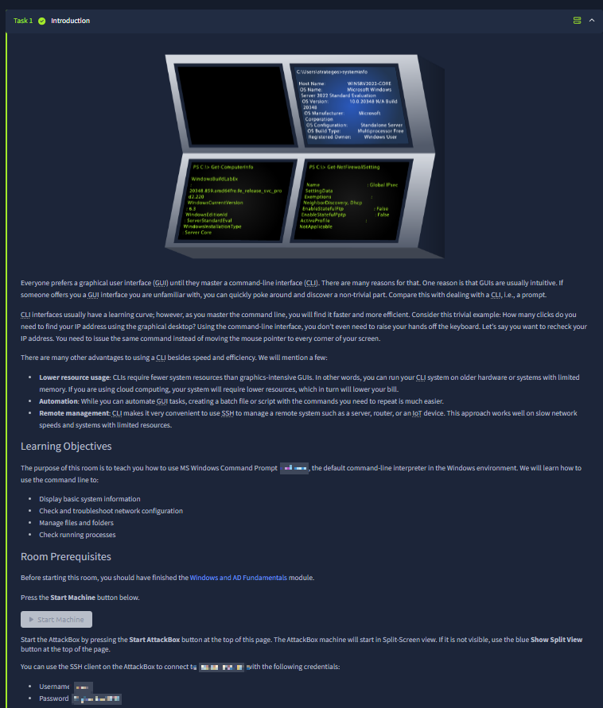

The opening section explains why this room exists: GUI is easy to start with, but CLI becomes faster and more scalable for repeated operations. The screenshot emphasizes three practical reasons: **lower resource usage** (important on servers without full desktop environments), **automation** (scripted repetition instead of manual clicking), and **remote management** (especially over SSH). It also sets a clear learning objective for Windows CLI fundamentals: collecting host/system info, checking network state, handling files/directories, and managing running processes from the terminal.

## 2) SSH access flow from AttackBox

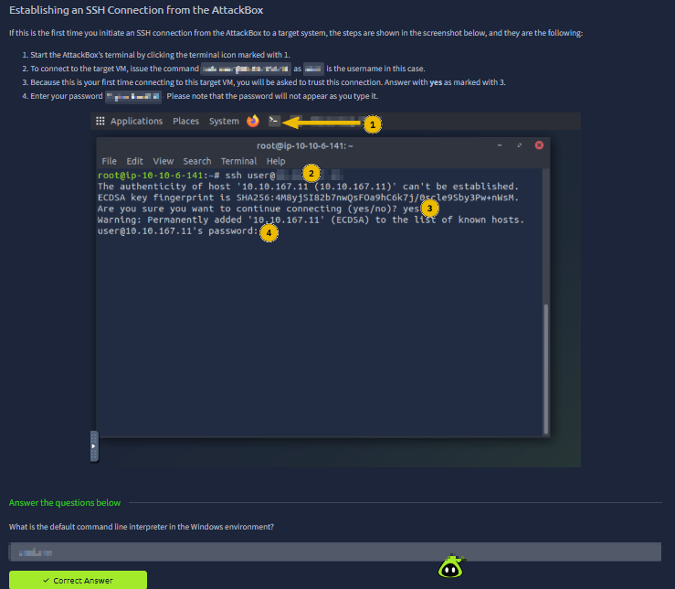

This image documents the exact first connection flow: open terminal, issue SSH command, confirm host fingerprint, then authenticate with password. The numbered callouts show a realistic first-time trust prompt (`yes/no`) and the credential entry stage, which is critical for beginners who often confuse host-key confirmation with password failure. Operationally, this builds the habit of validating remote host identity before trusting the session.

## 3) Core system discovery commands

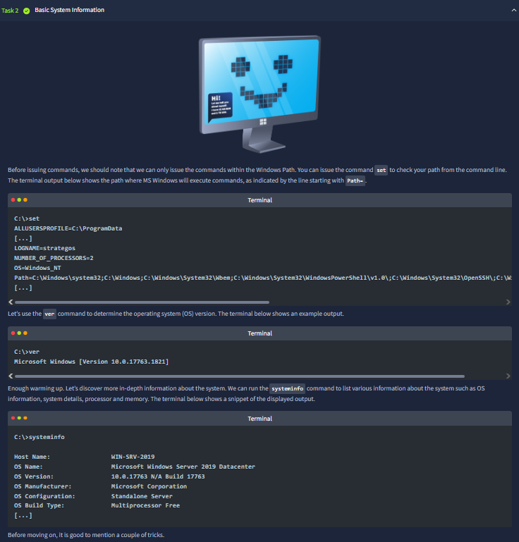

The screenshot chains three foundational Windows commands in the right order: `set` (environment and PATH visibility), `ver` (OS version), and `systeminfo` (full host profile). The room intentionally teaches command execution context first (PATH awareness), then gradually increases output depth. This is important in real troubleshooting because command behavior depends on environment variables and shell resolution order.

## 4) Output handling and quick host fingerprinting

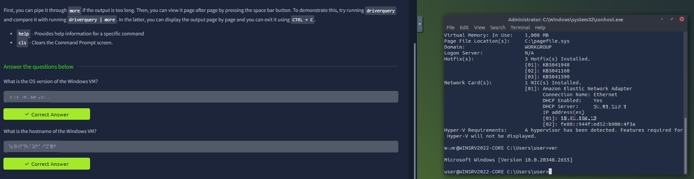

Here the room transitions from command execution to output control. It introduces paging with `more` for long results (e.g., driver inventory), then highlights convenience commands like `help` and `cls` for navigation hygiene. On the right side, we can see command-line evidence of host-level details (patch/hotfix blocks, network card lines, domain/workgroup context), showing how CLI produces an audit-friendly snapshot without GUI dependencies.

## 5) Network baseline with `ipconfig`

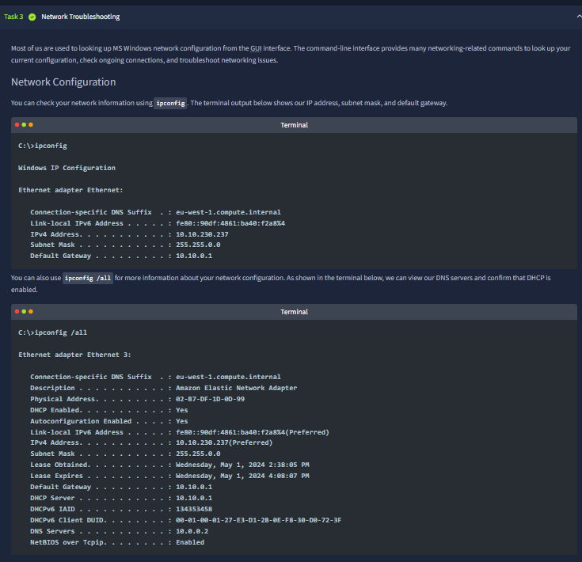

This section focuses on local interface truth: IPv4/IPv6, subnet mask, and default gateway from `ipconfig`, then richer adapter metadata from `ipconfig /all` (DNS, DHCP status, MAC/physical address, lease data). The screen demonstrates why `ipconfig` is usually first stop in incident triage: it immediately confirms whether addressing and gateway assumptions are valid before deeper packet-level debugging.

## 6) Connectivity path testing (`ping` + `tracert`)

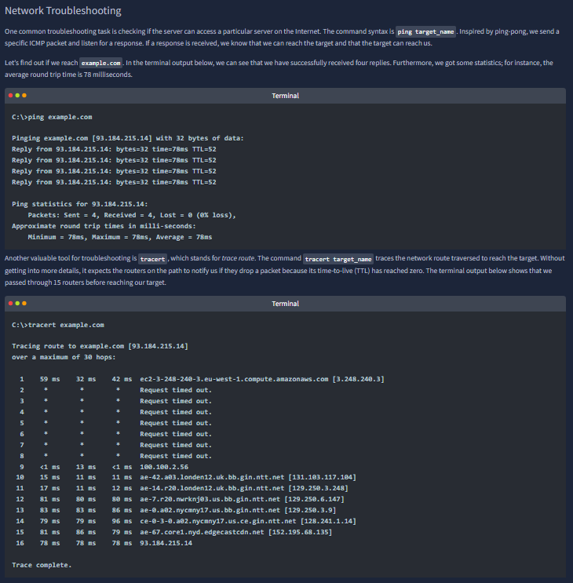

The screenshot pairs latency/reachability (`ping`) with route-level visibility (`tracert`). It also illustrates real-world behavior where many intermediate hops may timeout while final destination still succeeds. That distinction is operationally important: hop timeouts alone do not always indicate outage; they can reflect ICMP filtering or rate limiting in transit.

## 7) DNS and socket-level visibility

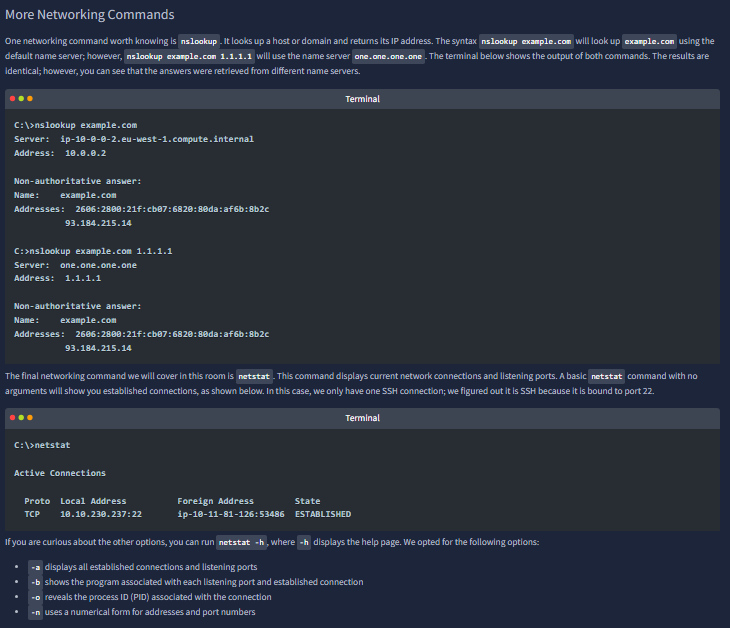

This step introduces two high-value diagnostics: `nslookup` (name resolution through chosen resolver) and `netstat` (active connections/listeners). The dual `nslookup` examples show that changing resolver endpoint can still resolve same domain, reinforcing the idea of distributed DNS infrastructure. Then `netstat` grounds the discussion in process/network reality by exposing open sessions and listening services.

## 8) Advanced `netstat` correlation (service ↔ port ↔ PID)

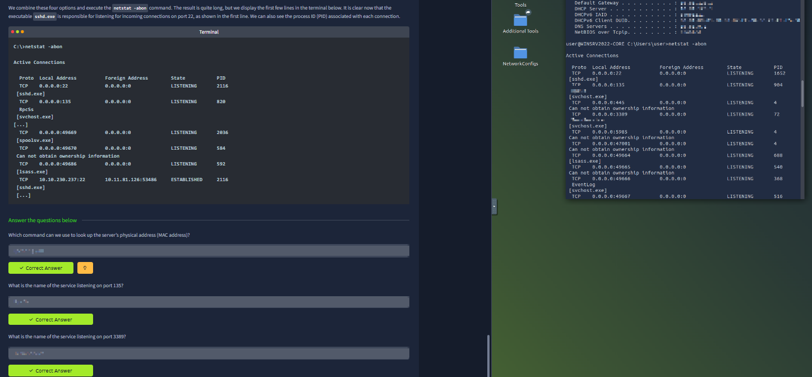

Using `netstat -abon`, the room connects each listening/established socket to executable name and PID, which is key for host investigation workflows. The image directly ties service processes to known ports (including remote access-related entries) and demonstrates why command-line process-port mapping is a practical security capability: it helps detect unexpected exposure and identify which binary owns a suspicious listener.

## 9) Directory navigation fundamentals

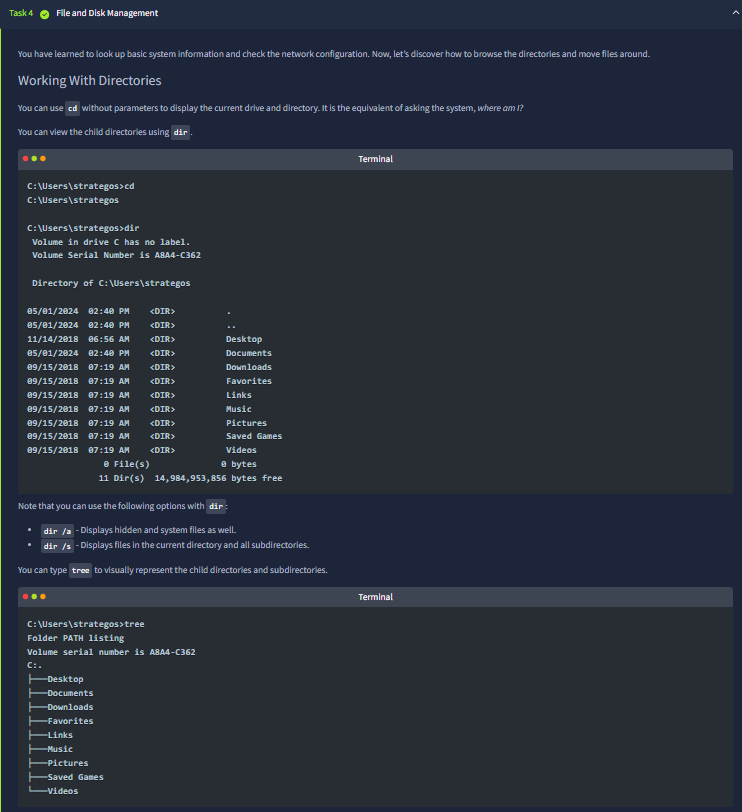

This screenshot covers basic file-system orientation: `cd`, `dir`, and `tree`, including useful switches for hidden/system files and recursive listing. It teaches both flat listing and hierarchical view, which is critical when quickly understanding unknown server directory structures. The sequence is intentionally beginner-friendly but maps directly to real admin tasks.

## 10) Moving through paths and directory lifecycle

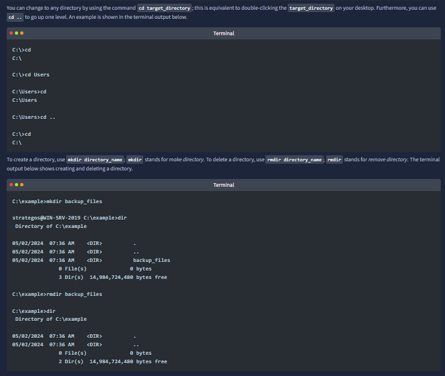

Here we see path transitions (`cd target`, `cd ..`) plus directory creation/removal (`mkdir`, `rmdir`) with before/after verification via `dir`. The screenshot stresses command predictability and reversibility: create, verify, remove, verify again. This discipline is useful for controlled operations and avoids accidental changes in the wrong working directory.

## 11) File operations: read/copy/move

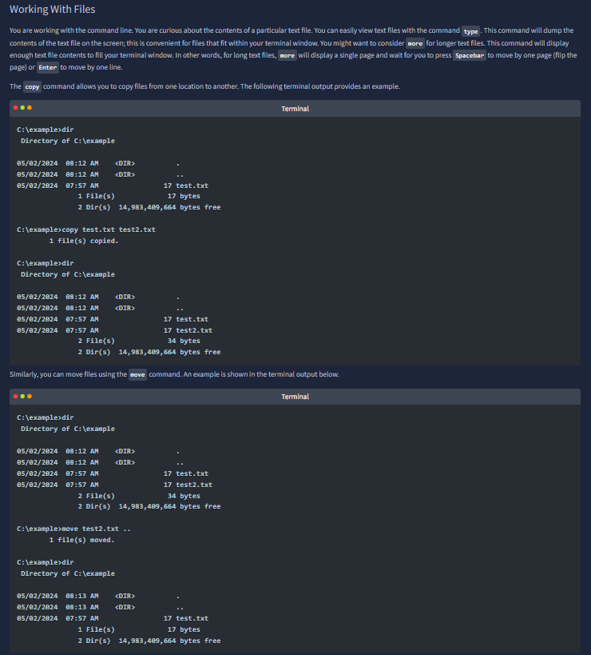

This image introduces file-level manipulation: reading text output, duplicating files with `copy`, and relocating files with `move`. The terminal snippets clearly show state change across listings (file counts and names before/after operations). The room’s progression helps learners distinguish between data duplication and data relocation, which matters during evidence preservation and scripted maintenance work.

## 12) File deletion and wildcard mindset

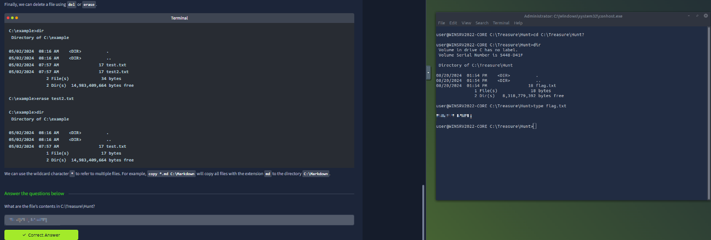

The section expands file handling to deletion (`del`/`erase`) and wildcard-based targeting. The right pane validates the practical step with live terminal output from a target directory, where file discovery and `type`-based content retrieval complete the task. Conceptually, this is about precision: selecting the right files and confirming results instead of issuing broad destructive commands blindly.

## 13) Task/process management from CLI

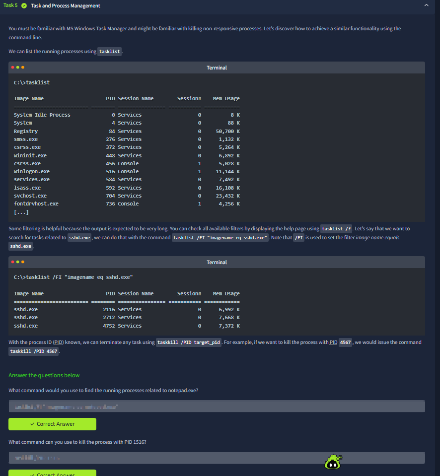

This screenshot maps GUI Task Manager concepts to terminal commands: `tasklist` for inventory, filtered queries (`/FI`) for narrowing by image name, and `taskkill /PID` for termination. The important operational point is that process control can be both enumerative and surgical—first identify exact process identity, then terminate by PID to avoid collateral impact.

## 14) Room wrap-up and command consolidation

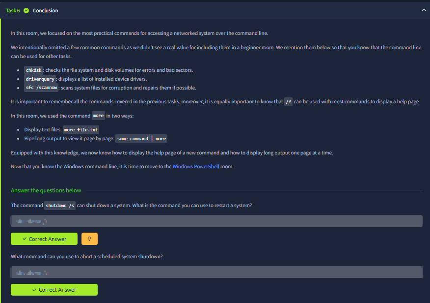

The final panel summarizes practical command families and reinforces help discovery (`/?`) as a universal fallback. It also revisits long-output handling with `more`, making output navigation part of daily CLI hygiene. The conclusion positions this room as a foundation for transitioning into PowerShell and more advanced Windows automation/security workflows.

## Key Takeaways

- Windows CLI is not just an alternative UI; it is a low-overhead, automation-ready control surface.
- A reliable troubleshooting chain is visible across screenshots: host info → network state → resolution/path tests → socket/process mapping.
- File and directory commands become safer when always paired with explicit verification (`dir`, targeted path checks).
- Process/network correlation (`netstat` + PID + executable) is one of the most practical security skills introduced in this module.
