

# Windows PowerShell

Room link: https://tryhackme.com/room/windowspowershell

## 1) Intro and learning goals
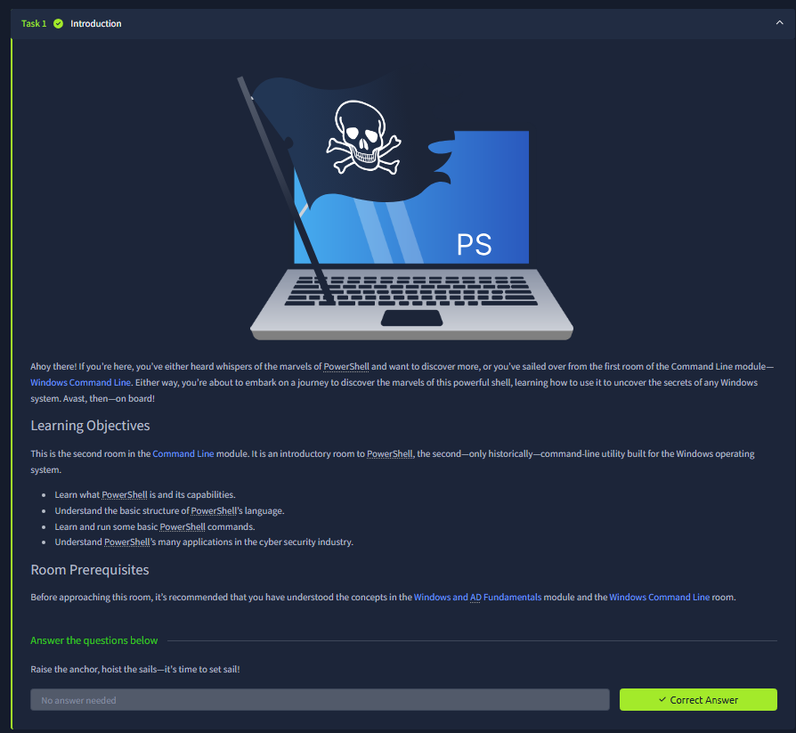
The first screen frames PowerShell as the next step after classic Windows CLI, not a replacement without context. It highlights why this module matters for security workflows: automation, repeatability, and remote operations. The learning objectives are explicit: understand PowerShell basics, cmdlet syntax, practical commands, and security use cases. This is important because later defensive and incident-response tasks assume you can quickly gather host/network data without depending on GUI tools.

## 2) What PowerShell is at architecture level
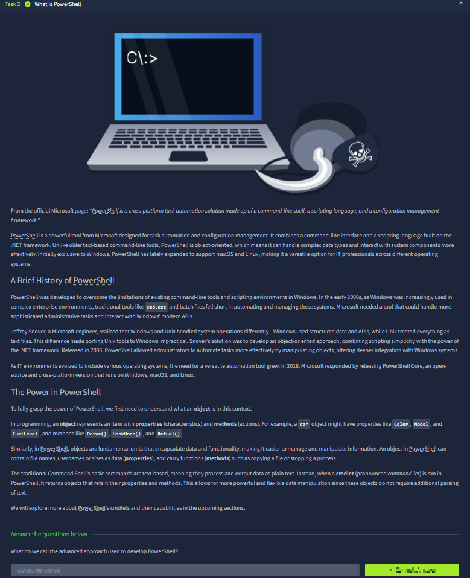
This panel explains PowerShell as a combination of shell + scripting language + configuration management layer over .NET. The key conceptual jump is object-oriented output: unlike plain text shells, PowerShell passes structured objects through the pipeline. The historical note (from Windows-only to cross-platform PowerShell Core) also shows why it is widely used in modern mixed environments.

## 3) Initial lab access and remmina/SSH workflow
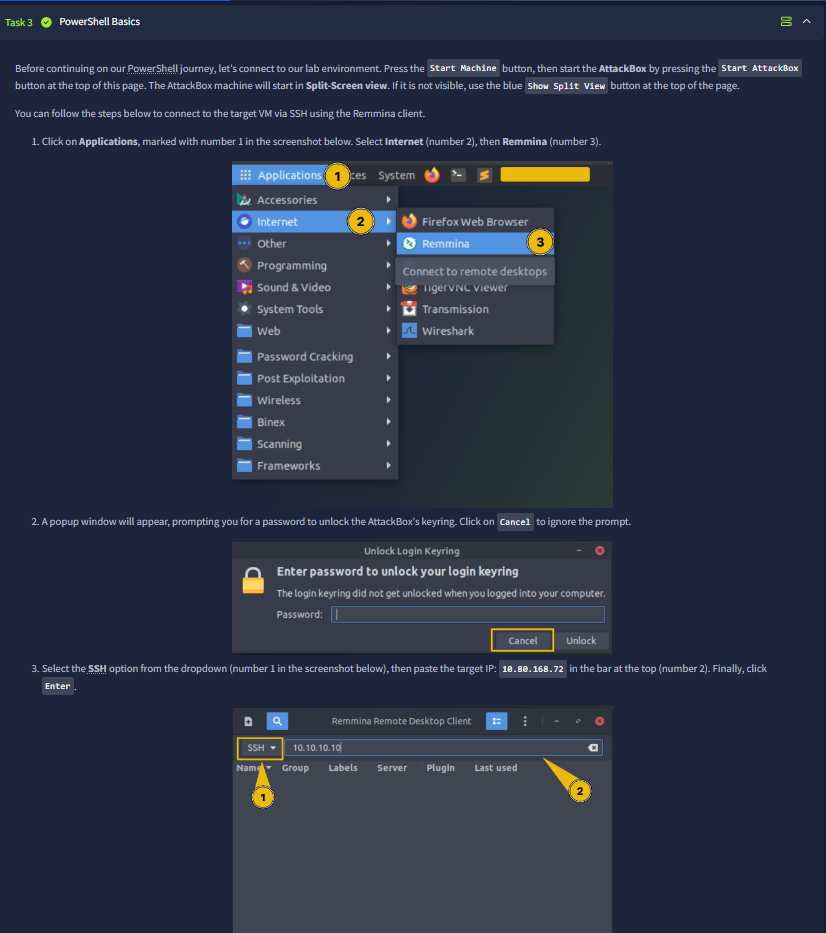
The screenshot documents the practical connection path from AttackBox UI menus into Remmina and then SSH target setup. This reinforces an operational habit: before writing commands, ensure access path is stable and reproducible. In real operations, that prevents confusion between tooling errors and command errors.

## 4) Launching PowerShell + Verb-Noun syntax
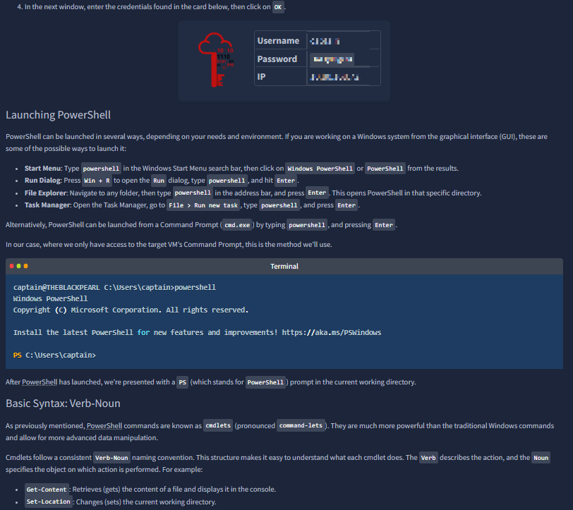
This image combines three essentials: authentication into target VM, starting PowerShell from cmd, and reading the `PS` prompt context. It then introduces the Verb-Noun command design (`Get-Content`, `Set-Location`), which is critical for discoverability. Once you learn the pattern, guessing and searching commands becomes much easier during investigations.

## 5) Discovering available commands with Get-Command
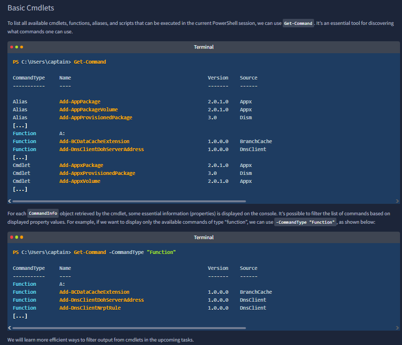
The room shows `Get-Command` for broad command inventory and `-CommandType` filtering to narrow scope (e.g., functions only). This is a high-value pattern for fast reconnaissance in unfamiliar systems. Instead of memorizing everything, you query what exists in the current environment and then pivot based on returned metadata.

## 6) Reading official command docs with Get-Help
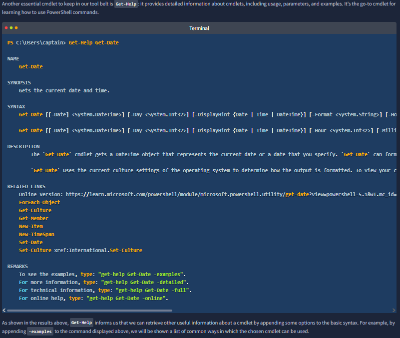
This screen demonstrates `Get-Help` against `Get-Date`, including syntax, description, related links, and usage variants (`-examples`, `-detailed`, `-full`, `-online`). The practical lesson is that command documentation is built into the shell. During incidents, this reduces context switching and helps avoid risky command misuse.

## 7) Aliases and module discovery
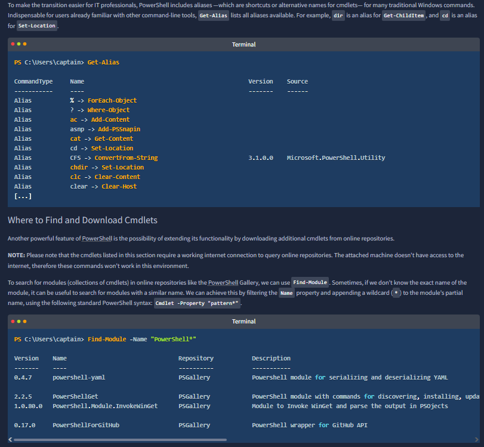
The panel maps legacy command habits into PowerShell aliases (`dir`, `cd`, `cat`) and then moves into module discovery with `Find-Module`. It also stresses prerequisite conditions (internet access) for repository queries. This is realistic: enterprise environments may restrict outbound connectivity, so you need fallback methods when gallery operations are blocked.

## 8) Installing modules and applied Q&A checks
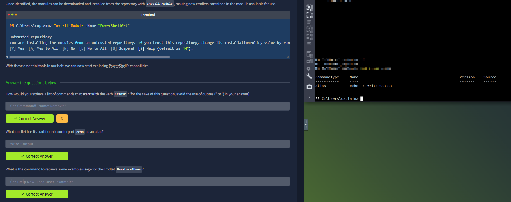
Here we see `Install-Module` and trust prompts for untrusted repositories, which is a real security decision point. The right side shows local verification/quiz context where command understanding is applied. The screenshot emphasizes that PowerShell extensibility is powerful but introduces supply-chain trust considerations.

## 9) File system navigation with Get-ChildItem / Set-Location
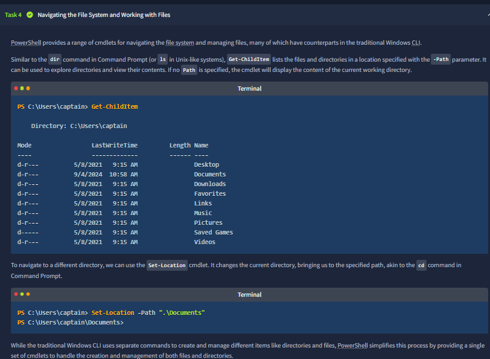
This section mirrors `dir`/`ls` behavior using `Get-ChildItem`, then changes directories with `Set-Location`. The key point is parity plus consistency: PowerShell provides richer object-aware output while keeping navigation intuitive. For analysts, this means faster pivoting through host artifacts.

## 10) Creating/removing/moving items with unified cmdlets
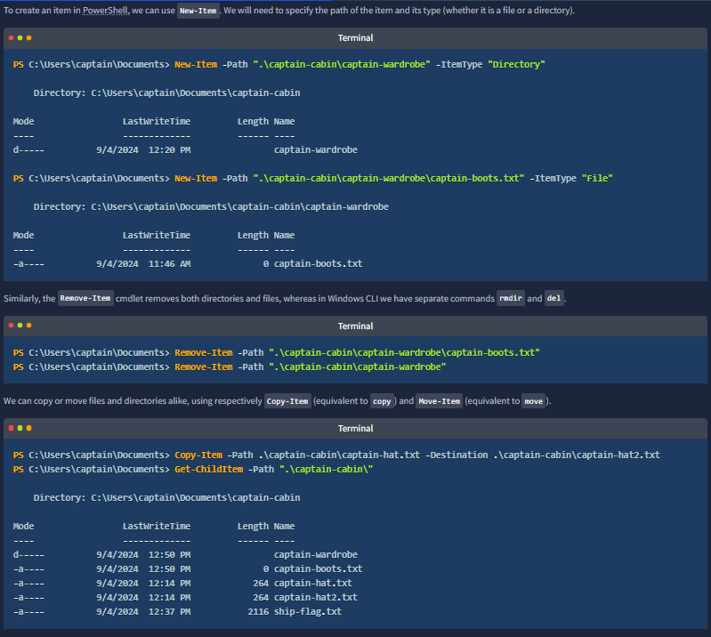
`New-Item`, `Remove-Item`, `Copy-Item`, and `Move-Item` are shown in one coherent workflow. Unlike split legacy commands, PowerShell standardizes file and directory handling under consistent patterns. This reduces operational mistakes and makes scripts easier to review and maintain.

## 11) Reading file contents and practical treasure checks
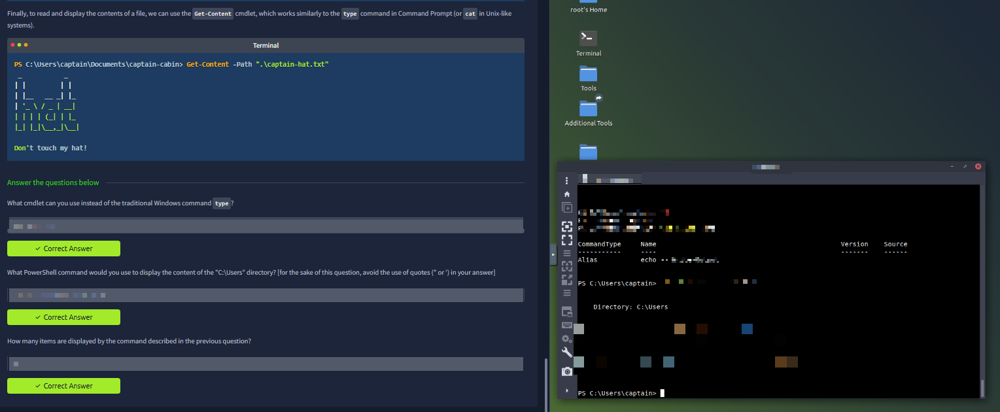
`Get-Content` is used as the direct equivalent of `type/cat`, followed by exercise-driven retrieval tasks. The right pane visually confirms practical command execution and resulting output in shell context. This links theory to hands-on validation, which is essential before automation.

## 12) Pipeline fundamentals: sorting object output
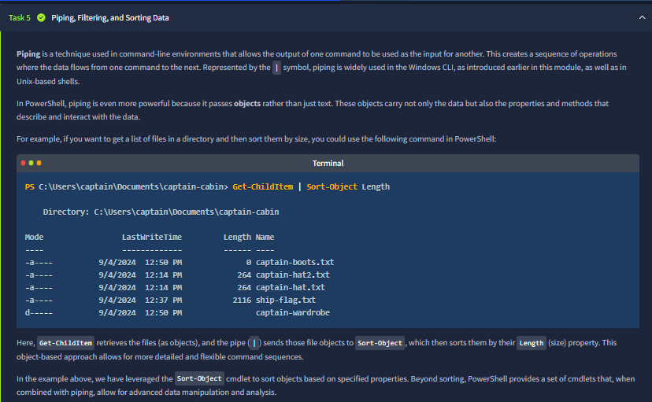
This screenshot introduces pipeline semantics where object streams from `Get-ChildItem` are sorted with `Sort-Object Length`. The core lesson is that PowerShell pipelines manipulate typed data, not just strings. That enables cleaner data operations and less parsing overhead.

## 13) Filtering and comparison operators
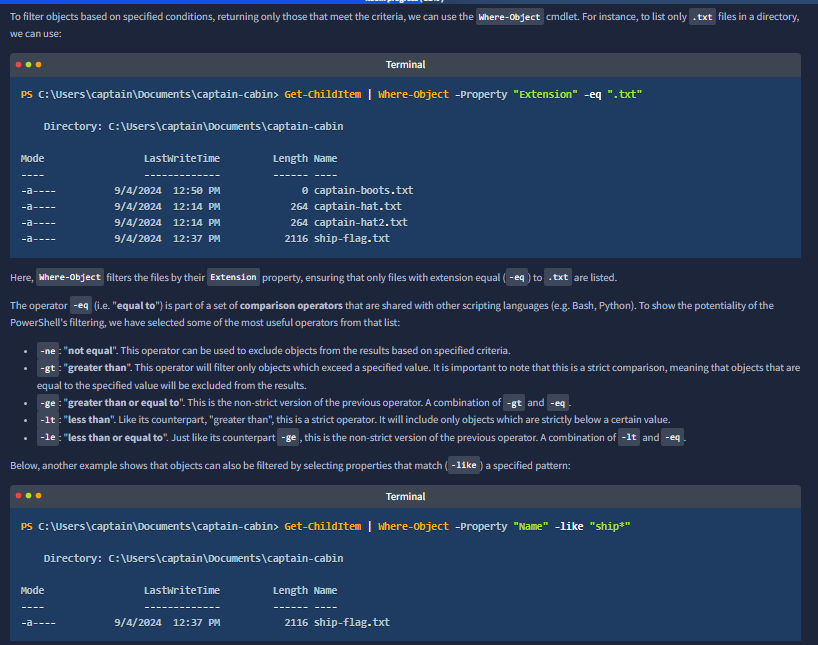
`Where-Object` examples show extension-based and wildcard-name filtering, then explain operators like `-eq`, `-gt`, `-ge`, `-lt`, `-le`, `-ne`. This is the foundation for triage filtering: quickly isolating suspicious files, sizes, or names without manual scrolling.

## 14) Selecting properties and text pattern search
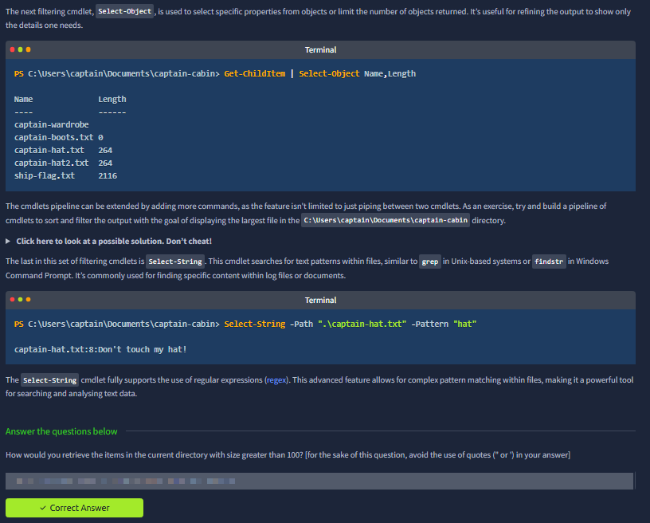
`Select-Object` trims output to needed fields, while `Select-String` performs content search with regex capability. Together they create an investigation pattern: reduce noise first, then search targeted evidence. This is especially useful in large log/file contexts.

## 15) System identity and local account intelligence
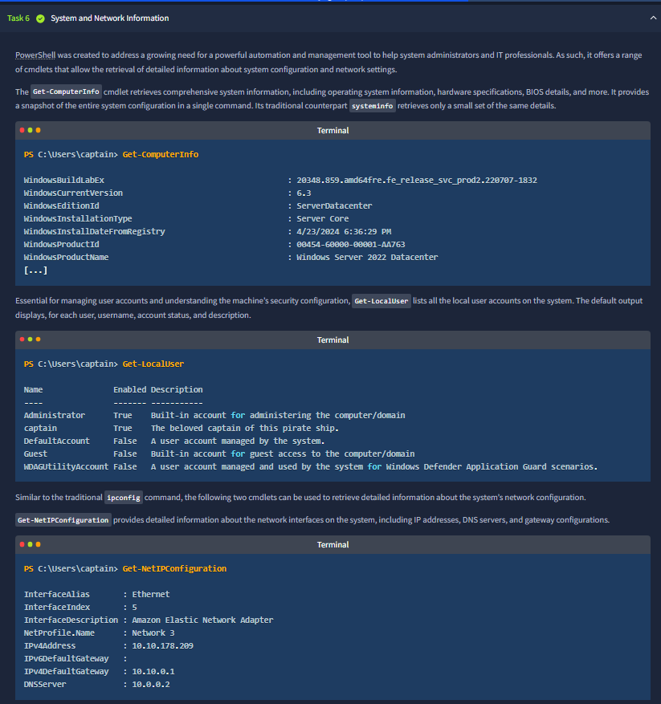
`Get-ComputerInfo` and `Get-LocalUser` provide fast host profile and user-account inventory, then `Get-NetIPConfiguration` adds interface-level network context. The module shows why these commands are often first responders in host triage: they establish baseline system identity and account posture quickly.

## 16) Detailed IP inventory across interfaces
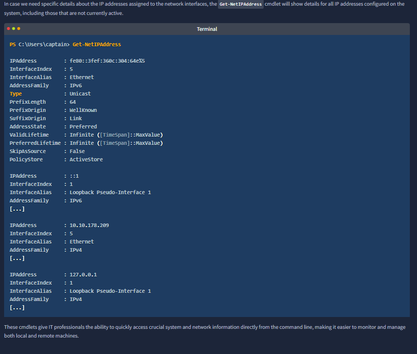
`Get-NetIPAddress` output includes loopback, IPv4, IPv6, state/origin metadata, and interface binding. The practical value is completeness: you can detect inactive or secondary addresses that might be missed in simpler views.

## 17) Applied hunting challenge from users/services clues
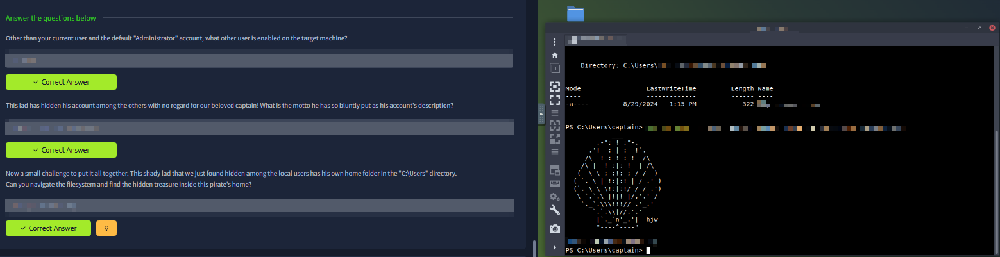
The screenshot combines question prompts with terminal evidence to locate hidden user context and descriptive motto clues. This simulates a common analyst workflow: correlate account metadata with filesystem artifacts until you identify the target object.

## 18) Real-time analysis: processes and services
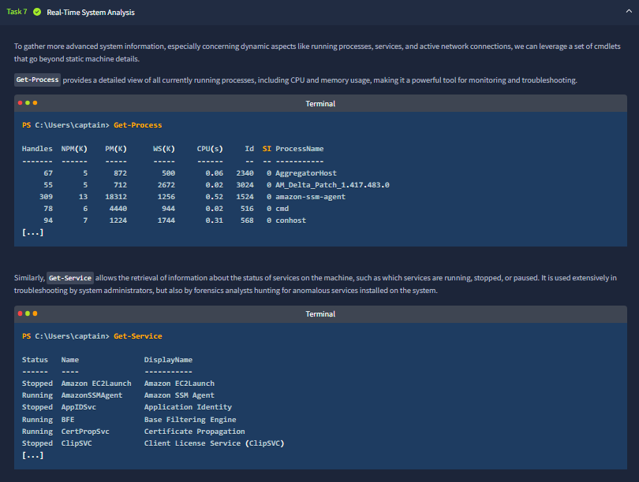
`Get-Process` and `Get-Service` provide dynamic runtime visibility (resource use, status, service state). This marks a shift from static enumeration to operational monitoring, important for spotting anomalies during active incidents.

## 19) Network sessions + integrity hashing
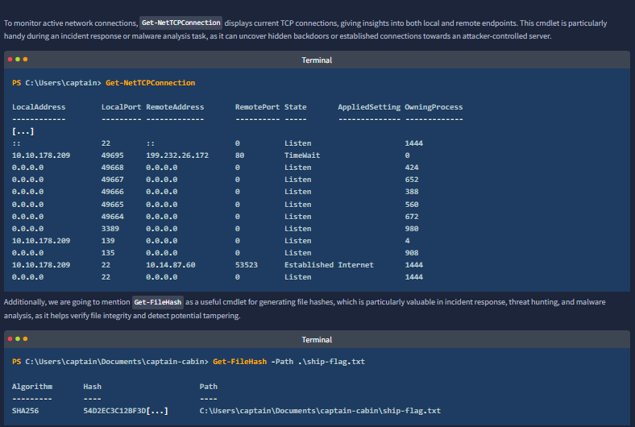
`Get-NetTCPConnection` is used for connection-level situational awareness, while `Get-FileHash` adds integrity verification. These two together are strong IR primitives: identify suspicious network behavior and validate whether critical files were altered.

## 20) Alternate Data Streams (ADS) inspection and challenge closure
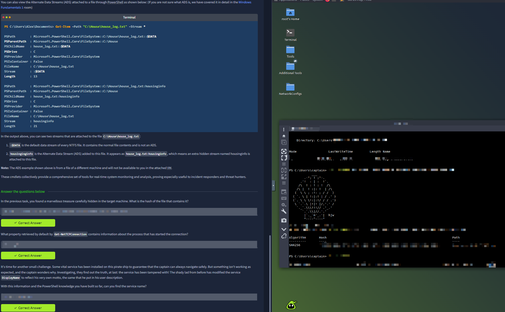
This section demonstrates `Get-Item -Stream *` to enumerate NTFS alternate streams beyond `:$DATA`. The panel then chains prior concepts into challenge completion: hash validation, process-owner fields, and service tampering indicators. It’s a solid example of multi-cmdlet reasoning rather than one-command answers.

## 21) Scripting and remote execution with Invoke-Command
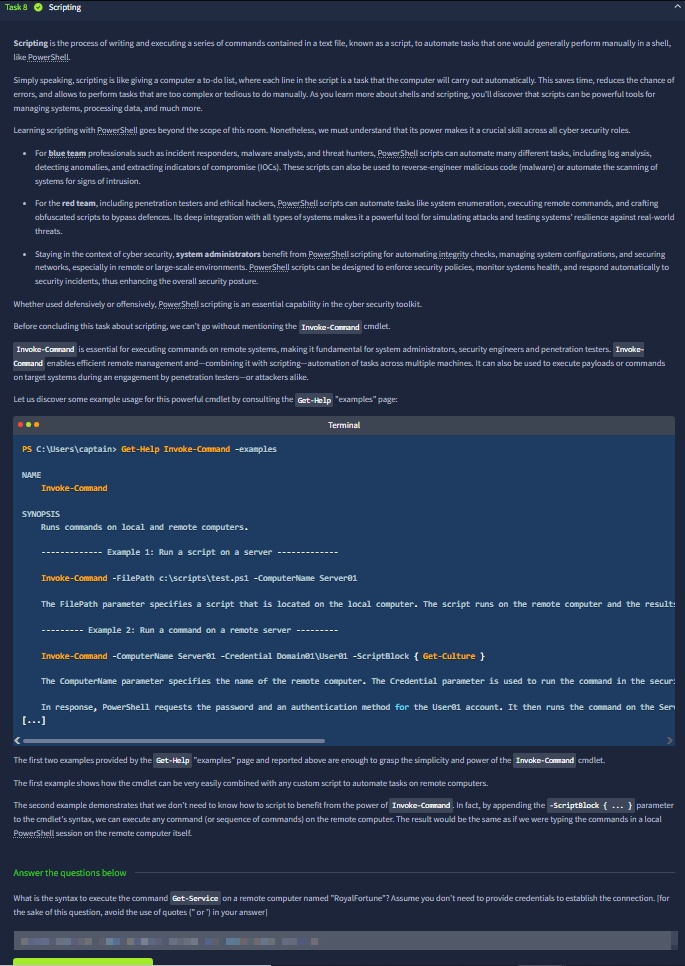
The conclusion introduces scripting as automation at scale and focuses on `Invoke-Command` for local/remote execution, including `-ScriptBlock` patterns. The security relevance is clear: blue teams use it for fleet checks and response automation; red teams may use similar primitives for remote execution paths. Mastering this command closes the gap between manual shell usage and operational automation.

## Key Takeaways
- PowerShell’s object pipeline is the biggest functional advantage over text-only CLI workflows.
- Discovery-first habits (`Get-Command`, `Get-Help`) reduce errors and speed up unfamiliar-task execution.
- File/network/process/account cmdlets form a complete baseline triage toolkit on Windows.
- Filtering/selecting/searching (`Where-Object`, `Select-Object`, `Select-String`) turns large outputs into actionable evidence.
- `Invoke-Command` and scripting are the bridge from one-off commands to repeatable security operations.
