

# Linux Shells

Room link: https://tryhackme.com/room/linuxshells

## 1) Linux shells vs GUI mindset
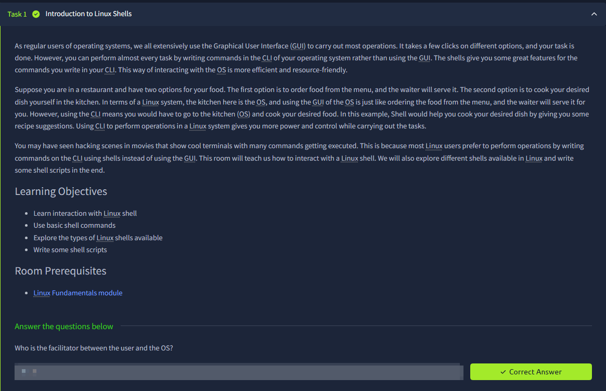
The opening task clearly contrasts GUI-driven usage with CLI-driven control and explains the shell as the main facilitator between the user and the operating system. The restaurant analogy in the screenshot is important: GUI is like ordering from a menu, while shell usage is like going into the kitchen and directly controlling how work is done. The room objectives also set the practical path for the module—basic shell interaction, core commands, shell types, and script writing—so this screen establishes both conceptual context and the execution roadmap.

## 2) Session setup and prompt orientation
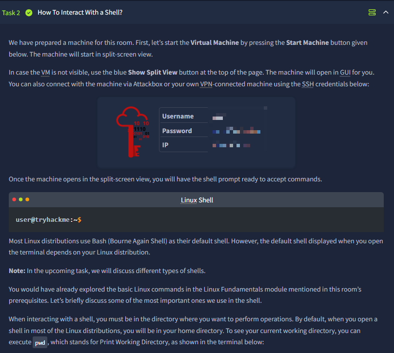
This step focuses on operational access: starting the VM, using split view, and connecting either with AttackBox or over SSH credentials. The screenshot also introduces the shell prompt format (`user@host:~$`), which is essential because prompt context tells us who we are, where we are, and privilege level expectations before running commands. It additionally highlights Bash as the common default shell and transitions into practical command flow, making this a bridge from setup into hands-on command work.

## 3) Core navigation and text utilities in action
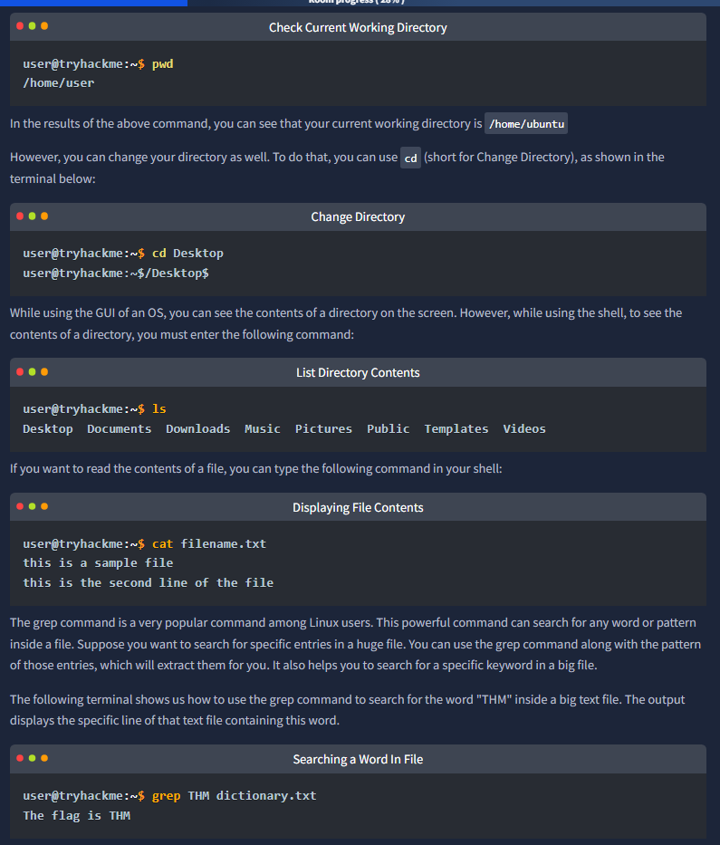
This panel chains foundational commands in a logical sequence: `pwd` for current location, `cd` for movement, `ls` for directory visibility, `cat` for file content, and `grep` for targeted text search. What makes this screenshot valuable is how it demonstrates command purpose through immediate terminal output rather than abstract definitions. It teaches that Linux usage is not one command at a time in isolation; real workflows combine navigation, inspection, and filtering together to solve tasks efficiently.

## 4) Knowledge-check confirmation for shell basics
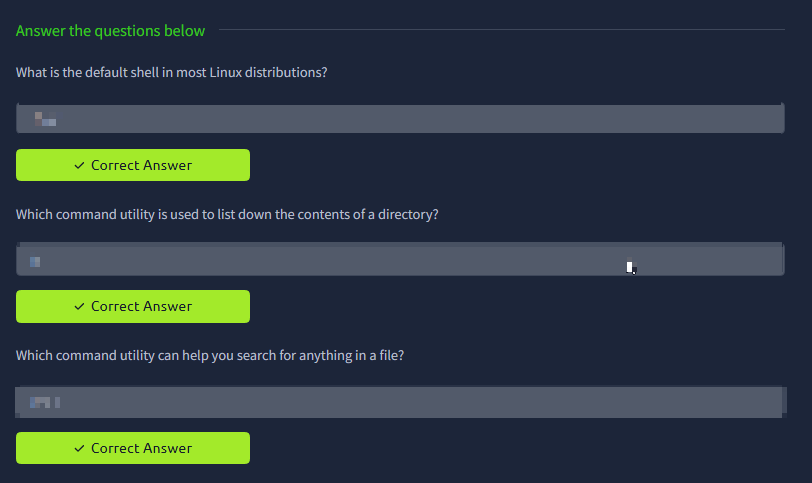
The quiz block validates the high-priority essentials from the previous screenshot: default shell expectations, directory listing utility, and file content search behavior. Even though answers are hidden, the question set itself confirms which concepts TryHackMe treats as core competency for this task. This screen therefore acts as a competency checkpoint, ensuring command recognition and practical recall before moving into advanced shell topics.

## 5) Detecting and switching shell environments
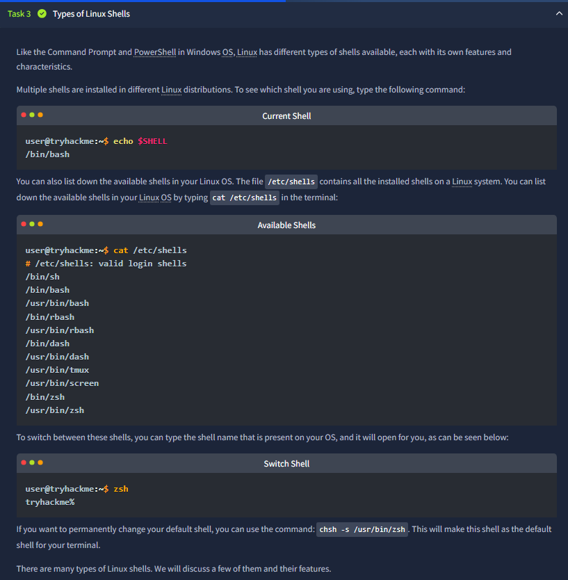
This task introduces shell identity and availability management using `echo $SHELL` and `/etc/shells`, then demonstrates runtime shell switching (`zsh`) and persistent default-shell change (`chsh`). The screenshot is useful because it separates three different concerns: identifying current interpreter, enumerating installed interpreters, and changing execution context. That distinction matters in security work because tooling behavior, scripting syntax, and prompt capabilities can vary by shell.

## 6) Bash, Fish, and Zsh feature deep dive
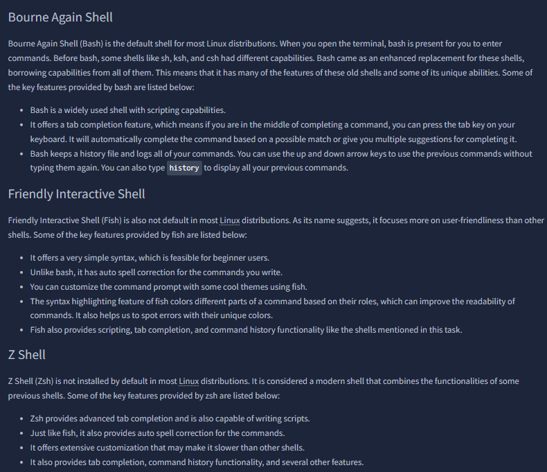
Here the room compares shell families through practical dimensions: scripting strength, auto-completion behavior, command history ergonomics, syntax highlighting, and usability features. Bash is framed as default and broadly compatible, Fish as beginner-friendly and correction-heavy, and Zsh as highly customizable with advanced completion. This screenshot is a strong architecture-level comparison because it teaches trade-offs rather than just listing names.

## 7) Structured feature comparison table
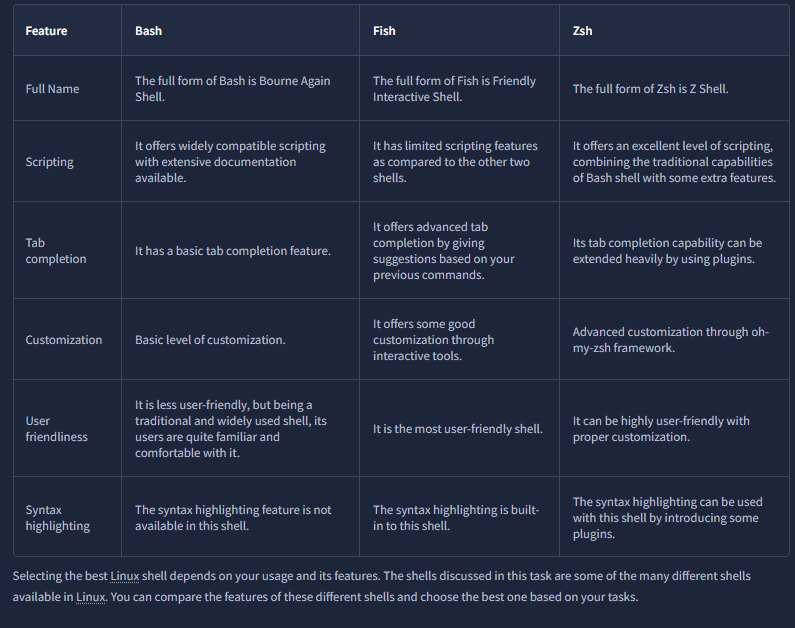
The tabular view consolidates the prior narrative into a decision matrix across full name, scripting depth, tab completion model, customization capacity, user friendliness, and syntax highlighting. This format helps convert descriptive content into operational selection criteria: choose shell based on workload, not popularity. The screenshot also reinforces that shell choice is a productivity and reliability decision in day-to-day command-line operations.

## 8) Validation checkpoint for shell-type differences
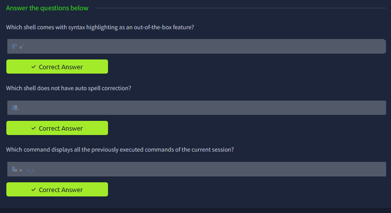
This question block checks whether the learner can map shell characteristics to specific tools (highlighting support, spell-correction behavior, history command purpose). That confirms the room expects not only recognition of commands, but also recognition of shell-specific usability features. The screenshot closes the shell-type segment by ensuring comparative understanding before scripting begins.

## 9) Shell scripting foundations: file + shebang + variables
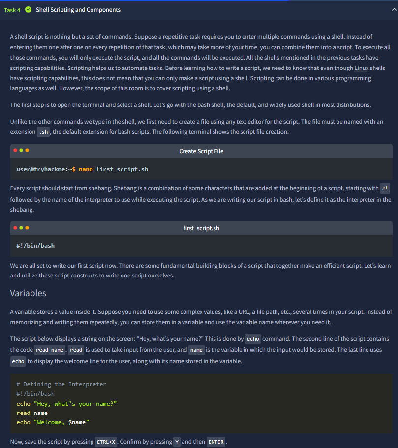
The script section introduces `.sh` creation, interpreter declaration with shebang, and input/output variable usage (`read`, `echo`, variable expansion). This screenshot is especially important because it moves from command consumption to command authoring—turning repeated manual operations into reusable automation. The textual walkthrough and code block together show how shell scripts encode interaction logic in a minimal but extensible structure.

## 10) Execution permissions and loop mechanics
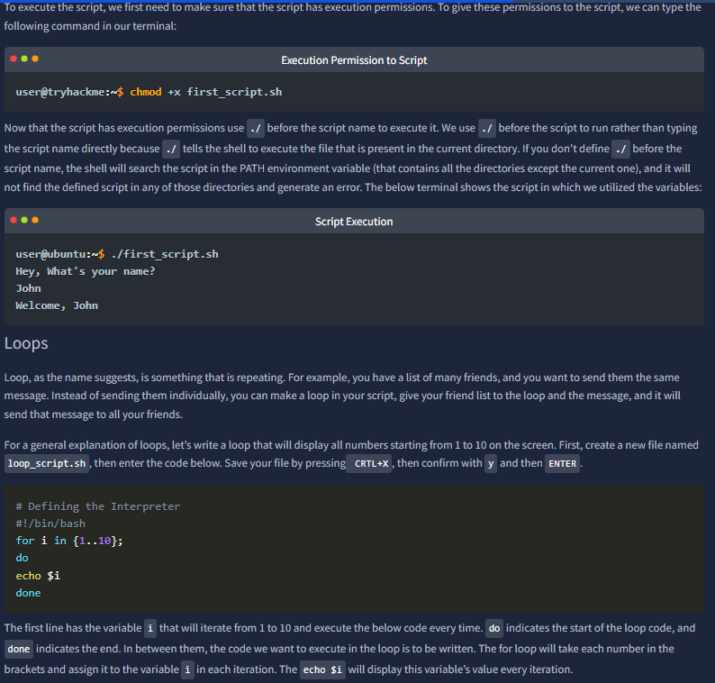
This part explains why script files require execute permission (`chmod +x`) and why `./script.sh` is used for current-directory execution instead of relying on `PATH`. It then transitions into loop syntax with a concrete `for` example and variable iteration behavior. The screenshot is strong because it ties environment semantics (permission/path) directly to control-flow constructs (loops), both required for reliable script operation.

## 11) Conditional logic and authorization pattern
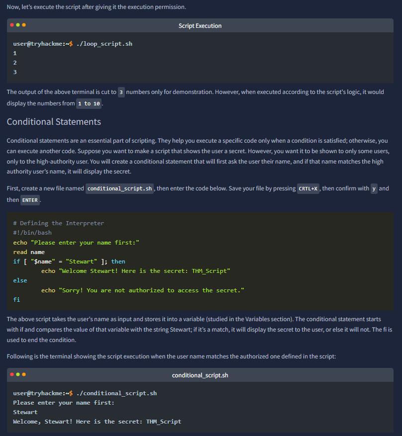
The room demonstrates if/else control with user input checking against an expected identity, then conditionally discloses or denies a secret string. The script execution output proves both the prompt-handling flow and the branch behavior. This is a practical security-adjacent pattern: validate input, compare expected values, and gate sensitive output based on policy conditions.

## 12) Failure-path execution + script commenting discipline
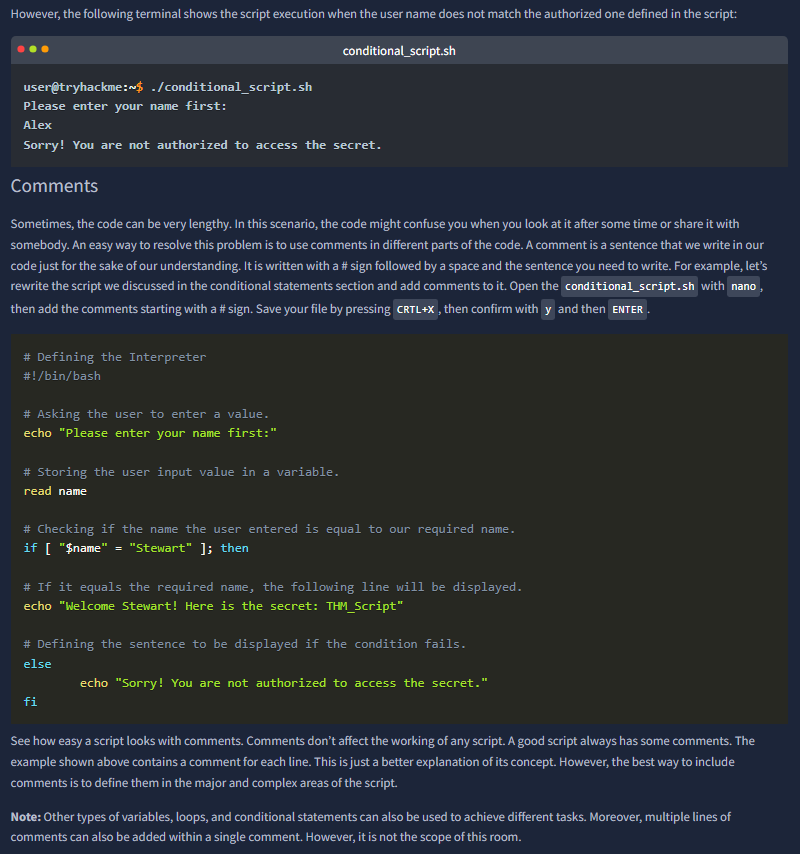
The top terminal output confirms the negative branch behavior when supplied identity does not match expectations, and the lower section introduces comments as maintainability infrastructure. The key takeaway is that readable scripts are safer scripts: comments preserve intent, reduce future misconfiguration risk, and make logic review easier during troubleshooting or team handoff. The screenshot also clarifies comments do not alter runtime logic.

## 13) Quiz checkpoint for scripting primitives
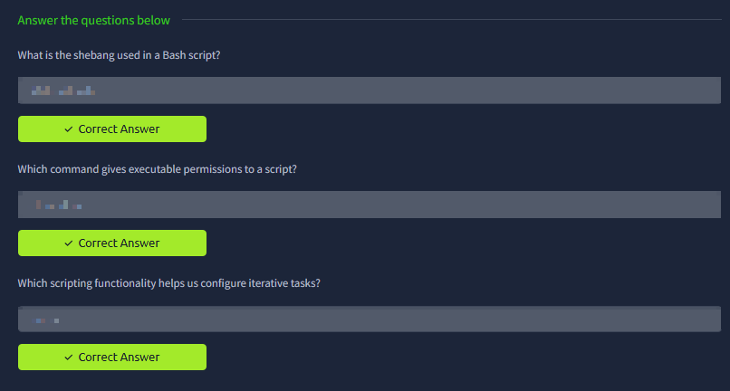
This question set verifies learner control over three central scripting pillars: interpreter declaration (`shebang`), execution enablement (`chmod`), and iterative task automation (`loops`). The checkpoint is aligned with real usage: without these three, script creation is incomplete even if basic commands are known. It acts as a correctness gate before the full practical challenge.

## 14) Locker-script challenge design and logic blueprint
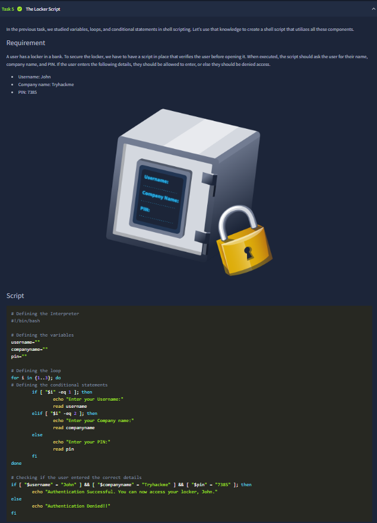
This task defines a multi-field authentication scenario (username, company, PIN), then presents a script that gathers values in sequence using loop-based input prompts and validates them with conditional checks. The visual design and code together show the move from isolated primitives into a composed script workflow. This is effectively the module’s integration test for variables + loops + conditionals.

## 15) Practical execution outcome and denial case
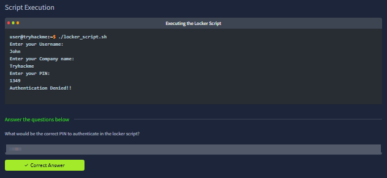
The terminal run demonstrates an authentication failure path after entering credentials, and the accompanying question area confirms the learner must infer and correct the required values. This screenshot emphasizes the operational habit of validating script behavior through real runs rather than assuming code is correct by inspection. It also reinforces debugging by comparing expected vs actual branch output.

## 16) Root-required log search exercise and constrained troubleshooting
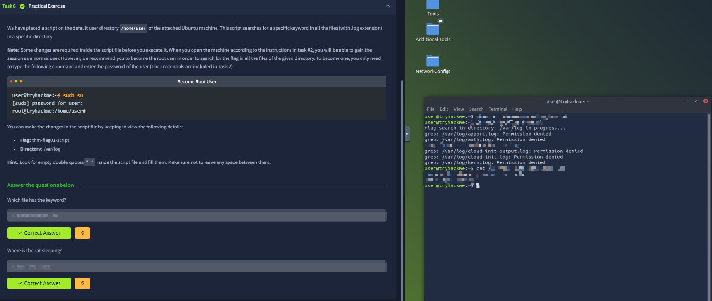
The final practical challenge introduces privilege boundaries (`sudo su`), file-search logic in log directories, and script adjustment using explicit hints (keyword and target directory). The right-side terminal output shows permission-denied conditions and iterative command usage, which models realistic troubleshooting in Linux environments. This closes the room by combining shell operations, permissions, and search logic into a task that resembles actual analyst workflow.
