

# Networking Concepts

Room link: https://tryhackme.com/room/networkingconcepts

## 1) OSI model foundation (7 layers)
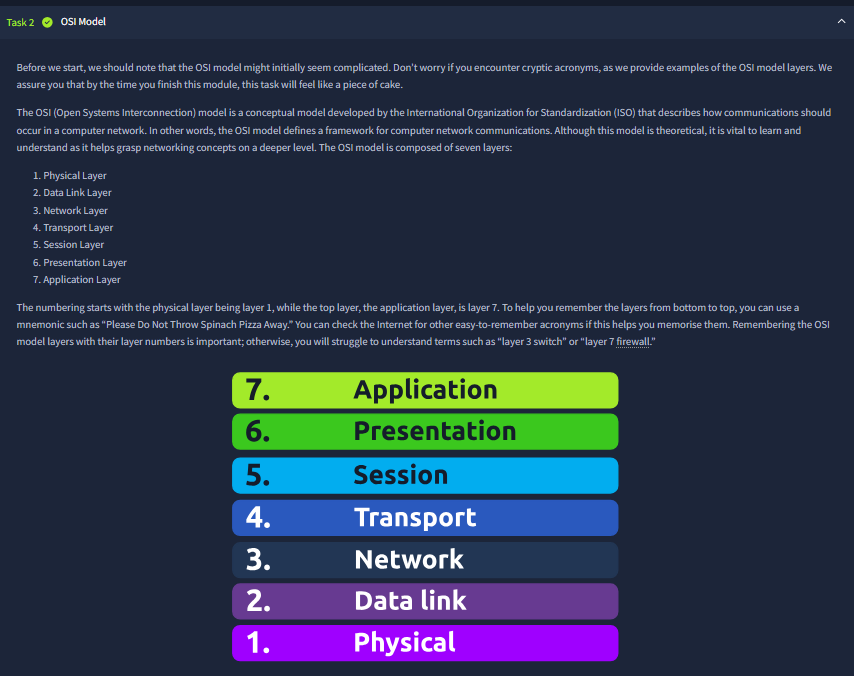
This screenshot introduces the ISO OSI model and lists all seven layers from Physical (1) up to Application (7). The key point shown in the text is that this is a conceptual framework used to understand how communication happens in networks, and why terms like “layer 3 switch” or “layer 7 firewall” make sense only if the layer ordering is clear.

## 2) Layer 1 vs Layer 2 with MAC structure
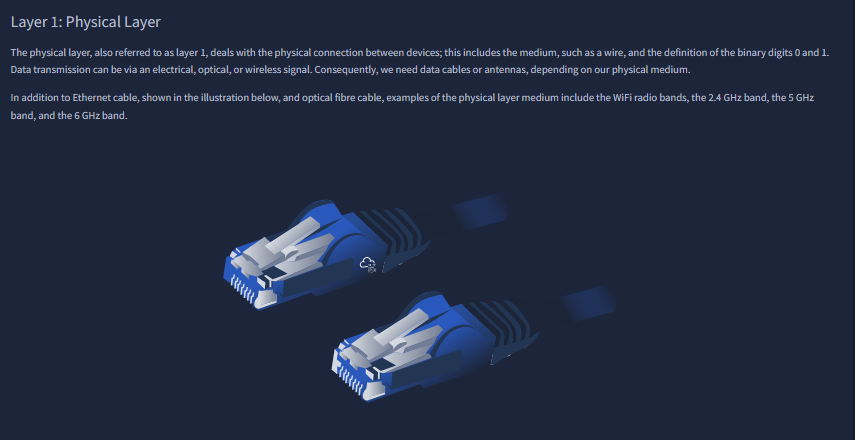
The panel explains Physical Layer as signal/media transport (wired, optical, wireless) and Data Link Layer as local-segment communication rules. The MAC diagram explicitly splits a MAC into vendor/OUI and unique interface part, matching the text that Ethernet/Wi‑Fi addresses are six bytes and represented in hexadecimal.

## 3) Layer 3 to Layer 6 responsibilities
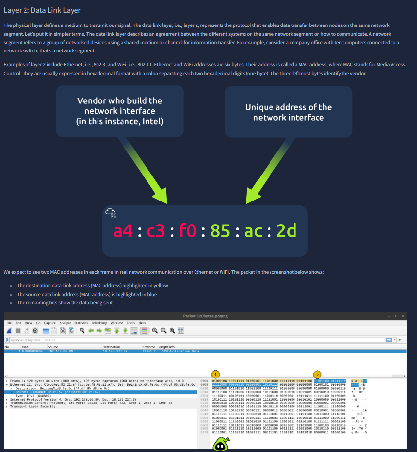
This screenshot covers Network, Transport, Session, and Presentation layers in sequence. The routing diagram supports the layer-3 explanation (path selection across networks), while the lower text maps transport to TCP/UDP, session to communication synchronization, and presentation to encoding/compression/encryption tasks.

## 4) Layer 7 + complete OSI summary table
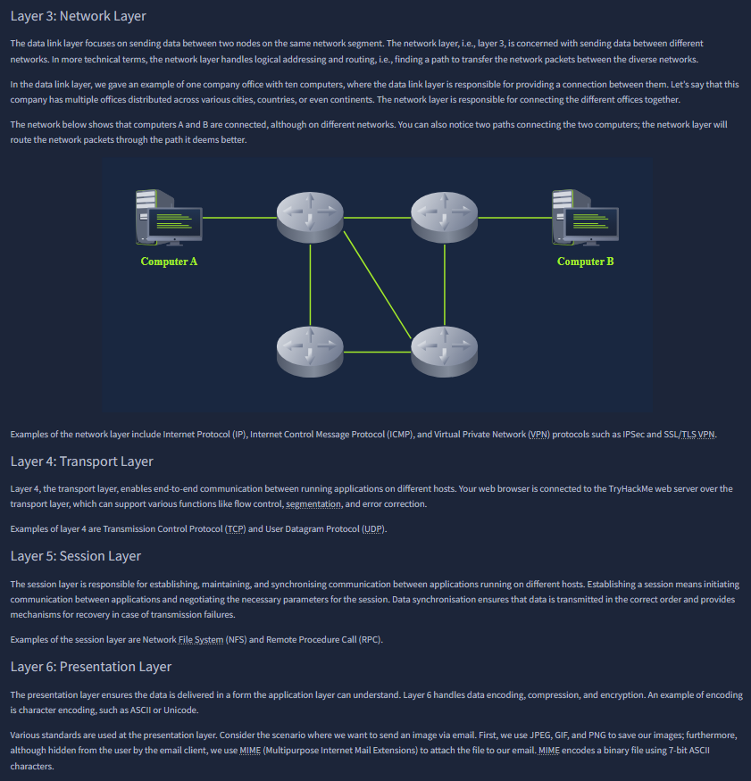
The image focuses on Application Layer protocols (HTTP, FTP, DNS, POP3, SMTP, IMAP) and then consolidates all OSI layers in one summary table with functions and protocol examples. The questions below verify understanding by asking which layer handles routing, end-to-end app communication, encoding, and same-segment transfer.

## 5) TCP/IP model mapping from OSI
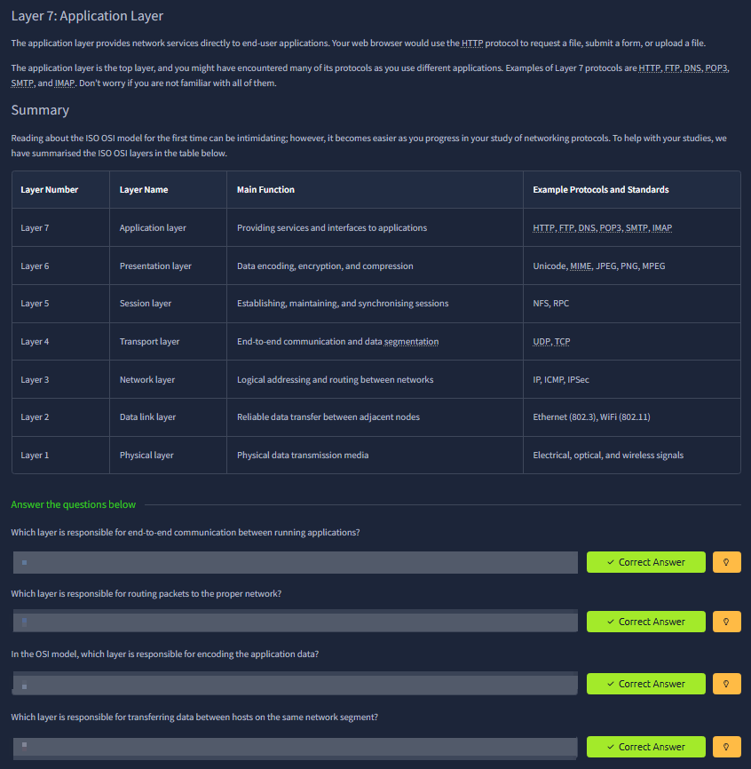
This section shows how the implemented TCP/IP stack groups OSI layers: Application (OSI 5–7), Transport (OSI 4), Internet (OSI 3), and Link (OSI 1–2). The table and notes also mention the five-layer teaching variant (adding Physical explicitly), so the screenshot is about model translation between theory and practice.

## 6) IP addressing basics and host config output
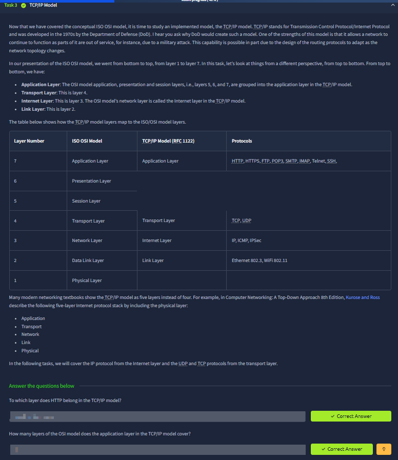
The screenshot explains IPv4 as four octets (32 bits), highlights network/broadcast concepts, and demonstrates `ifconfig` output interpretation (host IP, subnet mask, broadcast). It directly links addressing theory to real terminal evidence.

## 7) CIDR notation and private ranges
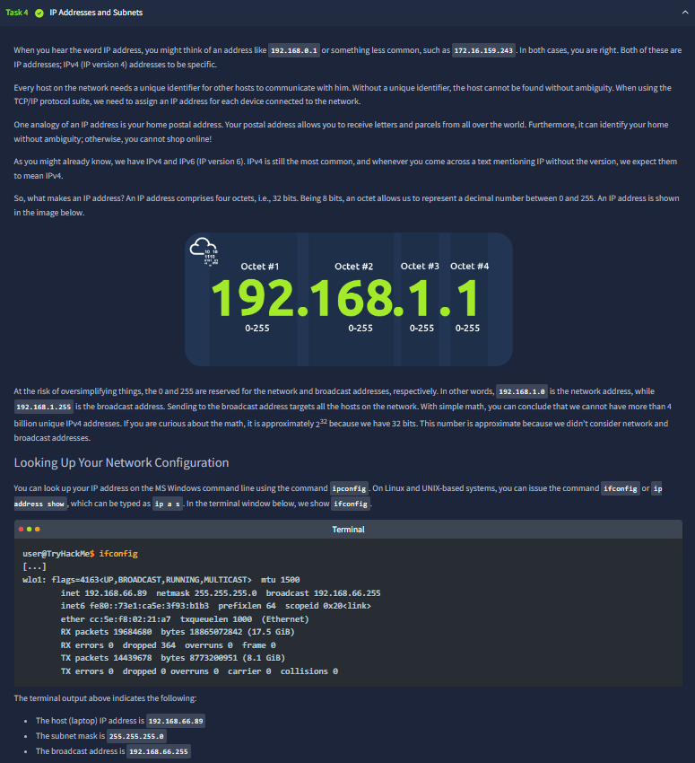
This panel continues with `ip a`, shows CIDR format (`/24`), and explains equivalence with subnet masks (255.255.255.0). It also lists RFC1918 private ranges (10/8, 172.16/12, 192.168/16) and clarifies that private hosts require NAT to reach the public internet.

## 8) Routing concept with multi-hop path selection
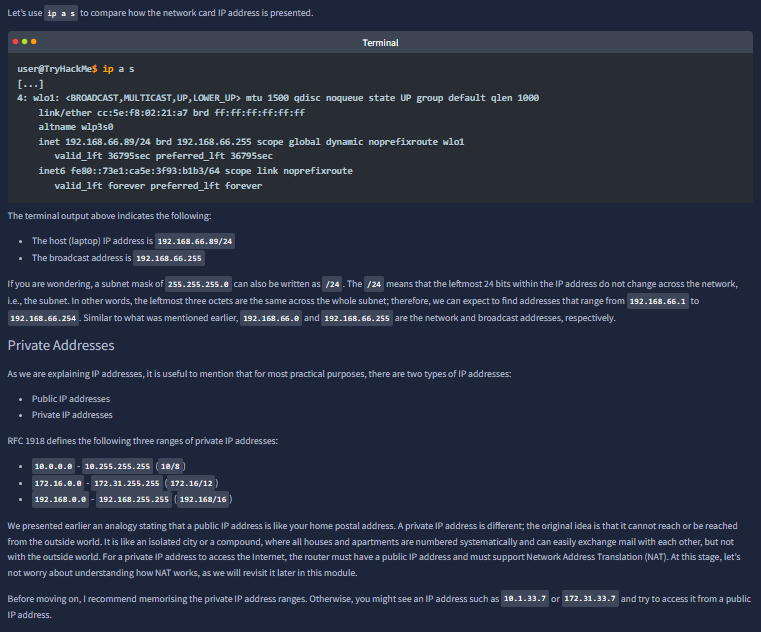
The diagram illustrates several routers connecting office/mobile users to a web server. The accompanying text emphasizes router behavior at Layer 3: inspect destination IP and forward to the best next network path until the packet reaches its destination.

## 9) Address validity and private/public checks
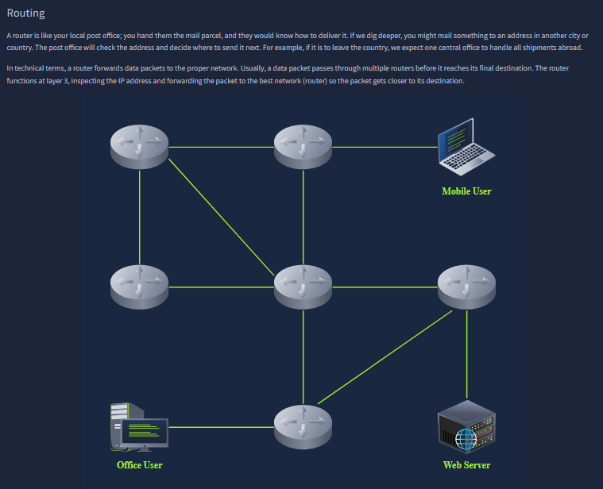
This screenshot is a pure verification block: identify a non-private IP and an invalid IP from given candidates. It tests practical application of the earlier range and octet rules rather than new theory.

## 10) UDP vs TCP and three-way handshake
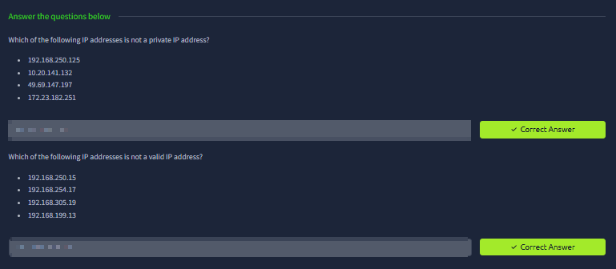
The section compares UDP (connectionless, lower overhead) with TCP (connection-oriented, reliable). The SYN → SYN-ACK → ACK flow in the diagram is the core point, and the questions below check handshake knowledge plus the approximate port-number space.

## 11) Encapsulation lifecycle
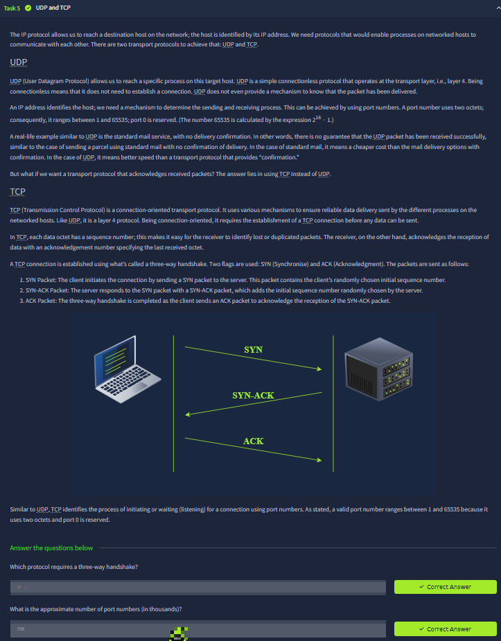
This panel visualizes encapsulation: application data is wrapped with transport headers, then IP headers, then link-layer header/trailer to form a frame. The “life of a packet” list walks through sending an HTTP request and router-by-router forwarding, tying layered theory to movement of a real request.

## 12) Telnet basics and service interaction setup
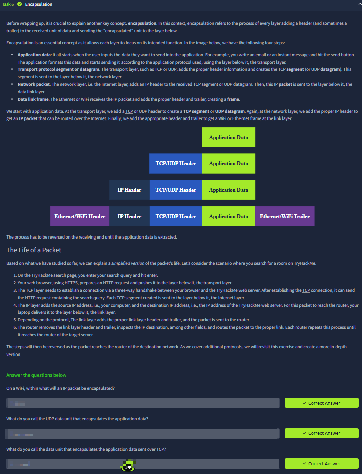
The screenshot introduces Telnet as a raw remote terminal protocol and sets practical labs against echo (port 7), daytime (13), and HTTP (80) services. It shows a live connection to the echo service and explains exit control (`CTRL + ]`), demonstrating direct TCP service interaction.

## 13) Telnet to daytime and manual HTTP request
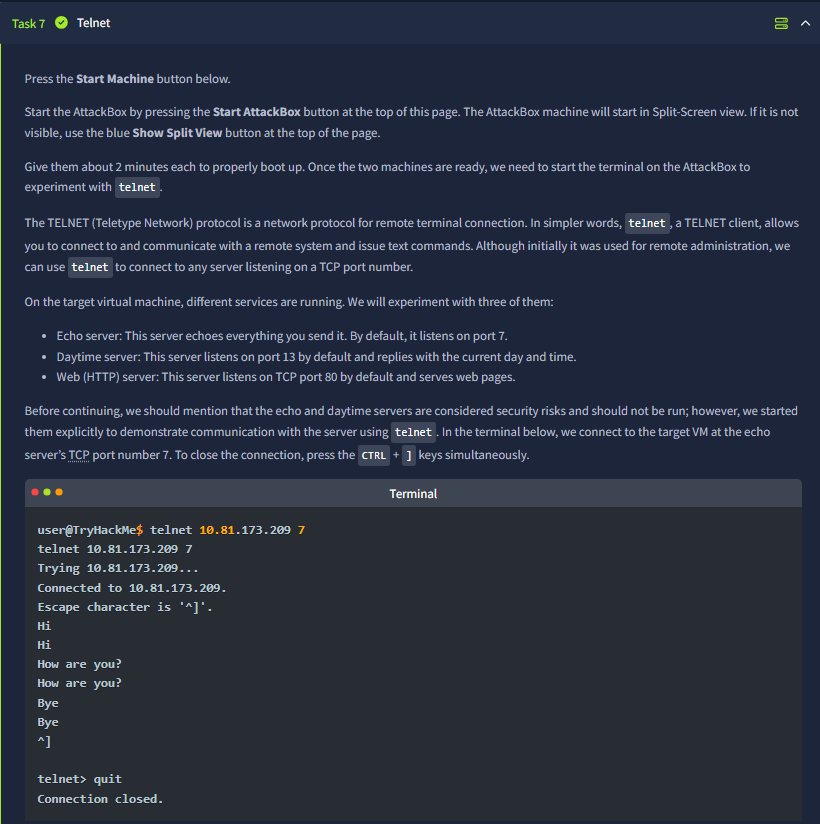
This continuation shows connection to port 13 (returns time and closes) and manual HTTP request over Telnet on port 80 (`GET / HTTP/1.1` + `Host:` + blank line). The returned `HTTP/1.1 200 OK` proves protocol-level communication without a browser.

## 14) Final challenge answers from service enumeration
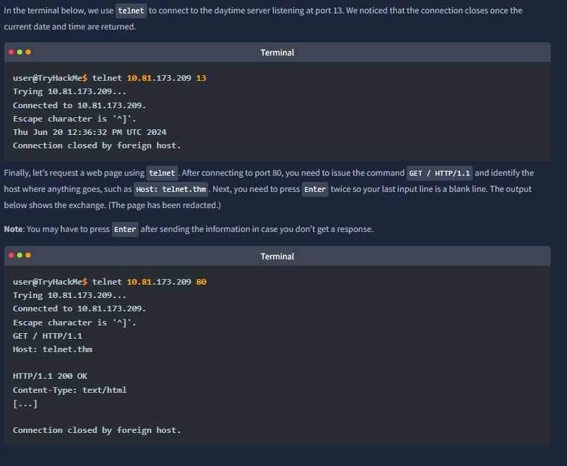
The questions ask for HTTP server name/version and flag after connecting to the target service via Telnet. The right-side terminal confirms follow-up extraction work, so this screenshot represents the room’s practical evidence-collection phase.

## 15) Room completion checkpoint
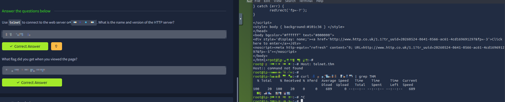
This final view confirms the completed answers in the challenge block. At this stage, the flow from OSI/TCP-IP theory to addressing, routing, transport behavior, encapsulation, and Telnet-based service testing is complete and validated end-to-end.
