# Networking Essentials

Room link: https://tryhackme.com/room/networkingessentials

## 1) DHCP purpose and DORA lifecycle
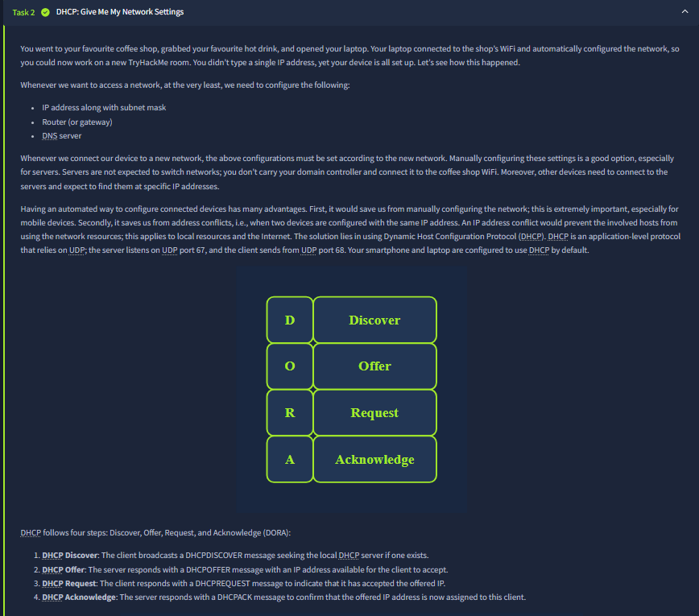
This section explains why DHCP is essential in real networks: users move between networks, and manually assigning IP addresses, subnet masks, gateways, and DNS settings each time is impractical and error-prone. The screenshot also highlights the DORA workflow (Discover, Offer, Request, Acknowledge), showing how a host automatically negotiates usable network settings from a DHCP server over UDP. The core takeaway is that DHCP is not just “IP assignment”; it is full baseline host configuration delivery.

## 2) Packet-level view of DHCP exchange + question intent
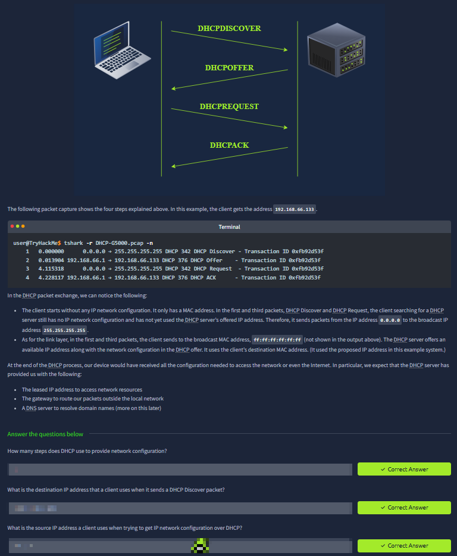
Here the room moves from theory to packet evidence using tshark/Wireshark output. You can see client broadcast behavior (`0.0.0.0 -> 255.255.255.255`) during discovery/request phases and direct server responses during offer/ack phases, which proves exactly how DORA appears on the wire. The “Answer the questions” block below is testing protocol literacy: how many phases DHCP uses, which destination IP is used in discovery, and what source IP a client has before receiving a lease.

## 3) ARP framing context and MAC resolution
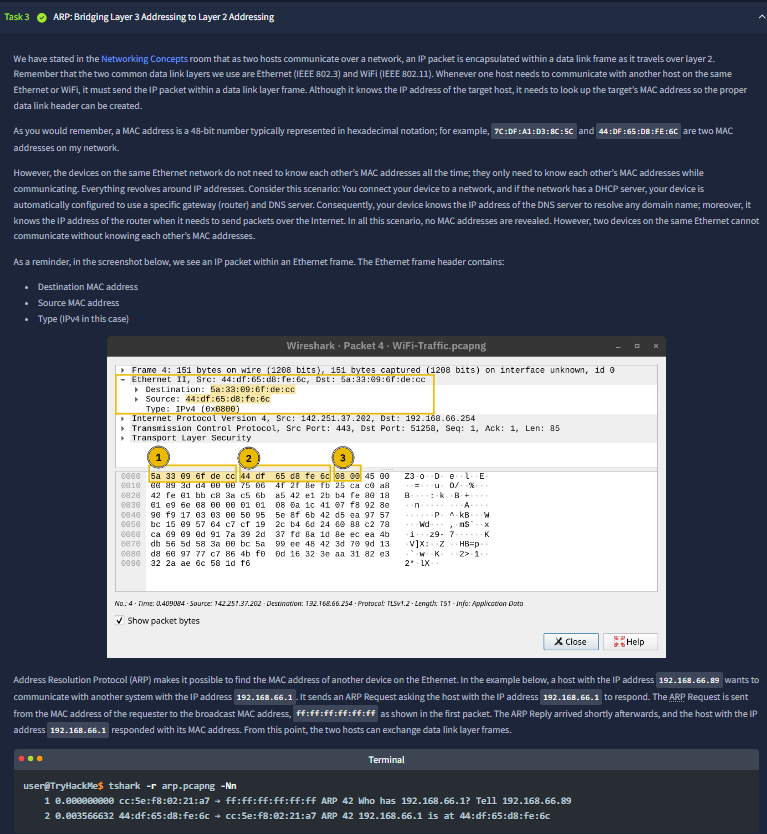
This screenshot explains why ARP is needed even when we already know IP addresses: Ethernet delivery still requires destination MAC addresses to build the layer-2 frame header. The room’s packet breakdown ties IP-to-MAC mapping directly to frame fields (destination MAC, source MAC, EtherType). It emphasizes that same-subnet communication depends on ARP resolution before normal data exchange can happen.

## 4) ARP request/reply details + question intent
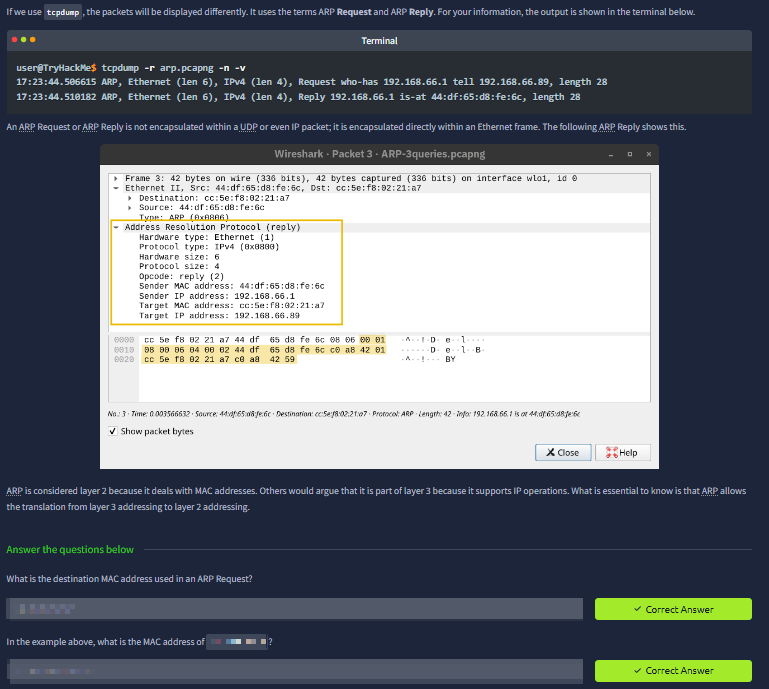
This continuation focuses on ARP as request/reply traffic carried directly inside Ethernet frames (not TCP/UDP). The packet details show who is asking, who responds, and which MAC addresses are involved in both directions. The questions below are checking whether you can read those exact addresses from packet evidence: broadcast destination in ARP request and the responder/requester identities shown in the capture.

## 5) ICMP diagnostics: ping fundamentals
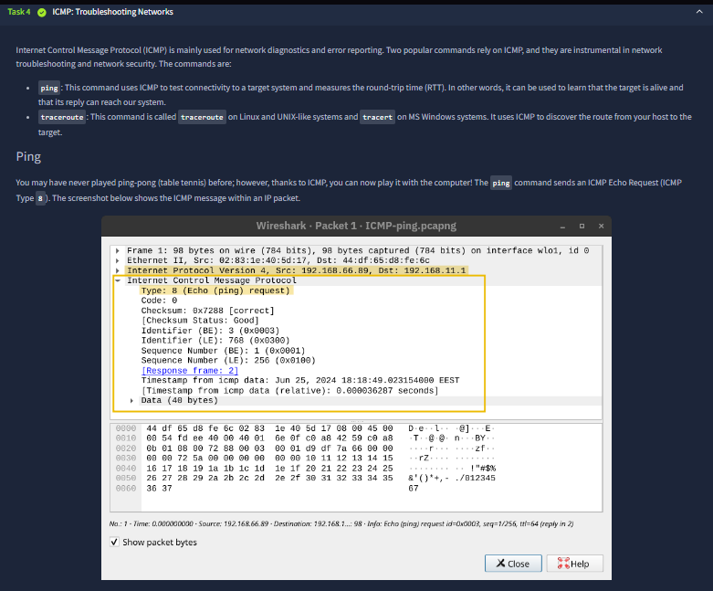
This task introduces ICMP as the protocol family behind common diagnostics, especially `ping`. The highlighted packet is ICMP Echo Request (Type 8), and the room explains that this validates reachability and helps measure RTT. It is an operational baseline skill: before deeper troubleshooting, verify that a target is alive and replying at ICMP layer behavior.

## 6) ICMP echo reply metrics and reliability interpretation
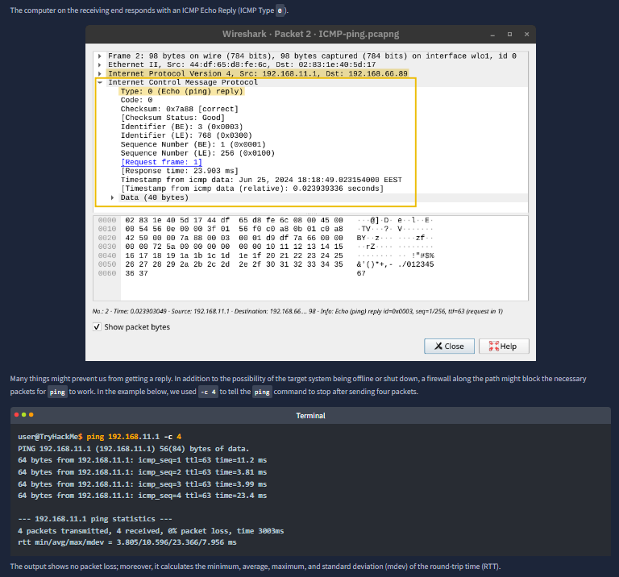
The screenshot shows the matching ICMP Echo Reply (Type 0) and then command-line `ping -c 4` statistics. This section teaches how to interpret success beyond “it replied”: packet loss percentage, min/avg/max latency, and standard deviation reveal link quality and stability. The room is training practical troubleshooting judgment, not just protocol names.

## 7) Traceroute mechanics + question intent
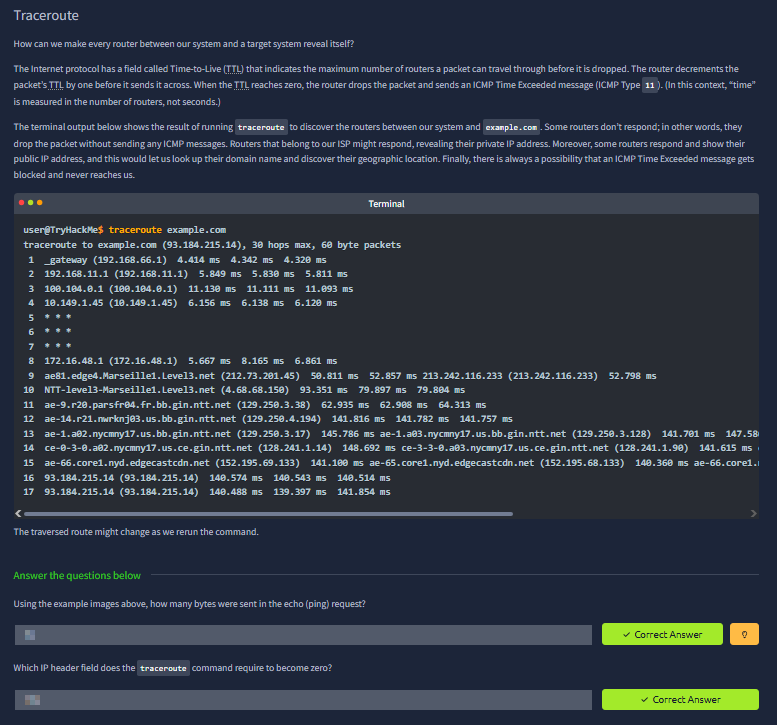
This part explains traceroute via TTL expiry and ICMP Time Exceeded responses from intermediate routers. The terminal output demonstrates hop-by-hop path discovery and variable routing behavior across runs. The questions below validate whether you can extract concrete values from the examples, such as payload byte count in the echo request and the specific header field traceroute manipulates (TTL).

## 8) Routing concept across interconnected networks
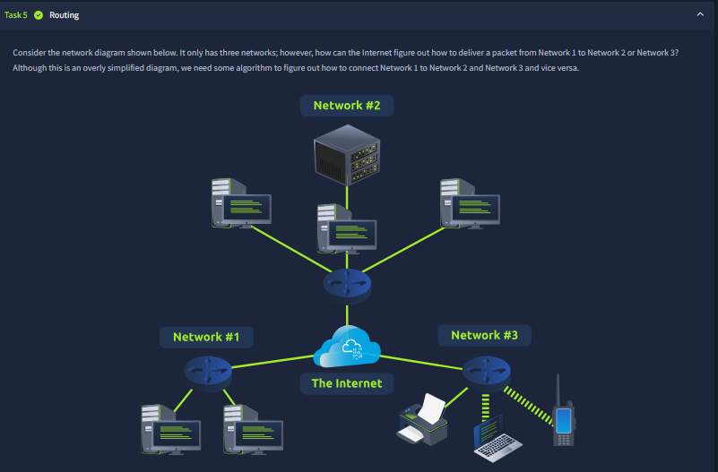
The routing diagram models Internet-scale logic in a simplified form: different networks are connected, and routers must decide where each packet should go next. The key idea is forwarding by path decisions, not direct endpoint visibility. This lays the foundation for understanding why routing protocols and topology knowledge are necessary in multi-network communication.

## 9) Routing protocols comparison + question intent
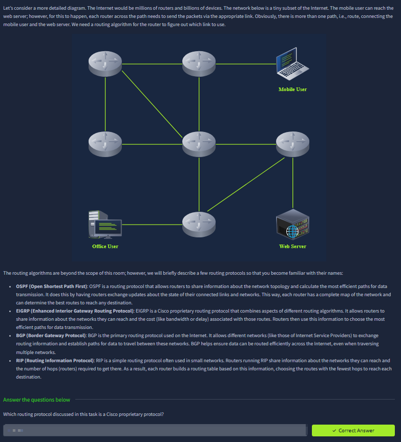
This screenshot introduces named routing protocols and their operational styles: OSPF (link-state), EIGRP (Cisco proprietary hybrid), BGP (inter-domain Internet routing), and RIP (hop-count based). The purpose is familiarity at concept level, not deep protocol tuning. The question block checks if you can map protocol characteristics correctly, especially identifying vendor-specific protocols like EIGRP.

## 10) NAT translation behavior + question intent
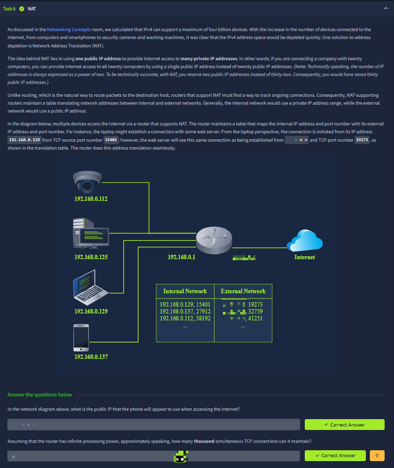
The NAT section explains address conservation and connection tracking by mapping many private internal tuples (IP:port) to external public tuples. The example translation table demonstrates how simultaneous sessions remain unique via port translation. The questions below test practical NAT reasoning: which public identity an internal host appears as, and approximate connection-scale capacity from available port space.

## 11) Closing challenge synthesis and protocol recap
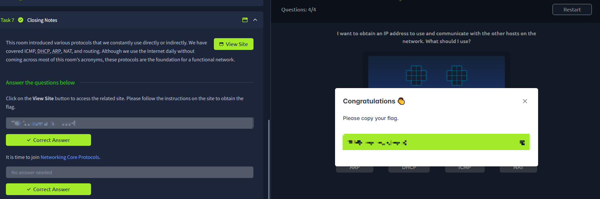
The final screenshot confirms the room’s integrated challenge completion and summarizes covered core protocols (DHCP, ARP, ICMP, routing, NAT). The right-side challenge panel and completion modal show end-to-end understanding was applied in practice, not only memorized. At this point, the module’s outcome is clear: you can connect protocol behavior at packet level to real troubleshooting and network operation decisions.
