# Networking Core Protocols

Room link: https://tryhackme.com/room/networkingcoreprotocols

## 1) DNS role in daily networking and record types
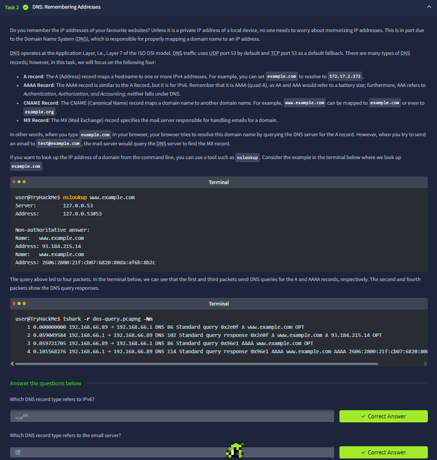
This screenshot introduces DNS as the naming layer that lets users work with domain names instead of memorizing IP addresses. The text clearly maps common records to their purposes: **A** for IPv4 mapping, **AAAA** for IPv6 mapping, **CNAME** for aliasing one name to another, and **MX** for mail routing. It also explains transport behavior (UDP/53 by default, TCP/53 fallback), then demonstrates `nslookup` and packet capture output to show that resolution is observable on the wire as query/response pairs.

## 2) WHOIS as registration metadata and ownership context
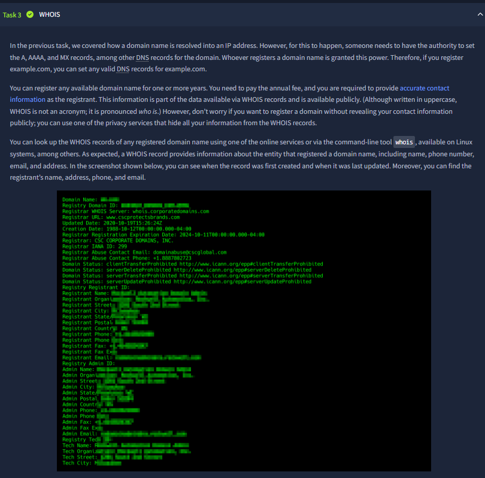
Here the room shifts from “how names resolve” to “who registered those names.” The WHOIS section explains that domain registration creates public metadata about registrar, creation/update/expiry dates, and contact details. The screenshot’s terminal output (plus privacy-protected entries) makes an important operational point: some domains expose real contact details while others use privacy services, so reconnaissance quality varies by registration policy.

## 3) WHOIS practical extraction + what the questions verify
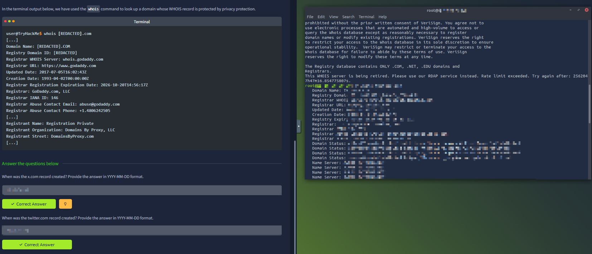
This practical view shows two separate WHOIS lookups and corresponding answer fields below. The core concept is not just reading a WHOIS blob, but extracting precise evidence like creation dates and registrar information from noisy output. The question block is testing whether you can reliably locate and normalize exact fields (especially dates in strict format) rather than guessing from surrounding text.

## 4) HTTP/HTTPS request model and method semantics
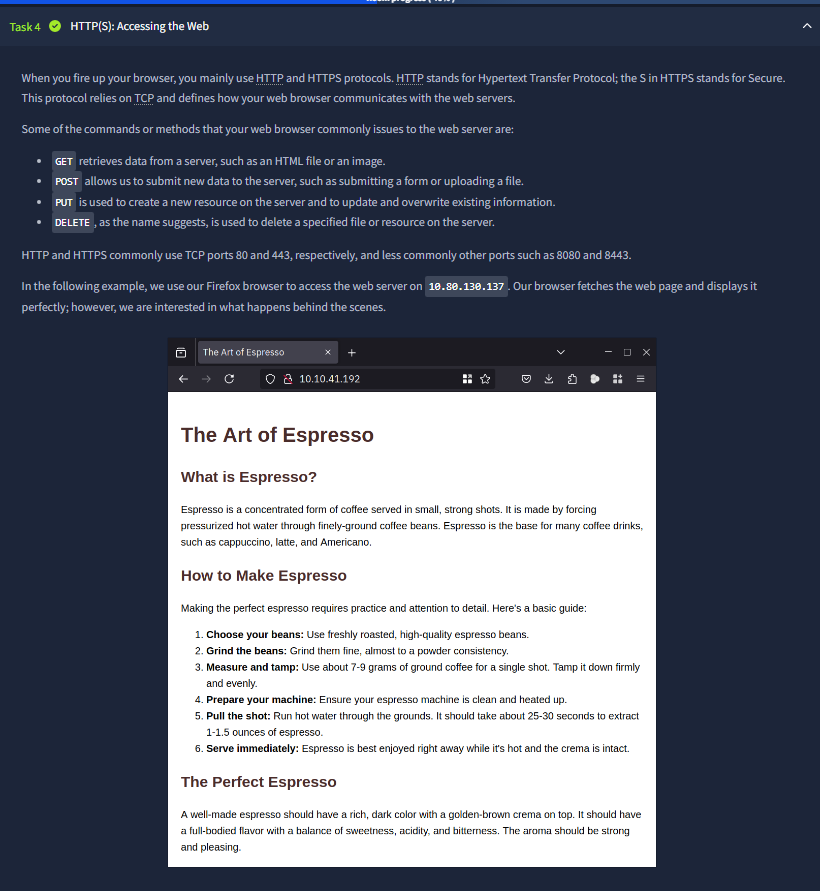
This section defines HTTP as the web’s application protocol over TCP and highlights standard methods (`GET`, `POST`, `PUT`, `DELETE`) with expected behavior. It also contrasts default ports (80 for HTTP, 443 for HTTPS) and uses a live browser example to connect concept to user experience. The key takeaway is that browsing is a protocol conversation, not just page rendering.

## 5) HTTP exchange visibility in Wireshark + manual request logic
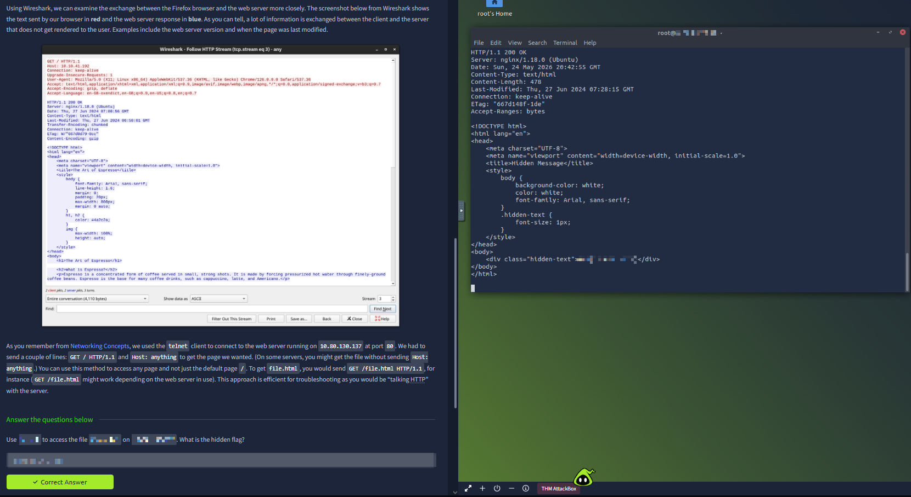
The screenshot demonstrates two perspectives of the same flow: Wireshark stream view and raw terminal response from manual HTTP interaction. The room text emphasizes that much more data is exchanged than what the page visually displays (headers, metadata, timing). It also revisits telnet-style manual requests (`GET` + `Host`) to show how analysts can directly request files and inspect hidden content paths when testing web behavior.

## 6) FTP purpose, command set, and control/data behavior
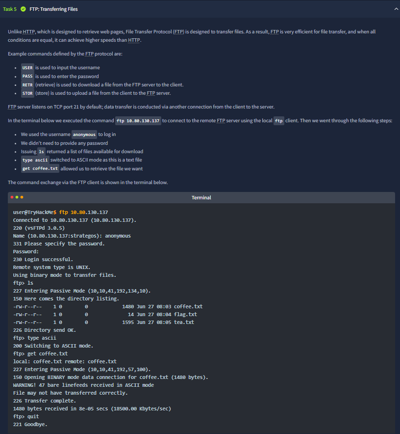
This part introduces FTP as a protocol specialized for file transfer, distinguishing it from HTTP page retrieval. The screenshot walks through real command usage (`USER`, `PASS`, `LIST`, `TYPE`, `GET`) and emphasizes default port 21 for control connection. A critical protocol insight here is that directory listing and file transfer can involve separate flows, which matters for debugging firewall/NAT issues.

## 7) FTP stream analysis + question intent
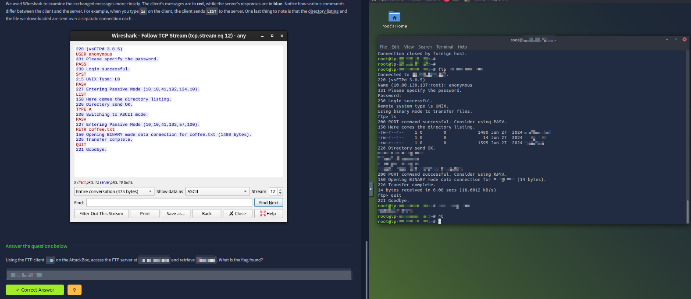
The Wireshark + terminal pairing confirms exact command/response sequence during an FTP session, including login, listing, transfer mode change, file retrieval, and quit. The questions below are validating operational extraction skills: use command-line FTP client behavior to retrieve a specific file and produce the flag. In other words, this tests practical protocol execution, not only command memorization.

## 8) SMTP flow fundamentals and email submission lifecycle
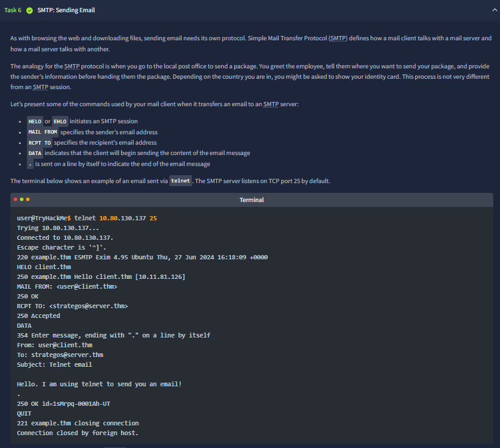
This screenshot explains SMTP as the “send side” email protocol and maps its key commands: `HELO/EHLO`, `MAIL FROM`, `RCPT TO`, `DATA`, and terminating `.` line. The sample telnet interaction shows full message construction (headers + body) and server acceptance responses. The focus is understanding stateful sequencing—SMTP works only when commands are issued in valid order.

## 9) SMTP capture interpretation + what the questions verify
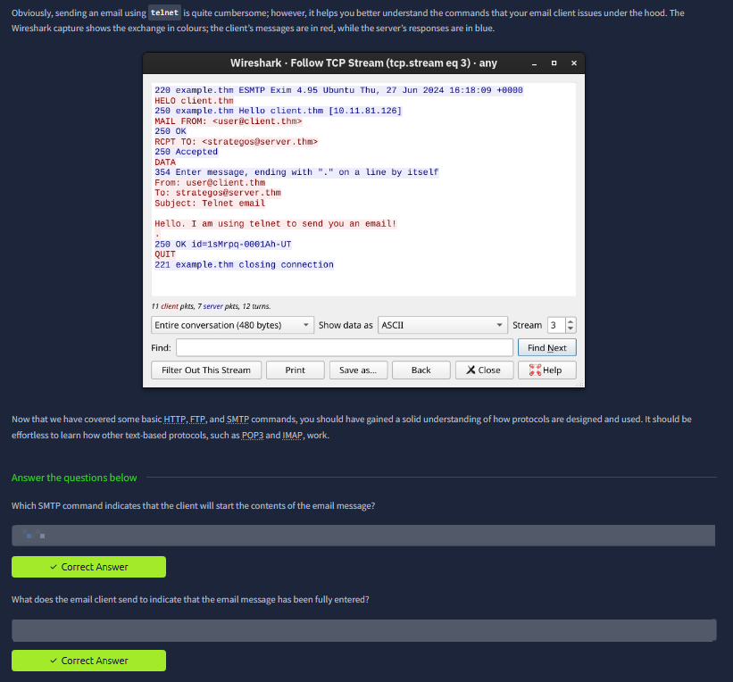
The stream capture reinforces client/server roles by color and sequence, then asks protocol-specific questions beneath. Those questions are checking whether you understand SMTP control points: which command starts message content transfer and which marker indicates end-of-message. It measures protocol grammar understanding, not content reading.

## 10) POP3 role and command model for mailbox retrieval
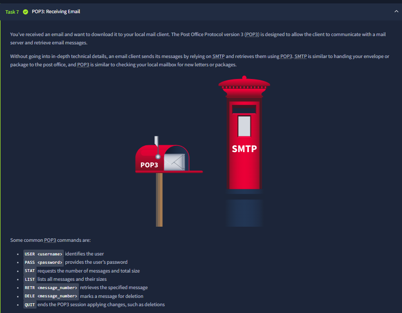
This section introduces POP3 as the receive side counterpart to SMTP. The screenshot lists practical commands (`USER`, `PASS`, `STAT`, `LIST`, `RETR`, `DELE`, `QUIT`) and explains POP3’s download-focused model. The conceptual contrast is important: SMTP sends messages to server infrastructure, while POP3 is used by clients to authenticate and pull messages from inbox storage.

## 11) POP3 telnet session: auth, listing, retrieval
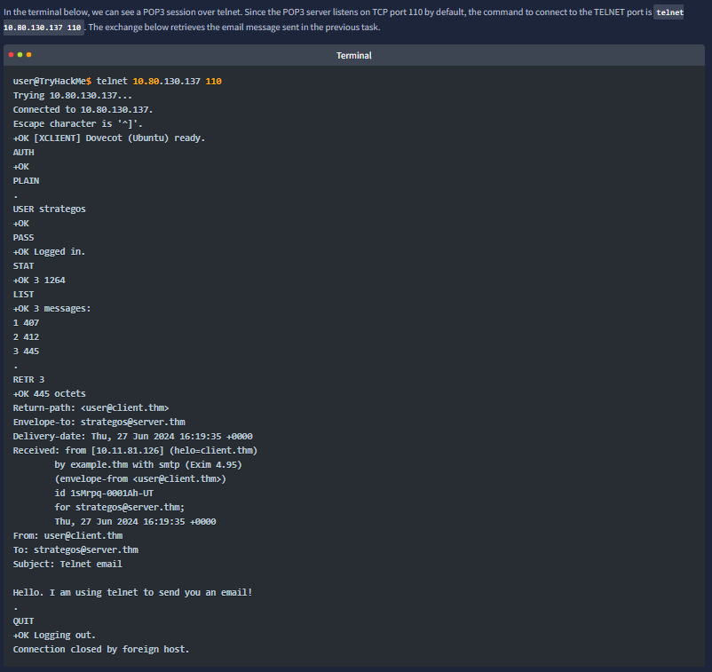
The terminal capture shows a full POP3 workflow over port 110: authenticate, inspect mailbox state, list message sizes, then fetch a specific message with `RETR`. This provides concrete evidence of message retrieval syntax and server replies (`+OK` patterns). It also demonstrates why plaintext protocol familiarity is useful in troubleshooting and incident analysis.

## 12) POP3 traffic visibility and credential exposure risk
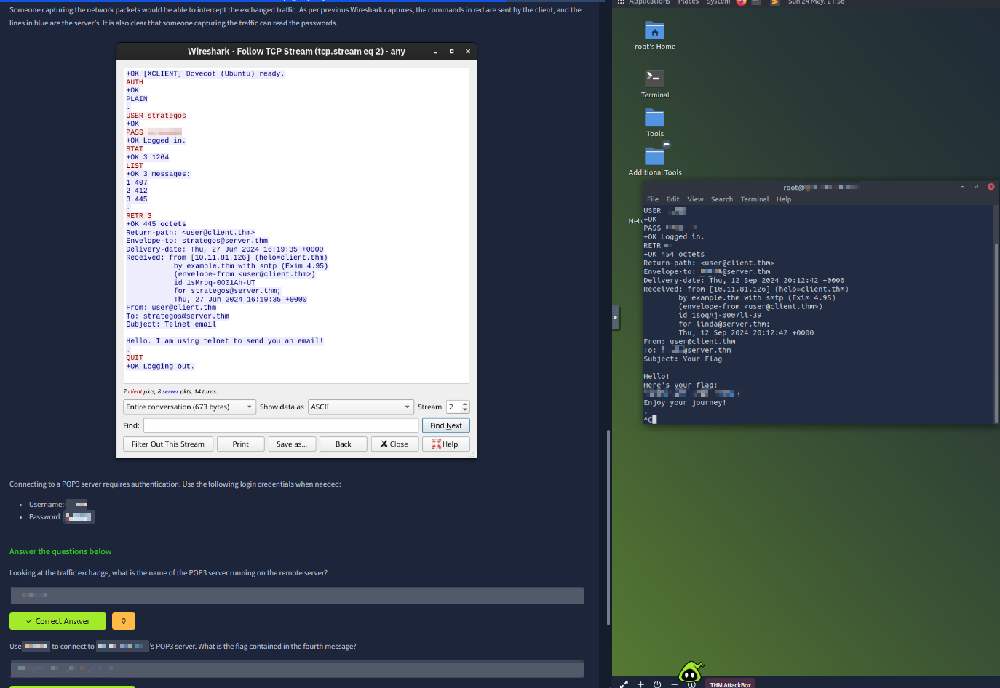
This screenshot is especially valuable from a security angle: it shows that protocol commands and sensitive values can be visible in captured traffic when transport is unencrypted. The room combines stream evidence with practical task questions (server identification and message retrieval) to highlight both analyst capability and confidentiality risk in legacy/plaintext workflows.

## 13) IMAP synchronization model and command complexity
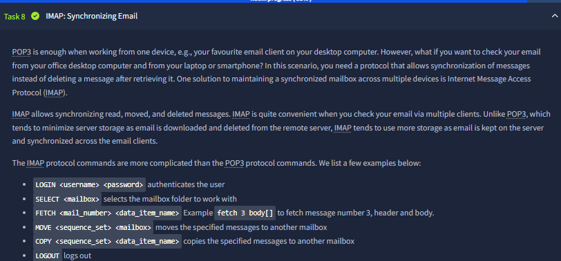
This section explains why IMAP exists alongside POP3: synchronization across multiple clients/devices instead of simple download-and-remove behavior. The listed commands (`LOGIN`, `SELECT`, `FETCH`, `MOVE`, `COPY`, `LOGOUT`) show richer mailbox operations. The core message is that IMAP preserves server-side mailbox state and supports multi-device consistency at the cost of a more complex protocol model.

## 14) IMAP practical fetch workflow over telnet
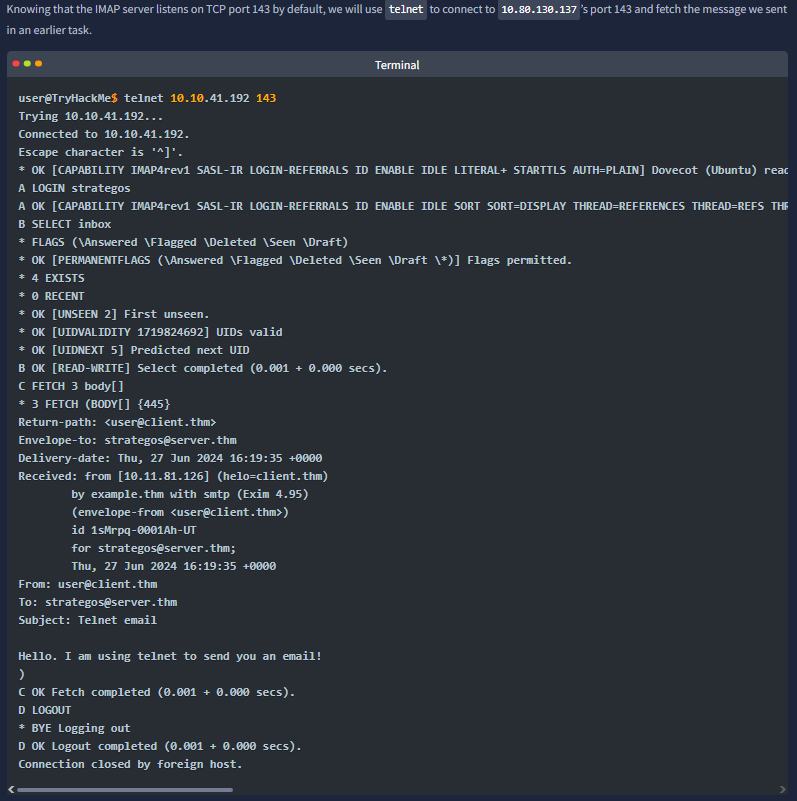
The terminal output demonstrates a realistic IMAP flow: connect to port 143, authenticate, select mailbox, and fetch message content using command tags and `FETCH ... BODY[]`. Unlike simpler request models, IMAP’s tagged commands and multi-line responses require careful parsing, which this screenshot captures clearly.

## 15) IMAP stream evidence + final protocol extraction check
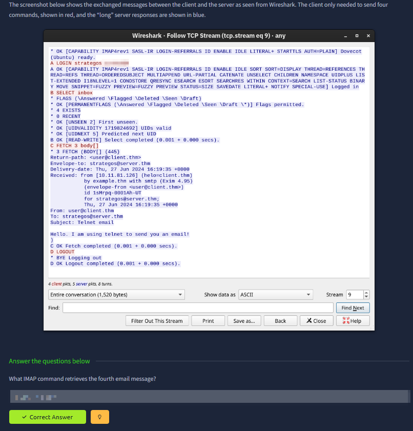
The final evidence screenshot shows the same IMAP interaction in stream form and asks for the exact command used to retrieve a specific message. This closes the room by verifying command-level precision across DNS/WHOIS/HTTP/FTP/SMTP/POP3/IMAP progression. The practical outcome is strong protocol literacy: reading, generating, and validating real network conversations across core services.
