

# Networking Secure Protocols

Room link: https://tryhackme.com/room/networkingsecureprotocols

## 1) TLS motivation: from plaintext interception to protected sessions
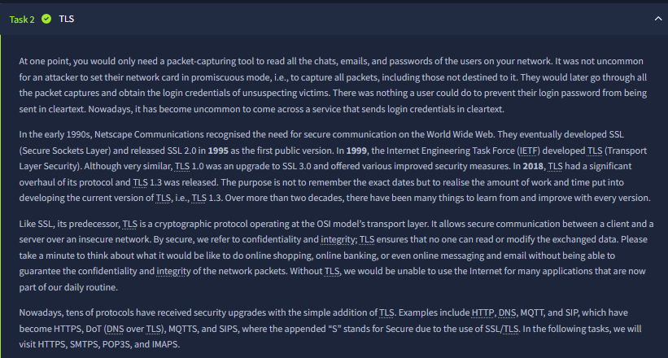
This first screenshot explains the core security problem very clearly: legacy plaintext protocols allowed anyone on-path (or in promiscuous mode) to read credentials and message content. The room then places TLS in historical context (SSL lineage, then modern TLS versions) and emphasizes its practical security goals: **confidentiality** (traffic cannot be read by outsiders) and **integrity** (traffic cannot be silently modified). It also connects this to real protocols by showing how “secure variants” are formed (HTTPS, SMTPS, POP3S, IMAPS), so the learner understands TLS as a reusable security layer rather than a web-only feature.

## 2) Certificate trust model and CA-backed authentication
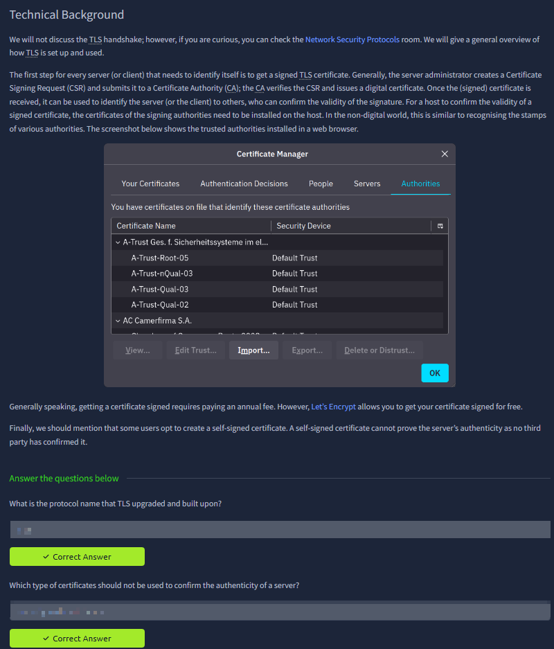
This screenshot focuses on how trust is bootstrapped: server operators generate a CSR, a CA validates/signs it, and clients verify that signature against trusted root authorities in their certificate store. The visual certificate manager supports that concept by showing where trust anchors live on endpoints. The text also captures an important operational distinction: CA-signed certificates prove identity through third-party attestation, while self-signed certificates do not provide equivalent authenticity for public-facing services.

## 3) HTTP visibility in packet captures (why encryption matters)
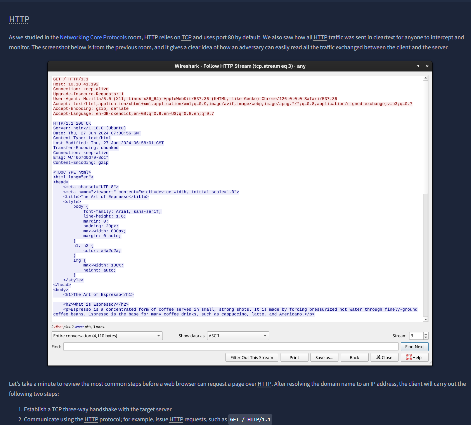
Here the room revisits normal HTTP behavior over TCP/80 and demonstrates that request/response content is fully visible in packet tools. The screenshot shows readable headers and page content, proving that without transport encryption, metadata and payload are both exposed to passive monitoring. This stage is pedagogically important because it creates a baseline before introducing HTTPS behavior in later screenshots.

## 4) Packet timeline breakdown: handshake, app data, teardown
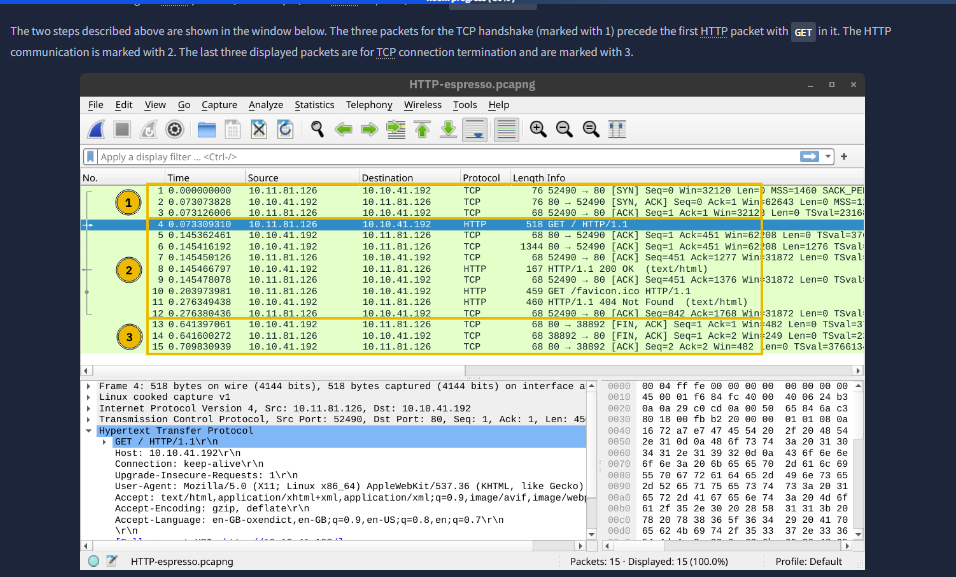
This capture is annotated into three phases: TCP handshake packets, HTTP exchange packets, and connection termination packets. That sequence reinforces that application protocols are carried on top of transport sessions and helps learners visually separate transport events from application events. It is an excellent “mental model” screenshot for analysts who need to triage where a failure occurs: before app traffic starts, during request/response, or during close.

## 5) HTTP over TLS workflow (what changes, what stays the same)
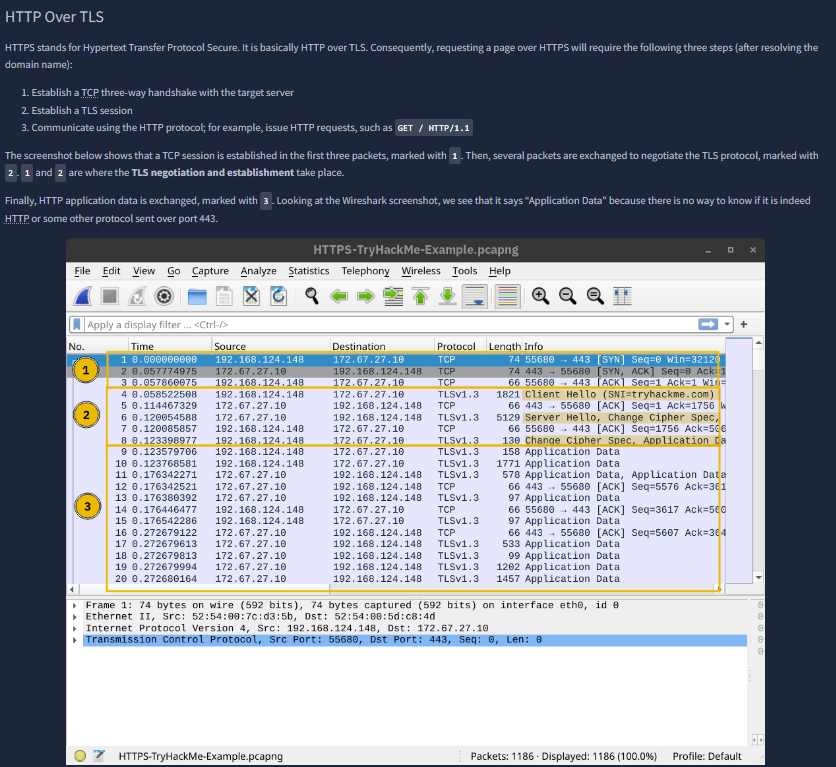
This section explains the layered transition from HTTP to HTTPS: TCP still starts first, then TLS negotiation occurs, then HTTP semantics run inside the encrypted channel. The capture labeling shows the packet-level consequence—after setup, payload appears as protected application data on port 443. The key concept is compatibility: the app protocol behavior remains familiar, but transport security wraps it to prevent eavesdropping and tampering.

## 6) Encrypted stream view and the “gibberish” effect
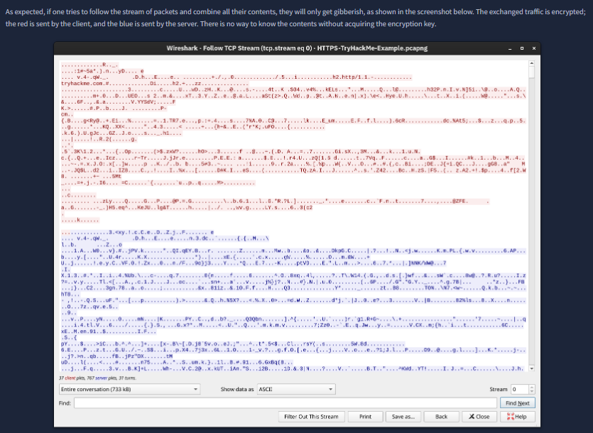
This screenshot demonstrates the practical outcome of encryption in stream-follow views: bytes are present, but unreadable without session keys. Client/server directions are still observable, yet meaningful content is hidden. It cleanly teaches the difference between **traffic visibility** and **content visibility**—analysts can still observe flow metadata, but not sensitive payload in plaintext.

## 7) Decrypting TLS in lab conditions with key material
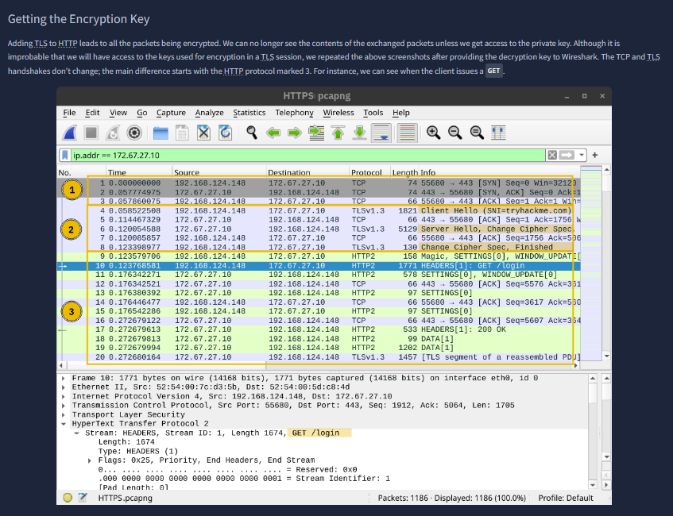
This image introduces a controlled-lab exception: if session secrets are available to the analyst, packet tools can decrypt HTTPS and recover higher-layer details (e.g., request lines like `GET /login`). The room uses this to show investigation methodology, not to weaken TLS claims. The concept is that encryption is strong in real adversarial settings, but in authorized forensics/testing workflows, key logging can enable deep traffic inspection.

## 8) Decrypted HTTP/2 stream and validated protocol continuity
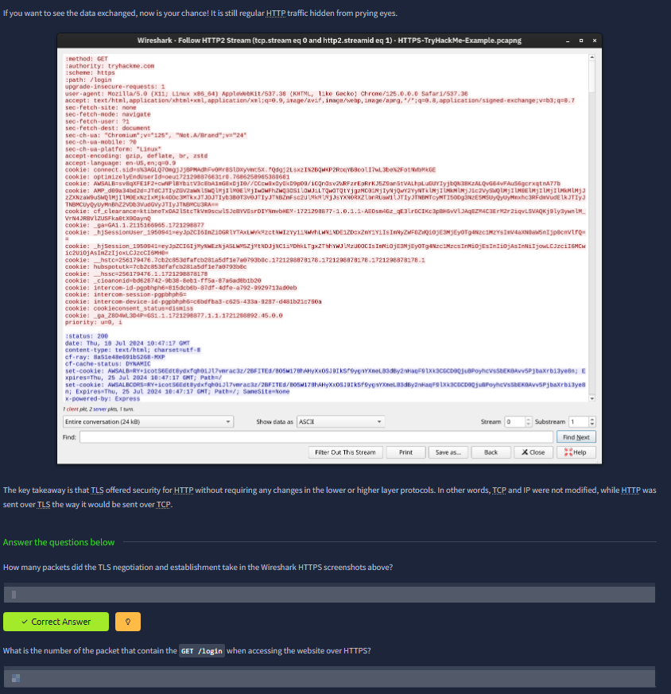
With decryption configured, the screenshot shows full HTTP/2 headers and cookies again, proving that application semantics remain intact under TLS. The accompanying quiz asks packet-count and packet-number details, which tests precise reading of captures rather than generic conceptual recall. This trains operational packet-analysis discipline: verify exact evidence points from trace data.

## 9) Secure mail protocol mapping and default ports
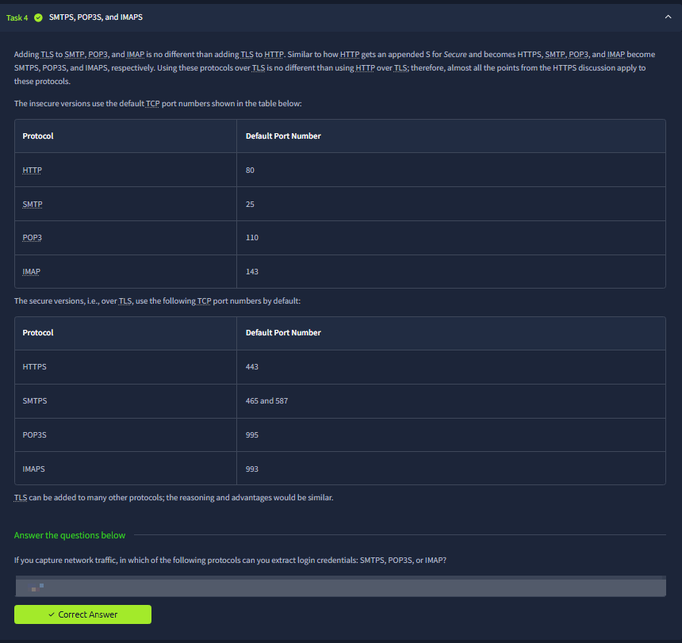
This section generalizes HTTPS lessons to email protocols, contrasting insecure defaults (HTTP/SMTP/POP3/IMAP) with secure TLS-enabled variants (HTTPS/SMTPS/POP3S/IMAPS) and their ports. The two-table format is strong because it helps learners avoid common confusion during firewall and service validation. It also reinforces that transport security patterns repeat across services.

## 10) SSH fundamentals as secure remote administration
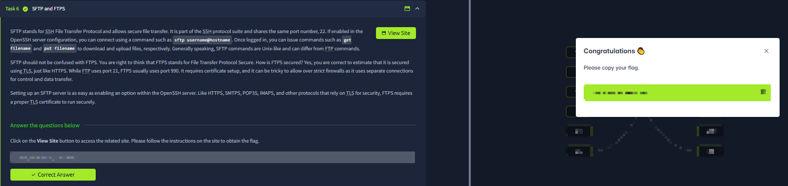
The SSH task explains why Telnet is insecure and how SSH replaces plaintext admin sessions with encrypted channels and stronger authentication options. The screenshot references OpenSSH specifically, adds practical syntax (`ssh user@host`), and mentions X11 forwarding and tunneling capabilities. This is more than “login securely”—it introduces SSH as a broader secure operations toolkit for remote management and protocol forwarding.

## 11) SFTP and FTPS comparison: two secure file-transfer paths
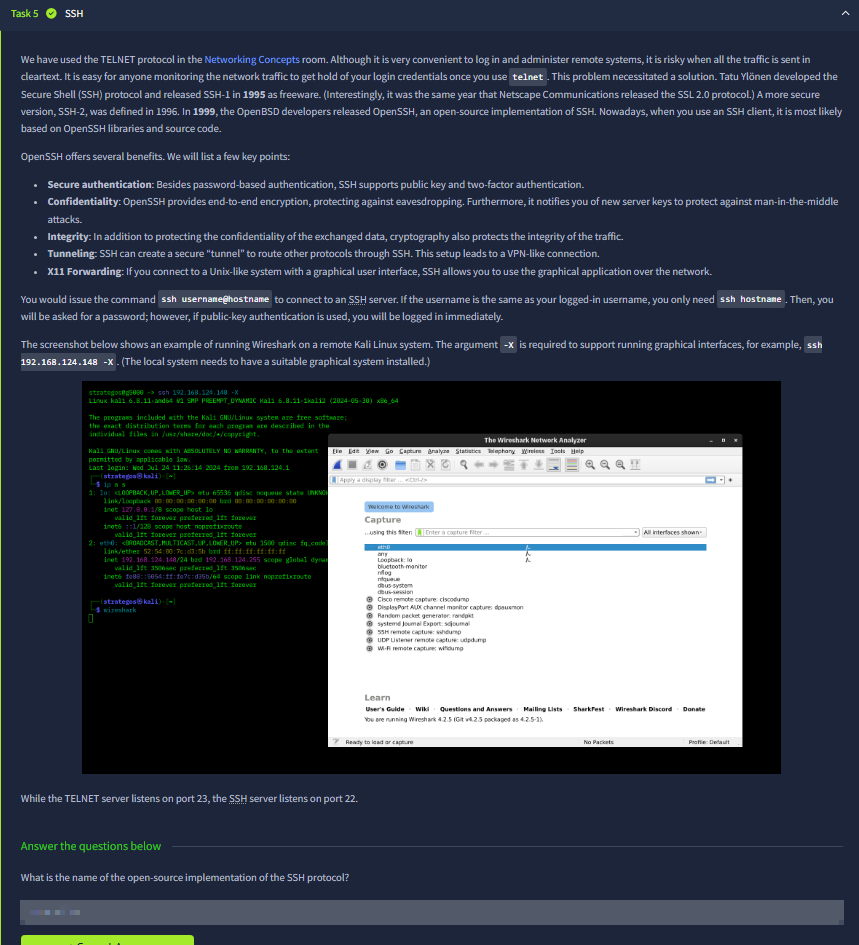
This screenshot differentiates secure file-transfer options clearly. **SFTP** is part of the SSH ecosystem (commonly port 22) and follows SSH security properties, while **FTPS** is FTP + TLS (commonly associated with 990 or explicit TLS modes) and keeps FTP’s dual-channel behavior. The room highlights practical setup implications: protocol choice impacts deployment complexity, compatibility, and firewall behavior.

## 12) VPN architecture for branch-to-branch secure transport
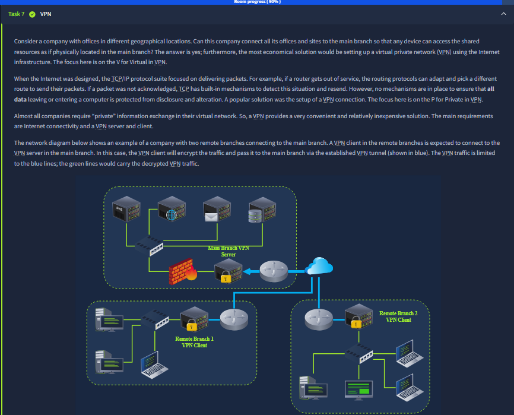
The diagram introduces a classic hub-and-spoke model where branch clients connect through VPN tunnels to a main-branch server. It emphasizes two simultaneous truths: traffic may traverse public Internet paths, yet confidentiality/integrity are preserved by encapsulation and encryption inside the tunnel. This directly links protocol security to business connectivity needs across geography.

## 13) Client-level VPN behavior, routing impact, and geolocation effects
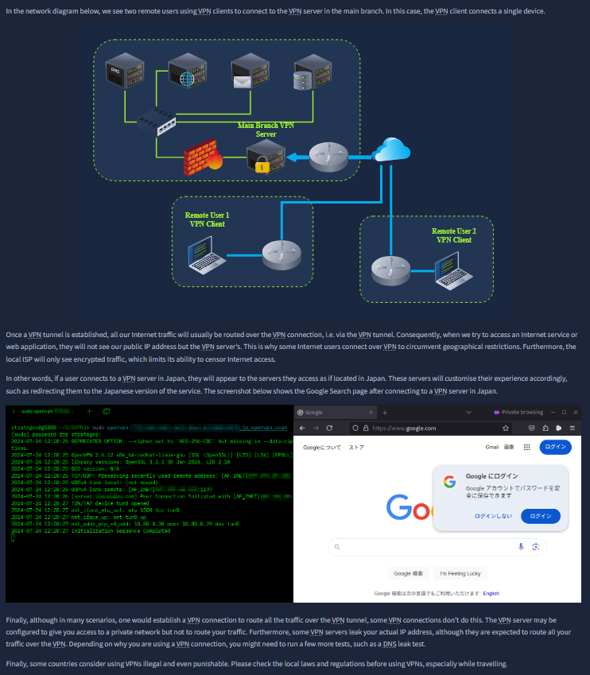
This screenshot expands VPN understanding from topology to user impact. It explains that once tunnel routing is active, Internet requests can egress from the VPN server location (e.g., region-specific content/language changes), and it cautions that not all VPN setups are full-tunnel by default. The note about local laws is also operationally relevant for real deployments and testing hygiene.

## 14) VPN checkpoint question and scenario validation
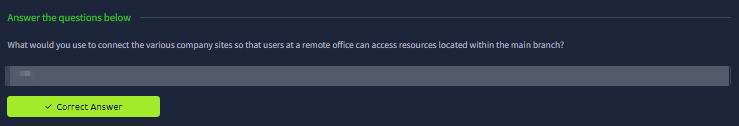
The question block here validates whether the learner can map a business requirement (“remote office users access main-branch resources”) to the correct secure control (VPN). While simple on the surface, it tests architectural judgment rather than command memorization—choosing the correct technology for network segmentation and secure remote reachability.

## 15) TLS decryption lab setup in Wireshark (key-log workflow)
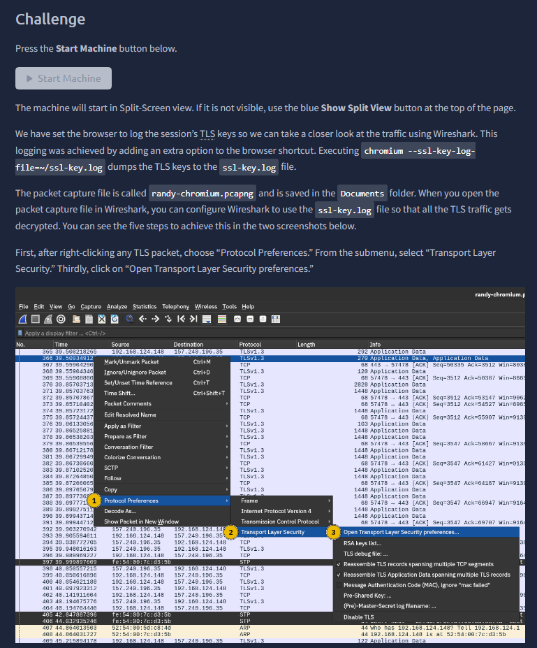
This challenge screenshot gives a concrete analyst workflow: capture encrypted traffic, load session key material (`ssl-key.log`) into Wireshark protocol preferences, then decrypt TLS for investigation. The instructions tie browser key logging, packet capture files, and Wireshark configuration into one repeatable incident-analysis path. It’s a strong practical bridge between protocol theory and hands-on network forensics.

## 16) Final credential-recovery exercise from decrypted traffic
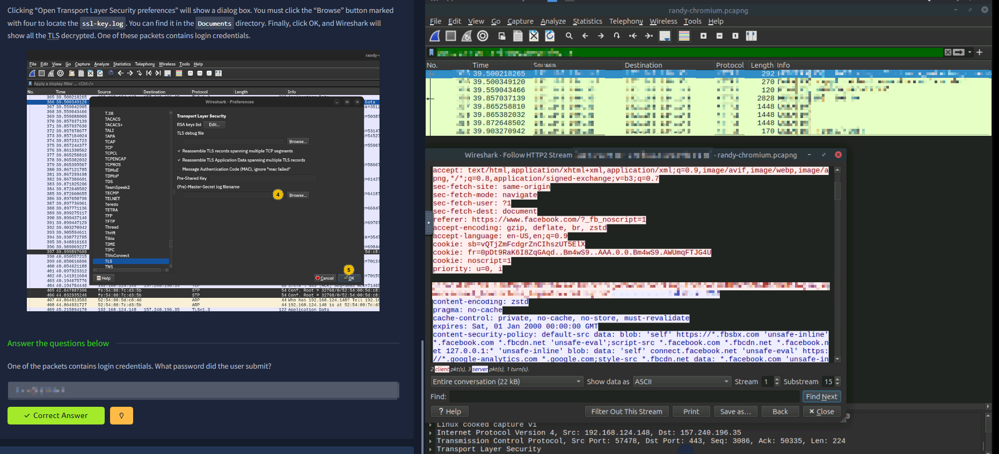
The final screenshot completes the workflow by showing decrypted application content and asking for submitted credentials found in packets. The learning outcome is clear: when authorized access to decryption keys exists, defenders can recover critical evidence from encrypted sessions for troubleshooting or incident response. This closes the room with a realistic analyst skill—secure-protocol awareness plus controlled forensic extraction.
