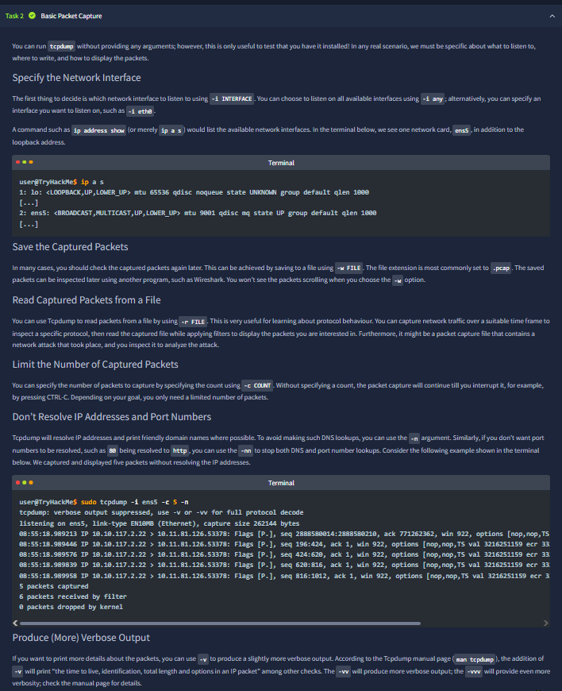
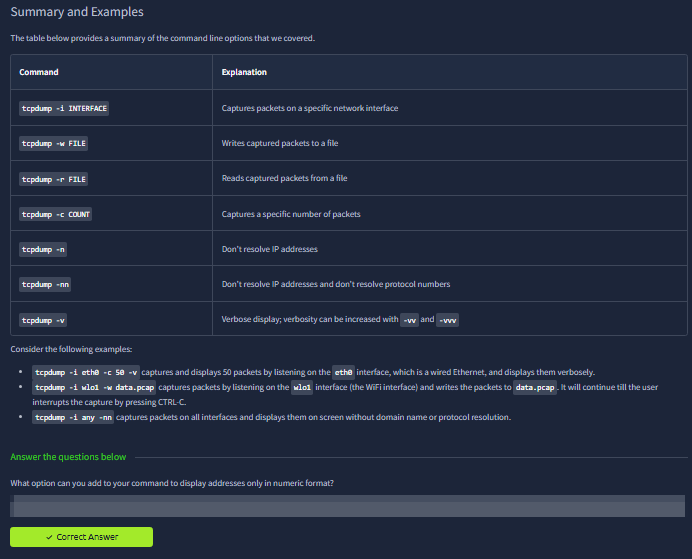
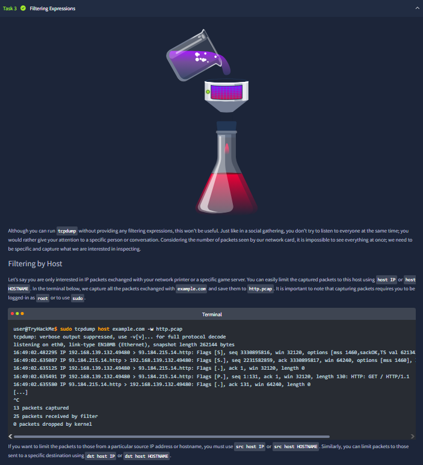
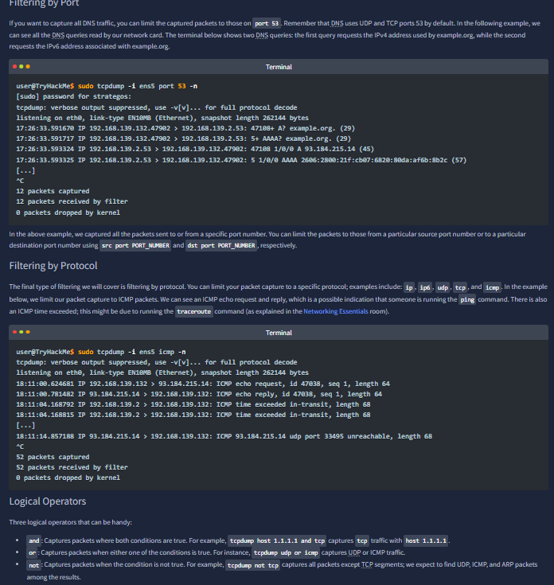
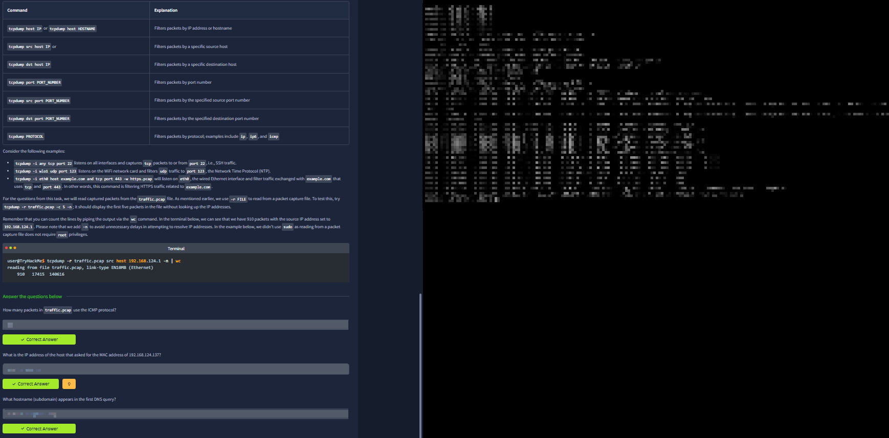
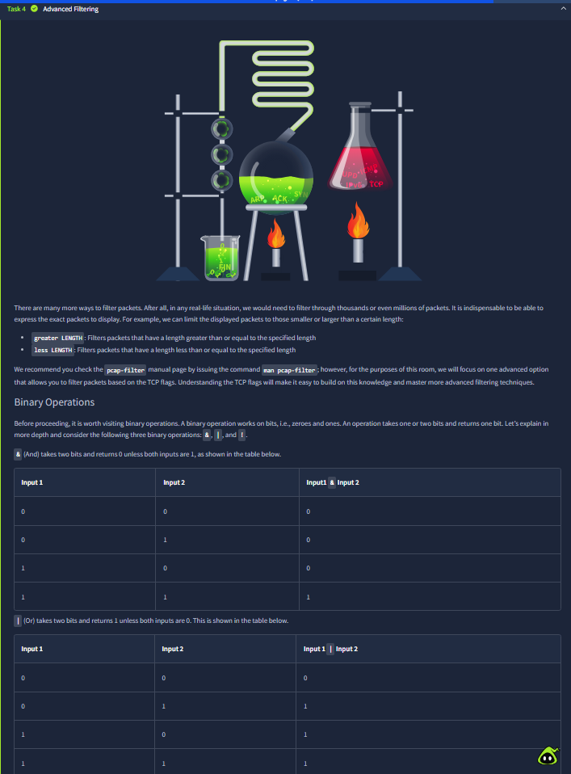
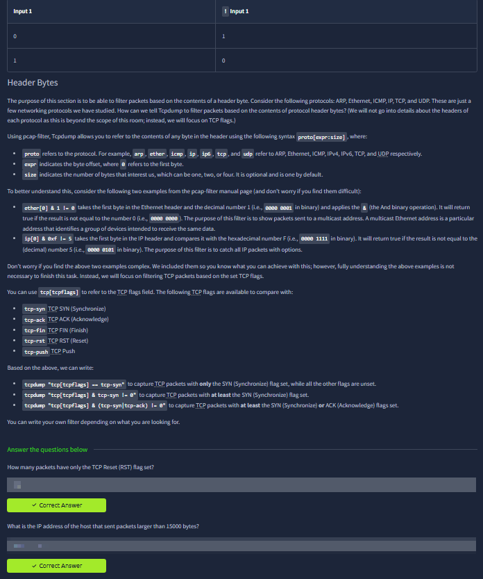
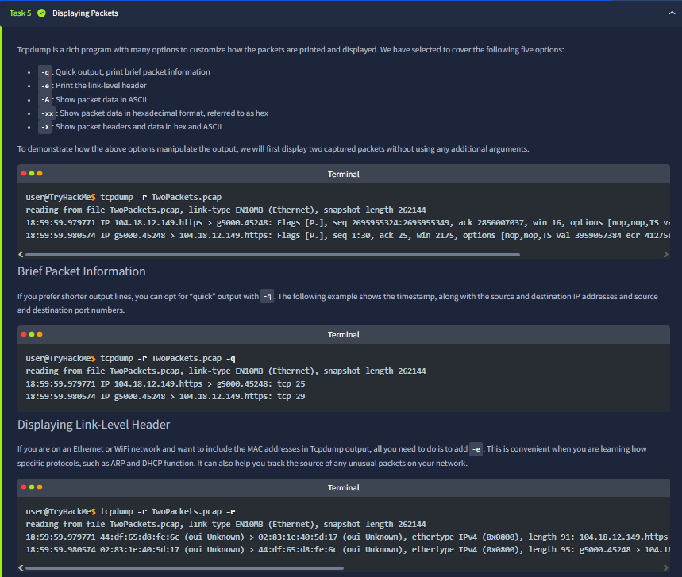
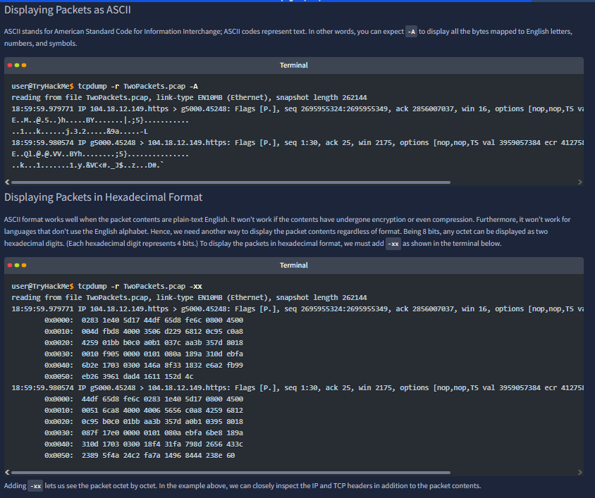
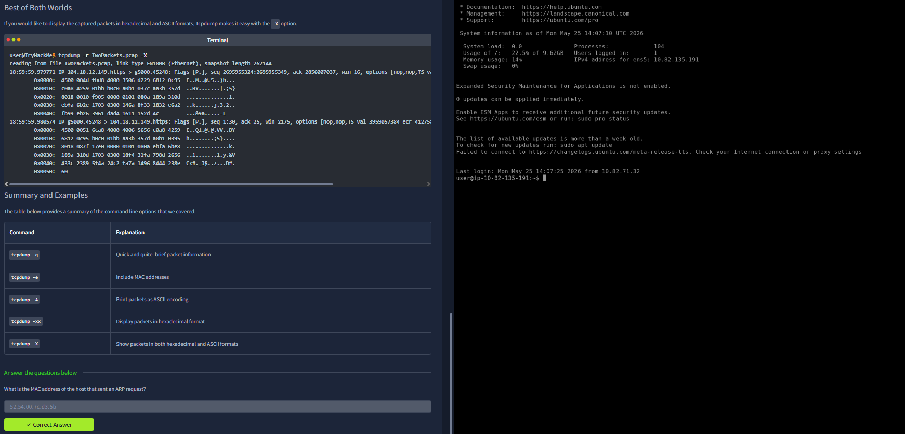

# tcpdump

Room link: https://tryhackme.com/room/tcpdump

## 1) Room scope, tcpdump purpose, and baseline workflow

This opening screenshot frames tcpdump as a terminal-first packet sniffer focused on visibility and troubleshooting rather than graphical analysis. The content highlights the practical baseline commands: selecting a network interface with `-i`, saving captures to a file with `-w`, reading a saved file with `-r`, limiting packet count with `-c`, disabling name resolution via `-n`, and adding verbosity with `-v` / `-vv`. The key takeaway is operational discipline: start with simple capture controls, then move into filtering and interpretation once packet data is reliably collected.

## 2) Option summary and first question checkpoint

This image consolidates the most-used tcpdump arguments into a quick-reference table and reinforces command memorization through short practical questions. The screenshot’s structure shows a training pattern used throughout the room: explain syntax, demonstrate realistic command forms, then validate understanding immediately with answer prompts. From a workflow perspective, this step anchors the learner in “command intent” (what each flag changes in output) before introducing more advanced filter logic.

## 3) Filtering Expressions: host-level filtering logic

This section introduces `host`, `src host`, and `dst host` expressions and demonstrates why directionality matters in packet hunting. The screenshot emphasizes that broad host filtering can be noisy, so splitting traffic into source-only or destination-only queries gives cleaner investigative context. The practical side panel and question block indicate the room is training you to translate narrative requirements (“packets from X” vs “packets to Y”) into exact BPF expressions, which is critical for fast triage during incident response.

## 4) Port/protocol filtering and boolean composition

Here the room advances from host-based filters to packet scoping by port and protocol (for example DNS, ICMP, and TCP examples shown on the page). The screenshot also demonstrates combining predicates with `and`, `or`, and `not`, teaching learners to build layered filters rather than running many disconnected commands. The analysis focus in this stage is precision: each added condition narrows noise and increases the evidentiary value of returned packets.

## 5) Practical filter validation with pcap-based counting

This screenshot mixes command reference and hands-on validation using an offline capture (`-r traffic.pcap`) plus shell counting pipelines (`wc`). The displayed quiz flow shows that the room expects repeatable, measurable answers—not guesswork—by deriving counts and matching criteria from real packet data. Operationally, this is an important transition from “knowing syntax” to “proving results,” which mirrors how analysts justify findings in tickets and reports.

## 6) Advanced filtering: packet length and bitwise flag context

This step introduces advanced BPF capabilities like size-based filtering (`greater` / `less`) and sets up bitwise reasoning for protocol header inspection. The screenshot’s examples prepare the learner for flag-level packet selection, where matching raw header bits can isolate very specific traffic behavior. The key concept is that tcpdump filters are not limited to human-readable fields—you can filter directly on low-level packet characteristics when standard selectors are insufficient.

## 7) Header-byte syntax and TCP flag-centric filtering

This image goes deeper into header-byte access syntax (`proto[expr:size]`) and ties it directly to TCP flag analysis (SYN, ACK, FIN, RST, PSH patterns). The text and practical questions focus on converting abstract flag concepts into exact capture commands, including combinations that detect handshake states or reset behavior. This is a strong incident-response skill because many network events (failed sessions, scans, abrupt disconnects) are identifiable through flag patterns before application payloads are even inspected.

## 8) Display tuning: quick mode and link-layer detail

This screenshot shifts from capture/filtering into output readability. It demonstrates `-q` for concise packet summaries and `-e` for link-layer header visibility (notably MAC address information). The section teaches that display options are strategic choices: short output helps fast scanning, while link-layer expansion helps when troubleshooting ARP/DHCP/L2 attribution problems. In practice, analysts alternate these modes based on the question being answered.

## 9) Payload views: ASCII vs hexadecimal inspection

The room now contrasts `-A` (ASCII rendering) with `-xx` (hex output), showing where each representation is useful. The screenshot explains that ASCII works when payload contains readable text, while hex view remains reliable for binary/non-printable data and protocol-level examination. This distinction matters in forensic workflows: readable strings speed contextual understanding, but hex-level inspection avoids losing detail when data is encoded, compressed, or structured.

## 10) Combined output mode and final command recap

The final screenshot demonstrates `-X`, which displays hex and ASCII together, then closes with a compact option summary table and question checkpoint. The page effectively ties the module together: capture controls, filtering expressions, advanced header logic, and output formatting all contribute to a complete tcpdump baseline. From an operational standpoint, this closing stage confirms that the learner can choose the right display mode for the investigation objective and extract concrete evidence from packet traces.
