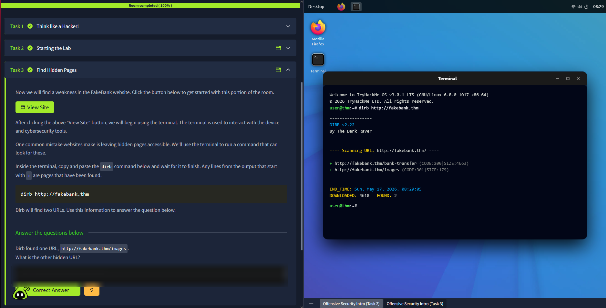
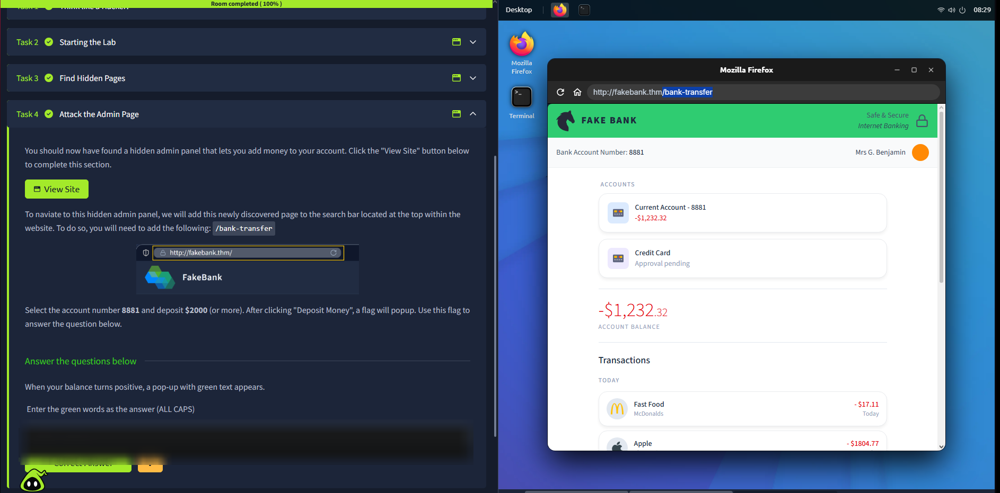
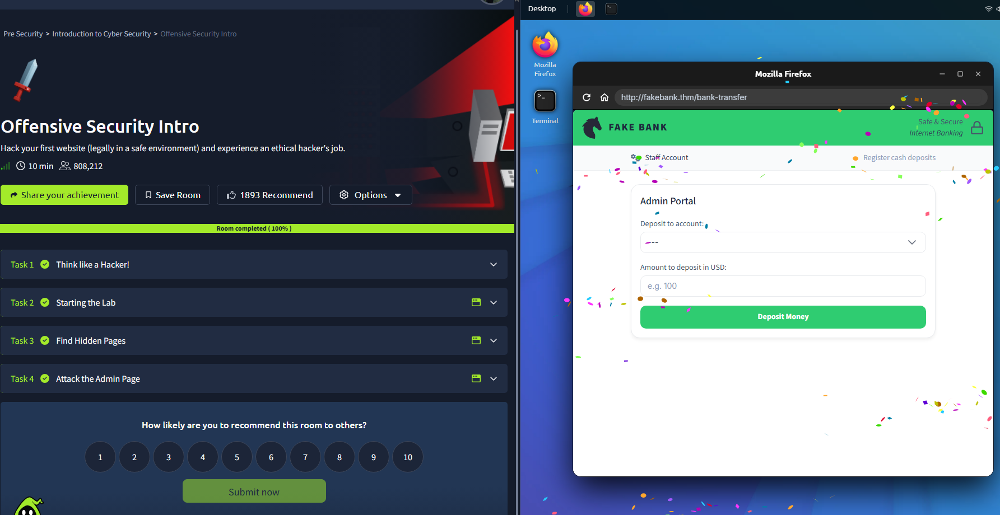

# Offensive Security Intro

Room link: https://tryhackme.com/room/offensivesecurityintrokKx12l39

## Executive Summary
- This room introduces the offensive security mindset: how attackers enumerate, identify weaknesses, and exploit them.
- The hands-on lab uses a small FakeBank web app to show why hidden pages are still part of the attack surface.
- We perform basic content discovery with `dirb` and find an unlinked endpoint (`/bank-transfer`).
- We then use that endpoint to change the account balance and complete the objective.
- Takeaway: security-by-obscurity is not a control; authorization must be enforced server-side.

## Room Information
- Type: Walkthrough
- Path: Pre Security -> Module 1 (Introduction to Cyber Security)
- Difficulty: Info
- Tools used: `dirb`, browser

## Walkthrough (Task-by-task)

### Task 1 - Think like a Hacker!
**Goal:** Understand the attacker mindset (enumerate -> identify -> exploit).

### Task 2 - Starting the Lab
**Goal:** Start the lab environment and confirm access to the FakeBank site.

### Task 3 - Find Hidden Pages
**Goal:** Discover hidden or unlinked paths on `http://fakebank.thm`.

**Steps**
1. Run directory brute-forcing:
   - `dirb http://fakebank.thm`
2. Review results; lines starting with `+` are discovered paths.

**Evidence**
1. `dirb` results show `http://fakebank.thm/bank-transfer` (in addition to `/images`).

**Answer**
- Other hidden URL: `http://fakebank.thm/bank-transfer`

### Task 4 - Attack the Admin Page
**Goal:** Use the discovered admin-like page to add money and reveal the green success popup.

**Steps**
1. Open `http://fakebank.thm/bank-transfer` in the browser.
2. Select account `8881`.
3. Deposit `$2000` (or more).
4. When the balance becomes positive, capture the green popup text.

**Evidence**
1. FakeBank `/bank-transfer` page is reachable directly (unlinked).

2. Successful deposit screen.

## Security Notes (Portfolio layer)

### What went wrong (conceptually)
- Hidden page does not mean protected page. Content discovery quickly reveals unlinked endpoints.

### Impact (real-world analogy)
- Exposed administrative or sensitive endpoints can enable unauthorized actions (fund transfers, data modification, privilege abuse).

### Fix / Mitigations
- Enforce authorization checks server-side (role checks plus object-level checks).
- Remove or disable admin or debug endpoints in production.
- Add monitoring and alerting for suspicious discovery patterns (for example unusual 404 volume).

### How to test (quick validation plan)
- Attempt direct access to sensitive endpoints as an unauthenticated user; verify `403` (or safe redirect).
- Verify authorization is enforced even if the endpoint is discovered via brute-force.
- Add automated tests that cover access control on admin routes.
