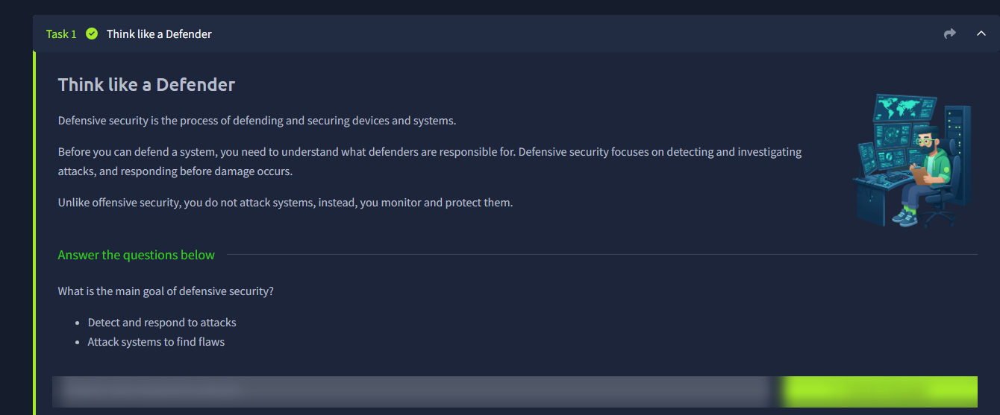
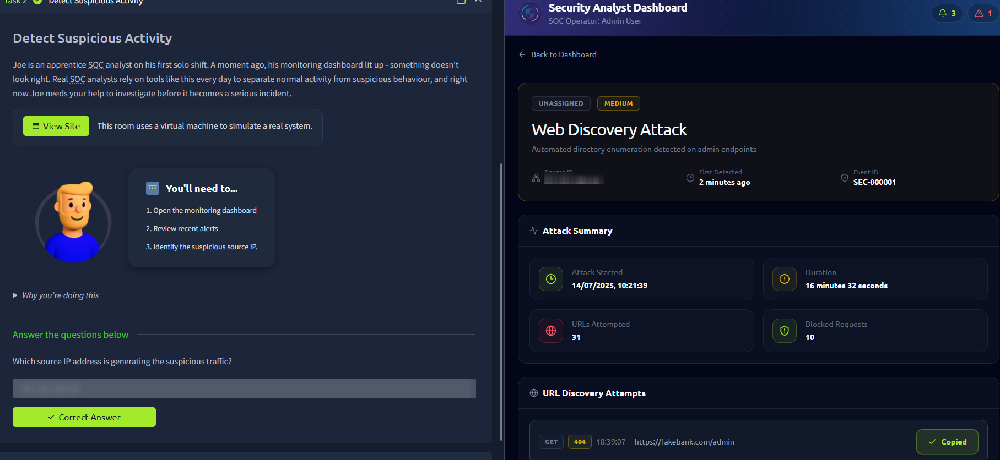
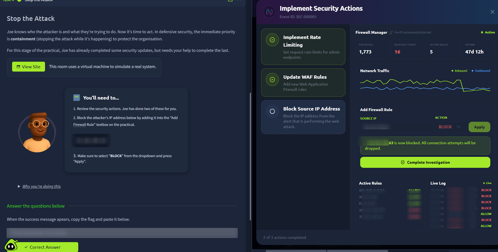

# Defensive Security Intro

Room link: https://tryhackme.com/room/defensivesecurityintro

## Executive Summary
- This room introduces defensive security fundamentals: monitoring, investigating, and responding to threats.
- The practical flow follows a SOC analyst workflow: detect suspicious activity, identify attacker behavior, and contain the incident.
- Key takeaway: defensive security is about reducing impact quickly through visibility and response, not attacking systems.

## Room Information
- Type: Walkthrough
- Path: Pre Security -> Module 1 (Introduction to Cyber Security)
- Difficulty: Info

## Walkthrough (Task-by-task)

### Task 1 - Think like a Defender
Defensive security is the process of defending and securing devices and systems.

Before you can defend a system, you need to understand what defenders are responsible for. Defensive security focuses on detecting and investigating attacks, and responding before damage occurs.

Unlike offensive security, you do not attack systems, instead, you monitor and protect them.

**Question**
- What is the main goal of defensive security?

**Answer**
- Detect and respond to attacks

**Evidence**

### Task 2 - Detect Suspicious Activity
Joe is an apprentice SOC analyst on his first solo shift. A moment ago, his monitoring dashboard lit up - something does not look right.

Real SOC analysts rely on tools like this every day to separate normal activity from suspicious behaviour, and right now Joe needs your help to investigate before it becomes a serious incident.

You will need to:
1. Open the monitoring dashboard.
2. Review recent alerts.
3. Identify the suspicious source IP.

**Question**
- Which source IP address is generating the suspicious traffic?

**Answer**
- [REDACTED]

**Evidence**

### Task 3 - Identify the Attack
Joe has spotted suspicious activity, but he still needs to identify what kind of attack is underway.

You will need to:
1. Investigate the attack that has occurred.
2. View the URL Discovery Attempts list.
3. Check the latest URL Discovery Attempts entry.

**Question**
- Copy the latest URL that the attacker has tried to find.

**Answer**
- [REDACTED]

### Task 4 - Stop the Attack
Now it is time for containment. Joe has already completed some security updates, but needs help to finish the last step.

You will need to:
1. Review the security actions.
2. Add the attacker IP into the Add Firewall Rule textbox.
3. Select `BLOCK` and click `Apply`.

**Question**
- When the success message appears, copy the flag and paste it.

**Answer**
- [REDACTED]

**Evidence**

## Security Notes (Portfolio layer)

### What happened
- A web directory discovery pattern triggered alerts and exposed an active probing attempt.

### Why this matters
- Early detection plus fast containment prevents reconnaissance from escalating into exploitation.

### Defensive controls
- Alert triage, source attribution, and firewall blocking are core first-response controls.

