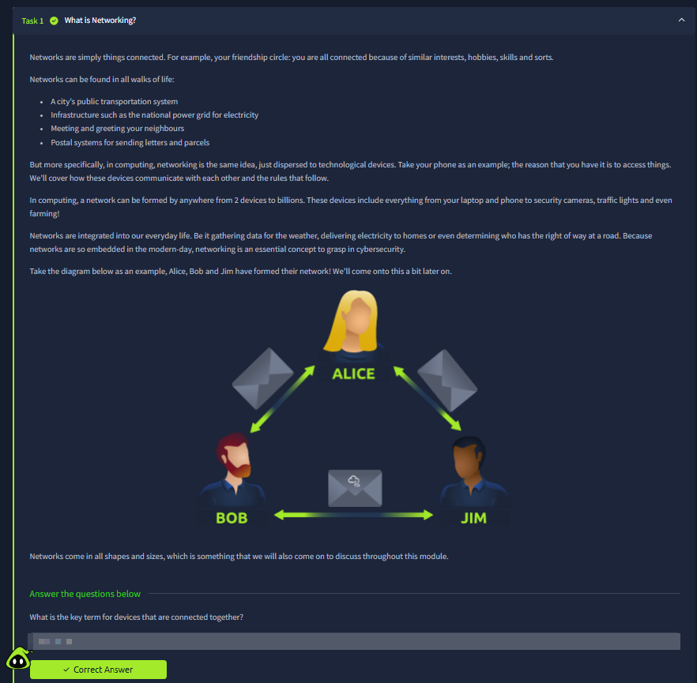
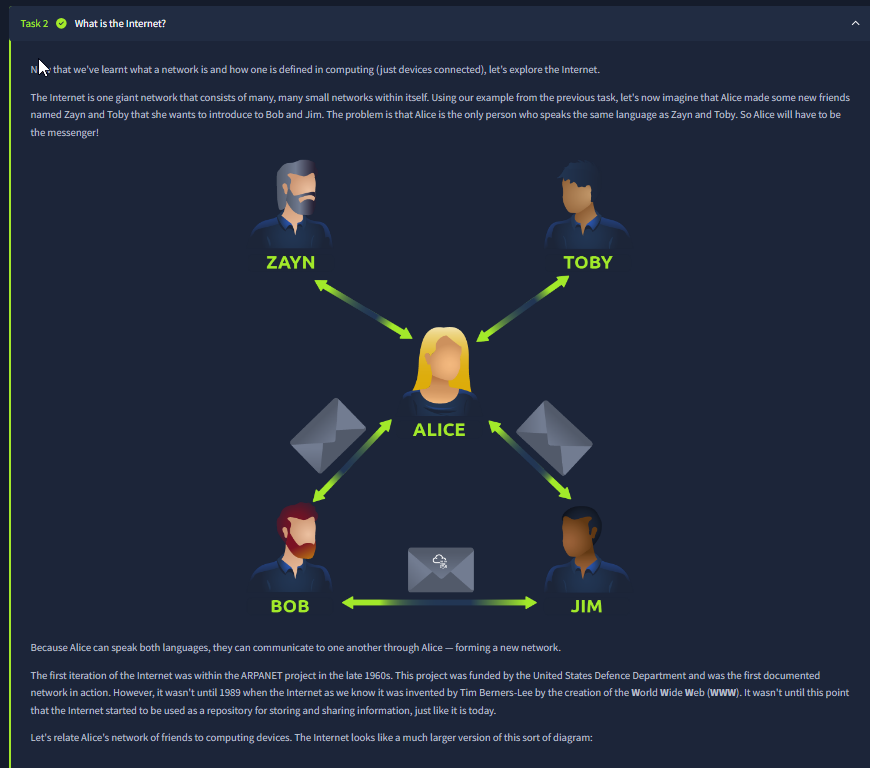
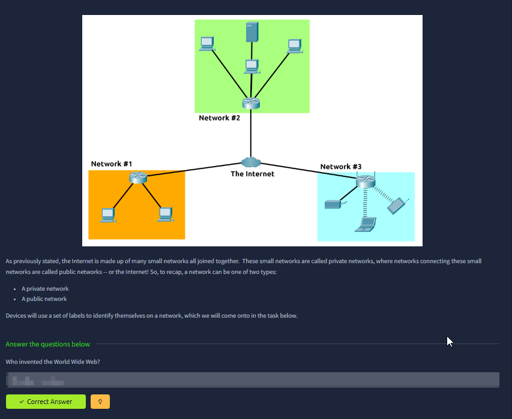
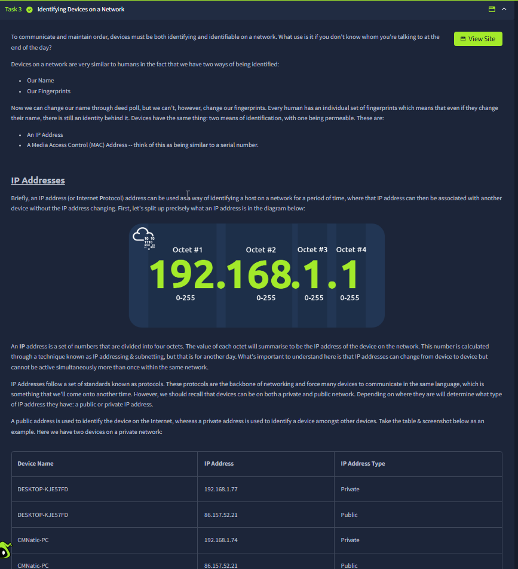
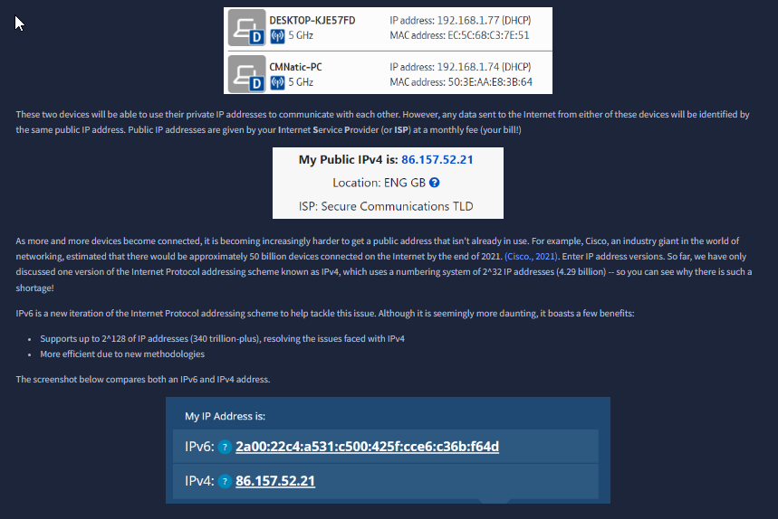
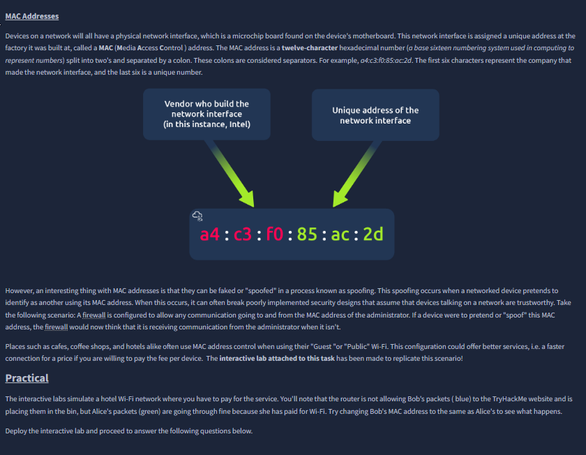
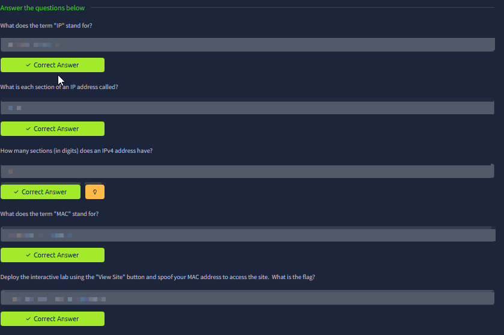
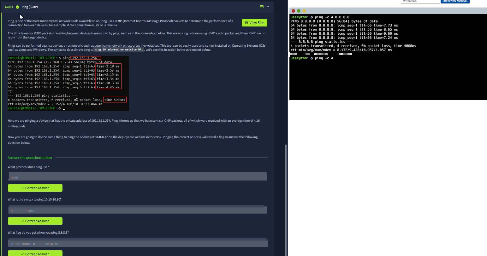

# What is Networking?

Room link: https://tryhackme.com/room/whatisnetworking

## Executive Summary
- This room establishes what “networking” means in computing: multiple devices connected by rules/protocols so they can exchange data.
- It introduces the Internet as “networks of networks” and clarifies **private vs public** networks at a high level.
- It then focuses on identity: **IP addresses** (logical identifiers) vs **MAC addresses** (hardware/interface identifiers), and why both exist.
- The practical piece uses `ping` to demonstrate **ICMP** as a basic connectivity check and a common troubleshooting primitive.
- AppSec takeaway: understanding addressing + reachability is foundational for threat modeling, logging, and debugging “it works on my machine” issues that are actually network boundaries.

## Room Information
- Type: Walkthrough
- Path: Pre Security -> Module 2 (Network Fundamentals)
- Difficulty: Info
- Topics: Internet basics, public/private networking, IP/MAC identity, ICMP/ping

> Note: quiz answers were blurred before publication. The focus below is the concept shown in each screenshot, not the hidden answer text.

---

## Evidence (1–8) + detailed analysis

### 1) Defining “networking” (connection + rules)

What you see:
- The room explains networking as “things connected,” then pivots to computing: devices connected to share data.
- A simple diagram (Alice/Bob/Jim) illustrates communication lines between participants.

What it’s really teaching:
- “Networking” is not the Internet only. It’s the general concept of **connectivity + communication rules**.
- The diagram is intentionally simple: it’s building intuition for “nodes” and “links” before adding complexity like routers, addressing, and protocols.

Why this matters (practical + security):
- In AppSec, we constantly assume connectivity: browser ↔ API ↔ database. If you can’t reason about what’s connected and how, debugging and threat modeling gets fuzzy.
- The “rules” part is the seed for protocols: devices need agreed formats to exchange data safely and predictably.

---

### 2) The Internet = many networks joined together

What you see:
- Multiple distinct networks (Network #1/#2/#3) connected through “The Internet.”
- Text explains the Internet as interconnected smaller networks and introduces the idea of private/public networks.

Key idea:
- The Internet is not one giant LAN; it’s a federation of networks connected via routing.
- This is where “trust boundaries” begin to exist: private networks usually have more trust assumptions than public networks.

Why this matters:
- When an application says “internal only,” it usually means “reachable only from a private network segment” — and that can be true or false depending on routing/firewalling.
- Many vulnerabilities are basically “boundary failures” (e.g., internal admin panels exposed to the public Internet).

---

### 3) MAC addresses: interface identity (Layer 2)

What you see:
- A MAC address example broken into two conceptual parts:
  - vendor/manufacturer prefix
  - unique interface identifier
- The room mentions spoofing and sets up a practical scenario.

What it means:
- A MAC address identifies a **network interface** on a local network segment.
- It’s used for local delivery (frames) and is different from IP (packets).

Security angle:
- The room hints at a key reality: MAC addresses can be **spoofed**. If a network’s access control trusts MAC too much (e.g., “allow Alice’s MAC”), it’s weak.
- This is an early intro to “identity vs authentication”: an identifier alone is not proof.

---

### 4) Public vs private IP + IPv4 vs IPv6 (address space pressure)

What you see:
- Devices inside a private network with private IPs, plus a “My Public IPv4 is …” box.
- A section comparing IPv4 and IPv6 addresses.

What it’s really teaching:
- Devices on a home/office LAN use **private IP addresses**.
- Outbound Internet traffic typically appears as a single **public IP** (your ISP-facing identity).
- IPv6 exists largely to address scale and addressing limitations of IPv4.

Why this matters:
- “Where is the user coming from?” depends on where you observe: internal logs might show private IPs; edge services might see public IPs.
- In incident response and abuse detection, mixing these contexts up leads to wrong conclusions.

---

### 5) Ping (ICMP) basics: a primitive for reachability

What you see:
- The room introduces ping and shows an example command output.
- On the right, there’s a terminal running pings (including a public target), demonstrating packet counts/latency.

Interpretation:
- `ping` sends ICMP Echo Requests and expects Echo Replies.
- It’s a **reachability** test, not a full application health check: success means “some path exists and responses return,” not “HTTP works.”

Why this matters:
- In troubleshooting, ping is often step 0: “Can we even reach the host?”
- In security, ICMP visibility can reveal network mapping, and blocking/allowing ICMP is a policy choice (it affects diagnostics).

---

### 6) Knowledge check: terminology reinforcement (blurred)

What you see:
- A quiz block asking about terms like IP and MAC and some fundamentals.

What it validates:
- That you can name the core building blocks (IP, octets, MAC) because later rooms assume them.

How to think about it:
- These terms are not trivia; they’re the words you need to describe problems precisely (e.g., “wrong octet,” “MAC spoofing,” “private vs public IP”).

---

### 7) IP addresses as logical identifiers (structure + octets)

What you see:
- A section titled “Identifying Devices on a Network.”
- An IPv4 example broken into octets (0–255 each), plus a table of devices and their IP address types.

Interpretation:
- IP addresses identify a host **logically** (at Layer 3) and can change when a device moves networks.
- Octets are simply a human-friendly representation of the underlying 32-bit IPv4 value.

Why this matters:
- Access control rules, logs, and network policies commonly operate at the IP level.
- You need this mental model before learning subnetting, gateways, routing, and segmentation.

---

### 8) The Internet story as a communication problem (conceptual model)

What you see:
- A story-style explanation using people (Alice/Zayn/Toby/Bob/Jim) and arrows to represent message passing.
- It frames the Internet as a bigger version of “connected groups” with shared rules/languages.

What it’s really teaching:
- The hard part of global communication is interoperability: shared conventions/protocols and relays (routers) enable “different groups” to communicate.

Why this matters:
- This directly maps to protocol stacks: you can’t secure what you can’t model.
- In threat modeling, we start by mapping who talks to whom, over which channels, and what assumptions exist at each boundary.

---

## Summary
This room is a foundation layer: it establishes what a network is, what the Internet is, and how device identity works (IP vs MAC). It also introduces ICMP/ping as a baseline connectivity tool. These concepts become the prerequisites for everything that follows in networking and web security (routing, subnetting, DNS, HTTP, logging, segmentation).
