# Intro to LAN

Room link: https://tryhackme.com/room/introtolan

## Executive Summary
- This room is a practical introduction to how devices communicate inside a **Local Area Network (LAN)**.
- It builds a mental model you’ll reuse later for troubleshooting and security: topology → switch/router roles → subnetting → ARP → DHCP.
- For AppSec, this matters because a lot of “application issues” are actually network reachability, segmentation, or configuration problems.

> Note: answer boxes were intentionally blurred before publication. The focus below is the concept shown in each screenshot, not the hidden quiz text.

---

## Evidence (1–11) + detailed analysis

### 1) Star topology (single point of dependency)
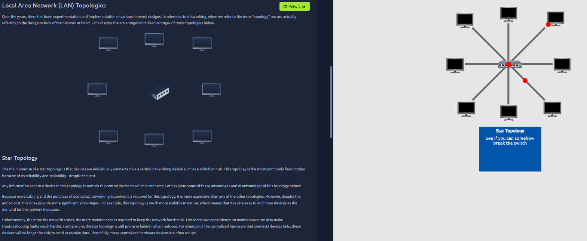

What you see:
- Devices connect into a single central device (typically a switch).
- The exercise hints at breaking the center device to observe the impact.

What it means:
- Endpoints are isolated from each other’s failures, but the central switch becomes a **single point of failure**.

Why this matters:
- Availability: a switch failure can take down an entire segment.
- Security/ops: central switching is where monitoring and segmentation often start.

---

### 2) Bus topology (shared medium)
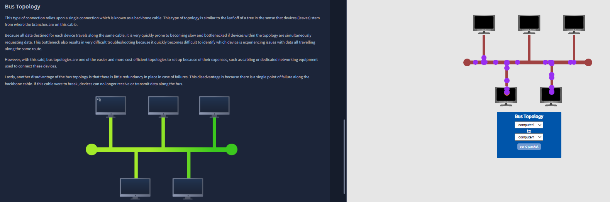

What you see:
- Multiple devices share a single backbone.

What it means:
- A shared medium increases contention and makes fault isolation harder as the network grows.

Why this matters:
- Reliability: one break can affect everyone.
- Historically, shared-medium networks make sniffing/eavesdropping easier to reason about.

---

### 3) Ring topology (failure ripple)
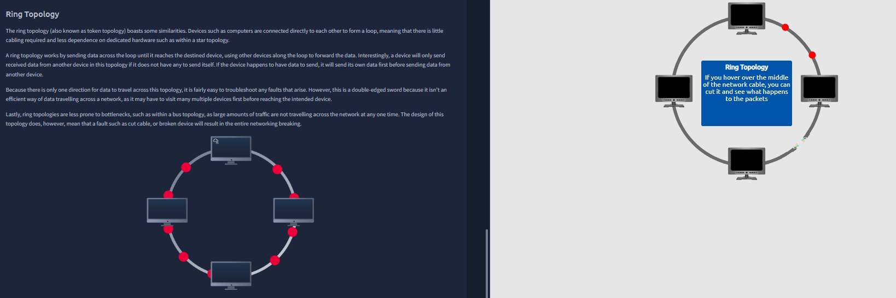

What you see:
- Devices form a loop; the exercise suggests cutting a link.

What it means:
- Without redundancy, a single break can disrupt the whole ring.

Why this matters:
- Reinforces that network design choices define resilience under failure.

---

### 4) Switch vs Router (Layer 2 vs Layer 3 roles)
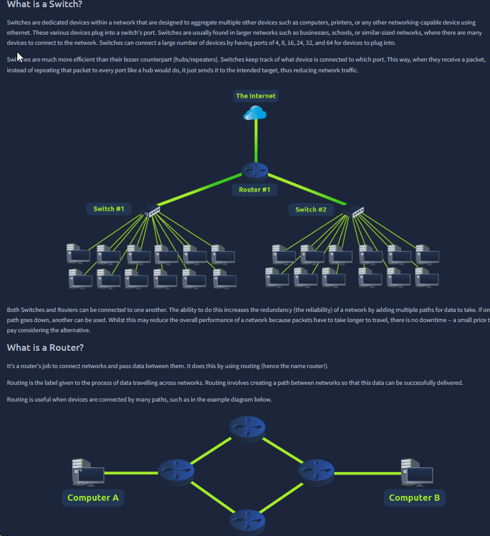

What you see:
- Visual comparison: switch fans out within a LAN; router connects different networks.

What it means:
- Switch: local delivery within the LAN.
- Router: sends packets between networks/subnets; the decision point for “local vs remote”.

Why this matters in practice:
- Many “can’t access service” bugs are routing, gateway, or segmentation issues.

---

### 5) Topology/routing vocabulary check (blurred)
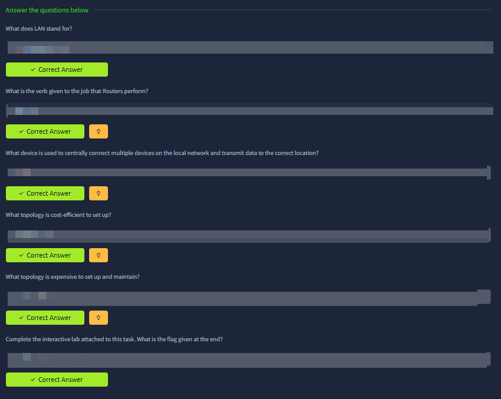

What this is validating:
- That you can distinguish topology tradeoffs and device roles (switch vs router) instead of memorizing terms.

---

### 6) Subnetting primer (splitting networks intentionally)
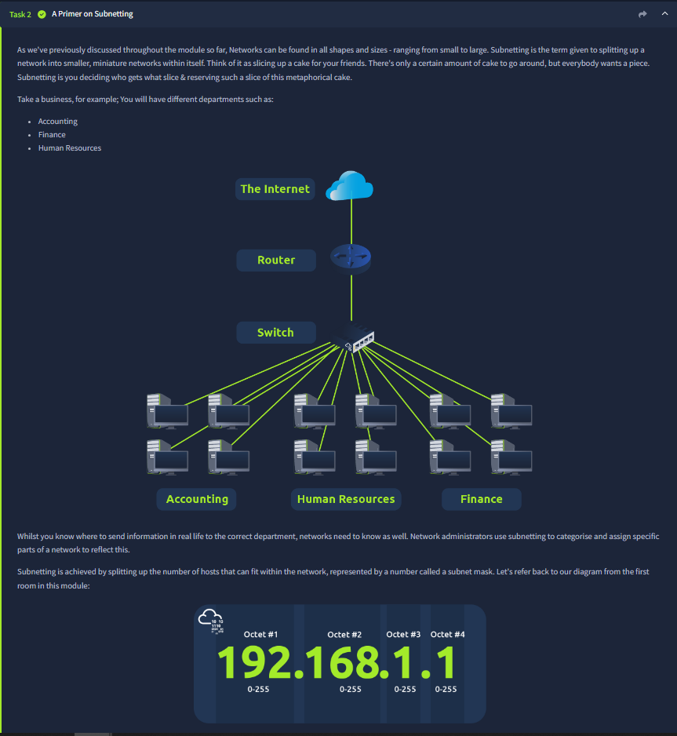

What you see:
- Analogy: splitting a business into departments = splitting a network into subnets.

What it means:
- Subnetting creates manageable boundaries: less broadcast noise, clearer policy zones, cleaner troubleshooting.

Security angle:
- Subnets are often the basis of segmentation (users vs servers vs management).

---

### 7) Network/Host/Gateway roles (how addresses are used)
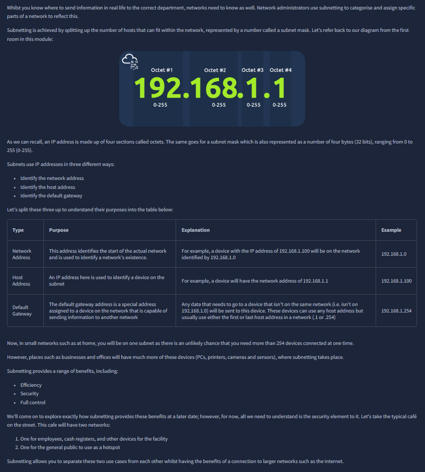

What you see:
- IPv4 broken into octets, plus roles: network address, host address, default gateway.

What it means:
- The **default gateway** is where traffic goes when the destination is not local.
- Subnetting is about deciding what “local” means.

---

### 8) Subnetting knowledge check (blurred)
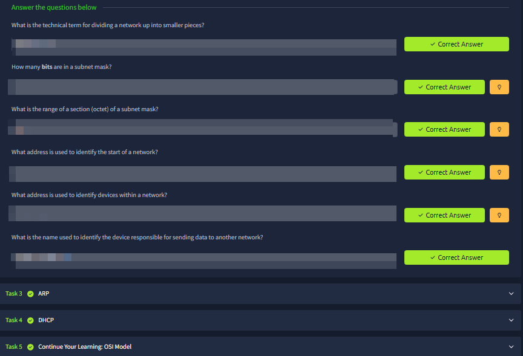

What this is validating:
- You can connect subnet mask concepts to the practical “local vs remote” decision.

---

### 9) ARP (IP ↔ MAC mapping inside the LAN)
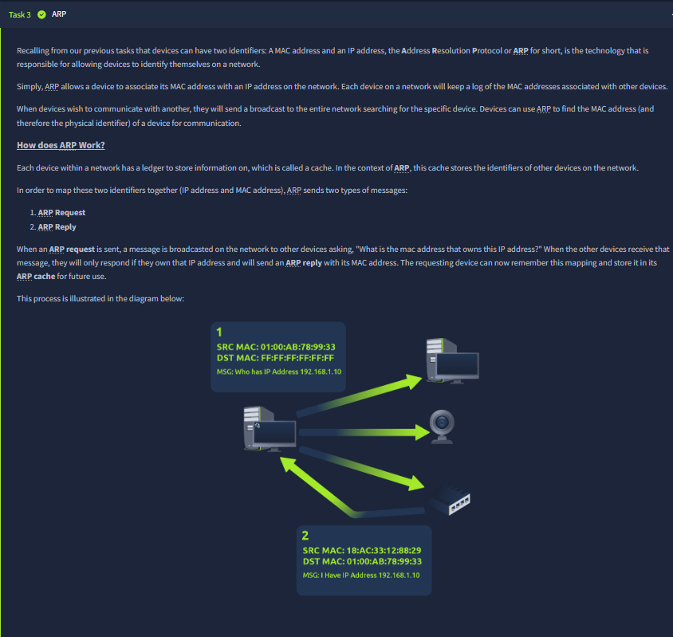

What you see:
- ARP request/reply flow and caching.

What it means:
- IP identifies the target logically, but Ethernet delivery needs a MAC address.
- ARP bridges that gap on the local network.

---

### 10) ARP knowledge check (blurred)
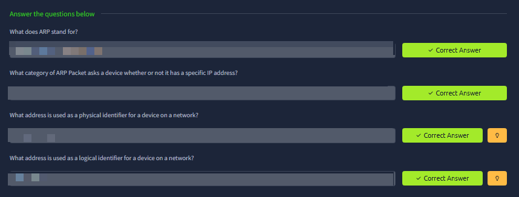

What this is validating:
- You can distinguish MAC (physical identifier) vs IP (logical identifier) and understand ARP’s role.

---

### 11) DHCP (automatic configuration) + knowledge check (blurred)
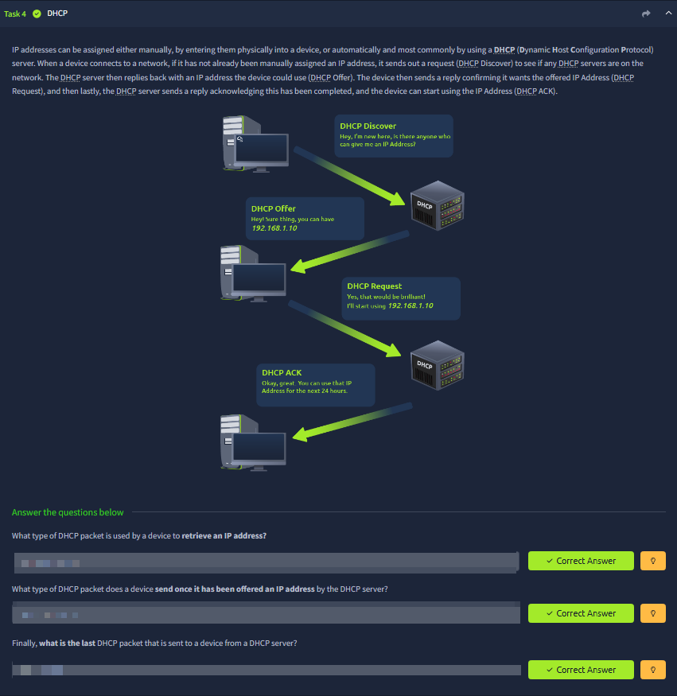

What you see:
- DORA flow: Discover → Offer → Request → ACK.

What it means:
- DHCP automates IP configuration for hosts joining a network.

Security angle:
- Rogue DHCP can influence gateway/DNS and redirect traffic; configuration is power.

---

## Summary
This room connects topology + device roles + subnetting + ARP + DHCP into one mental model for how LAN communication actually works.
