# OSI Model

Room link: https://tryhackme.com/room/osimodelzi

## Executive Summary
- This room teaches the **OSI model** as a practical framework for reasoning about where communication breaks and where security controls apply.
- The goal isn’t memorization; it’s to build “layer thinking”: *what is being addressed, routed, transported, and finally interpreted by the application?*
- AppSec takeaway: many bugs are really **layer mismatches** (trust assumed at the wrong layer, validation applied at the wrong layer, or controls placed where they don’t help).

> Note: any quiz answers/flags are blurred in screenshots. The captions focus on the concept shown, not the hidden answer text.

---

## Evidence (1–11) + detailed analysis

### 1) Why layers exist (a shared troubleshooting language)
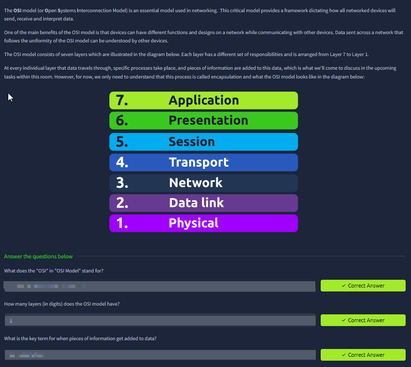

What you see:
- The room frames OSI as a standard way to describe communication problems.

What it means:
- Layers help you say *what kind* of failure you have without guessing:
  - “Link down” (physical/data link),
  - “No route” (network),
  - “Port closed” (transport),
  - “TLS handshake fails” (presentation),
  - “HTTP 403 / auth failure” (application).

Why this matters in AppSec:
- It prevents false security assumptions (e.g., “it’s internal so it’s safe” → network layer trust instead of application-layer auth).

---

### 2) OSI overview (seven buckets, one mental model)
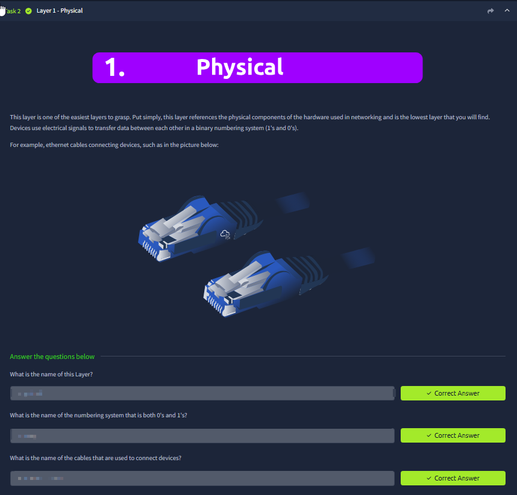

What you see:
- A diagram listing the seven OSI layers from physical → application.

How to interpret it (without memorizing):
- Each layer answers a different question:
  - Physical: “how do bits move?”
  - Data link: “how do neighbors talk locally?”
  - Network: “how do we reach another network?”
  - Transport: “which service/port and delivery behavior?”
  - Session: “how do we keep a conversation state?”
  - Presentation: “how is data encoded/encrypted?”
  - Application: “what does the app protocol mean?”

---

### 3) Physical layer (media, signal, reliability)
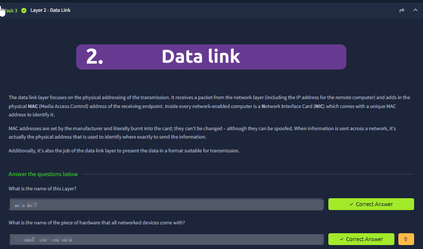

What you see:
- Physical transport types (copper/fiber/wireless) and why the medium matters.

Why it matters:
- Many “app bugs” are actually physical instability (Wi‑Fi drops, bad cable, interference).
- Physical access is also a security boundary: if an attacker can connect, they can often become “inside” very quickly.

---

### 4) Data link layer (frames, MAC, local switching)
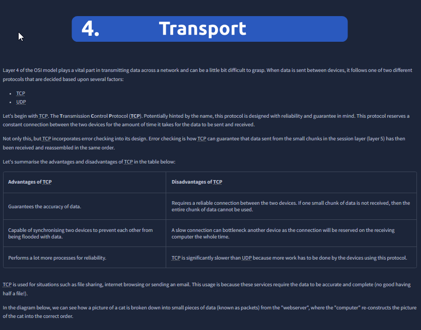

What you see:
- Concepts around frames/MAC and local segment delivery.

Interpretation:
- L2 is where switching lives; it’s the “local neighborhood.”
- MAC is an identifier, not authentication (spoofing is possible).

Security angle:
- VLAN boundaries, ARP behavior, and local MITM-style risks are rooted here.

---

### 5) Network layer (IP + routing between networks)
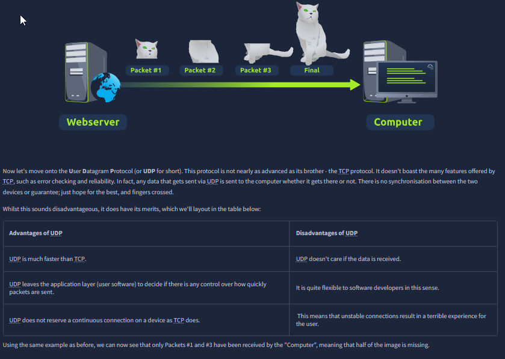

What you see:
- IP addressing and routing decisions are introduced/visualized.

Interpretation:
- L3 answers “where is the destination network and which next hop do we take?”

AppSec mapping:
- Many exposures are routing/segmentation failures (admin routes exposed publicly).
- Threat model trust zones often align with routed boundaries plus firewall rules.

---

### 6) Transport layer (TCP/UDP, ports, delivery semantics)
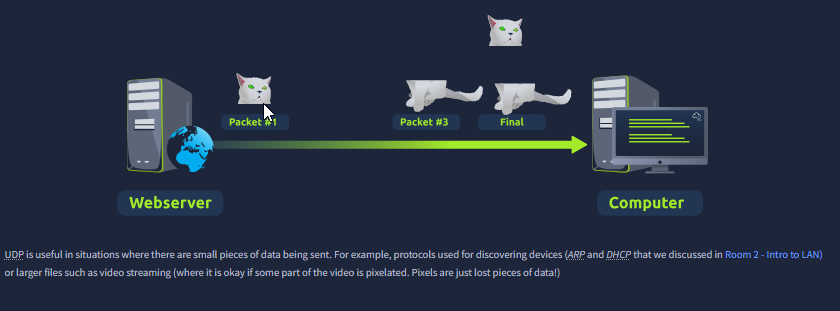

What you see:
- TCP vs UDP and the concept of ports as service selectors.

Interpretation:
- TCP provides reliable delivery semantics (handshake, ordering).
- UDP is lighter-weight but doesn’t guarantee delivery.

Security angle:
- A lot of policy is L4: “allow 443/tcp,” rate-limits, timeouts, scanning detection.

---

### 7) Session layer (conversation state)
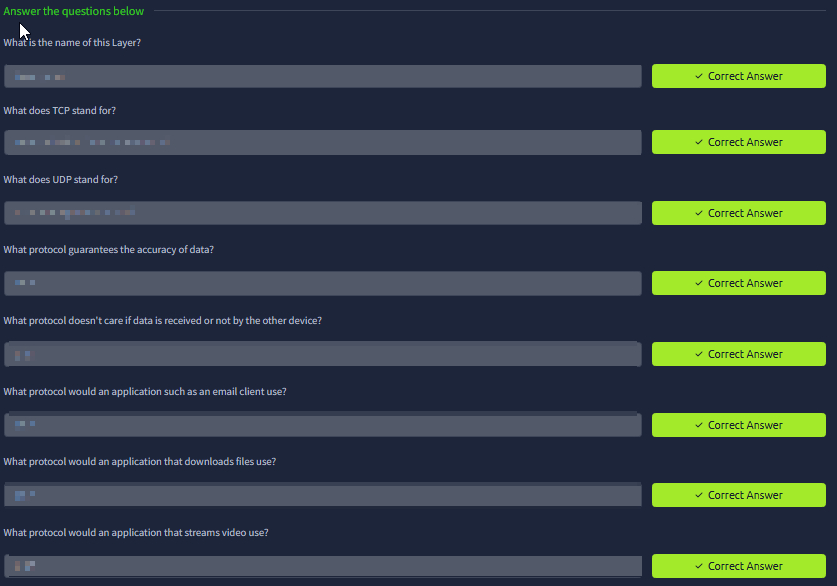

What you see:
- Session is described as maintaining state across multiple exchanges.

Why it matters:
- It helps explain why “one request” ≠ “one conversation.”

AppSec angle:
- Application sessions (cookies/tokens) are not the same as OSI session, but the mental model helps reason about state, timeouts, and termination.

---

### 8) Presentation layer (format + encryption)
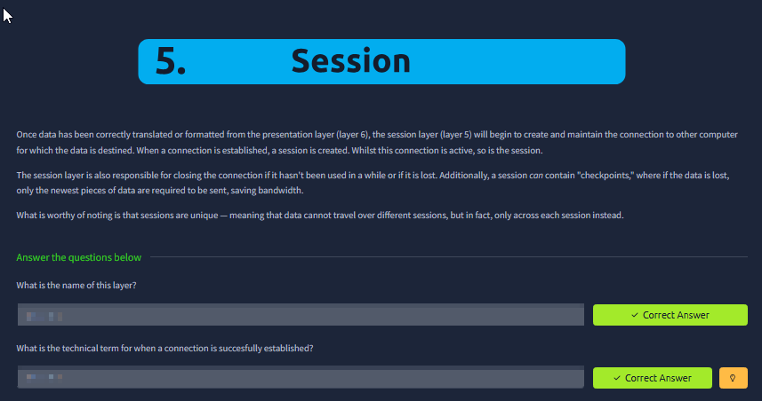

What you see:
- Data representation and encryption concepts.

Interpretation:
- Encoding/serialization and TLS/crypto live here conceptually.

Security angle:
- Real bugs here include parsing differences, encoding confusion, insecure serialization, and TLS misconfigurations.

---

### 9) Application layer (protocol meaning: HTTP/DNS/SMTP…)
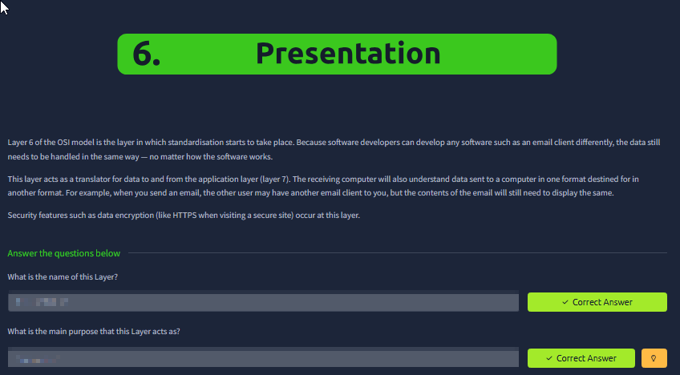

What you see:
- Application protocols are introduced as “what users/applications actually interact with.”

AppSec mapping:
- Most web vulns we report (XSS/SQLi/CSRF/access control) are application-layer issues.
- Fixes usually must happen here even if the symptom appears lower (e.g., firewall blocks ≠ proper auth).

---

### 10) Mapping a real request across layers
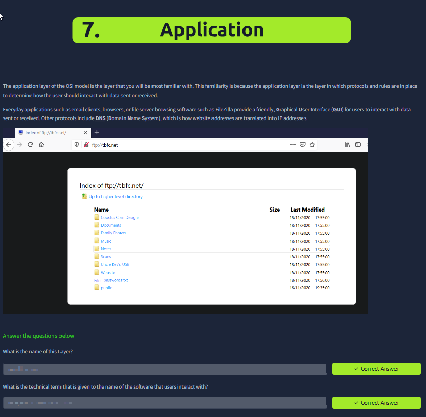

What you see:
- A practical mapping exercise (browser → HTTP → TCP → IP → Ethernet/Wi‑Fi).

Why it matters:
- This is the real skill: taking an observed failure and knowing what layer to test next (DNS, TCP connect, TLS, HTTP status, app logs).

---

### 11) Knowledge check (blurred)
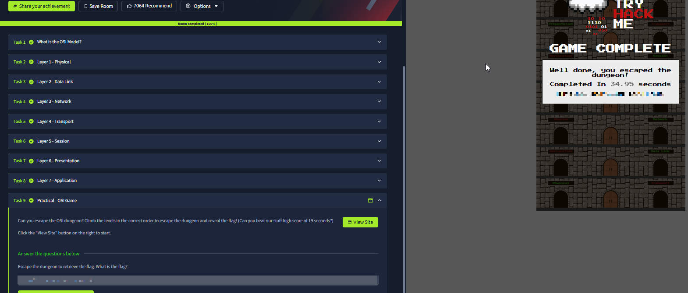

What it validates:
- You can map common identifiers (MAC, IP, port, protocol) to the correct layer and avoid mixing concepts.

---

## Summary
The OSI model is useful only if it changes your behavior:
- isolate problems systematically,
- place controls at the right layer,
- avoid trusting the wrong layer.

This becomes a baseline skill for threat modeling, debugging, and writing confident security reports.
