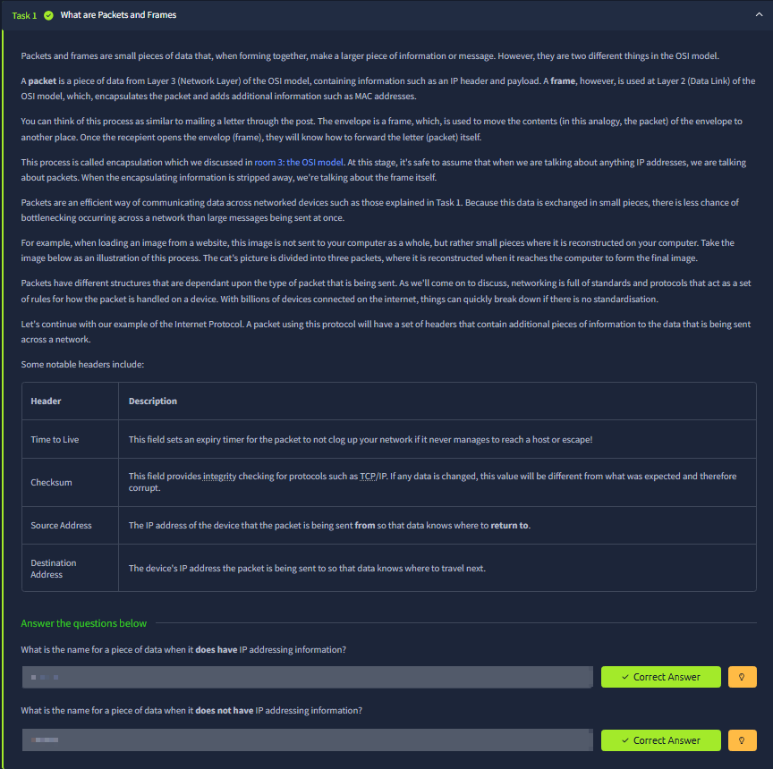
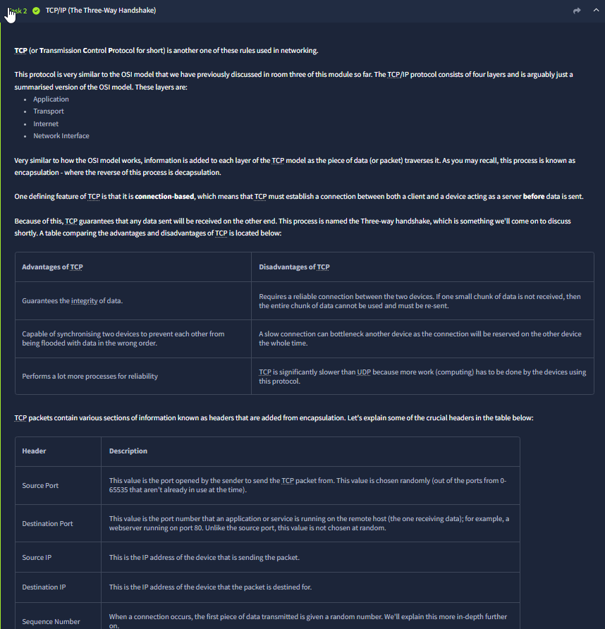
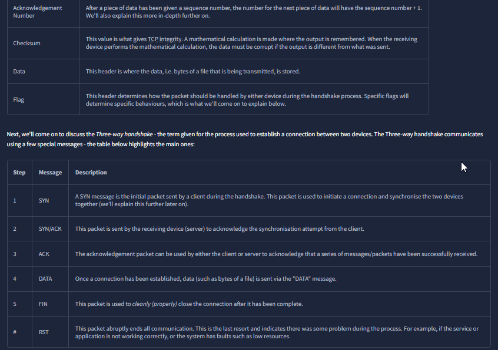
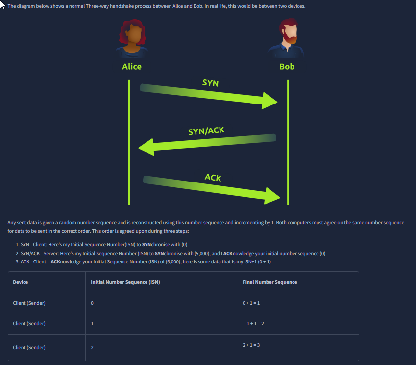
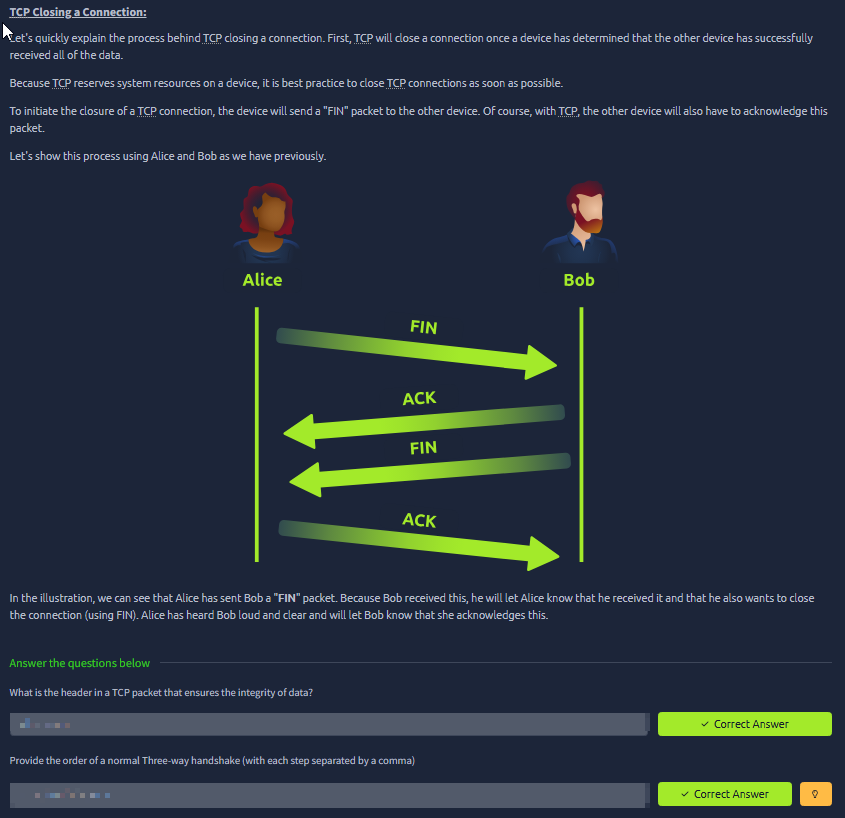
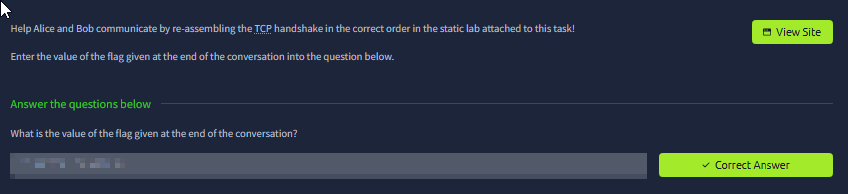
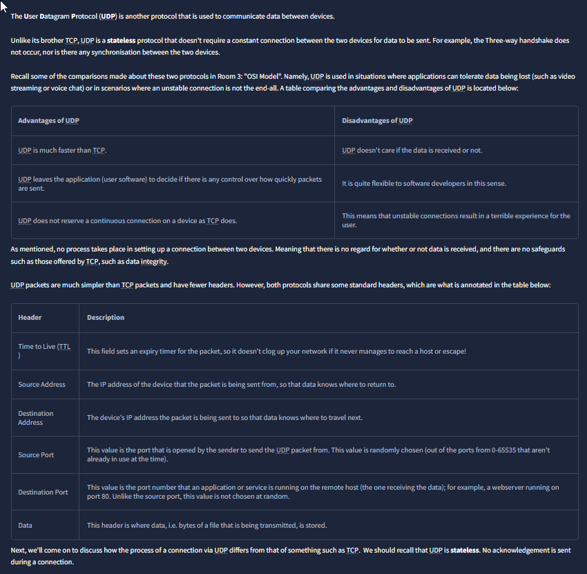
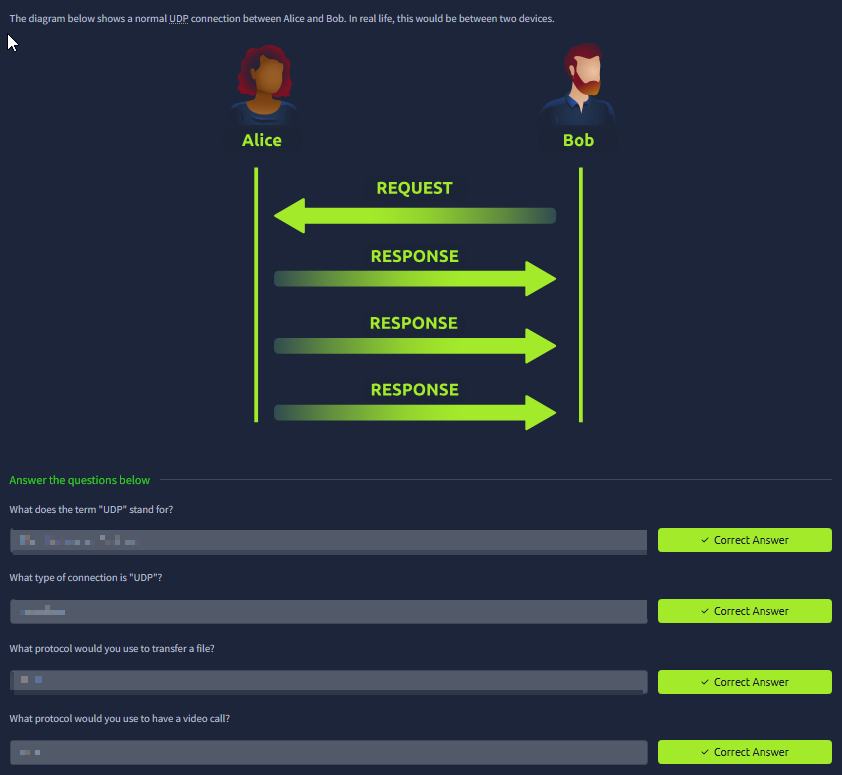
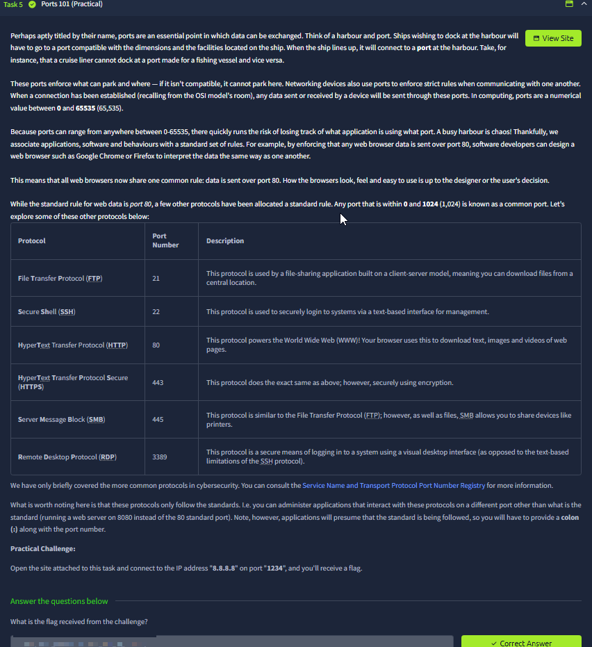

# Packets & Frames

Room link: https://tryhackme.com/room/packetsframes

## Executive Summary
This room ties together the "OSI Model" concepts by focusing on how data is actually moved across networks:

- **Packets vs Frames** and why we use them (efficiency + addressing)
- **Encapsulation** (each layer adds its own metadata)
- **TCP** vs **UDP** in a practical way (reliability vs speed)
- Why **ports** exist and how they map network traffic to the correct application/service

Even for AppSec, this matters because many real vulnerabilities are rooted in "layer confusion":
trusting the wrong layer for identity, placing controls at the wrong layer, or misunderstanding what a firewall can and cannot protect.

---

## Evidence (1–9) + detailed analysis

### 1) Packets vs Frames (OSI context + headers that matter)

What you see:
- The room introduces the difference between **packets** and **frames** and connects it back to OSI:
  - Packet ≈ Layer 3 (Network), includes IP-level addressing information.
  - Frame ≈ Layer 2 (Data Link), wraps a packet for delivery inside a local network (MAC-level delivery).

Key concepts shown in the table (why these headers exist):
- **Time To Live (TTL):** prevents a packet from looping forever due to routing mistakes. Every router hop typically reduces TTL.
- **Checksum:** integrity check so corrupted data is detectable.
- **Source Address / Destination Address:** the "return address" and the "target address" at the IP level.

Why this matters (practical thinking):
- If you’re dealing with **IP addresses**, you’re usually talking about packets and Layer 3 routing.
- If you’re dealing with **MAC addresses**, you’re usually in Layer 2 local delivery.

Security angle:
- TTL and routing behavior is one reason why scanning and traceroute can reveal network layout.
- Checksums highlight that corruption detection exists, but it’s not the same as cryptographic integrity (TLS/HMAC). Attackers can still alter packets and recompute checksums in many contexts.

---

### 2) TCP/IP model + TCP is connection-based

What you see:
- A short recap that TCP/IP is often presented as a simplified model, and then a focus on **TCP** being **connection-based**.
- A table comparing TCP pros/cons and a table of common TCP header fields.

Interpretation:
- Connection-based means both sides agree on parameters before data flows (this sets up the **three-way handshake**).
- The TCP header fields listed (ports, IPs, sequence-related fields) exist so TCP can deliver reliably and in-order.

AppSec mapping:
- A ton of "network controls" are implemented using TCP assumptions: sessions, timeouts, rate-limits, load balancer health checks.
- Understanding that TCP has state helps you understand certain defenses (and why stateless UDP behaves differently).

---

### 3) TCP control flags + handshake/teardown vocabulary

What you see:
- A table listing TCP message types/flags used across the lifecycle:
  - **SYN** (start connection)
  - **SYN/ACK** (server acknowledges + synchronizes)
  - **ACK** (acknowledgement)
  - **DATA** (payload)
  - **FIN** (clean close)
  - **RST** (abrupt reset)

How to read this:
- These flags are TCP’s “language” for building and closing a reliable channel.
- **RST** is important because it often appears when something actively rejects a connection (or a middlebox interferes).

Security angle:
- Seeing repeated **RST** responses can indicate filtering, firewall behavior, or a service that is down.
- These flags are also the basis for many IDS/IPS signatures and stateful firewall behavior.

---

### 4) The TCP three-way handshake (SYN → SYN/ACK → ACK)

What you see:
- A visual diagram showing Alice ↔ Bob completing:
  1) SYN
  2) SYN/ACK
  3) ACK
- A note about sequence numbers and why both sides need to agree to reconstruct data.

Why the handshake exists:
- It establishes that:
  - both sides can send/receive,
  - both sides agree on initial sequence numbers,
  - the connection can now carry reliable, ordered data.

AppSec/infra angle:
- Handshake behavior is why "is the port open?" can be tested without speaking application protocols.
- It’s also why SYN flood attacks exist: making servers allocate state for half-open connections.

---

### 5) TCP connection closing (FIN + ACK sequence)

What you see:
- A diagram showing a clean TCP close: FIN/ACK exchanges between Alice and Bob.

Why it matters:
- TCP keeps state and can hold resources. Clean closure prevents unnecessary resource consumption.
- In production systems, "leaky" connections can cause performance issues that look like "the app is slow" but are actually transport-layer exhaustion.

Security angle:
- Connection management issues can contribute to DoS conditions.
- Some security tools rely on normal close behavior; abnormal resets can interfere with logging/telemetry.

---

### 6) Practical task completion (static lab / flag prompt)

What you see:
- The room prompts you to reassemble a TCP exchange in the correct order using an interactive/static lab.

What this is teaching (even without the answer text):
- You are forced to internalize the correct ordering of TCP lifecycle messages.
- It’s a hands-on way to convert “I read it once” into “I can recognize it in a capture/log.”

Security angle:
- This skill translates directly into reading Wireshark captures and diagnosing handshake failures.

---

### 7) UDP recap + shared headers with TCP

What you see:
- UDP is described as **stateless** (no handshake, no connection state).
- A comparison table for UDP advantages/disadvantages.
- A header table showing fields UDP still needs (TTL, source/destination addresses, ports, data).

Interpretation:
- "Stateless" doesn’t mean "no structure"—it means there is no built-in reliability conversation like TCP.
- UDP is often used when speed matters and occasional loss is acceptable.

Security angle:
- Stateless protocols are harder to protect with purely stateful assumptions.
- UDP is common in infrastructure (DNS and other discovery-like behavior), so understanding it helps when debugging weird intermittent issues.

---

### 8) UDP request/response pattern (no handshake)

What you see:
- A simplified UDP exchange: request → response(s), without SYN/SYN-ACK/ACK.

What this reinforces:
- UDP communication is “send and hope” at the transport level.
- Any reliability must be implemented by the application protocol itself (retries, sequence IDs) if needed.

Security angle:
- This is why some application protocols over UDP implement their own anti-replay and sequencing.
- It’s also why testing UDP services often needs packet-level tools rather than browser-based debugging.

---

### 9) Ports 101 (mapping traffic to the correct service)

What you see:
- A "harbor/port" analogy explaining why ports exist.
- A table mapping common protocols to port numbers (FTP 21, SSH 22, HTTP 80, HTTPS 443, SMB 445, RDP 3389).
- A practical challenge referencing connecting to a host on a specific port.

Why this matters:
- An IP address gets you to a machine/network. A **port** gets you to a specific **service** on that machine.
- Default ports are conventions, not magic. Services can run on non-standard ports, but clients then need to know where to connect.

Security angle:
- Exposing sensitive services on reachable ports is one of the fastest ways to get compromised (e.g., exposed RDP/SMB).
- When you hear “attack surface,” at the network level it often means: “What is listening on which ports, and from where is it reachable?”

---

## Summary (what I’ll use going forward)
- Packets/frames and encapsulation are the "plumbing" behind IP/MAC/ports.
- TCP vs UDP explains why some apps feel reliable vs lossy (and why some attacks target connection state).
- Ports are the bridge between network connectivity and application exposure.

This room makes the OSI model actionable: it stops being a diagram and becomes a debugging + security reasoning tool.
