# Extending Your Network

Room link: https://tryhackme.com/room/extendingyournetwork

## Executive Summary
This room moves from “what is a network?” into “how do networks scale and connect safely?” It introduces the building blocks you’ll see in real environments:

- **Port forwarding** (publishing internal services)
- **Firewalls** (rule-based filtering and segmentation)
- **VPNs** (encrypted tunnels between networks/users)
- **Routing vs Switching** (L3 path selection vs L2 forwarding)
- **VLANs** (logical segmentation inside the same physical network)
- A **network simulator** that forces you to reason about packet flow instead of memorizing terms

For AppSec/Product Security, these topics are directly tied to exposure: “Can the internet reach this service?”, “What trusts what?”, and “Which controls reduce blast radius if something goes wrong?”

---

## Evidence (1–13) + deep analysis

### 1) Port forwarding in a private network (intranet-style access)
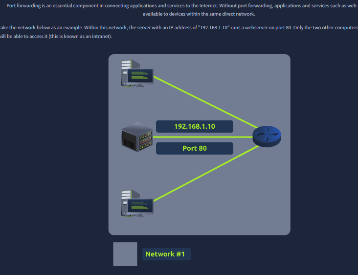

What you see:
- A simple internal network diagram (“Network #1”) where a server at `192.168.1.10` is running a web service on **Port 80**.
- Only hosts inside the same private network can reach that service.

What it teaches:
- Private RFC1918 IP ranges (like `192.168.x.x`) are not directly routable on the public internet.
- “Service exposure” is not only “the server exists” — it’s also “is it reachable from outside the network?”

Security angle:
- Keeping something private by default reduces exposure, but it’s not a security control by itself. Internal threats and lateral movement still exist.

---

### 2) Port forwarding for internet access (publishing a service)
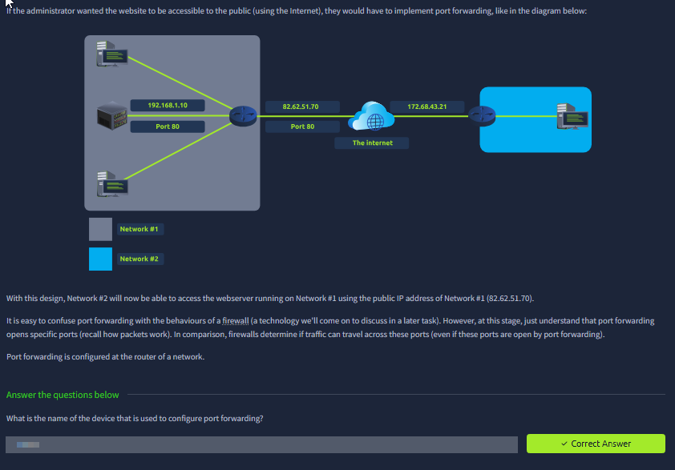

What you see:
- The same internal server (`192.168.1.10:80`) now shown as reachable by another network over “the internet”, using a **public IP** on the edge device (router).
- The key idea: traffic hits the router’s public IP on a port, then is forwarded to the internal host.

What it teaches:
- Port forwarding is configured on the **router/NAT gateway** (the network edge).
- It maps something like: `public_ip:80 -> 192.168.1.10:80`.

Security angle (important):
- Port forwarding is one of the most common ways people accidentally expose admin panels, databases, or dev services.
- “It’s behind NAT” is not a guarantee. Port forwarding punches a hole intentionally.

---

### 3) Firewalls vs port forwarding (they are not the same)
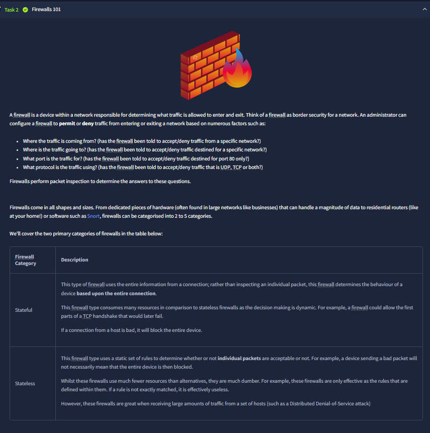

What you see:
- Text that explicitly contrasts port forwarding with firewall behavior:
  - Port forwarding **opens a path**.
  - A firewall **decides** whether traffic is allowed across that path.

What it teaches:
- These are separate controls:
  - You can forward a port but still block traffic with firewall rules.
  - You can allow a port in a firewall but have no forwarding configured (so nothing reaches the internal host).

Security angle:
- Real-world exposure mistakes often come from misaligned configs: someone forwards a port “temporarily” and forgets it, or firewall rules are too broad.

---

### 4) Firewalls 101 (what questions a firewall answers)

This same screen also introduces what firewalls evaluate:
- **Where is traffic coming from?**
- **Where is traffic going to?**
- **What port/protocol is used?** (TCP/UDP)

Why this matters:
- This is the mindset shift from “a network exists” to “a network is a policy boundary.”

AppSec mapping:
- In a threat model, this is literally how you define trust boundaries: “browser to API”, “internet to admin”, “office network to prod”, etc.

---

### 5) Practical firewall task: block malicious traffic (port 80)
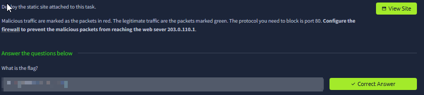

What you see:
- A task instructing you to configure a firewall to prevent red/malicious packets from reaching a web server, specifically by blocking **port 80**.

What it teaches:
- You can reduce risk with very simple rules: “deny inbound TCP/80 from untrusted sources.”
- It reinforces: *the port number + protocol* is a concrete decision point.

Security angle:
- Blocking port 80 is meaningful if the service should be HTTPS-only. But in real deployments you’d typically allow 80 only for redirect/ACME and enforce TLS on 443.

---

### 6) Firewall knowledge check (OSI layer thinking)
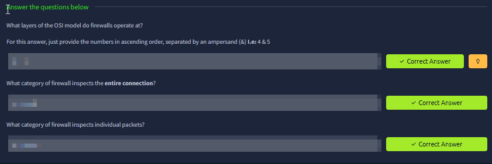

What you see:
- Questions that connect firewalls back to OSI layers and firewall types (stateful vs stateless).

What it teaches:
- **Stateless** filtering: packet-by-packet rules (cheaper but “dumber”).
- **Stateful** filtering: tracks connection state (more context, more resource usage).

Security angle:
- Stateful inspection matters for TCP because the firewall can understand “this is an established connection” vs “this is unsolicited inbound.”
- Stateless rules are common in high-throughput setups but require careful design.

---

### 7) VPN basics (a tunnel across the internet)
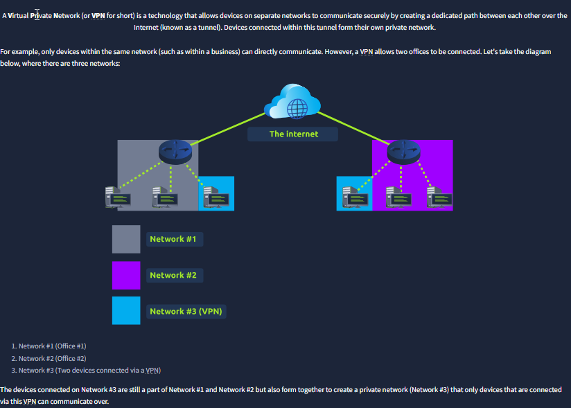

What you see:
- A diagram with multiple networks connected via the internet and a labeled **VPN** network segment.

What it teaches:
- A VPN creates a **private tunnel** so devices can communicate as if they’re in a trusted/private network, even though they’re separated geographically.

Security angle:
- VPN reduces eavesdropping risk on untrusted networks (e.g., public Wi‑Fi), but it also changes your trust boundary: a remote laptop may now have internal access.
- “VPN access” should be treated as privileged; device posture and identity still matter.

---

### 8) VPN benefits (privacy vs anonymity nuance)
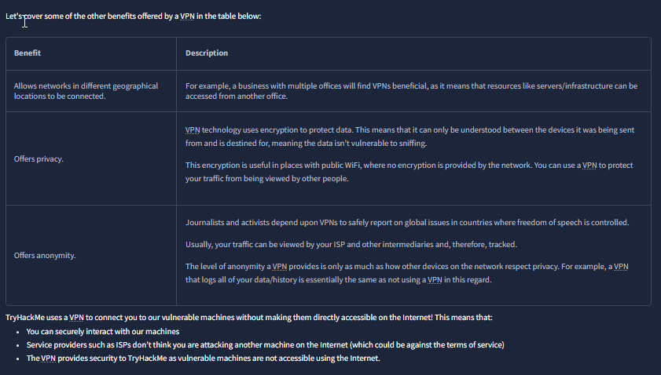

What you see:
- A table listing VPN benefits (connect sites, encrypt traffic, privacy, “anonymity” claims) and a note about TryHackMe using VPN to access labs safely.

Key nuance:
- Encryption gives **confidentiality in transit**, but it does not automatically give anonymity:
  - your VPN provider can still see traffic,
  - logs/policies matter,
  - endpoints and accounts can still identify you.

Security angle:
- This is why professional environments treat VPN as transport security, not a magic privacy cloak.

---

### 9) VPN technologies overview (PPP, PPTP, IPSec)
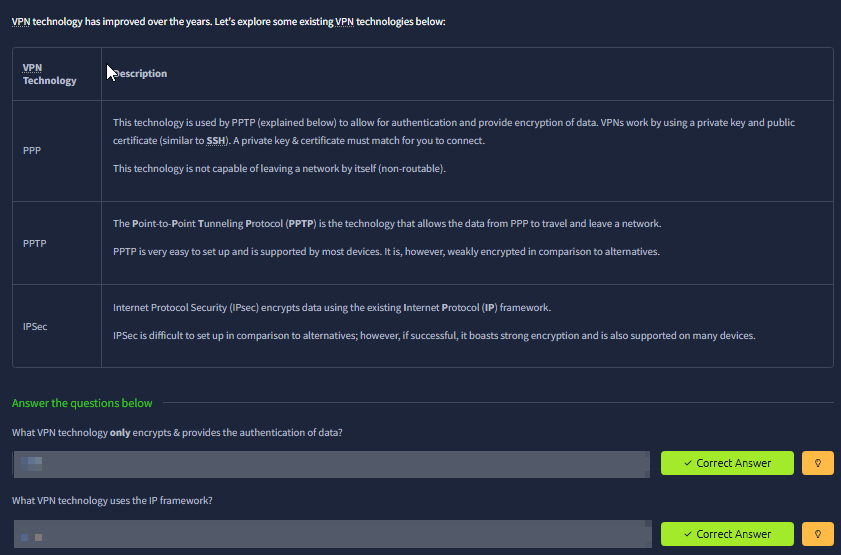

What you see:
- A comparison table of VPN technologies:
  - PPP (as a concept),
  - PPTP (easy but weak by modern standards),
  - IPSec (stronger, harder to set up, IP-based framework).

Why this matters:
- You begin to see “security tradeoffs”:
  - simplicity vs strength,
  - legacy compatibility vs modern cryptography.

AppSec mapping:
- In real orgs, you’ll see legacy protocols lingering. Being able to recognize “this is outdated/weak” is valuable for risk assessment.

---

### 10) What is a router? (routing decisions and paths)
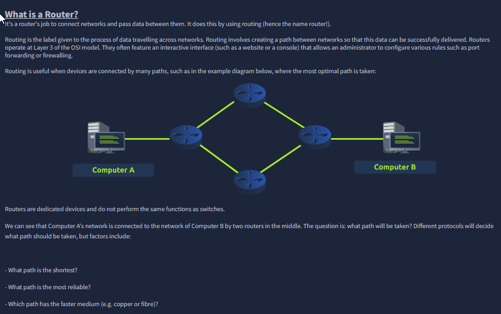

What you see:
- A router diagram connecting Computer A to Computer B via multiple possible paths.
- The text explains routers operate at **Layer 3 (Network)** and choose paths.

What it teaches:
- Routing is about “best path” selection based on factors like distance/cost/reliability/medium.
- Routers connect networks; they’re not primarily about local device-to-device forwarding.

Security angle:
- Routing defines reachability. If routing allows it, an attacker may reach it.
- Many security designs rely on “this network cannot route to that network.”

---

### 11) What is a switch? (L2 forwarding using MAC)
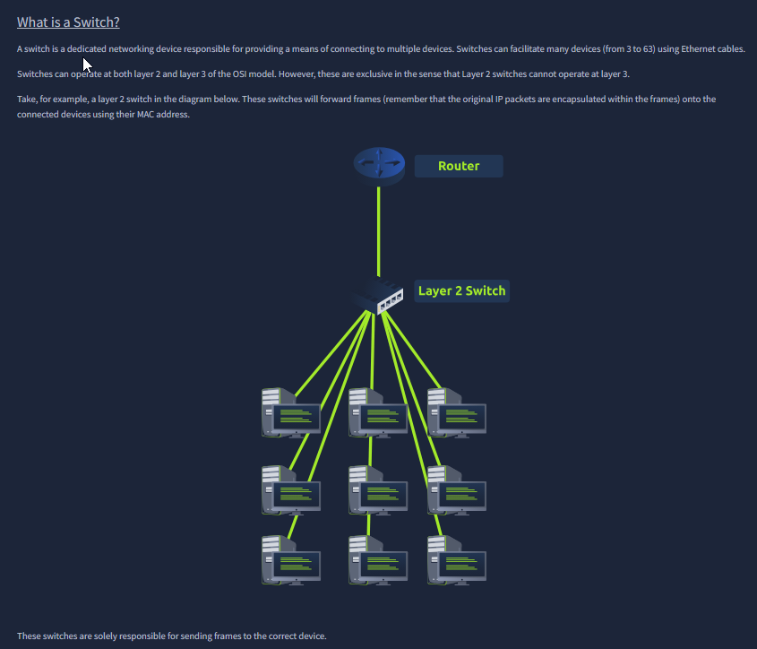

What you see:
- A layer 2 switch connecting many devices, with a router upstream.

What it teaches:
- Switches operate at **Layer 2** and forward **frames** using **MAC addresses**.
- They connect many devices within the same LAN segment.

Security angle:
- Local attacks (ARP spoofing, MAC spoofing) are rooted in the fact that L2 is a “shared neighborhood.”
- This is why segmentation (VLANs) matters even inside a building.

---

### 12) Layer 3 switches + VLAN segmentation (logical separation)
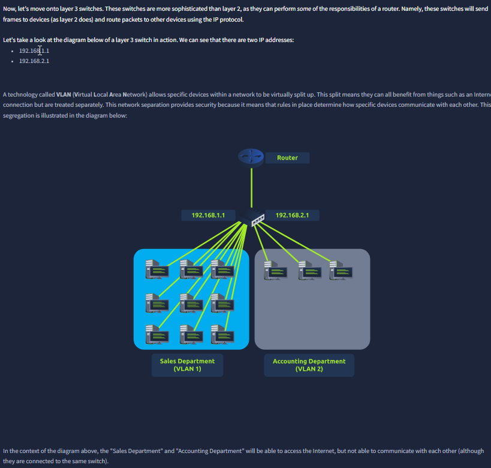

What you see:
- A diagram showing two IP networks (`192.168.1.1` and `192.168.2.1`) and two groups (“Sales” and “Accounting”) separated into VLANs.

What it teaches:
- VLANs split a physical network into multiple logical networks.
- Devices can share the same physical switch but be prevented from talking to each other directly (depending on configuration).

Security angle:
- VLANs are a common blast-radius control: compromise in VLAN A shouldn’t automatically reach VLAN B.
- But VLANs are not a substitute for application-layer authorization. They reduce reachability; they don’t validate identity.

---

### 13) Network simulator (end-to-end packet flow + logs)
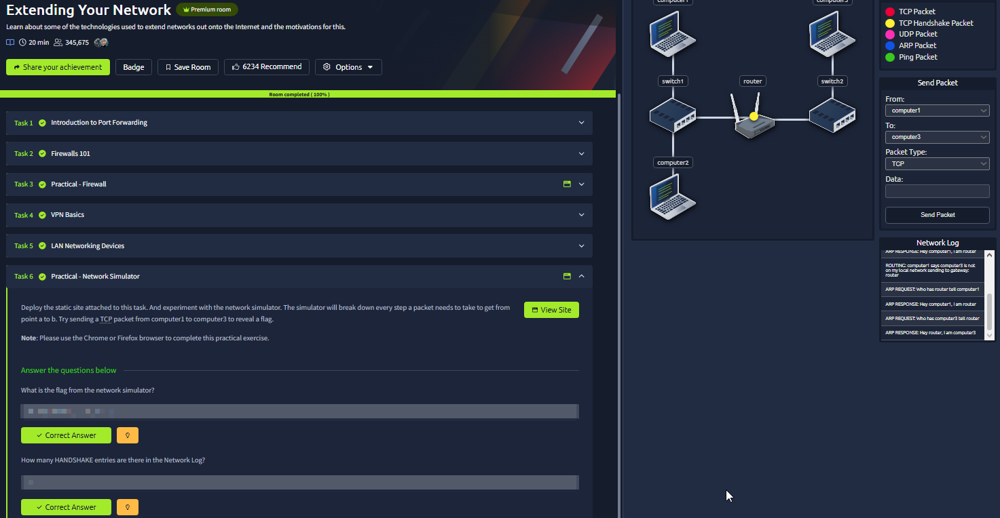

What you see:
- A completed-room view and a network simulator UI:
  - multiple computers, switches, a router,
  - selectable packet types (TCP, handshake, UDP, ARP, ping),
  - a **network log** that shows the steps (e.g., ARP request/response, routing decision, etc.).

What this teaches (the real skill):
- You stop guessing and start reasoning:
  - If we want to send TCP data from one host to another:
    1) we need local L2 resolution (ARP) to talk to the gateway,
    2) routing at L3 decides where to forward,
    3) transport behavior (handshake vs UDP) changes the sequence of events.

Security angle:
- This mental model is exactly how you troubleshoot blocked traffic:
  - Is it failing at ARP (L2), routing (L3), firewall/port (L4), or app-level policy (L7)?
- It’s also how you understand the impact of segmentation and firewall rules in a threat model.

---

## Summary (what I’m taking forward)
- **Port forwarding** increases exposure; treat it as a deliberate risk decision.
- **Firewalls** enforce policy; understand whether rules are stateless or stateful.
- **VPNs** protect traffic in transit, but also extend trust boundaries.
- **Routers** route (L3), **switches** forward (L2), **VLANs** segment logically.
- The simulator reinforces that real networking is a chain of dependent steps, not a single magic hop.
