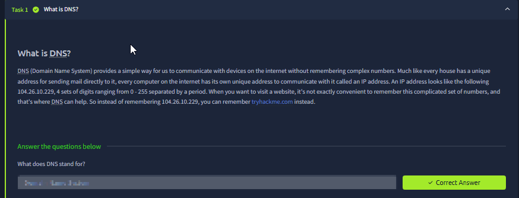
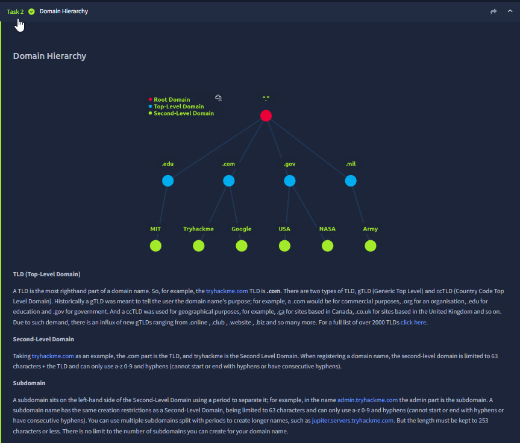
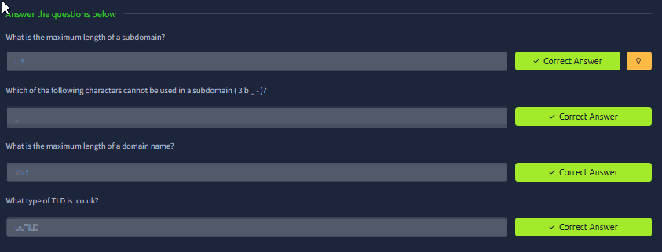
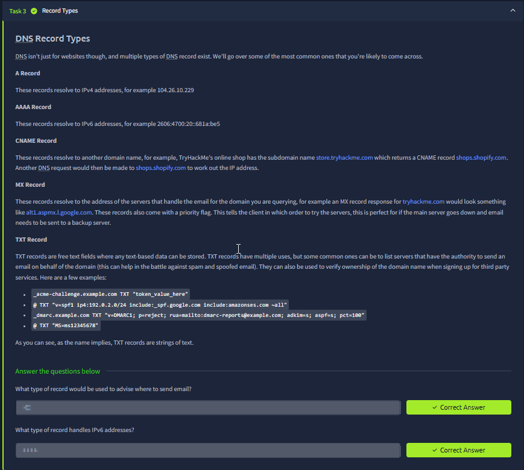
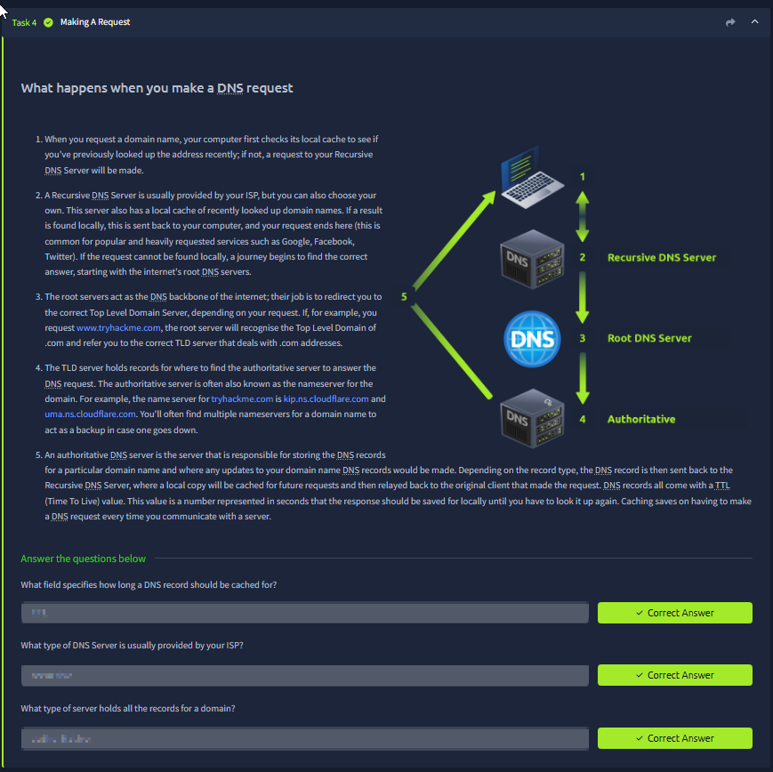
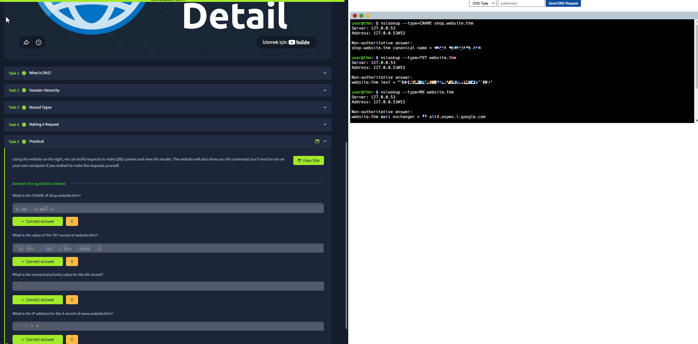

# DNS in Detail

Room link: https://tryhackme.com/room/dnsindetail

## Executive Summary
DNS (Domain Name System) is the "phonebook" of the internet, but for security it is much more than that:

- It is a **critical dependency** for almost every web request (even before HTTP begins).
- It introduces **trust decisions** (which resolver you use, which answers you accept, how long you cache them).
- It is a frequent target for abuse: misconfigurations, spoofing, cache poisoning, and data exfiltration via DNS.

This room explains DNS from three angles:
1) **What DNS is** and why we need it,
2) **How domain names are structured** (hierarchy),
3) **How DNS works operationally** (record types + resolution flow + caching),
and ends with a small practical exercise to read real DNS records.

---

## Evidence (1–6) + deep analysis

### 1) What is DNS? (the "name → IP" translation layer)

What you see:
- A short explanation that humans prefer names like `tryhackme.com`, while computers need numeric addresses like `104.26.10.229` (IPv4 example).

What’s actually happening when you type a URL:
- Your browser cannot contact `tryhackme.com` until it knows an IP address.
- DNS is the system that maps:
  - **domain name** → **IP address** (A/AAAA), or
  - **domain name** → **another name** (CNAME), or
  - **domain name** → **mail servers** (MX), etc.

Why this matters for security:
- DNS happens *before* TLS and HTTP. If DNS is compromised, users can be sent to the wrong server.
- This is why organizations care about trusted resolvers, DNS security, and why phishing often starts with look‑alike domains.

---

### 2) Domain hierarchy (root, TLD, second-level domain, subdomains)

What you see:
- A visual tree with:
  - **Root domain** (the top / “.”),
  - **TLDs** like `.com`, `.edu`, `.gov`, `.mil`,
  - and example second-level domains under each.
- Text sections explaining **TLD**, **second-level domain**, and **subdomain**.

How to read a domain name correctly:
- The domain is read right-to-left in terms of hierarchy:
  - `admin.tryhackme.com`
    - TLD: `.com`
    - second-level: `tryhackme`
    - subdomain/host label: `admin`

Practical takeaway:
- Subdomains are extremely common in real systems (`api.`, `admin.`, `cdn.`, `staging.`).
- Many security findings start with “a forgotten subdomain” (e.g., old admin panels or dev endpoints).

Security angle:
- Enumeration: knowing naming patterns makes recon smarter (you’re not guessing randomly).
- Policy: cookies, same-site scoping, and CORS decisions often interact with subdomains.

---

### 3) Domain naming rules (length limits + allowed characters)

What you see:
- A quiz section asking about:
  - max length of a subdomain/label,
  - characters not allowed,
  - max length of a full domain name,
  - what kind of TLD `.co.uk` is.

Why this matters (beyond trivia):
- These rules shape what attackers can register:
  - hyphen tricks,
  - look‑alike names (homoglyphs),
  - extremely long names can stress parsers/logging systems.

Security angle:
- Domain constraints don't prevent phishing; they only define syntactic validity.
- For defenders, understanding ccTLD vs gTLD helps recognize why domains can “look” unusual but still be normal (e.g., multi-part country-code structures).

---

### 4) DNS record types (A, AAAA, CNAME, MX, TXT)

What you see:
- A list of common DNS record types and what they represent:
  - **A**: domain → IPv4 address
  - **AAAA**: domain → IPv6 address
  - **CNAME**: domain → another domain name (alias)
  - **MX**: mail exchangers for email delivery
  - **TXT**: free-text records (often used for verification and email security policies)

How these show up in real security work:
- **A/AAAA**: direct infrastructure exposure (what IPs a domain points to).
- **CNAME**: common source of “dangling DNS” issues (points to a resource that no longer exists / can be claimed).
- **MX/TXT**: used to prevent email spoofing or verify ownership:
  - SPF/DMARC/DKIM often live in TXT records.
  - Misconfigured TXT records can reveal internal tooling or third‑party services.

---

### 5) What happens during a DNS request (recursive + root + authoritative + caching)

What you see:
- A numbered diagram showing the resolution journey:
  1) local cache check,
  2) query sent to a **recursive resolver** (often ISP or chosen resolver),
  3) resolver asks **root DNS** where to find TLD servers,
  4) resolver asks **TLD servers** where to find the authoritative server,
  5) resolver asks **authoritative DNS** for the actual record,
  and then caches the result based on **TTL**.

Key concepts (very important):
- **Recursive resolver** does the hard work for you and caches results.
- **Root/TLD servers** do not store “your domain’s final answers”; they delegate.
- **Authoritative servers** are the source of truth for a domain’s records.
- **TTL (Time To Live)** controls caching duration:
  - high TTL → faster repeat lookups, slower changes
  - low TTL → changes propagate faster, more DNS load

Security angle:
- If an attacker influences what the resolver caches, victims may repeatedly get the wrong answer (this is why cache poisoning is a known DNS risk).
- DNS is also a visibility layer: defenders monitor DNS queries to detect malware C2 or suspicious lookups.

---

### 6) Practical DNS lookups (nslookup + reading the output)

What you see:
- A practical task UI plus a terminal showing `nslookup` queries like:
  - `nslookup --type=CNAME shop.website.thm`
  - `nslookup --type=TXT website.thm`
  - `nslookup --type=MX website.thm`
- Output that includes:
  - the resolver used (e.g., `127.0.0.53` local stub on Linux),
  - whether the answer is “non-authoritative” (coming from cache/recursive resolver),
  - and the record results.

How to interpret key lines:
- **Server / Address**: which DNS resolver answered you (not necessarily the authoritative server).
- **Non-authoritative answer**: your resolver is returning a cached/delegated answer; it is not the zone’s authority.
- Record outputs map directly back to Task 3 concepts (CNAME points to another name, MX lists mail exchangers, TXT returns strings).

Security angle:
- Knowing how to query DNS types is essential for:
  - verifying domain ownership / third-party integrations,
  - checking SPF/DMARC presence,
  - investigating suspicious infrastructure quickly.

---

## Summary (how I’ll apply this)
- DNS is a prerequisite for web traffic; treat it as part of the security boundary.
- I can break down a domain into components (TLD / SLD / subdomain) and use that for recon and policy reasoning.
- I can read and interpret common record types, and I know the operational flow (recursive → root → TLD → authoritative → TTL cache).
