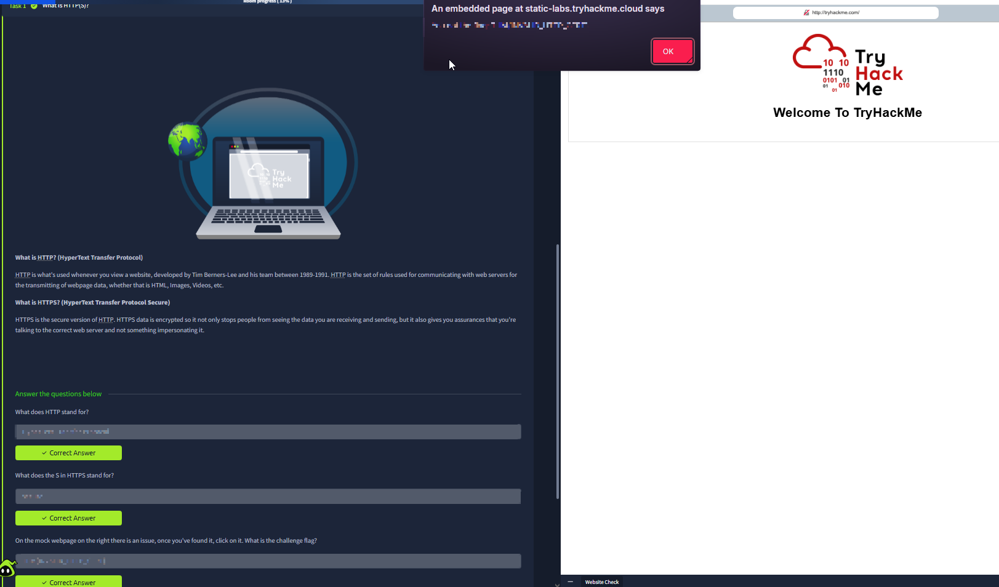
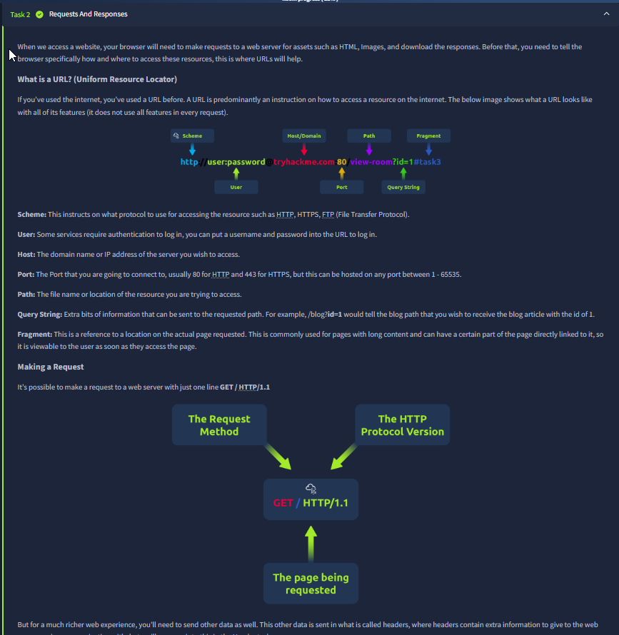
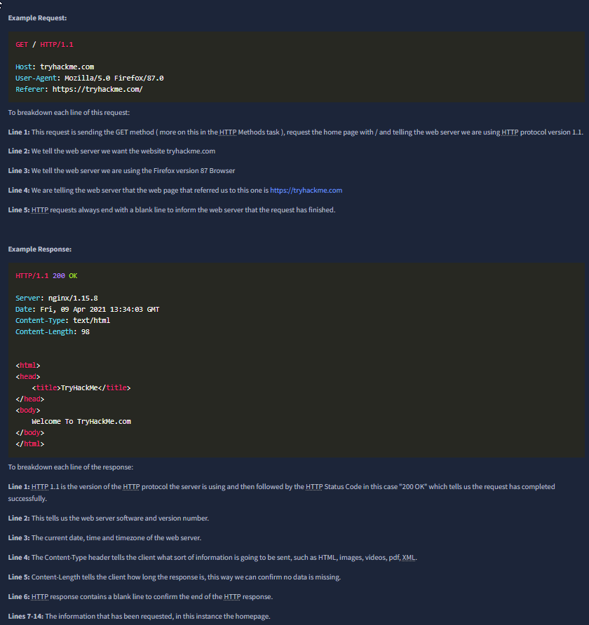
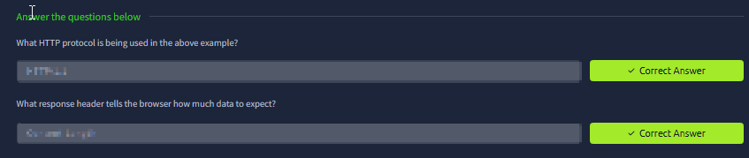
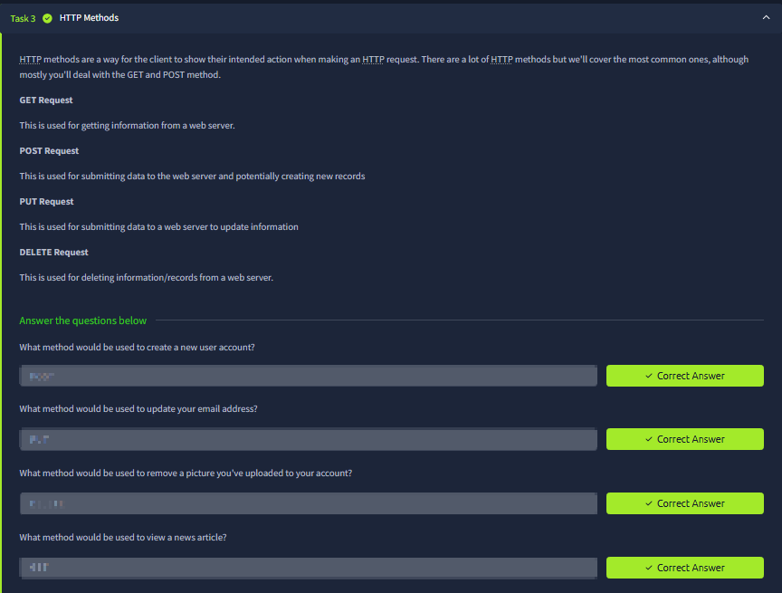
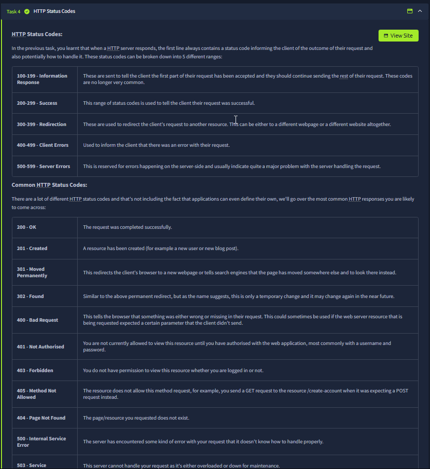
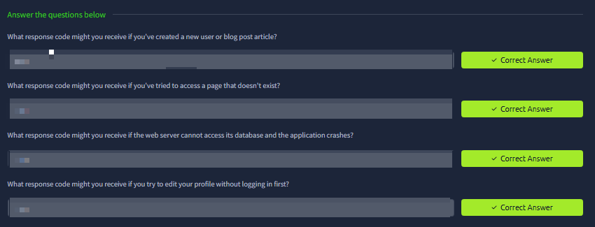
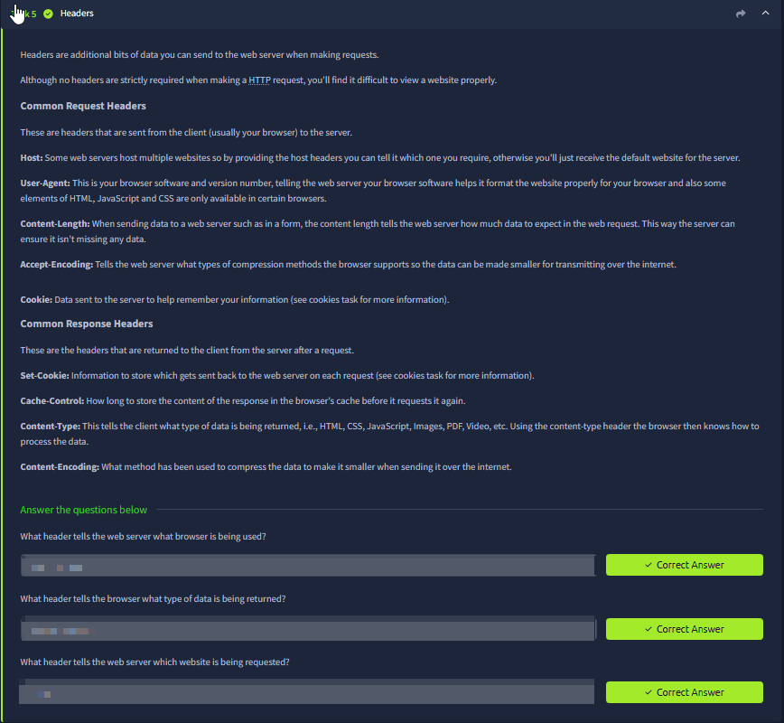
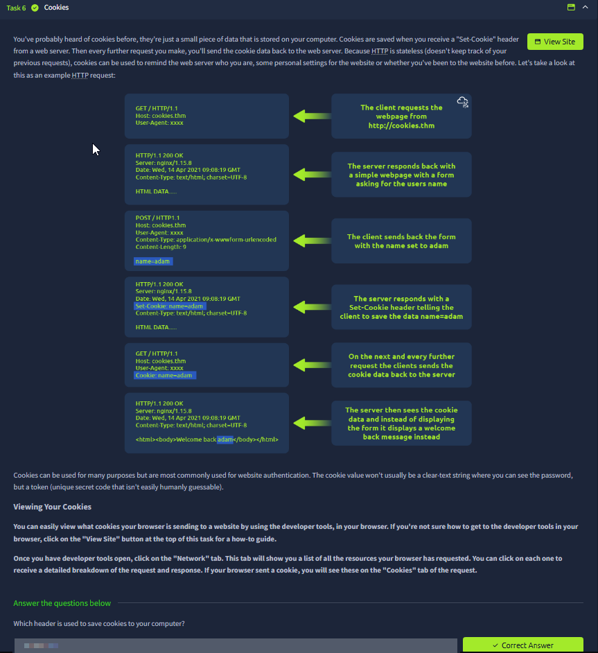
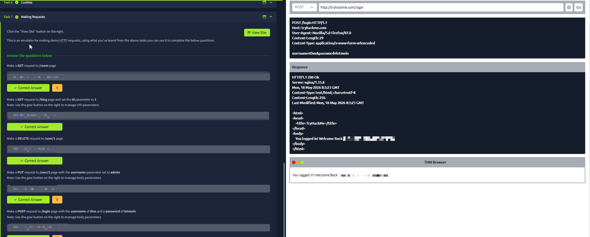

# HTTP in Detail

Room link: https://tryhackme.com/room/httpindetail

## Executive Summary
This room breaks HTTP down into the pieces you will constantly see in AppSec:

- **Request/response basics** (what a client sends vs what a server returns)
- **URL anatomy** (scheme, host, port, path, query string, fragment)
- **Methods** (GET/POST/PUT/DELETE) and what they imply for state changes
- **Status codes** (success, redirects, client errors, server errors)
- **Headers** (Host, User-Agent, Content-Type, Content-Length, cookies, caching)
- **Cookies** (stateless HTTP + session tracking)
- A small **request emulator** that makes the abstract parts concrete

AppSec takeaway: most web vulnerabilities are “HTTP misunderstandings” — mixing up where data lives (URL vs body vs headers), trusting the wrong header, assuming browsers behave like raw clients, or failing to validate state transitions.

---

## Evidence (1–10) + deep analysis

### 1) HTTP vs HTTPS (why TLS changes the threat model)

What you see:
- A “What is HTTP?” intro plus a short comparison with HTTPS.
- An embedded lab page on the right where you interact with a mock website.

Key concepts to internalize:
- **HTTP is plaintext** at the application layer. Anyone on the path (same Wi‑Fi, ISP, proxy) can potentially view/modify traffic.
- **HTTPS = HTTP over TLS**. TLS provides:
  - confidentiality (sniffing becomes much harder),
  - integrity (tampering is detectable),
  - server authentication (you know which server you are talking to *if* certificates are valid).

AppSec angle:
- HTTPS does not fix application bugs, but it prevents many network-layer attacks (simple sniffing, injection, session hijack on open Wi‑Fi).
- This is why “force HTTPS + HSTS” is considered baseline hygiene.

---

### 2) Requests and responses + URL structure (where data can live)

What you see:
- “Requests and responses” context plus a full URL breakdown:
  - scheme, userinfo, host, port, path, query string, fragment.
- A simple request example: `GET / HTTP/1.1` framed as “method + version + page being requested”.

Why this matters (practically):
- When you are testing or exploiting a web app, the same input can land in multiple places:
  - URL path: `/product/123`
  - query string: `?id=123`
  - request body: `id=123`
  - headers: `Host: ...`, `Referer: ...`, custom headers

AppSec angle:
- Vulnerabilities often come from parsing differences between these locations (e.g., “path-based routing” vs “query-based logic”).
- Many access-control bugs happen because a server trusts a user-controlled header (like `X-Forwarded-For`) as identity or authority.

---

### 3) Raw request/response examples (learning to read wire-format)

### 4) Interpreting requests/headers (Host, User-Agent, Referer)
The request example shows classic headers:
- **Host**: required in HTTP/1.1; tells the server which virtual host/site you want.
- **User-Agent**: identifies the client; should never be trusted for security decisions.
- **Referer**: indicates the previous page; useful for analytics but attacker-controllable in many scenarios.

The response example reinforces:
- **Status line** (`HTTP/1.1 200 OK`) communicates outcome.
- **Server** header leaks software/version sometimes (info disclosure risk).
- **Content-Type** tells the browser how to interpret the body.
- **Content-Length** tells the client how many bytes to expect.

AppSec angle:
- Being able to read raw HTTP quickly is essential for debugging auth/session flows, reproducing bugs, and writing credible evidence.

---

### 5) HTTP methods (GET/POST/PUT/DELETE) and “safe vs unsafe” actions

What you see:
- A list of common methods and a quiz mapping actions to methods.

How to reason about methods (more important than memorizing):
- **GET** should be safe/idempotent: retrieving data, not changing state.
- **POST** typically creates or triggers a state change (login, create record, upload).
- **PUT/PATCH** often update data.
- **DELETE** removes data.

AppSec angle:
- CSRF risk is usually tied to state-changing methods (POST/PUT/DELETE).
- Misusing GET for state changes is dangerous because:
  - it can be cached,
  - it can be triggered by prefetching,
  - it can be embedded in images/links.

---

### 6) Cookies (why stateless HTTP still “remembers” you)

### 7) Cookie lifecycle (Set-Cookie → browser storage → Cookie header)
This section visualizes a very common real flow:
- Client requests a page.
- Server replies with `Set-Cookie: ...`
- Browser stores it and automatically includes it in future requests as `Cookie: ...`

What matters for security:
- Cookies are not “magic auth”; they are just client-stored key/value data automatically replayed.
- If the cookie contains a session identifier and it is stolen, the attacker can often reuse it (session hijack).

AppSec angle:
- Important cookie attributes in real apps:
  - `HttpOnly` (reduces JS access),
  - `Secure` (only over HTTPS),
  - `SameSite` (reduces CSRF),
  - `Path/Domain` scoping.

---

### 8) Status codes (how the server communicates outcomes)

What you see:
- A table grouping status codes by range (1xx–5xx) plus a list of common codes.

How to use this in practice:
- **2xx**: success (but “success” might still mean “logic bug”).
- **3xx**: redirect (often relevant in auth flows).
- **4xx**: client-side error (bad request, unauthorized, forbidden, not found).
- **5xx**: server-side error (crash, misconfig, overload).

AppSec angle:
- Distinguish **401 vs 403**:
  - 401: “you are not authenticated”
  - 403: “you are authenticated but not authorized”
- Frequent 5xx can indicate exploitable error handling or input handling weaknesses (and often leak stack traces in real systems).

---

### 9) Status code quiz (mapping scenarios to the right code)

Why this matters:
- It forces you to connect “real situations” to code families:
  - creating a resource → 201
  - missing page → 404
  - application crash → 500
  - editing profile without login → 401 (or 403 depending on design)

AppSec angle:
- In recon, inconsistent status codes often leak information (e.g., username enumeration, hidden endpoints).
- In testing, status codes are quick signals of where control is enforced.

---

### 10) Request emulator (thinking like a client, not like a browser)

What you see:
- A built-in tool to send different HTTP requests (GET/POST/PUT/DELETE) and see the response.
- This is effectively “mini Burp” but simplified for learning.

What it teaches:
- Browsers hide a lot of details; using a request tool helps you see:
  - exact path,
  - headers,
  - body parameters,
  - and the raw response.

AppSec angle:
- This is the mindset you use with Burp Suite:
  - capture a request,
  - change one thing at a time,
  - observe response differences,
  - and build a reproducible case.

---

## Summary (what I’m taking forward)
- I can break down a URL and know where each input lives.
- I can read and explain raw HTTP requests and responses.
- I understand how cookies implement “state” on top of stateless HTTP.
- I can interpret status codes as signals for authentication/authorization vs application errors.
