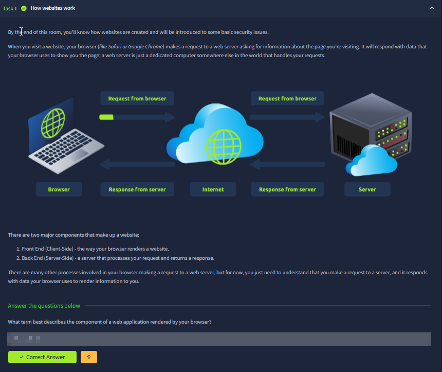
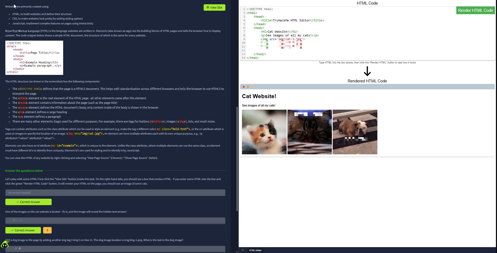
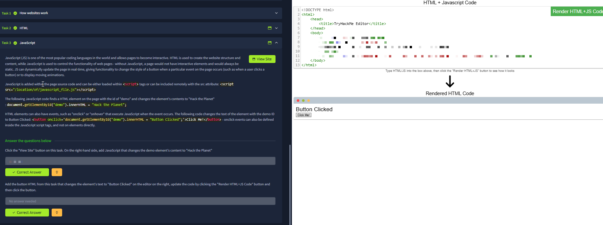
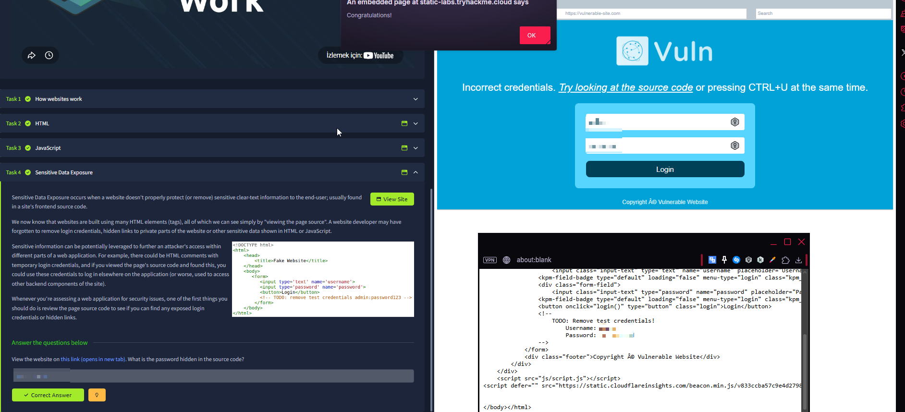
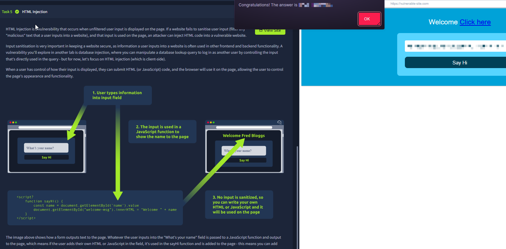

# How Websites Work

Room link: https://tryhackme.com/room/howwebsiteswork

## Executive Summary
- This room explains the **client/server** split (browser vs web server) and the request/response cycle that powers every web app.
- It then connects the web fundamentals to security by showing how **frontend code** (HTML/JS) can become an attack surface when it leaks secrets or reflects untrusted input.
- The small interactive “editor” exercises are important because they mirror real-world workflows: reading markup, understanding how the browser renders it, and recognizing when the browser is executing attacker-controlled content.

## Room Information
- Type: Walkthrough
- Path: Pre Security -> Module 3 (Web Fundamentals)
- Focus: browser-server flow, HTML structure, JS behavior, source review, basic injection concepts

## Walkthrough (Task-by-task)

### 1) How websites work (browser ↔ server)
**What you see in the diagram:** a browser on the left, a server on the right, and the Internet in the middle. The arrows show the two-way exchange:
- The browser sends a **request** (for example: “give me the page at `/`”).
- The server returns a **response** (HTML/CSS/JS and other assets) that the browser renders.

**What’s happening conceptually:**
- A website is not “stored in your browser”. Your browser is a **client** that asks for resources and renders them.
- A web server is a **remote machine** (often many machines behind load balancers) that processes requests and returns responses.

**Security lens (why this matters for AppSec):**
- Everything the server receives from the browser is **untrusted input** (headers, cookies, URL params, POST bodies).
- Everything the browser renders from the server can become dangerous if the server reflects attacker-controlled content (XSS/HTML injection).

### 2) HTML basics (structure + rendering)
**What you see:** the room explains that websites are built using HTML for structure, CSS for styling, and JavaScript for interactivity. On the right there’s a simple HTML editor and a “Render HTML Code” button that shows the rendered output.

**Key HTML elements shown here (and why they matter):**
- `<!DOCTYPE html>`: tells the browser “this is HTML5” so it uses standards mode (reduces weird legacy parsing issues).
- `<html>`: root element wrapping the page.
- `<head>`: metadata (title, meta tags, linked CSS/JS).
- `<body>`: what the user actually sees.
- Content tags like headings (`<h1>`), paragraphs (`
`), and images (``).

**The “rendering” mental model:**
- You write HTML text.
- The browser parses it into a DOM (document object model).
- The browser paints it to the screen. If the markup includes images (``), the browser issues additional requests to fetch them.

**Security lens:**
- When an app allows user-controlled HTML into a page, the browser will parse it as markup — that’s the root of HTML injection and often a stepping stone toward XSS.
- Broken links / missing files in HTML are not “just bugs” — they can leak internal paths, framework details, or create behavior that attackers can abuse (e.g., open redirects, asset substitution, cache poisoning in more advanced scenarios).

### 3) JavaScript basics (behavior + events)
**What you see:** the room demonstrates JavaScript as the layer that makes a page interactive. The right panel contains HTML+JS code and a “Render HTML+JS Code” button. The rendered page includes a button, and clicking it changes something on the page.

**What this shows in real-world terms:**
- JavaScript runs in the browser and can read/write DOM elements (e.g., `document.getElementById(...)`).
- Events like `onclick` trigger code execution. Modern apps do this at scale via frameworks, but the core model is the same.

**Security lens:**
- If user input is inserted into the DOM using unsafe sinks (like `innerHTML`), it can become **DOM-based XSS**.
- Even without XSS, JS can expose sensitive behavior: hidden API endpoints, feature flags, debug modes, and logic flaws are often discoverable in frontend code.

### 4) Sensitive data exposure (view-source as recon)
**What you see:** a deliberately vulnerable demo site. The UI says the credentials are incorrect, and it hints to look at the source code (e.g., using view-source / Ctrl+U). The bottom-right area shows HTML source where “test credentials” appear inside comments.

**What’s happening conceptually:**
- Anything shipped to the browser is **public** from an attacker perspective.
- “Hidden” content is not protected. If it’s in HTML/JS, it’s readable with:
  - view-source
  - DevTools (Elements / Sources)
  - intercepting proxies

**Security lens (real-world impact):**
- Hardcoded credentials, API keys, admin paths, and debug endpoints are common “starter findings” in real applications.
- This type of leak is often the first step in a chain:
  1) Exposed credentials or endpoint
  2) Unauthorized access / privilege escalation
  3) Data exposure or account takeover

**AppSec habit to build:** whenever you test a feature, always check:
- Page source and JS bundles
- Network tab requests
- Any “hints” in comments, headers, or error messages

### 5) HTML injection (untrusted input becomes markup)
**What you see:** the room explains HTML injection and shows a flow where:
1) a user types input into a field,
2) the input is processed by JS and inserted into the page,
3) if the app doesn’t sanitize, the browser treats attacker input as HTML (and potentially JavaScript).

The right panel shows a simple “Say Hi” style demo where output changes based on user input. The key takeaway is not the exact demo, but the browser behavior: **it will render HTML tags if they are injected into the output in an unsafe way**.

**Security lens:**
- HTML injection is often “less powerful” than full XSS, but it still enables:
  - UI redress (phishing inside the page)
  - malicious links/buttons/forms
  - content spoofing that helps social engineering
- The line between “HTML injection” and “XSS” is usually the presence of executable contexts (scripts/event handlers/JS sinks). Many real findings start as HTML injection and become XSS after small tweaks.

## Security Notes (Portfolio layer)

### Impact
- The browser/server model defines your attack surface: all client inputs are untrusted, and all server responses can become dangerous if they contain attacker-controlled content.
- Frontend leaks (source code, JS bundles, comments) can directly enable unauthorized access or significantly reduce attacker effort.

### Fix / Good Practice
- Never place secrets (credentials, API keys, admin-only endpoints) in frontend code.
- Use context-aware output encoding and safe DOM APIs; avoid inserting untrusted strings into `innerHTML`.
- Implement input validation, but rely primarily on **output encoding** and strict templating rules for browser-facing content.

### How to Test
- Review page source + JS bundles for secrets or debug leftovers.
- Attempt safe injection probes in reflection points to confirm encoding behavior (HTML-escaped vs raw insertion).
- Use DevTools Network + Burp to observe what the browser requests and what the server returns.
