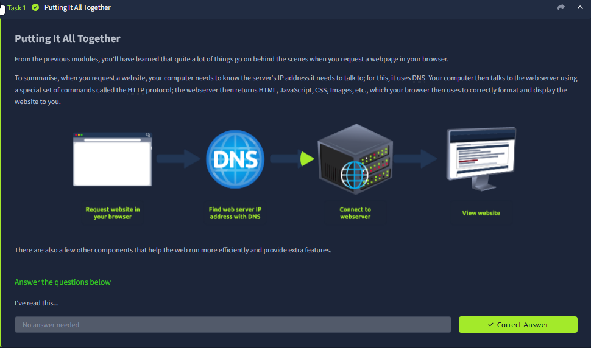
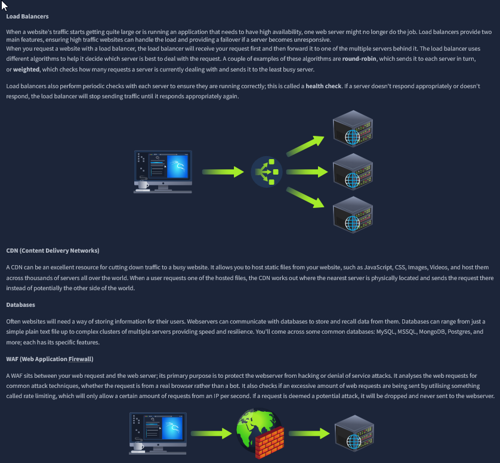
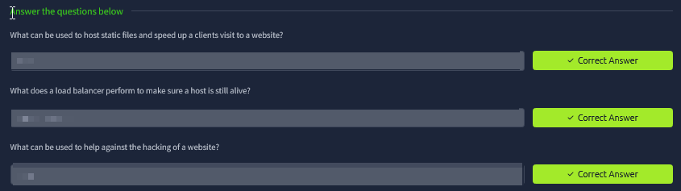
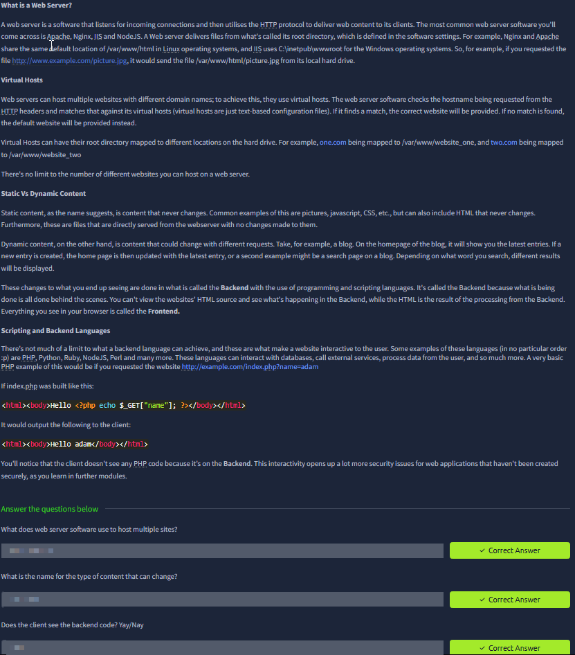
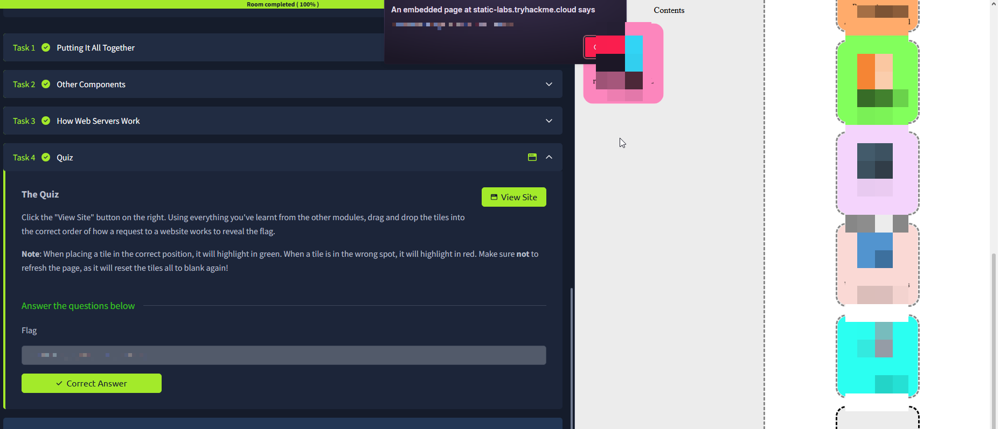

# Putting It All Together

Room link: https://tryhackme.com/room/puttingitalltogether

## Executive Summary
- This room ties together the full “request → DNS → HTTP → response → rendering” chain and introduces real production components like **load balancers**, **CDNs**, **databases**, and **WAFs**.
- It also clarifies what a **web server** is (software that speaks HTTP and serves content) and how it can host multiple sites using **virtual hosts**.
- Security takeaway: the more components in the path, the more **trust boundaries** and **misconfiguration** opportunities exist (origin exposure, weak WAF rules, unsafe dynamic rendering, leaked secrets in app/server layers).

## Room Information
- Type: Walkthrough
- Path: Pre Security -> Module 3 (Web Fundamentals)
- Focus: end-to-end web request chain, web server responsibilities, “other components” in real deployments

## Walkthrough (Task-by-task)

### 1) Putting it all together: from URL to rendered page
**What the diagram is showing:** the high-level “pipeline” of a normal web visit:
1) You request a website in your browser.
2) **DNS** resolves the domain name into an IP address (so you know where to connect).
3) Your browser uses **HTTP/HTTPS** to connect to the web server and request resources.
4) The server returns responses (HTML/CSS/JS/images), and the browser renders them.

**Important detail:** DNS doesn’t “serve” the website; it only answers *where* the website lives (IP). The actual content comes over HTTP/HTTPS.

**Security lens:**
- This is the base chain for most web attacks. If you can influence **any step**, you can often influence what the user sees or what the server processes.
- Examples:
  - DNS poisoning / spoofing (in certain threat models) → user sent to attacker infra
  - HTTP manipulation / insecure redirects → session leakage / phishing
  - Weak input handling at server → injection vulnerabilities

### 2) Other components: Load balancers, CDNs, databases, WAF
This section explains why real deployments rarely look like “one browser talks to one server”.

#### Load Balancers
**What they do:** sit in front of multiple backend servers and distribute requests using strategies like **round-robin** or “least connections”. They also run **health checks** to stop sending traffic to broken nodes.

**Security lens:**
- The load balancer can be a “policy enforcement point” (TLS termination, header normalization, rate limiting).
- Misconfig risks: trusting `X-Forwarded-For` blindly, exposing internal admin endpoints, or inconsistent security headers between nodes.

#### CDN (Content Delivery Network)
**What it does:** caches static resources (images, JS, CSS) close to users so pages load faster and origin servers handle less traffic.

**Security lens:**
- CDN caching changes attack surface: cache poisoning, stale content, and incorrect cache keys can expose user-specific data if misconfigured.
- Also helps DDoS resilience, but does not “fix” application vulnerabilities.

#### Databases
**What they do:** store user data and application state (accounts, orders, sessions, content).

**Security lens:**
- DB is where injection vulnerabilities become catastrophic (SQLi/NoSQLi).
- Access control matters: least privilege DB users, parameterized queries, audit logging.

#### WAF (Web Application Firewall)
**What it does:** sits between the user and the web server and filters requests for suspicious patterns (basic attack signatures) and can rate-limit.

**Security lens:**
- WAF is not a replacement for fixing the app; it’s a **mitigation layer**.
- Bad WAF configs can block legitimate users, or be bypassed by encoding tricks, parameter pollution, or novel payloads.

### 3) Knowledge check (quiz)
**What’s happening:** the room asks quick questions to verify you understand the role of:
- CDN (hosting static files and speeding up visits)
- Load balancer health checks (confirm hosts are alive/healthy)
- WAF (helps protect against common web attack patterns)

**Why this matters:** these “definitions” map directly into real incident triage. When something breaks (or gets attacked), you need to know *which layer* is responsible:
- Is the page slow because origin is down, or CDN cache misses?
- Is traffic failing because the LB marked a node unhealthy?
- Is the WAF blocking a request (false positive) or missing an attack (false negative)?

### 4) What is a web server? Virtual hosts + static vs dynamic content
This section is dense and important.

#### Web server (software)
**Core idea:** a web server is software that:
- listens for incoming connections
- speaks the HTTP protocol
- returns resources (files or generated responses)

Examples mentioned: **Apache**, **Nginx**, **IIS**, **NodeJS** HTTP servers.

#### Virtual hosts
**What’s being taught:** one web server can host **multiple websites** (multiple domains). It uses the request’s **Host header** to decide which site configuration to serve.

**Security lens:** the `Host` header is attacker-controlled input. Misconfigurations around virtual hosts can cause:
- host header injection impacts (password reset poisoning, cache poisoning contexts)
- routing to unintended vhosts / default site exposure

#### Static vs dynamic content
**Static content:** same for everyone (images, JS, CSS, “about.html”). It’s typically served directly from disk or a CDN.

**Dynamic content:** generated on the server for each request (personalized pages, search results, logged-in dashboards).

**Security lens:** dynamic content is where most serious vulnerabilities live:
- injection (SQLi, command injection)
- access control (IDOR, privilege escalation)
- authentication/session bugs

The room also hints at backend scripting (example PHP snippet) to show how user input can affect output.

### 5) Final exercise: reorder the request flow
**What’s happening:** the “View Site” exercise is a drag-and-drop timeline where you arrange steps of a web request. This checks you can mentally model:
- DNS lookup
- connecting to server
- HTTP request/response
- browser rendering

**Why this matters (AppSec habit):**
- When you debug a vuln, you’re basically answering: *where in this chain did the trust boundary break?*
- You’ll keep reusing this model for things like SSRF (server makes outbound requests), XSS (browser executes attacker-controlled content), and authentication flows (cookies/tokens ride on requests).

## Security Notes (Portfolio layer)

### Impact
- Real production web stacks add multiple layers (LB/CDN/WAF/DB). Each layer can introduce misconfigurations that become security issues.
- Dynamic backend logic + user input is the most common route to critical vulns (injection + access control issues).

### Fix / Good Practice
- Treat every inbound header/param as untrusted; validate and normalize early.
- Keep a clear architecture diagram: where TLS terminates, where auth is checked, and what layer logs what.
- Use least privilege between components (app ↔ DB, edge ↔ origin).

### How to Test
- Map requests in the browser devtools + proxy and confirm which layer responds (CDN vs origin).
- Verify vhost routing and `Host` header handling.
- Confirm WAF rules are observable (logs) and test for false positives/negatives using safe test strings.
