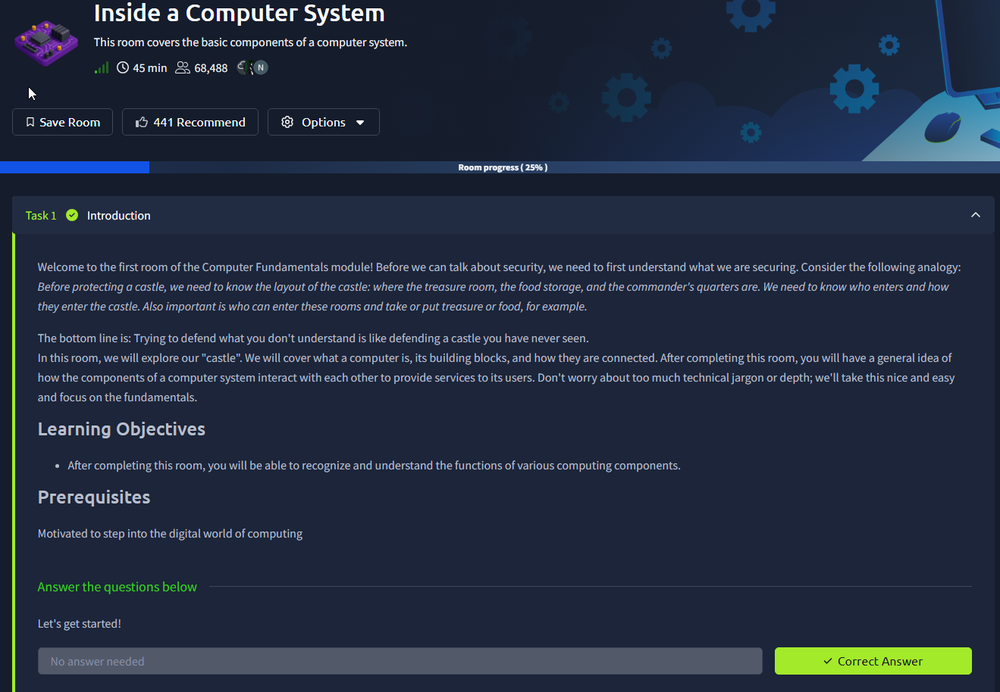
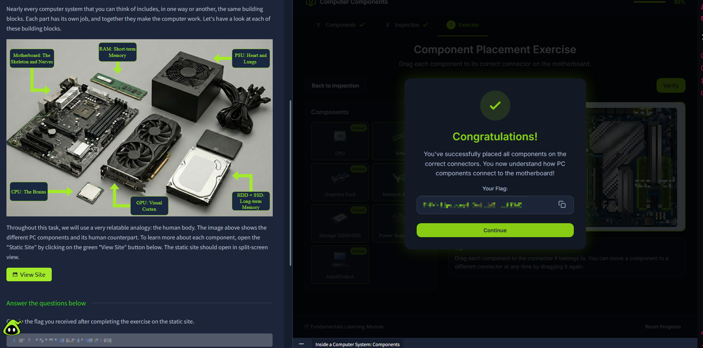
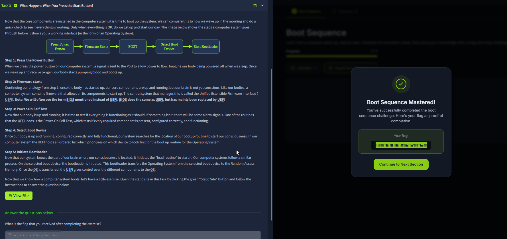

# Inside a Computer System

Room link: https://tryhackme.com/room/insideacomputer

## Executive Summary
- This room introduces the **core building blocks** of a computer (CPU, RAM, storage, motherboard, GPU, PSU) and explains how they work together as a system.
- The interactive exercises are the “real value”: instead of memorizing names, you practice mapping each component to its role and where it connects.
- Security takeaway: you can’t defend what you don’t understand — OS hardening, malware behavior, forensics, and even web security ultimately run on top of these hardware/software layers.

## Room Information
- Type: Walkthrough
- Path: Pre Security -> Module 4 (Computer Fundamentals)
- Focus: computer components and the boot process (from power-on to OS load)

## Walkthrough (Task-by-task)

### 1) Introduction: understanding what we’re securing
**What you see:** the room frames the topic using a “castle” analogy. Before you protect something, you need to understand:
- what the important parts are (treasure room),
- how access happens (doors, guards),
- and how everything connects.

**What this means in practice:**
- In cybersecurity, “the system” is not just an app — it’s hardware + firmware + OS + applications.
- Security work becomes easier when you can place a problem in the right layer:
  - “is this an OS config issue?”
  - “is this a network issue?”
  - “is this app logic?”

**Why this matters for AppSec too:**
- Even web apps depend on the OS, filesystem, memory, CPU scheduling, and networking.
- Many vulns (RCE, file upload, deserialization) become more intuitive once you understand what “executing code” actually means at the system level.

### 2) Components: mapping parts to roles (and where they connect)
This section teaches the “big parts” and their responsibilities. In the screenshot, the room uses human-body analogies (useful for building intuition fast):

- **Motherboard**: the “skeleton + nerves” — it connects components via slots/chipset and provides the buses they communicate on.
- **CPU**: “the brain” — executes instructions; coordination point for computation.
- **RAM**: “short-term memory” — fast working area for currently running programs and data.
- **Storage (HDD/SSD)**: “long-term memory” — persistent files, OS installation, programs, logs.
- **GPU**: “visual cortex” — accelerates graphics/parallel compute workloads.
- **PSU**: “heart and lungs” — provides stable power delivery to everything.

**What the exercise is validating:**
- Not just “what is RAM”, but “where does it physically sit / connect”.
- This mirrors a real troubleshooting/security habit: if you know the architecture, you can reason about failure modes and attack surface.

**Security lens:**
- RAM is volatile → why memory forensics must happen quickly.
- Storage is persistent → why disk encryption + secure deletion matter.
- Motherboard/firmware layer exists → why UEFI/BIOS security and secure boot show up in modern hardening.

### 3) Boot sequence: what happens when you press the power button
This part is essentially: **how the machine goes from “off” to “OS running”**.

**The flow shown in the room:**
1) **Press power button** → PSU supplies power, components wake up.
2) **Firmware starts** (UEFI/BIOS) → initial low-level control of the system.
3) **POST** (Power-On Self Test) → quick checks that required components are present and functioning.
4) **Select boot device** → decide where to load the OS from (disk/USB/network).
5) **Start bootloader** → loads the OS kernel + hands off control to the OS.

**Why this matters:**
- It explains why “boot order” matters (e.g., USB boot).
- It explains why firmware security is sensitive: if an attacker controls boot steps, they can persist “below” the OS.

**Security lens:**
- Secure Boot and trusted boot chains exist to prevent tampered bootloaders/firmware.
- Malware that persists in boot/firmware is harder to detect than userland malware.

## Security Notes (Portfolio layer)

### Impact
- Without basic system knowledge, you’ll misdiagnose problems (e.g., mixing “CPU” vs “RAM” symptoms) and miss where controls should apply.
- Boot/firmware is a high-value target for persistence because it executes before the OS.

### Fix / Good Practice
- Keep firmware updated (UEFI/BIOS) and enable Secure Boot where appropriate.
- Apply least privilege and system hardening at OS level (users/services) because everything you run depends on OS enforcement.

### How to Test
- Verify boot order is locked down (no unintended external boot).
- Confirm Secure Boot status and firmware versions are managed.
- Validate you can explain where sensitive data lives (RAM vs disk) for incident response decisions.
