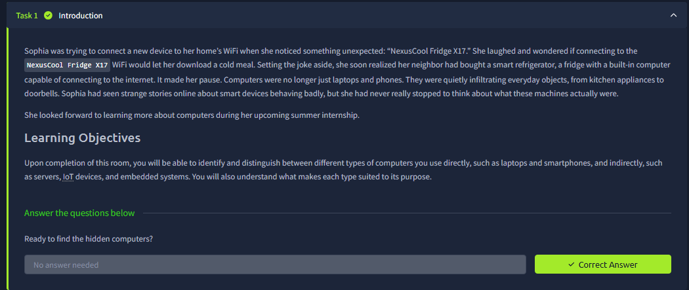
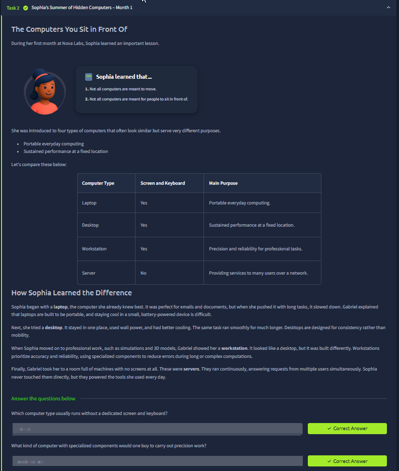
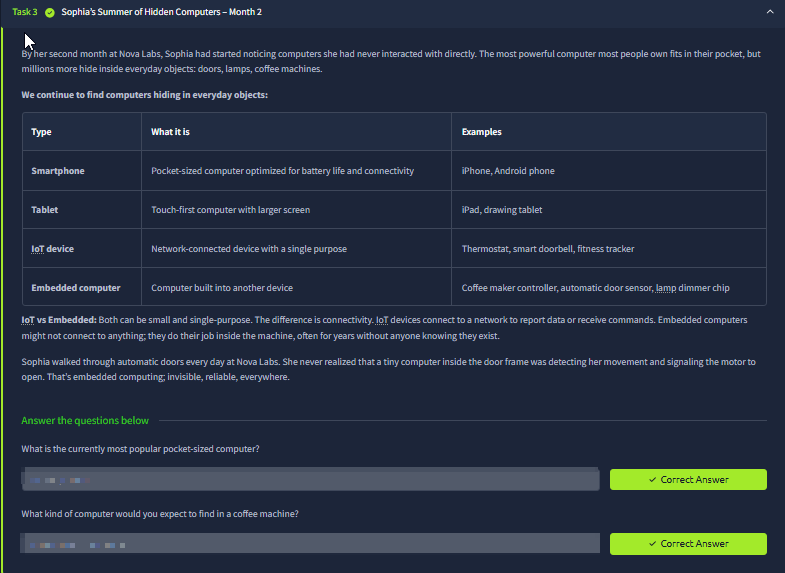
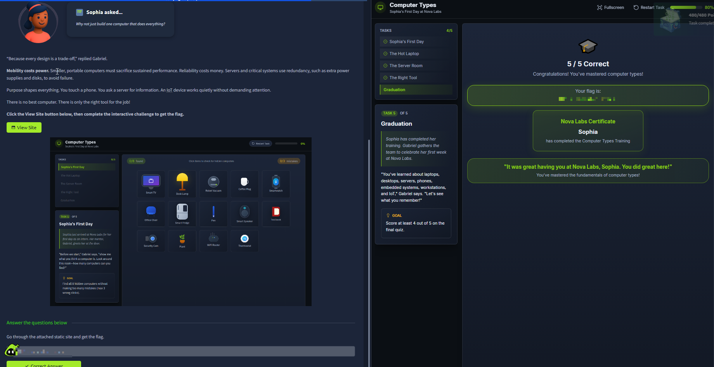

# Computer Types

Room link: https://tryhackme.com/room/computertypes

## Executive Summary
- This room expands “computer” beyond laptops/desktops and frames modern environments as a mix of **end-user devices + servers + embedded/IoT systems**.
- The goal is to build fast intuition for **“right tool for the job”**: trade-offs between mobility, performance, cost, and reliability shape what kind of computer you pick.
- Security takeaway: different computer types imply different threat models (patching/monitoring, identity, physical access, network exposure, and update mechanisms vary widely).

## Room Information
- Type: Walkthrough
- Path: Pre Security -> Module 4 (Computer Fundamentals)
- Focus: computers you see vs computers you don’t see (servers, IoT, embedded systems) + trade-offs

## Walkthrough (Task-by-task)

### 1) Intro: finding “hidden computers” in daily life
**What you see:** a short story about a “smart fridge” on a home Wi‑Fi network. The point is: computing is now everywhere, not only in phones/laptops.

**What this is teaching:**
- A “computer” is any system that can process data, run logic, and interact with other systems.
- Many devices we don’t think about (fridges, doorbells, cameras) contain computers that connect to networks and exchange data.

**Security lens:**
- Hidden computers are often **less visible** (no keyboard/screen), but still have software, credentials, network access, and vulnerabilities.
- Consumer IoT often has weaker update hygiene → long-lived risks (default creds, outdated firmware, exposed services).

### 2) The computers you sit in front of (laptop, desktop, workstation, server)
This section compares “computer types” that can look similar but are built for different purposes.

**Key differences shown in the table:**
- **Laptop**: portable everyday computing (mobility prioritized).
- **Desktop**: sustained performance at a fixed location (power/thermals prioritized).
- **Workstation**: professional precision/reliability (specialized components, stability).
- **Server**: provides services to many users over a network (usually no dedicated screen/keyboard).

**Why the distinctions matter:**
- Mobility costs performance: laptops throttle under sustained heavy workloads.
- Reliability costs money: servers use redundancy (power supplies, disks) and are designed to run continuously.

**Security lens:**
- Servers are *always-on* and network-exposed → hardening, patching, monitoring become critical.
- Workstations often handle sensitive production data (engineering, design) → data protection and endpoint security matter.
- Laptops move across networks → Wi‑Fi risks, device theft, and endpoint encryption become central.

### 3) Hidden computers month 2 (smartphone, tablet, IoT device, embedded computer)
**What you see:** a table comparing computer categories you interact with directly (phone/tablet) and indirectly (IoT/embedded).

**Core concept:** **IoT vs embedded**
- **IoT device**: network-connected device built for a single purpose (thermostat, doorbell, tracker).
- **Embedded computer**: a computer built into another device, often doing one job reliably “in the background” (controllers, sensors, chips).

They overlap, but connectivity is a key differentiator: embedded doesn’t *have to* be networked, while IoT is typically network-connected by definition.

**Security lens:**
- Connectivity increases attack surface: once networked, you have ports/services, auth, update channels, and potential remote exposure.
- Embedded systems often have long lifetimes and limited patching → design-time security (secure boot, signed updates) becomes more important.

### 4) “Right tool for the job” (trade-offs) + interactive challenge
**What you see:** the room emphasizes there’s no perfect computer for everything — every design is a trade-off:
- Mobility vs sustained power
- Reliability vs cost (redundancy)
- Purpose-specific devices that “quietly” do one task well

Then you complete an interactive exercise (finding computer types in everyday objects / final quiz), and you get completion feedback.

**Security lens:**
- Trade-offs create security outcomes:
  - Cheap IoT → weaker patch cycles
  - Always-on servers → higher exposure
  - Mobile endpoints → higher theft/loss risk
- The defender mindset is: identify the device type, then apply the right controls (hardening, monitoring, network segmentation, update strategy).

## Security Notes (Portfolio layer)

### Impact
- Treating all devices the same leads to gaps: servers, laptops, and IoT have different exposure and operational constraints.
- “Hidden” computers (IoT/embedded) can become stealth entry points into networks when unmanaged.

### Fix / Good Practice
- Inventory devices by type (endpoints, servers, IoT/embedded) and assign ownership + patch responsibilities.
- Segment networks to keep IoT isolated from sensitive systems.
- Enforce baseline security: strong auth, secure updates, logging, and monitoring appropriate to the device role.

### How to Test
- Validate what devices are present and what services they expose (asset discovery).
- Check update status/firmware versions and whether secure update paths exist.
- Confirm segmentation rules: IoT should not have direct paths to critical assets.
