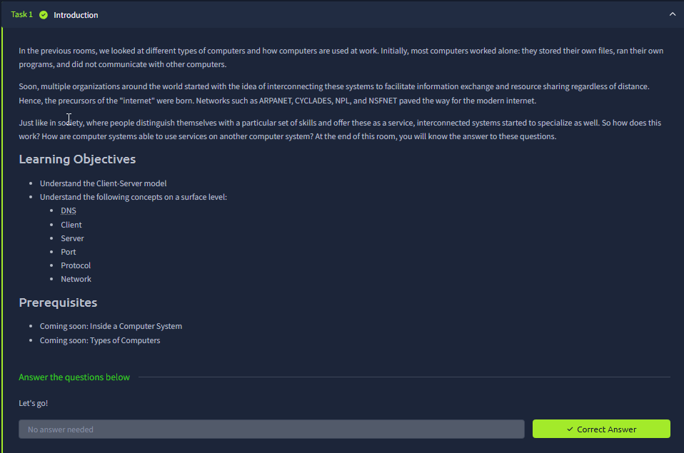
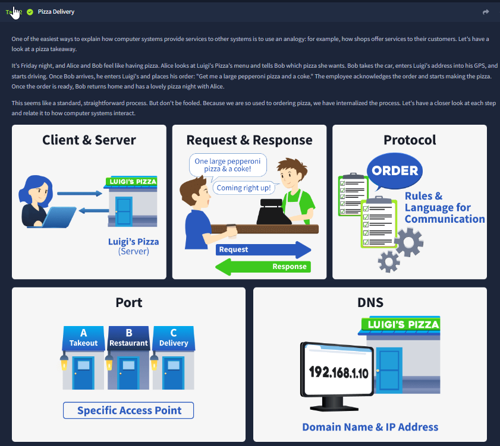
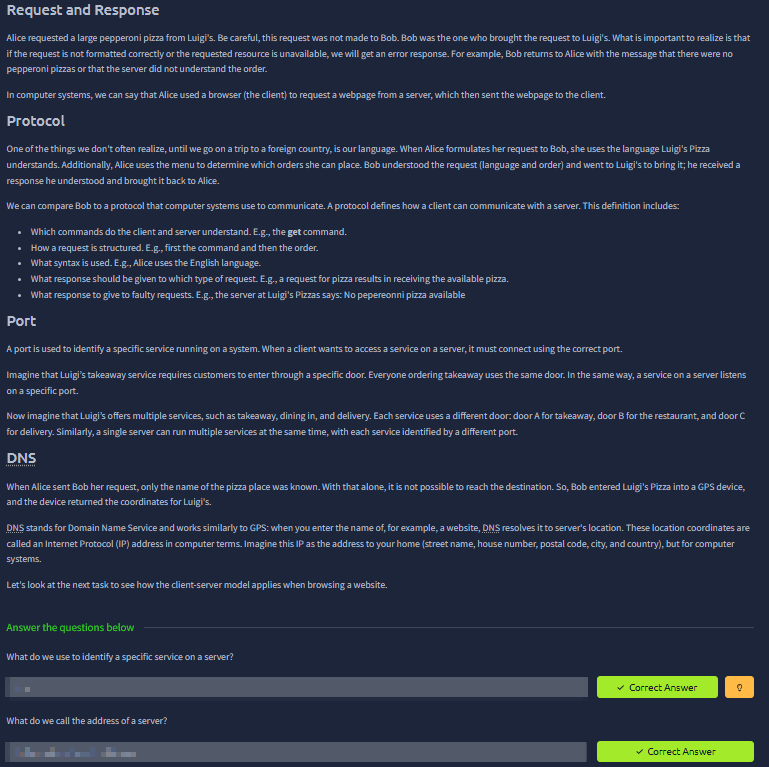
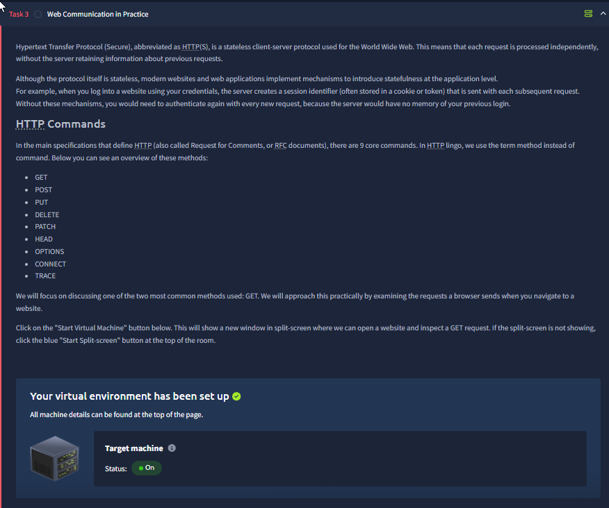
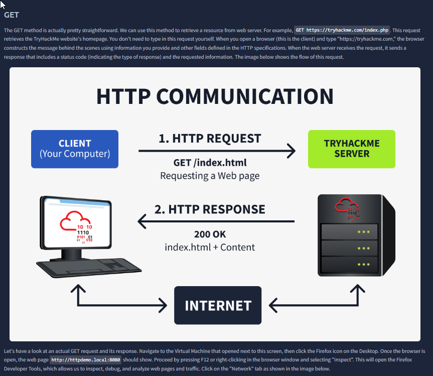
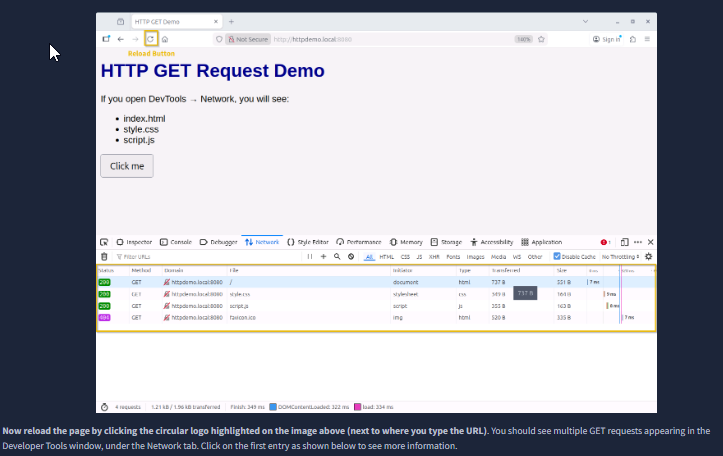
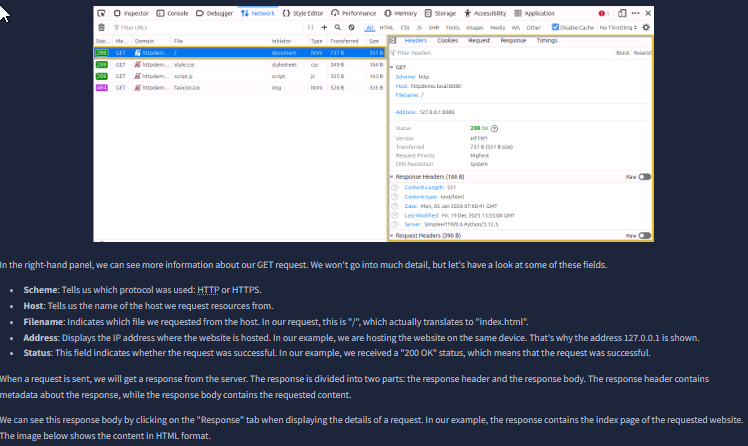
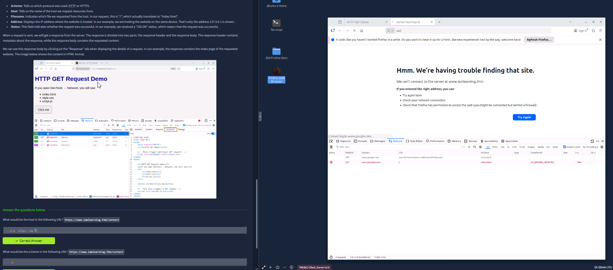

# Client-Server Basics

Room link: https://tryhackme.com/room/clientserverbasics

## Executive Summary

This room builds a practical mental model for how services on the Internet work using the **client-server model**:

- A **client** (your browser/app) initiates a request.
- A **server** hosts a service and responds.
- A **protocol** defines the "language" used (e.g., HTTP/HTTPS).
- A **port** identifies which service on a host you want to reach (e.g., 80/443).
- **DNS** maps human-friendly names (domains) to IP addresses.

The key takeaway: when you "open a website", your browser isn't fetching *one file* - it usually fetches **multiple resources** (HTML, CSS, JS, images, icons) via multiple requests, and developer tools help you see and debug this traffic.

---

## Evidence (1-8)

### 1) Room intro + learning objectives

This opening screenshot frames the room as a "surface-level but essential" foundation for how systems talk to each other. The learning objectives list the exact terms we will keep reusing across every web/security topic later:

- **Client**: the requester (browser/app).
- **Server**: the responder (service host).
- **Protocol**: the rules for communication.
- **Port**: the service identifier on a host.
- **DNS**: name → IP resolution.
- **Network**: the "transport medium" connecting endpoints.

In AppSec terms, this is important because almost every bug you'll triage later (auth issues, injection, SSRF, IDOR, CSRF, etc.) is "just HTTP requests" hitting server-side logic - so you need to be comfortable reading requests and understanding where they go.

---

### 2) "Pizza shop" analogy (mapping concepts to real life)

This screenshot uses a simple analogy to make the client-server model intuitive:

- The **client** is the customer placing an order.
- The **server** is the shop preparing the order.
- A **request** is "I want X".
- A **response** is "Here is X (or an error)".
- A **protocol** is the agreed format ("how we place orders here").
- A **port** is like choosing a specific counter/line in the shop (which service you're talking to).
- **DNS** is like using the shop's name ("Pizza Place") instead of memorizing its physical coordinates.

This analogy matters because in real systems, you often troubleshoot by asking:

1) Who is the client?
2) Which server/service is being contacted?
3) Over which protocol?
4) On which port?
5) Is the name/IP resolution correct (DNS)?

---

### 3) Service identification: protocol + port + DNS

Here the room turns the analogy into a networking reality check:

- A **server can run multiple services** at the same time (web server, SSH, database, etc.).
- The **port number** tells the server which service your client is trying to reach.
- The **protocol** defines how the conversation should look (HTTP vs. HTTPS vs. something else).
- **DNS** exists because humans prefer names, but computers route traffic by IP addresses.

The quiz block at the bottom (answers intentionally not repeated here) reinforces that you must identify:

- The **server address** (domain/IP),
- The **service** you want,
- The **port** associated with that service.

For AppSec, this is where you start thinking about:

- "What endpoint is actually being hit?"
- "Is the request going to the intended system or being redirected/proxied somewhere else?"

---

### 4) Web communication in practice: HTTP/HTTPS and statelessness

This section introduces **HTTP/HTTPS** as the dominant web protocol and highlights a key property: **HTTP is stateless**.

What "stateless" means in practice:

- Each request is processed "independently".
- The server does not automatically "remember" previous requests unless the application adds state via mechanisms like **cookies**, **sessions**, or **tokens**.

Why this matters for security:

- Authentication is usually implemented by session cookies/tokens to "recreate state".
- Many vulnerabilities involve breaking assumptions around state:
  - Session fixation / hijacking
  - CSRF (browser auto-sends cookies)
  - Missing authorization checks (server trusts client state too much)

The screenshot also lists common **HTTP methods** (GET, POST, PUT, DELETE, etc.). Even at a beginner level, you should connect them to intent:

- **GET** = retrieve data (should be safe/side-effect free in good design).
- **POST/PUT/PATCH/DELETE** = change state (where you expect auth + validation).

---

### 5) HTTP request/response flow (GET → 200 OK)

This diagram shows the minimal "happy path" for loading a page:

1) Client sends an HTTP **GET** request for a resource (e.g., `/index.html`).
2) Server replies with a **status code** (e.g., `200 OK`) and the requested content.

Two key points to internalize:

- The URL path (like `/index.html`) is not "just text" - it maps to a server-side route or file.
- Status codes are fast signals for debugging:
  - `200` success
  - `301/302` redirect
  - `401/403` auth/permission issue
  - `404` not found
  - `500` server error

In AppSec write-ups later, you'll constantly use these codes as evidence ("a 302 indicates login redirect", "a 403 indicates access control triggered", etc.).

---

### 6) Real traffic: DevTools Network tab shows multiple requests

This is the moment the theory becomes "real".

The Network tab shows that loading a site typically triggers **multiple GET requests**, such as:

- `index.html` (the main HTML document)
- `styles.css` (CSS stylesheet)
- `script.js` (JavaScript)
- `favicon.ico` (site icon)

This is extremely relevant for security testing because:

- Each request is an attack surface (parameters, headers, cookies, origins).
- Some vulnerabilities only appear on "secondary" endpoints (JS bundles, API calls, tracking pixels).
- Observing the network waterfall helps you understand what the front-end is actually doing.

---

### 7) Inspecting request details: scheme, host, status, headers

This screenshot zooms into a single request and shows the "identity" of that request:

- The **scheme** (e.g., `http://` vs `https://`)
- The **host** (domain or IP - here it's local)
- The **address** (e.g., `127.0.0.1`)
- The **status code** (e.g., `200`)
- Request/response headers and metadata

Why this is useful:

- Many bugs are about "wrong trust assumptions" in headers (Host header abuse, CORS, cache behavior, etc.).
- If a page breaks, the request detail panel often explains *why* (blocked mixed content, failed DNS, refused connection, wrong port, etc.).
- You can also spot when a browser is talking to multiple origins (CDNs, APIs) - which matters for SOP/CORS and data leakage.

---

### 8) URL anatomy: scheme, host, and path

In practice, AppSec testing often requires manipulating these parts safely:

- Changing paths/parameters to find hidden endpoints
- Verifying redirects and canonical host behavior
- Confirming whether a service is HTTP vs HTTPS and which port it's actually listening on

---

## Security Notes (Why this room matters for AppSec)

- **Most web vulns are just "unexpected requests"**: if you can't read/trace requests, you'll miss root causes.
- **Stateless HTTP drives auth design**: sessions/cookies/tokens become the main security control points.
- **DevTools is your first "free Burp"**: before using Burp Suite, DevTools already reveals endpoints, parameters, and failures.

---

