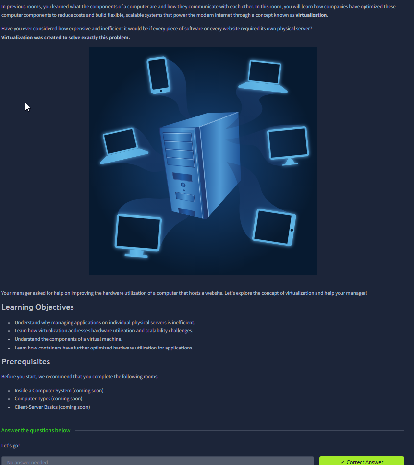
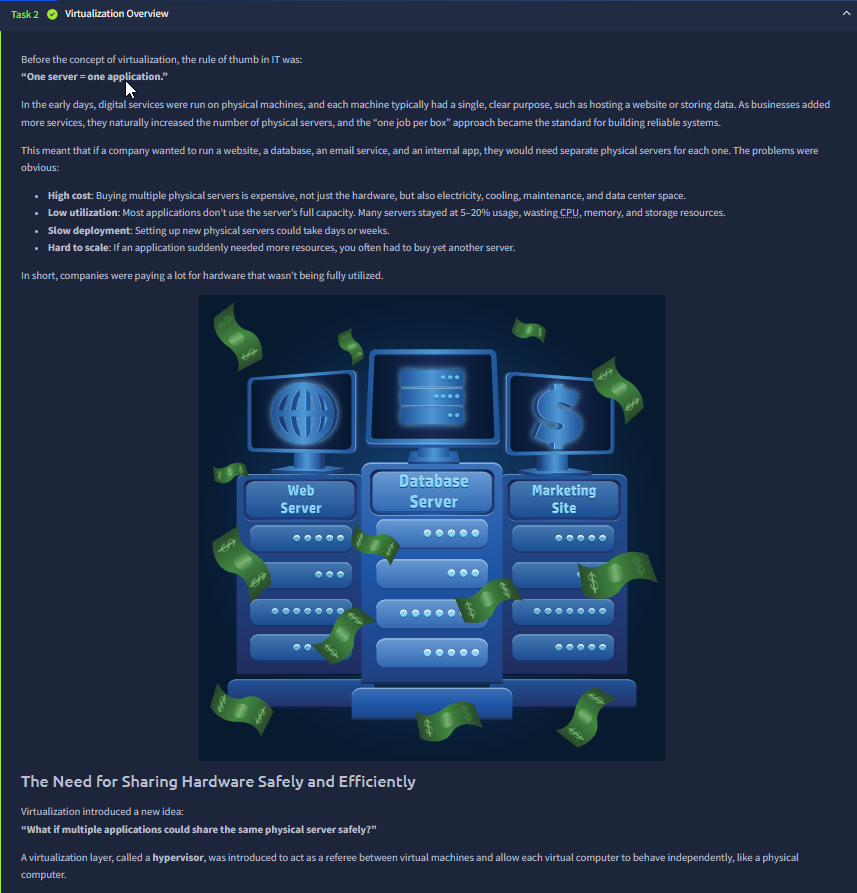
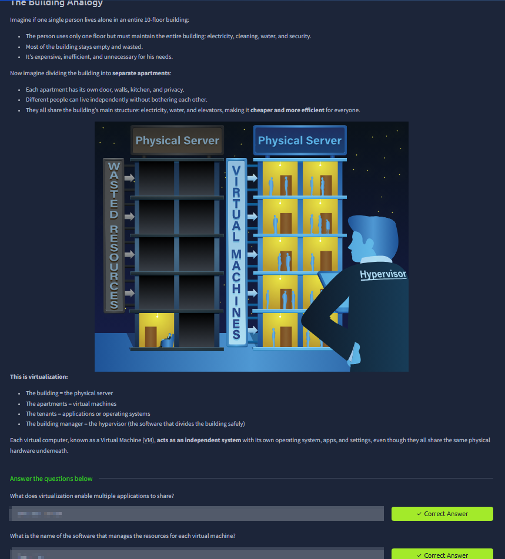
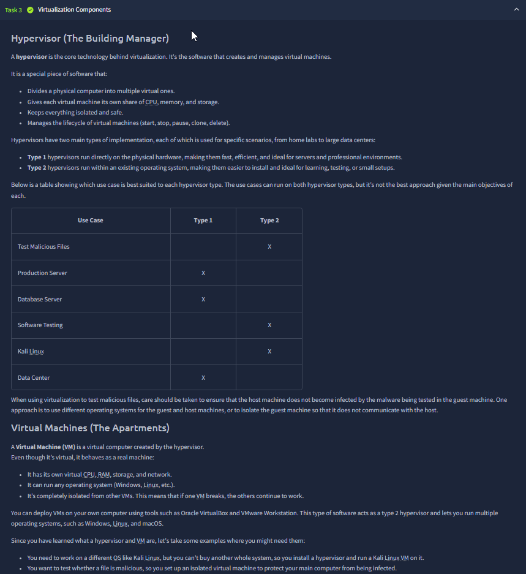
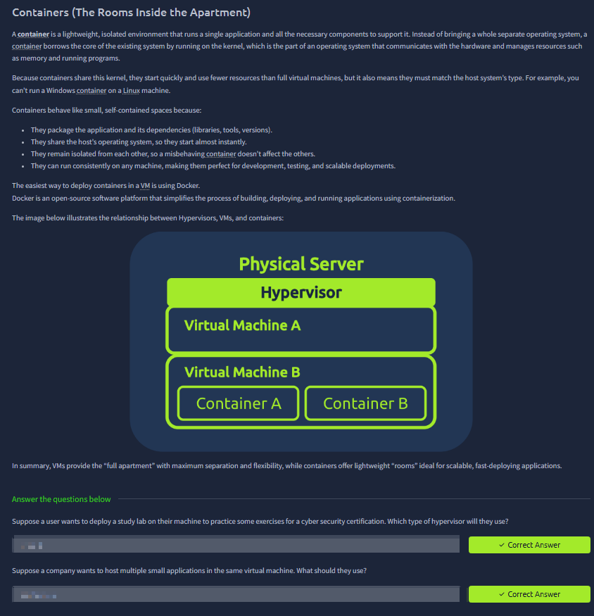
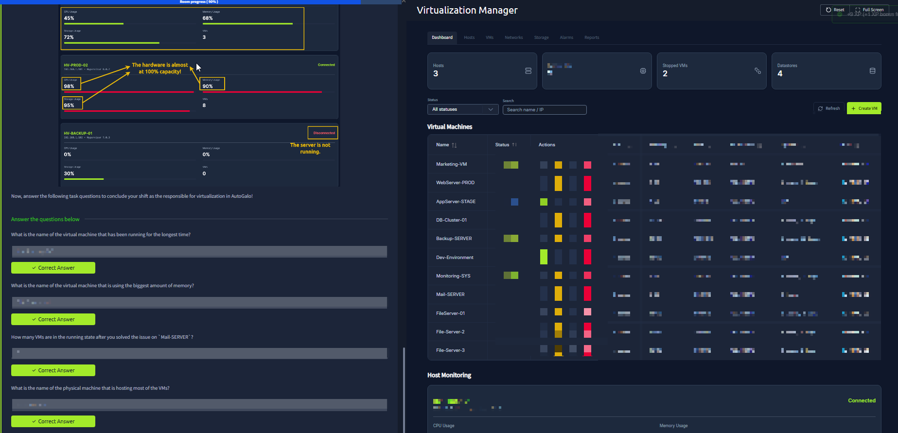

# Virtualisation Basics

Room link: https://tryhackme.com/room/virtualisationbasics

## Executive Summary
- This room explains why the old "one server = one application" model does not scale well in cost, speed, and hardware efficiency.
- It introduces the virtualisation stack clearly: **physical server -> hypervisor -> virtual machines -> containers**.
- The practical ending focuses on monitoring and operations: reading VM status, host capacity, uptime, and failure states from a virtualisation dashboard.

## Room Information
- Type: Walkthrough + practical management scenario
- Path: Pre Security (Computer Fundamentals track)
- Main concepts: resource sharing, hypervisor roles, Type 1 vs Type 2, VM isolation, containers, operational monitoring

## Walkthrough (Evidence + Analysis)

### 1) Why this room exists: scaling beyond single-purpose physical servers

The first screenshot sets a clear problem statement: modern internet services need flexible and scalable compute, but pure physical-server-per-service approaches become expensive and inefficient.  
The room text explicitly says virtualisation was created to solve this exact issue.

Important details shown in this screen:
- The manager scenario ("improving hardware utilization of a computer that hosts a website") frames this as a real operational problem, not just theory.
- Learning objectives are specific and progressive:
  1. Understand why individual physical servers are inefficient.
  2. Understand how virtualisation solves utilization and scalability.
  3. Understand virtual machine components.
  4. Understand how containers further optimize deployment.

Security and engineering relevance:
- This is the baseline for understanding shared infrastructure risk.
- In AppSec and Product Security, you often assess applications running on virtualised platforms, so knowing where isolation boundaries are created is mandatory.

---

### 2) Old model breakdown: "One server = one app" cost and utilization problem

This section shows the historical deployment pattern and its failures very directly.  
The room text lists the exact pain points of running each service on separate physical machines:

- High cost (hardware + electricity + cooling + maintenance + data center space).
- Low utilization (servers idle most of the time, wasting CPU, memory, storage).
- Slow deployment (new physical server setup can take days/weeks).
- Poor flexibility (sudden demand spikes require buying new hardware).

The image reinforces this: separate dedicated servers for web/database/marketing imply duplicated spending with low average hardware usage.

Then the room introduces the transition idea:
- not "replace physical servers",
- but **share the same physical server safely and efficiently**.

This is where hypervisor enters as the control plane between hardware and isolated workloads.

---

### 3) Building analogy: mapping real estate to virtualisation architecture

This screenshot gives one of the cleanest mental models in the room:
- Building = physical server
- Apartments = virtual machines
- Tenants = applications or operating systems
- Building manager = hypervisor

The diagram visually contrasts waste vs efficiency:
- Left side: mostly empty capacity, one tenant carrying full building overhead.
- Right side: multiple tenants isolated into separate apartments, sharing core building resources.

The text below the diagram also emphasizes an important technical point:
- Each VM behaves as an independent system with its own OS/apps/settings,
- even while all VMs share the same underlying physical hardware.

Operational value:
- Better hardware utilization without losing workload separation.
- Faster service provisioning because new VMs are software-defined units.

---

### 4) Virtualisation components in depth: hypervisor responsibilities + Type 1/Type 2 decisions

This is the most architecture-heavy screen in the room.  
The text gives concrete hypervisor responsibilities:
- divide one physical computer into multiple virtual ones,
- allocate CPU/memory/storage to each VM,
- keep VMs isolated and safe,
- manage VM lifecycle (start, stop, pause, clone, delete).

It then distinguishes hypervisor types with practical context:
- Type 1: runs directly on hardware, better for production/data center style environments.
- Type 2: runs on top of host OS, better for local learning/testing/small labs.

The use-case table supports this with examples:
- production/database/data center mapped toward Type 1,
- malware testing/software testing/Kali lab style activities mapped toward Type 2.

The lower section defines VMs explicitly:
- own virtual CPU/RAM/storage/network,
- can run different operating systems,
- isolated from other VMs.

Security note from this same section:
- Malware testing in virtualized labs still requires strict host protection and isolation strategy.
- VM isolation helps, but operational mistakes can still expose the host or other workloads.

---

### 5) Containers section: lighter isolation model and relation to VMs

This screenshot covers containerization as the optimization layer after VMs.

Key points directly stated in the room:
- A container is lightweight and usually runs a single application plus required dependencies.
- Containers share the host kernel instead of shipping a full guest OS.
- They start faster and consume fewer resources than full VMs.
- They must match host-kernel compatibility constraints.

The diagram visualizes layering:
- Physical Server
- Hypervisor
- VM A / VM B
- Containers running inside a VM context

The text summary is important and balanced:
- VMs provide "full apartment" style stronger separation and flexibility.
- Containers provide "lightweight rooms" optimized for fast, scalable deployments.

The practical recommendation shown:
- Docker as a mainstream platform for building/deploying/running containerized workloads.

---

### 6) Practical dashboard operations: capacity pressure, failure states, and VM management decisions

This is the strongest real-world screen in the room because it moves from concept to operations.

What the screenshot shows on the left panel:
- A host (`HV-PROD-02`) near critical capacity:
  - CPU ~98%
  - Memory ~90%
  - Storage ~95%
  - explicitly annotated as almost full
- Another host (`HV-BACKUP-01`) shown disconnected / not running with 0% active usage.
- Question set focused on operations data interpretation:
  - longest-running VM,
  - highest memory consumer,
  - running VM count after handling a server issue,
  - physical host with most VM load.

What the right panel (Virtualization Manager) adds:
- Top-level environment summary cards (host count, running/stopped VMs, datastores).
- VM inventory table with state/action controls.
- Centralized host monitoring section for resource health.

Why this matters:
- Virtualisation is not only "creating VMs"; it is continuous resource governance.
- Capacity hotspots (CPU/memory/storage red zones) directly affect uptime and performance.
- Failure handling is a coordination task: VM state, host state, and placement decisions must be monitored together.

Security and reliability angle:
- Overloaded hosts increase instability risk and incident probability.
- Disconnected infrastructure components reduce redundancy and resilience.
- Clear visibility (status, uptime, host mapping) is part of secure operations because blind infrastructure creates hidden risk.

## Security Notes (Portfolio Layer)

### Impact
- Poor virtualisation management causes performance collapse, outage risk, and weak isolation confidence.
- Mismanaged shared infrastructure can turn one host issue into multi-service impact.

### Fix / Good Practice
- Monitor host saturation continuously and define alert thresholds before critical levels.
- Keep host redundancy healthy; avoid relying on a disconnected backup node.
- Use workload placement strategy (right-size VMs, rebalance heavy VMs, track uptime and health trends).

### How to Test
- Validate dashboards expose per-host CPU/memory/storage and VM mapping in real time.
- Simulate high-load conditions and verify alerting + remediation workflow.
- Confirm VM lifecycle controls and state transitions are logged and auditable.

