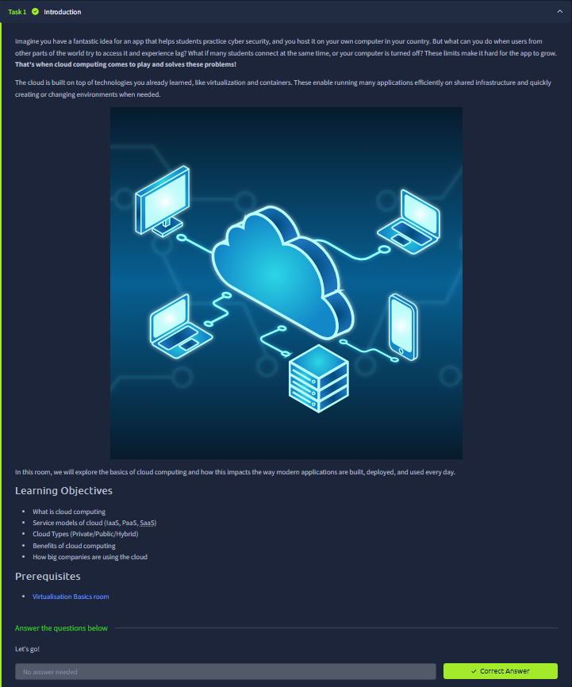
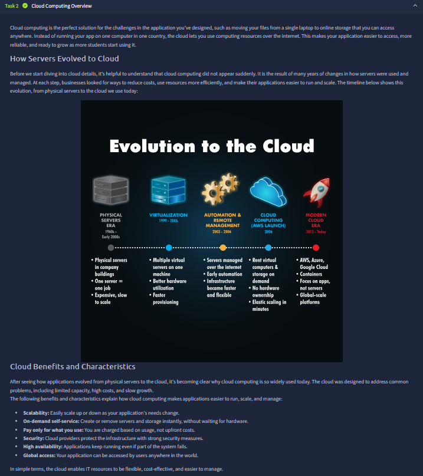
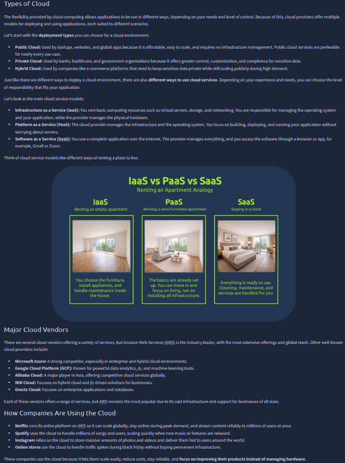
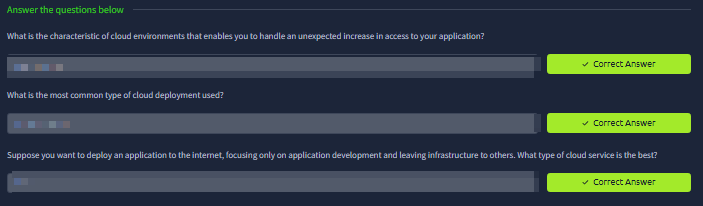
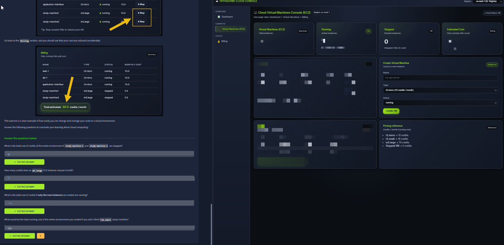
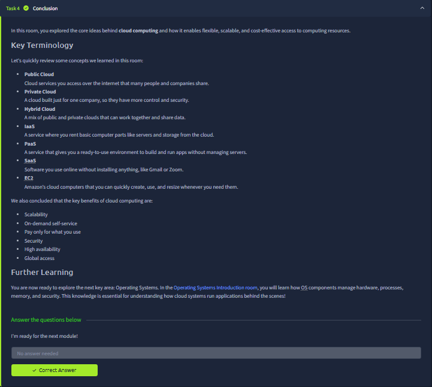

# Cloud Computing Fundamentals

Room link: https://tryhackme.com/room/cloudcomputingfundamentals

## Executive Summary
- The room starts with a real scaling problem: a useful app hosted on one local machine cannot reliably serve global users, high concurrency, or uptime needs.
- It then explains how cloud computing evolved from physical servers and virtualization into on-demand, globally accessible infrastructure.
- The practical section demonstrates that cloud architecture decisions are operational and financial at the same time: VM type and VM state directly change monthly cost.

## Room Information
- Type: Intro + practical cloud console exercises
- Path: Pre Security (Module 4 track progression)
- Focus: cloud fundamentals, deployment/service models, basic cloud operations, and cost behavior

## Walkthrough (Evidence + Analysis)

### 1) Introduction: why cloud becomes necessary when local hosting hits limits

The opening task uses a student cybersecurity app example to show a realistic pain point:
- If the app is hosted on one personal computer, users in other regions can face latency.
- If many users connect at once, performance degrades.
- If the personal machine is turned off, the service goes down.

The room explicitly frames cloud as the solution for these growth blockers.  
It also connects cloud to technologies already studied (virtualization and containers), showing cloud is not magic; it is an operational layer built on those foundations.

The learning objectives on this screen define the room scope precisely:
- What cloud computing is
- Service models (IaaS, PaaS, SaaS)
- Deployment types (Public / Private / Hybrid)
- Benefits of cloud computing
- How large companies use cloud platforms

This is a strong setup because it combines concept + business/operational context instead of giving only definitions.

---

### 2) Cloud computing overview: historical evolution and why adoption accelerated

This task presents cloud as an evolution over time rather than an abrupt replacement:
- Physical server era (dedicated hardware, slow to scale)
- Virtualization phase (multiple virtual servers on one host, better utilization)
- Automation and remote management phase
- Cloud launch era (rent compute/storage on demand, no hardware ownership)
- Modern cloud era (containers, global-scale platforms, managed services)

The "Cloud Benefits and Characteristics" list in the same screenshot is specific:
- Scalability
- On-demand self-service
- Pay only for what you use
- Security controls provided at infrastructure layer
- High availability
- Global access

Important interpretation from this screen:
- Cloud value is not only "server somewhere else"; it is speed of provisioning + financial flexibility + resilient architecture patterns.

---

### 3) Types of cloud + service model responsibilities + real vendor landscape

This section is dense and very useful because it joins three layers:

1. Deployment types:
- Public cloud (shared provider environment, broad accessibility, lower management overhead)
- Private cloud (single organization control, stronger isolation/governance expectations)
- Hybrid cloud (mix of public + private to balance scale and control)

2. Service models:
- IaaS: you manage more (OS/app stack), provider supplies base infra.
- PaaS: provider manages infra/platform, you focus on application logic/deploy.
- SaaS: full software consumption model through browser/app.

3. Market context:
- Major vendors are listed, with AWS emphasized as the most widely adopted.
- Examples of companies (Netflix, Spotify, Instagram, online stores) show cloud fit for burst traffic and global demand.

The IaaS/PaaS/SaaS apartment analogy in this screenshot is effective:
- IaaS resembles an empty apartment (more control, more setup effort).
- PaaS resembles semi-furnished (balanced control/convenience).
- SaaS resembles hotel use (ready-to-use service).

This mapping helps quickly reason about responsibility and operational burden.

---

---

### 5) Practical cloud console: VM lifecycle and pricing behavior

This is the most concrete practical part of the room.

Left side of the screenshot:
- It shows stopping unused VMs and then checking billing.
- A billing table confirms stopped machines contribute `0` running cost.
- The highlighted total estimate demonstrates cost reduction after operational action.

Right side of the screenshot (TryHackMe Cloud Console / EC2-style view):
- VM inventory with running/stopped status
- VM creation panel (name, type, status)
- Pricing reference by instance type
- Summary cards for running/stopped counts and estimated cost

What this proves operationally:
- Cloud billing is state-sensitive: running instances incur cost; stopped instances can drop to zero compute spend.
- Instance type selection drives monthly credits/cost strongly (`t3.micro`, `t3.small`, `m5.large` shown with different monthly values).
- Provisioning and budget are tied together; architecture choices must include financial impact review.

The question block below reinforces arithmetic reasoning from live configuration:
- total environment cost after stopping specific machines,
- monthly cost of a selected instance family,
- recalculating cost when only new instances run,
- recalculating after adding another VM type.

So this step is not just "create VM"; it teaches cost-aware operations.

---

### 6) Conclusion: terminology recap and conceptual closure

The final task summarizes the room using a clean glossary-style recap:
- Public cloud
- Private cloud
- Hybrid cloud
- IaaS
- PaaS
- SaaS
- EC2 (as quickly creatable/resizable cloud compute units)

It then re-states the room’s key cloud benefits:
- Scalability
- On-demand self-service
- Pay-for-use
- Security
- High availability
- Global access

The "Further Learning" pointer to operating systems is also logical:  
after cloud concepts, understanding OS-level process/memory/security behavior is the next foundation for secure infrastructure operations.

## Security Notes (Portfolio Layer)

### Impact
- Incorrect cloud model/service model choices can create both operational fragility and unnecessary security exposure.
- Cost-unaware VM provisioning causes resource sprawl and long-term risk (unused but exposed instances, weak lifecycle hygiene).

### Fix / Good Practice
- Define deployment model (public/private/hybrid) according to data sensitivity and compliance needs.
- Use right-sizing and VM lifecycle policies (start/stop/terminate discipline).
- Treat pricing, architecture, and security review as one workflow, not separate steps.

### How to Test
- Validate running vs stopped billing behavior in console and billing summary.
- Verify instance type and status match intended workload and budget assumptions.
- Recalculate projected monthly cost when changing VM mix, then confirm against dashboard estimate.

