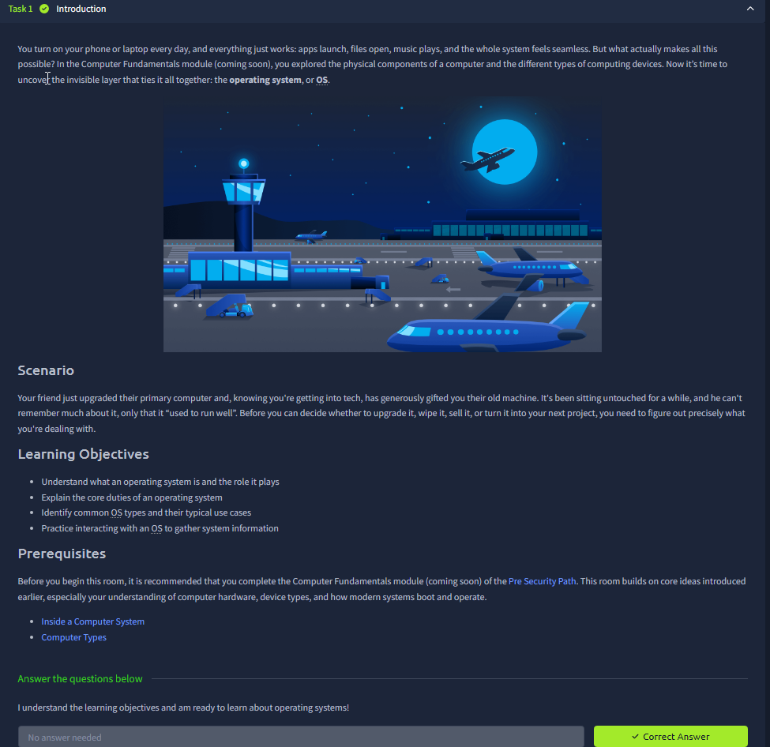
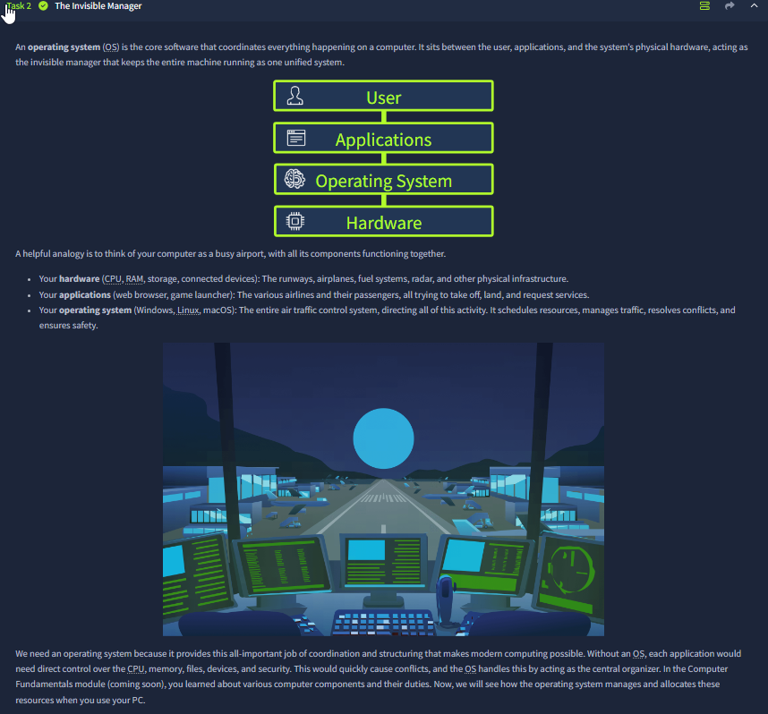
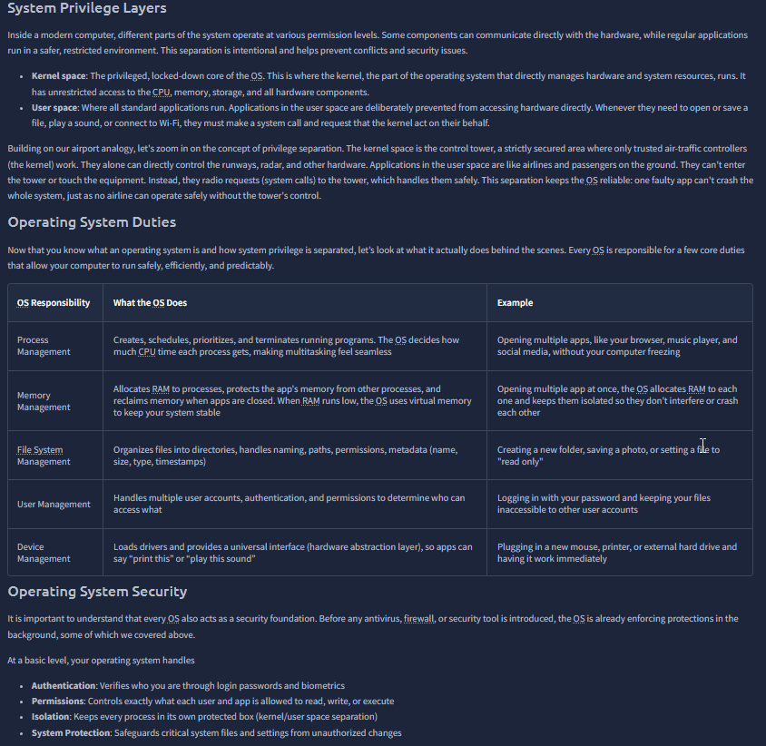
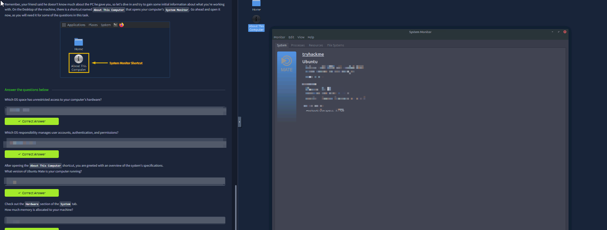
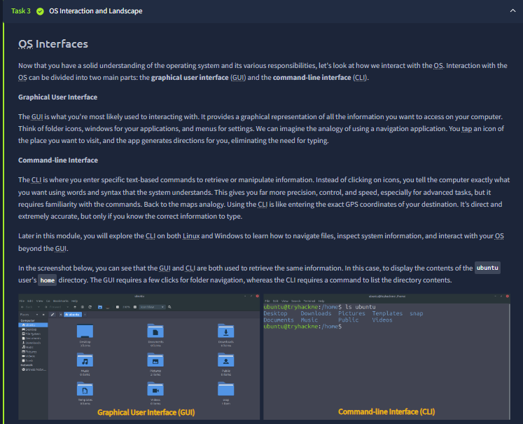
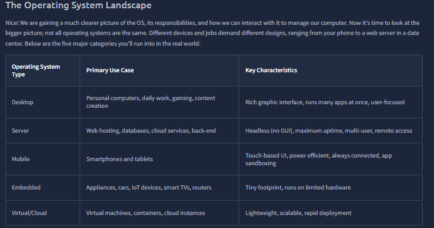
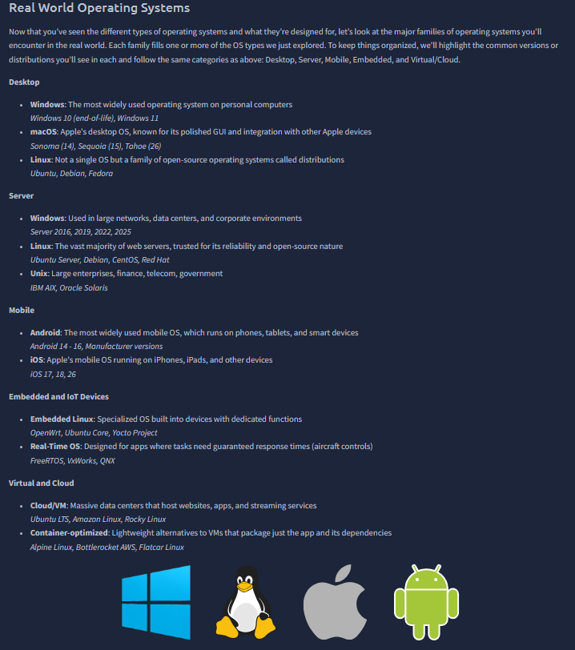
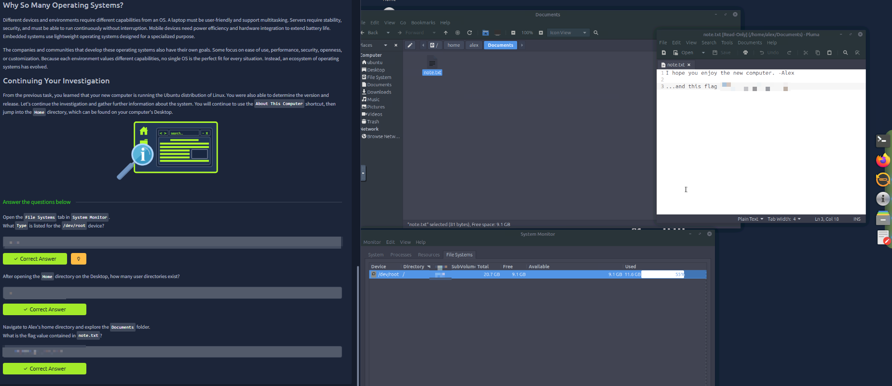

# Operating Systems: Introduction

Room link: https://tryhackme.com/room/operatingsystemsintroduction

## Executive Summary
- This room explains operating systems as the coordination layer that sits between users/apps and physical hardware.
- The content moves from concept (what an OS does) to architecture (kernel space vs user space), then to practical interaction (System Monitor, GUI/CLI, file system checks).
- The final tasks show that OS understanding is operational, not theoretical: reading system details, identifying disk/file-system attributes, and navigating user directories for investigation.

## Room Information
- Type: Intro + guided practical interaction
- Path: Pre Security
- Focus: OS core roles, privilege boundaries, interface usage, and real-world OS categories

## Walkthrough (Evidence + Analysis)

### 1) Introduction, scenario, and room objectives

This opening screen builds a realistic setup: daily computing feels seamless, but that smooth behavior is possible because the OS continuously orchestrates hardware and software behind the scenes.

The scenario is practical: you receive an old computer and need to inspect what it is running before deciding whether to upgrade, wipe, sell, or repurpose it. That is exactly the mindset of basic technical triage.

The learning objectives define the path clearly:
- understand what an OS is,
- explain OS duties,
- identify OS families/use cases,
- and practice collecting system information through OS interaction.

This makes the room action-oriented from the start.

---

### 2) "The Invisible Manager": OS as mediator between user, apps, and hardware

This screen introduces the core stack in one clean model:
- User
- Applications
- Operating System
- Hardware

The airport analogy is used to explain control and coordination:
- hardware is the physical airport infrastructure,
- applications are different flights/services requesting resources,
- OS is air-traffic control that schedules and prevents conflicts.

The key technical message here is important:
without an OS, every app would try to access CPU, memory, files, and devices directly, causing instability and resource collisions.

So the OS is not just a launcher. It is the arbitration and scheduling layer that enforces order.

---

### 3) Privilege separation + OS duties + OS-level security baseline

This is the densest conceptual screen in the room. It combines three major pillars.

System privilege layers:
- Kernel space: privileged core with direct hardware access.
- User space: regular apps operate with restricted rights and must request privileged actions via system calls.

This separation is presented as a stability and security mechanism: one faulty app in user space should not directly crash or fully control the core OS layer.

Operating system duties table:
- Process management (scheduling and lifecycle)
- Memory management (allocation, isolation, reclaiming, virtual memory)
- File-system management (paths, names, metadata, permissions)
- User management (accounts, auth, access decisions)
- Device management (drivers and hardware abstraction)

OS as security foundation:
- authentication,
- permission boundaries,
- isolation,
- protection of critical system files/settings.

This screen bridges theory with concrete responsibilities, which is essential before hands-on tasks.

---

### 4) Practical interaction begins: collecting host OS details via System Monitor

This screenshot marks the transition from concept to evidence gathering.

What is shown:
- A desktop shortcut (`About This Computer`) is used to open System Monitor.
- System tab displays distribution/version/system details.
- Question prompts ask for values directly from the machine state (OS space with unrestricted hardware access, user-management responsibility, Ubuntu Mate version, allocated memory).

Why this matters:
- You are not memorizing definitions; you are validating them against a live environment.
- It reinforces where to read trustworthy system metadata during initial host assessment.

---

### 5) OS interaction model: GUI vs CLI in the same workflow

This section explains two interfaces to the same operating system:
- GUI (graphical navigation, icons/windows/menus)
- CLI (text commands with explicit syntax)

The screenshot directly compares both views for retrieving directory content:
- GUI shows folders visually in file manager.
- CLI lists contents via terminal commands.

The room's point is operational efficiency and control:
- GUI is intuitive for discovery and navigation.
- CLI is faster, scriptable, and precise for repetitive/admin-heavy tasks.

This duality is foundational for cybersecurity workflows, where triage often starts in GUI but investigation/automation quickly moves to CLI.

---

### 6) Operating system landscape: categories by environment and constraints

This screen classifies OS types by deployment context:
- Desktop
- Server
- Mobile
- Embedded
- Virtual/Cloud

The table also maps each to primary use case and technical characteristics. For example:
- Server OS emphasizes uptime, remote access, and multi-user operation.
- Embedded OS emphasizes minimal footprint and constrained hardware compatibility.
- Virtual/Cloud environments emphasize lightweight, scalable, fast deployment traits.

The key insight:
OS design is contextual. There is no single "best OS" independent of workload, hardware limits, and reliability requirements.

---

### 7) Real-world families and distributions across categories

This screen grounds the categories with concrete families and examples:
- Desktop: Windows, macOS, Linux distributions
- Server: Windows Server, Linux server distros, Unix variants
- Mobile: Android and iOS
- Embedded/IoT: Embedded Linux and RTOS families
- Virtual/Cloud: cloud-optimized Linux and container-oriented minimal distros

It also highlights a useful practical truth:
Linux appears as multiple distributions tuned for different goals rather than one monolithic OS product.

This helps avoid a common beginner confusion between "Linux" as kernel/family and distro choices as operational packaging.

---

### 8) Why many operating systems exist + guided mini-investigation

Final section closes the conceptual loop:
- Different environments need different priorities (usability, uptime, power efficiency, real-time behavior, customization).
- Therefore an ecosystem of OS families evolved instead of one universal option.

Then the room returns to practical investigation:
- Use `System Monitor` file-systems tab to identify device type for `/dev/root`.
- Navigate from desktop into `Home`, inspect user directories.
- Explore Alex's `Documents` and inspect `note.txt`.

This ending is effective because it combines OS theory with basic host enumeration behavior: check system metadata, inspect file-system context, and navigate user-space artifacts methodically.

## Security Notes (Portfolio Layer)

### Impact
- Weak understanding of OS boundaries (kernel vs user space) leads to poor privilege assumptions.
- Incomplete OS triage can miss important host facts (version, memory constraints, file-system layout, user artifacts).

### Fix / Good Practice
- Treat OS as your first trust boundary: validate user rights, process isolation, and file permissions early.
- Use both GUI and CLI appropriately: GUI for orientation, CLI for precision and repeatability.
- Record host baseline details before major actions (upgrade, wipe, migration, hardening).

### How to Test
- Confirm OS identity/version via system tools.
- Validate accessible file-system mounts and root device mapping.
- Enumerate user directories and inspect expected document paths in a controlled way.
